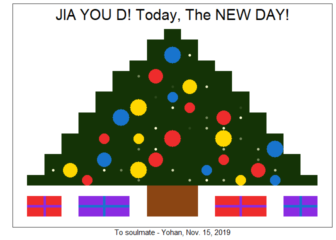

<!-- --><!-- -->

{width=700}

{width=700}

> * ## How do I get the best out of life?
* ## Face your past without regret.
* ## Handle your present with confidence.
* ## Prepare for the future without fear.

> * ## Keep the faith and drop the fear.
* ## Do not believe your doubts
* ## and never doubt your belief.

> * ## Trust God.
* ## Life is wonderful,
* ## if you know how to live.

My dear, Sorry, of course I'd like to talk to you, but, if I talked to you by sending a message then I break the rule and the last 3 days that we saved so far, is going to be useless and we gotta start again. That's why I sent at least emogi which confirms that I acknowledge your message. I mean we can talk, but you gotta tell a lie that you don't contact me. If you don't want to lie, yeah, we should not talk until you set up with him after that, we can talk without any burden. In fact I really want to share bible story about Jacob I read today. He was running away from his Brother and it reminded me of you.

---
title: "ChristmasTree.R"
author: "Yohan_Min"
date: "2020-01-17"
---
