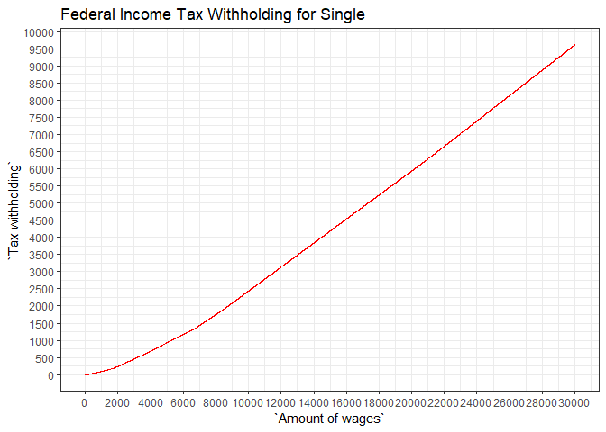

This graph is [based on 2018 Payroll Tax Information](https://isc.uw.edu/wp-content/uploads/2018/01/Payroll-Tax-Information-2018.pdf). The amount of wages is the wages after subtracting withholding allowances, which is calculated $172.90 X number of allowances claimed. Furthermore, Additional $2,000 is substracted from the wages based on the tax exemption treaty with Korean government. 


```r
y = c()

pa = c(154, 551, 1767, 3592, 6717, 8488, 20988)
ba = c(39.7, 185.62, 587.12, 1337.12, 1903.84, 6278.84)
pc = c(0.1, 0.12, 0.22, 0.24, 0.32, 0.35, 0.37)

for(i in 1:30000){
  if(i < pa[1]){
    y[i] = 0
  } else if(i < pa[2]){
    y[i] = (i - pa[1]) * pc[1]
  } else if(i < pa[3]){
    y[i] = (i - pa[2]) * pc[2] + ba[1]
  } else if(i < pa[4]){
    y[i] = (i - pa[3]) * pc[3] + ba[2]
  } else if(i < pa[5]){
    y[i] = (i - pa[4]) * pc[4] + ba[3]
  } else if(i < pa[6]){
    y[i] = (i - pa[5]) * pc[5] + ba[4]
  } else if(i < pa[7]){
    y[i] = (i - pa[6]) * pc[6] + ba[5]
  } else {
    y[i] = (i - pa[7]) * pc[7] + ba[6]
  }
}

library(ggplot2)
y = data.frame(y)
data = cbind(1:30000, y)
colnames(data) = c("Amount of wages", "Tax withholding")
str(data)
```

```
## 'data.frame':	30000 obs. of  2 variables:
##  $ Amount of wages: int  1 2 3 4 5 6 7 8 9 10 ...
##  $ Tax withholding: num  0 0 0 0 0 0 0 0 0 0 ...
```

```r
ggplot(data, aes(x = `Amount of wages`, y = `Tax withholding`)) +
  geom_line(color = "red") +
  ggtitle("Federal Income Tax Withholding for Single") + theme_bw()
```

<!-- -->


---
title: "Tax.R"
author: "Yohan_Min"
date: "Sat Jan 19 15:49:08 2019"
---
