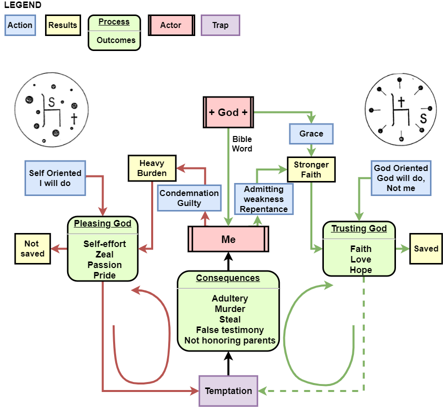
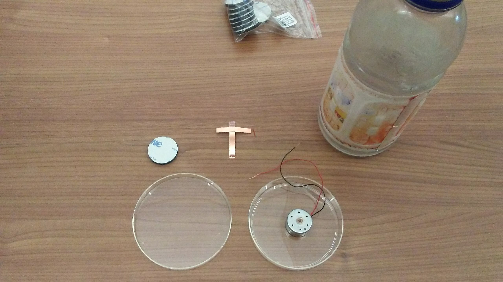
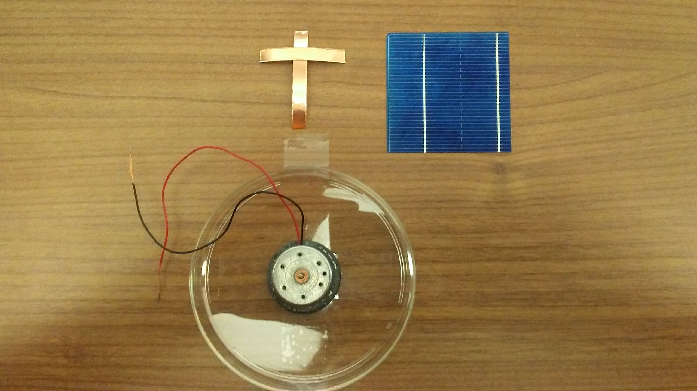
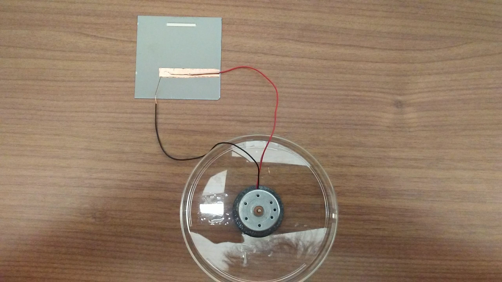
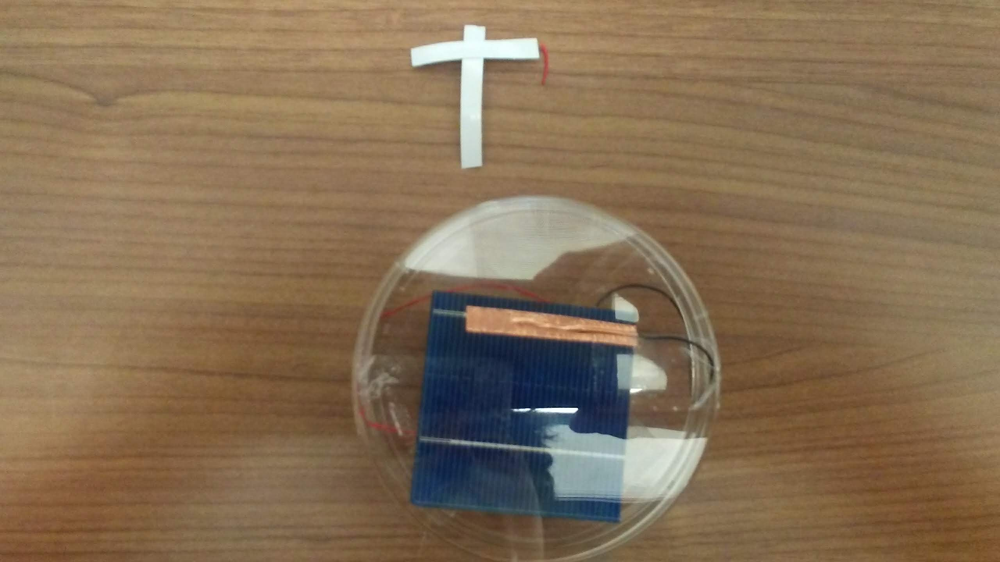
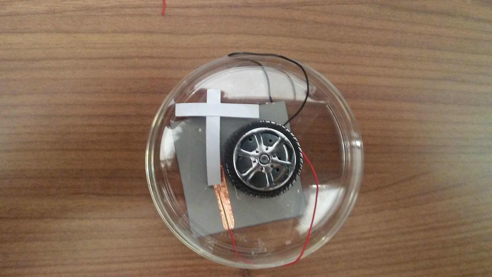

<!-- Packages -->
```{r setup, include=FALSE}
knitr::opts_chunk$set(echo = TRUE,warning=FALSE, message=FALSE)
```

# I have been crucified with Christ and I no longer live, but Christ lives in me. - Galatians 2:20 {#index}

I'd be the moon so I can reflect the shine from God on you during your darkest hours.

{width=600}


# Apr. 9, 2026 -  praise God (nat. comm. done)

Psalm 68:24-35

- 35 You, God, are awesome in your sanctuary;
    the God of Israel gives power and strength to his people. Praise be to God!

하나님을 찬송할지어다 (목): 뺏긴 언약궤가 블레셋뿐 아니라 이스라엘 백성을 치니 다윗은 수치스럽다. 오벳에돔이 궤를 가져가니 치시지 않고 복을 주시고, 다윗은 말씀을 깨닫고 하나님의 방식으로 언약궤를 가져오고 춤을 춘다. 하나님의 방식은 이미 말씀에 있다. 내 수치를 감당해야 하나님과 회복, 용서가 있다. 아담은 알몸을 가리움으로 수치를 감당하지 못했지만 예수님께선 벌거벗음으로 수치를 감당하셨다. 내 죄를 고백하고 수치를 감당할때 회복이 있고, 하나님을 찬송할 수 있다. 

이번 면접을 통해 내 힘으로 하려는 열심, 비교하며 세상성공, 명성을 쫓으려는 허황과 자랑, 사명 보다는 내 안위만을 생각했던 죄를 고백한다. 박사 3년차부터 3년의 박사과정, 포닥 4년, 총 7년간 싱글이 아닌 가족을 이루는 과정, 그 속에서 나에게 가장 큰 사랑을 주셨던 어머니, 할머니의 돌아가심, 이 과정이 단순 내가 어떤 직장을 가지냐보다 하나님께서 우리 가족을 다듬어 가기 위해 이끄시는 더 큰 의미가 있는 것 같다. 어디로 이끄실지 모르지만, 우리 가족에게 가장 선한 곳으로 이끄심을 믿고, 자유함으로 평안을 누리길 기도한다. 또한 그런 하나님을 찬양한다. 


# Apr. 8, 2026 -  bearing our burdens (planning)

Psalm 68:11-23

- 19 Praise be to the Lord, to God our Savior,
    who daily bears our burdens.

날마다 우리 짐을 지시는 주 (수): 내 약함을 인정하고 주님을 의지했던 때는? 2014년 IRENA 면접보고 겨울 영등포 극장 앞에서 현성이 형 기다리며 소식, 2015년 GGGI 근무 중 UNDP 면접, 그리고 BBB 모임 중 간절함. 2023년 겨울 한국에서 비자 기다리며 조마조마했던 순간. 2024년 6월 구직의 순간. 화려한 세상보다 하나님의 임재를 바라나? 최근까지 어디가 더 좋을까 비교하며 화려한 세상을 구했고, 지금도 마찬가지다. 사람들의 시선아 아닌 하나님만으로 만족했으면 좋겠다. 주께 맡겨야 할 죄의 짐은? 내 열심, 의, 자존심, 세상자랑. 자꾸 안되는 환경에 하나님을 원망하진 않나? 말씀에 순종하지 않은 나에게 원인이 있진 않나? 최종면접의 기회는 주셨으나, 내 열심을 너무 의지하지 않았나? 겸손히 하나님께 맡기고 내 최선을 다했나? 발표에 대한 불안으로 하나님께 기도했지만 여전히 내 열심에 의지한 것 같기도 하다. 내게 주신 사명에 집중, 자원을 충실히 관리하기 위해 시간관리하고, 좋지 못한 습관 (유투브, 메일 수시 확인, 군것질) 조금씩 없애도록 하겠다. 


# Apr. 7, 2026 -  refreshing your weary inheritance (new start)

Psalm 68:1-10

- 6 God sets the lonely in families,
    he leads out the prisoners with singing;
    but the rebellious live in a sun-scorched land. 
    9 You gave abundant showers, O God;
    you refreshed your weary inheritance.
    10 Your people settled in it,
    and from your bounty, God, you provided for the poor.

형통케 하시는 하나님 (화): 내 고난이 약재료가 된다고 하신다. 내 체면, 자존심, 고집, 교만, 의가 무너져야 형통이 온다. 형통이 뭘까? 많은 논문과 교수직? 안되는 환경과 사람 채찍을 통해 내 악을 보고 주께 믿음으로 나아감으로 평안을 누린다. 하나님을 믿지 못하고 내가 하나님 노릇을 하며 비교하고 따졌는데, 다 허사다. 내 힘으로 해결하려하고, 사람의 시선을 의식하고 잘된 것만 보이려는 모습. 내 체면, 자존심이 하나님의 대로를 막고 있다. 내 죄를 회개하고 고백하는 것이 대로를 여는 것이다. 자꾸 될 것 같은데 안 되니 창피하고 그냥 사라지고 싶은 마음이다. 망했다라는 순간 하나님을 만날 순간이다. 안 되는 것만 보이는 모델이 되어 오직 강한 하나님만 찬양할 수 있나? 설마 미국을 떠나게 되는 상황이 올까? 2년을 더 포닥을 해야 하나? 최종 면접까지 가서 안되는 사건을 통해 하나님께서 나에게 주시는 메세지는? 더욱 겸손한 마음으로 하나님만 의지하라는 것일까? 환경이 변하지 않아도 기뻐하라고 명령하신다. 하나님께서 나를 붙들고 계시기 때문에 기뻐할 수 있다. 궁핍해야 나를 견고케 하시는 하나님 은혜의 비를 만난다. 말씀만 들리면, 내 죄가 보이면 그것으로 된다. 이것이 형통이다. 내 열심과 힘으로 계획을 세우기 보단, 하나님의 인도하심을 믿으며 주어진 오늘 충실히 살겠다. 


# Apr. 6, 2026 - preach the gospel (MSU soft rejection)

Mark 16:14-20

- 14 Later Jesus appeared to the Eleven as they were eating; he rebuked them for their lack of faith and their stubborn refusal to believe those who had seen him after he had risen. 15 He said to them, “Go into all the world and preach the gospel to all creation.
20 Then the disciples went out and preached everywhere, and the Lord worked with them and confirmed his word by the signs that accompanied it.

만민에게 복음을 전파하라 (월): 주말내내 티격태격 하다가, 어제 대판 싸웠다. 서로 상처주는 말만 했다. 결혼 초 안좋은 기억들이 전부 내탓인양, 각자의 잘못이라는 나의 반박. 쥐를 궁지에 몰아놓다가 쥐에게 물린 고양이 비유. 그렇게 화해를 했고, 아내는 좀더 이해를 한 듯 만 듯. 목장 모임에서 앞으로의 진로에 대해 이야기 했고, 업데이트 요청 메일을 보내고 계속 지원하라는 답을 받았다. 주일날 메일을 보냈는데 오늘 아침 이미 다른 면접자랑 협상 중이란다. 그토록 원했던 곳인데, 아직 혹시나 하는 마음이 있지만, 털고 가야할 것 같다. 왜 MSU 와 TAMU 에 거의 될 것 같이 이끄신 이유가 뭘까. 안 되었어도 가서 면접의 기회만 가져본 것만도 감사할 일이긴 하다. 이젠 한 군데 남았다.  주말 부활절 행사에 다니엘 목사님이 아무것도 보이지 않지만 하나님께서 일하신다고, 현재 상황을 기다리라고, 주일 말씀에도 기다리라는 말씀을 받았다. 오늘 아침에 예수님께서 아직 믿음이 없는 나를 꾸짖으신다. 그리고 바로 사명을 주신다. 온 세상에 복음을 전파하라고. 최근 아무도 나를 원치 않는다고, 여지껏 지난 9년간 무엇을 위해 왔나 하며 푸념했고, 유럽 스위스, 스웨덴, 국책 연구소 등에도 기웃거려 보았다. 현 상황에 믿음 보다는 걱정만 앞선다. 포닥을 하자니, 언제까지 이렇게 갇혀 살아야 하나, 다른 일시직을 보니, 내가 할 수 있을까, 그냥 막막하다. 그 와중 내 정체성에 대해 생각도 해봤다. 완전 엔지니어링 쪽은 아니고, development engineering? DER 이용 사람들에게 도움이 되는 쪽으로, community planning, outreach. 오늘 내가 할 일에 집중하자. 그리고 하나님께서 인도하시니 믿고 내가 통제할 수 있는 것, 할일만 하자. 논문 수정, application. 그리고 하나님이 하실 일을 기대하자. 어떻게 나의 지경을 넓히시고 복음을 전하하는 자리로 인도하실지. 


# Apr. 2, 2026 - Jesus crucified (TAMU rejection)

Mark 15:21-32

- 21 A certain man from Cyrene, Simon, the father of Alexander and Rufus, was passing by on his way in from the country, and they forced him to carry the cross. 23 Then they offered him wine mixed with myrrh, but he did not take it. 26 The written notice of the charge against him read: the king of the jews.


못 박히신 예수님 (목): 아침에 아내랑 운전면허 갱신하러 갔는데 올 8월 초까지만이란다. 와중에 이멜, 텍사스 거절. 이제 점점 우려가 되고 긴박한 상황으로 몰아 넣어지고 있는 것 같다. 남은 것은 두 군데. 한 군데는 이제 한달이 넘어가도록 소식이 없고, 나머진 왠지 꺼려지는 상황. 거기에 3개 논문다 거절인 상황에 아직 한개는 어필이 가능하고, 나머지 두 개는 손 봐야하는데, 진행중인 여기 논문 끝내야하고, 캡스톤도 계속 진행이 되는데 최근 면접으로 뒤처지고 있는 상황에 정신줄 놓고 잠시 어디로 피신하고 싶은 심정이다. 결국 된 것도 없고, 지난 2년간 뭘 했나 싶다. 나도 모르게 이렇게 4년간 갇혀서, 의미를 상실한 채. 어느덧 눈 떠보니 이런 상황이다. 여기서 하나님께서 원하시는 것을 뭘까? 주어진 삶에 충성되는 것. 믿음으로 다시금 감사하며 나가자. 시몬은 어쩌다 옆에 있게 되어 십자가를 지게 되었다. 예수님께서는 왕이라는 죄패를 달고 십자가에 달리셨다. 나도 상황에 잘 매여 있다보면 십자가 지게 되고 죄패를 매달아야 할 것이다. 묵묵히 잘 매여 가자. 


# Mar. 31, 2026 - you are right (paper rejection)

Mark 15:1-11

- 2 “Are you the king of the Jews?” asked Pilate. “You have said so,” Jesus replied. 5 But Jesus still made no reply, and Pilate was amazed.


네 말이 옳도다 (화): 아침 이멜, 네어쳐 에너지 거절. 이로써 저널에 투고 했던 3개 논문 모두 현재 거절되고 안낸것과 같은 결과다. 지난 두 달간 면접 보면서 우려 먹었는데, 면접이 끝나고 한달여 지나니 이렇게 결과가 나온다. 아직 면접 결과는 나오지 않았다. 어떻게 해석해야 하나? 내가 의지했던 것의 무의미? 아님 나를 겸손으로 이끄시는 환경? 학계에 환멸을 느끼고 내가 하는 것이 삶에 가치를 창출 하는 것인지 단지 보여주기 위한 것인지, 아이들 가르치는 것에만 전념하라는 계시? 온전히 리뷰어의 의견에 좌지우지되는 결과, 그리고 논문은 읽기 편하게 하는 것이 관건인지 배웠다. 또 도전하면 된다. 멈출 필요는 없다. 내가 통제할 수 없는 것에 좌지우지 되지 말자. 또 하면 된다. 시니어 크리스챤 교수님 만나 물어보고 싶다. 연구자로 의미가 있는지. 내가 지금 해야할 것은? 내게 주어진 일. 현재 진행하는 논문을 쓰고 상관을 기쁘게 하라. 점심 금식 잘 하고 기도하며 예수님의 선택을 묵상한다. 


# Mar. 27, 2026 - what you will (waiting)

Mark 14:32-42

- 36 “Abba, Father,” he said, “everything is possible for you. Take this cup from me. Yet not what I will, but what you will.”


아버지의 원대로 하옵소서 (금): 내가 원하는 것이 확고하다. 원하는 것이 안되면 엄청 좌절할 것 같다. 하지만 하나님께서 원하시는 것이 최선이다. 내가 통제할 수 없는 것에 자꾸 에너지 낭비하지 말고, 하나님께 맡기고 내가 해야 할 일에 집중하자. 어제 아내가 3군데 모두 안되면 어쩌냐 다른 곳에 계속 지원하라고 하는데, 걱정도 된다. 어디든 하나님께서 보내시는 곳이 최고의 자리인데, 내 눈에 보이는 곳, 가고 싶은 곳에 눈길이 간다. 날씨, 환경, 직장 분위기, 내 연구 연관성, 명성. 여기에 구원은 없다. 구원이 가장 먼저가 되어야 한다. 하나님의 원대로 하옵소서. 


# Mar. 26, 2026 - you will fall away (waiting)

Mark 14:22-31

- 27 “You will all fall away,” Jesus told them, “for it is written:
“‘I will strike the shepherd,
    and the sheep will be scattered.’
28 But after I have risen, I will go ahead of you into Galilee.”
29 Peter declared, “Even if all fall away, I will not.”


너희가 나를 버리리라 (목): 지난 토요일부터 어제 수요일까지 가족과 함께 텍사스 롱뷰에 아내랑 큰 다툼없이 무난하게 다녀왔다. 롱뷰는 살기 괜찮아 보였는데, 후덕지근한 날씨를 고려해야 할 것 같고, 학교는 직접 손으로 만드는 엔지니어링 중심이라 작은 집 만들기 프로젝트, 학생들이랑 같이 해외 미션 트립, 유도 클럽등 다 가능할 것 같고 재밌을 것 같다. 이제 다시 자리에 돌아와 일상을 살아야 하는데 계속 소식을 기다리며 마음이 분주하다. 지난 일년간 기다리던 네이쳐 논문은 결국 거절되었고, 관련 논문으로 최근 인터뷰 하면서 발표도 했는데, 난감하기도 하다. 어차피 통보 나오는데는 지장이 없으니, 조급하지 말고, 천천히 여유를 가지며 수정해야겠다. 미시간 면접 후 봄방학 빼면 이제 3주째, 텍사스는 2주째. 아직 2주정도는 더 기다려야 결과가 나오지 싶다. 욕심, 고집, 내 생각, 세상적인 것들 다 접고 오직 하나님이 원하시는 것, 내게 주신 소명과 구원에 집중하고 싶은데, 되지 않는 나를 하나님께 불쌍히 여겨달라고 기도하겠다. 나 역시 주님을 배신하지만, 은혜로 용서하시고 견인해 가시는 주님께 감사하며 공동체에 붙어가자. 


# Mar. 20, 2026 - it should occur (humble)

Mark 13:1-8

-  2 “Do you see all these great buildings?” replied Jesus. “Not one stone here will be left on another; every one will be thrown down.” 8 Nation will rise against nation, and kingdom against kingdom. There will be earthquakes in various places, and famines. These are the beginning of birth pains.

이런 일이 있어야 하되 (금): 나의 옳고 그름과 열등감. 세상 눈을 의식함을 회개해야 한다. 로마 통치하에 헤롯성전의 거대함에 자신들을 투영해서 열등감을 덮으려는 이스라엘 사람들이 요즘 인터뷰 본 세개의 학교를 결과가 나오지도 않았는데 비교하며 김치국 마시는 나와 같다. 또한, 계속해서 아내의 짜증과 그 이면에 비논리적으로 나를 비난함에 자꾸 옳고 그름으로 대응하는 나의 모습이 있지만, 종국에는 그냥 아내의 말에 옳소이다 하는 것이 답임을 깨닫고 있다. 그냥 알았어, 담에는 고치도록 할께 하는 순간 팽팽하던 갈등은 사그러든다. 그럼에도 세상적으로 아직 옳고 그름으로 반응한다. 오늘 아침에 학교 오는 길 공원 놀이터에서 매달리기 하고 있었는데, 청소 아저씨가 못마땅하게 내 주위를 쓸며 나를 먼지 취급하는 것 같이 하더니, 대뜸 많은 놀이터에서 왜 하필 여기냐, 여긴 어린이들 오는 곳인데 너가 왜 여기있냐 하는데, 순간 반응을 해 버렸다. 여긴 아이가 아니면 올 수 없는 곳이냐, 많은 놀이터 중에 내가 여기 선택해서 올 자유가 없는가, 차별하냐 했더니, 나 보고 넌 미국 시민도 아니잖아 하며 차별함을 당연히 했다. 다른 Ranger 분이 오더니 중재를 했고 그렇게 마무리 되었다. 학교에 오면서 마음이 찜찜했다. 여전히 그 아저씨가 한 행동에 대한 반박의 내용은 맞다고 생각은 하는데, 크리스챤으로써 저렇게 반응을 한 것은 아닌 것 같고, 본이 되지 못하고, 내 자신이 외식하는 자 같이 느껴졌다. 다시 돌아가서 미안하다고 말할까 생각도 했지만, 이미 먼거리 왔고, 그냥 말자 하고 학교에 왔다. 내 옳고 그름의 성향을 보여준다. 아닌 것은 아니다라는 고집이 있어서 내 생각에 불의하다고 생각하는 것에는 분노를 한다. 똑같이 아내와의 관계에서도 마찬가지다. 혈기를 참는 것이 요즘의 순교라고 했다. 구원과 상관 없는 것에는 옳지 않다고 생각이 들어도, 상대방의 입장에서 공감하고 져 주는 것이 필요하다. 오늘 내 생각에 옳지 않다고 생각하는 것이 발생할 때, 그것이 구원과 상관이 없다면 겸손히 하나님의 마음으로 공감할 수 있도록 기도하고 적용하겠다. 


# Mar. 16, 2026 - What is God's to God (wisdom)

Mark 12:13-17

-  17 Then Jesus said to them, “Give back to Caesar what is Caesar’s and to God what is God’s.”

하나님 것은 하나님께 (월):  어제 집에 돌아오는데 주의를 주는데 딸이 계속 소리를 지르고 반항을 해서, 집에 도착후 아빠랑 이야기 하는 시간을 갖자고 했고, 집에 도착 후, 아내에게 먼저 집에 가라고 하니, 아내는 내가 딸을 훈계하는 것이 못마땅하여 짜증과 화를 내며 니가 아이 씻기고 잠재우고 알아서 하라며 차 문을 꽝 닫으며 가버렸다. 리아를 잘 타일러서 집에 가니, 아내는 딸에게 아빠랑 알아서 하라고 하니 그 무심한 행동에 딸은 울고, 나는 딸에게 머리 감겨 줄까, 아빠랑 같이 샤워할까 하고 물어보는데, 저만치 듣고 있더니 나에게 짜증을 내며 머리 감을 필요없어, 하며 호통을 친다. 나는 아내에게 소리 지르지 말아달라고 하고, 계속 딸에게 이야기 하는데, 아내는 또 짜증을 내며 소리지르길래, 나도 똑같이 아내에게 소리를 지르고 말았다. 그렇게 딸을 씻기고 옷 입히고, 책 읽히고, 잠을 재우고 방을 나와 아내랑 대화를 안하고 있다. 난 또 피해자 멘탈로 억울해 하고 있다. 아버지가 되어 딸의 잘못된 행동에 훈계를 못한다는 말인가? 아내는 지 멋대로 딸에게 소리지르고 난리 치면서 그거에 비해 나는 딸이 잘못했을 때, 일관성 있게 훈계를 한다는 것인데, 그것에 못마땅해 하고 저리 난리를 치는 상황에 그냥 억울하다. 그럼 아내의 화를 막기 위해서, 딸의 옳지 못한 행동에 그냥 혼자 속으로 묵히고 지나가야 하는 것인가? 옳고 그름의 문제에서 영혼구원의 분별을 못하고 함정에 빠진 것 같다. 아내의 소리지르는 행동에 나도 똑같이 소리지름으로 되갚아 준 것을 회개해야 할 것이지만, 아빠 노릇을 하는데, 그것에 반감을 갖는 아내에 어떻게 반응해야 할 지 모르겠다. 

엊그제도 비슷한 상황으로 소파에 앉아 광고지를 보고 있는데, 딸이 갑자기 나타나서 광고지를 낚아채 가는 것을 가지고, 딸에게 그렇게 하면 안된다고, 광고지 보고싶다고 상대에게 물어봐야 한다고 말했는데, 그것을 가지고 아내랑 싸웠었다. 아내는 딸이 그렇게 행동을 한 것은 내 주의를 끌기 위한 것이라고, 그러니 그런 딸의 의중을 이해하고 좀더 딸에게 관심을 가지지 못한 내가 잘못이라고 했다. 나는 그건 생각하지 못했고, 담에는 그런 딸의 행동을 이해하도록 하겠지만, 그럼에도 그렇게 낚아채는 행동은 잘못이니, 그건 훈계를 해야한다고 하니, 아내는 동의하지 않으며 내가 잘못이라고 했다. 나는 이 다른 두가지 포인트에 대해 나는 아내의 관점을 받아들이는데, 아내는 내 관점을 받아들이지 않고, 나를 계속 비난을 하고 대화 진전이 없으니, 다른 누군가에게 이야기 해서 도움을 받고, 현재로써는 우리 둘이 싸움밖에 되지 않으니 말하지 말자고 했었지만, 아내는 멈추지 않고 나를 비난을 하고, 결국 나 역시 멈추지 않는 아내를 비난함으로 대화를 끝냈었었다. 또 옳고 그름의 반복인 것이다. 아빠없이 자란 아내는 집에서 아버지의 역할을 경험하지 못했고, 엄마랑 갈등속에서 질서에 순종도 못하고, 나 역시 4형제중 장남으로 질서에 순종을 못하는 것이 있는데, 이렇게 질서에 순종 못하는 두 사람이 만난 형국이다. 딸을 훈계하며 동시에 아내를 만족시키며 하나님께 속한 자로 살수 있는 지혜를 구한다. 말씀에 내 악을 보고 십자가의 지혜로 결정하라고 하는데, 하나님께 지혜를 구하는 기도를 하겠다. 


# Mar. 9, 2026 - Jesus leading the way (worry)

Mark 10:32-40

-  32 They were on their way up to Jerusalem, with Jesus leading the way, and the disciples were astonished, while those who followed were afraid. Again he took the Twelve aside and told them what was going to happen to him. 
38 “You don’t know what you are asking,” Jesus said. “Can you drink the cup I drink or be baptized with the baptism I am baptized with?”

앞서가시는 예수 (월): 예수님께서 앞서 고난을 향해 가신다. 제자들은 자신들이 소원하는바를 모르고 예수님의 잔을 마실 수 있다고 한다. 하지만 누가 보좌 옆에 앉을 지는 하나님께서 결정하신다. 지난 2 주간 미시간, 텍사스에 면접을 다녀오고, 속이 후련할 줄 알았는데, 오히려 이것저것 재보며 시간을 낭비하고 있다. 여기는 날씨가 더 좋고, 저기는 연구기회가 더 좋고, 등등, 결과도 나오지 않았는데, 김치국 부터 마시고 있다. 내가 지금 원하는 것들이 제자들처럼 앞날을 모르고, 고난의 잔은 마시게 되는 형국이 될까? 이번 학교 방문을 통해 간접적으로 교수가 되면 펀딩에 매우 스트레스를 받게 될 것이라는 것을 보았다. 한편으로는 직접 겪어보며 배우면서 잘 할 수 있을거야라며 해보고 싶은 기대도 있다. 감사메일을 보냈는데, 답장이 안오니, 혹시 왔을까 하며 메일함을 기웃거리기도 하며 걱정하기도 한다. 내가 어떻게 했냐가 결과를 결정한다는 믿음이 확고한 것 같다. 또 2주후 다른 면접이 있는데, 거기는 연구가 아닌 티칭 중심인 작은 학교라, 주신 기회에 감사하지 못하고, 자꾸 눈을 연구 중심에 학교 이름도 있고, 많은 학생들이 있는 이 두군데 학교에 초점을 두며 앞으로 면접을 볼 학교를 차별하고 있다. 난 내가 할 최선을 다했고, 결과는 하나님의 인도하심에 맡기고 그만 재보고, 결과가 나올때까지 생각을 접고, 오늘 주어진 일에 충실하는 삶이 되도록 기도하겠다. 또, 면접 갔다와서, 아내의 불쑥 들어오는 행동에 여러번 부딪혔는데, 다시금 겸손함으로 아내의 일방적인 태도에 옳고 그름으로 반박하기 보단, 필요를 채우고, 품을 수 있도록 노력하겠다. 


# Mar. 3, 2026 - I believe (pray)

Mark 9:20-29

-  23 “‘If you can’?” said Jesus. “Everything is possible for one who believes.”
24 Immediately the boy’s father exclaimed, “I do believe; help me overcome my unbelief!”
28 After Jesus had gone indoors, his disciples asked him privately, “Why couldn’t we drive it out?”
29 He replied, “This kind can come out only by prayer.”

내가 믿나이다 (화): 믿음이 약한 나를 불쌍히 여겨달라고, 내가 할 수 있다는 교만을 버리고 할 수 없으니 오직 하나님께서 해 달라고 기도해야 겠다. 지난 주 많이 걱정했는데, 무사히 미시간 면접에 다녀왔다. 연구 발표, 시범 강의도 무난히 했다. 긴장은 했지만, 딱 알맞은 긴장이라 오히려 도움이 된 것 같다. 그래서 인지, 내일 출발할 텍사스 면접은 약간의 긴장은 있지만, 미시간 만큼 긴장이 되지는 않는다. 어느정도 되니, 이번에도 별 탈 없을 거라는 안도와 내가 할 수 있다는 교만과 자신감이 조금 있는 것 같다. 그러니 하나님을 갈급히 찾지도 기도도 예전처럼 하지 않는 것 같다. 오늘 제자들이 이전에는 귀신을 쫓아냈는데, 왜 이번에는 할 수 없었냐고 물어보니, 예수님께서 오직 기도만으로 가능하다고 하신다. 나중에 제자들과 같이 미시간에서는 잘 되었는데 텍사스에서는 왜 안되었냐고 반문하는 일이 없도록, 하나님께 오직 기도로 나아가야겠다. 오늘 짐 다 싸고 자기전 30분 이상 기도하는 시간을 갖도록 하겠다. 


# Feb. 24, 2026 - Demon left (deny myself)

Mark 7:24-30

-  28 “Lord,” she replied, “even the dogs under the table eat the children’s crumbs.”
29 Then he told her, “For such a reply, you may go; the demon has left your daughter.”

귀신이 나갔더라 (화): 힘든 상황은 하나님께서 내가 예수님을 갈급히 찾도록 허락 하신다. 이 상황은 하나님께서 주신 것이다. 그래야 내가 예수님을 찾는다. 내 자존심을 내려놓고, 온전히 구원을 바랄때, 예수님께서 역사하신다. 요즘 내 힘으로 해보려고 아둥바둥 하고 있다. 어떻게 면접을 준비해야할지, 찾아보고, 고민하는데, 문제는 이렇게 내 힘으로 하는것이 결과를 좌지우지할 거라는 믿음을 버리지 못하는 것이다. 하나님이 주신 상황에서 내가 할 것 하고 결과는 하나님께 맡기야 하는데, 그게 되지 못하니 마음이 평안하지 못하다. 불과 몇주전만 생각해도 아무소식 없이 버려진 것 같은 상황에, 내 힘으로 한다고 했지만, 면접 말아먹고, 체념하고 그냥 최종적으로 안되도 좋으니 현장면접 경험이라도 쌓게 해달라고 했는데, 지금 상황을 보면 면접 봤던 3군데 모두 현장 인터뷰 요청을 받아 복에 겨워야 하는데, 또 불안해 하고 있다. 내 열심을 버리지 못하니 힘들다. 지금도 할 것은 많은데 하며 마음만 급하다. 내 자존심, 열심의 귀신이 떠날 수 있는 은혜 주시길 기도한다. 내 힘으로 안되니, 하나님께 상시 평안을 위해 기도하며, 오늘 준비 잘하고 내일 새벽 무사히 출발하도록 하겠다. 

우리는 모두 죄인이다. 탐욕, 음란, 악독, 도둑질, 속임, 교만. 다 같은 죄인인데 뭘 두려워하나. 하나님께서 두려워말며 놀라지 말라고 명령하신다. 예수님께서 잠잠하라고 하신다. 아멘! 


# Feb. 19, 2026 - Result of being puzzled (give me faith)

Mark 6:17-29

-  20 because Herod feared John and protected him, knowing him to be a righteous and holy man. When Herod heard John, he was greatly puzzled; yet he liked to listen to him.

번민한 결과 (목): 어제 예수님께서는 제자를 보내시고 이에 이름이 더욱 전파된다. 그리고 오늘 헤롯이 번민하지만 결국 세레요한을 죽인다. 지난 5년간 결혼의 갈등에 몰입된 환경에서 내 지경을 넓히시려는 말씀인가 생각이 들었다. 결혼, 그렇게 바라고 기도했지만 결국 이뤄졌을 때 상황은 내가 생각한 것과는 반대였다. 그럼에도 하나님께서는 그 상황을 막지 않으시고 허락하신다. 다윗이 밧세바를 범할 때 내버려뒀지만 그 사건을 통해 선을 이루시는 하나님이 나에게도 역사하신다. 마찬가지로 이렇게 채용되기를 고대하지만, 추후 또 후회할 날이 올까? 내가 지금 보는 것이 전부가 아님을 알아야 한다. 오늘 말씀에 뭐가 옳은지 알면서도 갈팡질팡하다 결국 나락을 떨어지는 헤롯을 볼 수 있다. 내가 갈팡질팡하는 것은 뭔가? 결단을 내리고 믿고 앞으로 나아가야 할 때다. 


# Feb. 16, 2026 - Wake up (faith muscle)

Mark 5:35-43

-  36 Overhearing what they said, Jesus told him, “Don’t be afraid; just believe.”

달리다굼 (월): 두려워 말고 믿기만 하라. 어제 현지교회 말씀도 그렇고 오늘도 그렇다. 어제는 풍랑을 만났을때, 우린 놀라지만, 잠잠하라고, 예수님께서 무사히 우리를 맞은편으로 인도하신다고, 믿음의 근육이 자라려면 훈련이 필요하다. 오늘도 역시, 야이로의 딸이 죽었지만, 예수님께서 다시 말씀하신다. 두려워 말고 믿기만 해라. 

어제 주일날 예배후, 아내는 딸과 함께 생일파티에 가고, 나는 부단히 발표자료를 만들었다. 정신없이, 그렇게 하루를 보내고, 마음은 또 요동치고, 폭풍을 만난 것처럼 놀라고 두려웠다. 어느정도 발표자료는 가닥을 잡아가고는 있지만, 다음 주 수요일 새벽부터 일정시작 출발하고, 당장 이번주 금요일 사람들 앞에서 발표연습 일자가 잡혀서 4일 정도 밖에 시간이 없으니 마음이 급하다. 빨리 자료를 만들고 말하기 연습을 해야하는데, 그외로 해야할 연구, 논문에 답장을 해야해서 할 것은 많고 시간이 없으니, 맘이 평안하지는 않다. 내가 할 최선을 다해야 하지만, 하나님께 맡기고 평안을 누렸으면 좋겠다. 두려운 것은 자기 중심적이라 그렇단다. 내가 고난, 희생 감수하기로 마음을 먹으면 두려움은 사라진단다. 발표도 나를 돋보이게 하려기 보단 상대방에게 지식을 전달하고 이해시키려는데 목적을 두면 편안해 진다고 한다. 내 가치관을 버리지 않으면 주님은 내 삶을 통해 기적을 행할 수 없다고 하신다. 근데 이성적으로 그렇구나 하고 동의를 해도 실제 마음으로 믿어지지 않으니 이렇게 불안한 것 같다. 내 생각 버리고, 믿음의 근육이 자라는, 하나님의 인도하심에 잘 따라가는 하루 되길 기도합니다.  


# Feb. 14, 2026 - Healed and live (on-site invitation)

Mark 5:16-24

-  19 Jesus did not let him, but said, “Go home to your own people and tell them how much the Lord has done for you, and how he has had mercy on you.”
23 He pleaded earnestly with him, “My little daughter is dying. Please come and put your hands on her so that she will be healed and live.” 24 So Jesus went with him.

구원받아 살게 하소서 (토): 예수님께서는 누구는 따르라 하시고, 누구는 따라오지 말고 집으로 가서 복음을 전파하라고 하시고, 누구는 직접 찾아가시고, 누구는 갈급하게 예수님을 찾아오고, 각자의 사명과 방법이 다르다. 확실한 것은 하나님께서는 우리 모두를 구원하시길 원하심을 느낀다. 니고데모 같이 세상재물에 눈이 어두운 사람은 따르라 하시고, 광인과 같이 스스로 어찌 할 수 없는 사람은 직접 찾아가 구원해 주시고 사명을 주신다. 회당장은 고난을 통해 예수님을 간곡히 찾는다. 직장에 대한 불확실성으로 걱정과 염려로 예수님을 찾게 되고, 내 믿음의 수준에 맞게 응답하신다. 진행 중이고, 여전히 불확실 하지만 계속 말씀을 붙잡고 깨어 있어, 내 열심에 몰입되지 않고, 하나님께 맡길 수 있게 해달라고 기도 하겠다.

어제 금요일 일 마치고 집에 오는데 TAMU로 부터 메일이 왔다. 온사이트 인터뷰 요청. 생각지 못했는데, 설마 했는데, 인터뷰 본지 한달이 다되어 포기하고 있을때, 연락이 온 것이다. 그렇게 감격에 젖었고, 아침에 LeTourneou로 부터서도 연락이 왔다. 최종 2명 중 한명이고 곧 온사아트 관련 연락할 거라고. 예상치 못하게 다 온사이트 요청이 왔다. 그냥 하나님께 최종적으로 안되도 좋으니 인터뷰가서 보는 경험만이라도 하게 해달라고 기도했는데, 실제로 된 거다. 그렇게 감격하고 있는데, 딸이 성경구절 읽어달라고 가지고 왔는데, 주께 감사하는 구절이였다. 그냥 눈물만 났다. 


# Feb. 13, 2026 - Come out from him (seeking peace)

Mark 5:1-15

-  8 For Jesus had said to him, “Come out of this man, you impure spirit!”

그 사람에게서 나오라 (금): 어제 말씀에 폭풍 속에서 잠잠하라는 말씀, 그리고 오늘 아무것도 결박할 수 없었던 광인에게 찾아오시고 돼지는 몰살한다. 어제 갑작스럽게 인터뷰할 학교로부터 발표할 자료를 준비해서 알려달라고 해서 급한 와중에, 지난 1년간 심사를 기다리던 네이쳐에서 거절 메일이 왔다. 이유를 보니 한 리뷰어는 좋다고 했지만 다른 리뷰어가 잘 알지도 못하고 리뷰를 했는데 그걸보고 에디터가 결정을 내린 것이다. 나는 순간 광인이 되어서 반박 메일을 작성해서 에디터에게 보냈다. 그렇게 집에 오면서 생각을 하는데, 왜 이렇게 쉽지가 않나, 내가 통제할 수 없는 것으로 부터 이렇게 좌지우지 되어야 하나, 이상한 리뷰어 만나서 지난 1년간 기다렸던 것이 순간 물거품이 되는 상황. 요즘 인터뷰를 보면서 그나마 몇개의 논문이 지금 네이쳐에서 심사 중이다 하면서 써먹고 있는데 거절이 되니, 낙심도 되었다. 다행히 오늘 아침에 에디터가 그럼 다시 보내보라고 연락이 오긴 했다. 그렇게 집에 와서는 오늘 아침까지 연구랑 수업 시범 발표 내용 보내라고 하는데, 이것저것 찾아보느라 정신이 없었다. 어떻게 준비를 할지 찾아보는데, 발표시 피해야 말, 행동등, 챙길 것이 많으니, 과부하가 걸리고 부담이 되고, 평안을 누릴 수 없었다. 오늘 아침 하나님께 기도하니, 순간 평안을 경험했지만, 다시 또 일상으로 복귀하니, 분주하다. 내 욕심과 열심의 돼지가 몰살하도록, 하나님께서 어제 거절의 광풍을 허락하시고 내가 광인이라고 말씀하시는 것 같다. 내가 할 것은 기도 밖에 없는 것 같다. 계속 기도하도록 하겠다. 


# Feb. 11, 2026 - Hidden heaven (on-site interview invitation)

Mark 4:26-34

- 26 He also said, “This is what the kingdom of God is like. A man scatters seed on the ground. 27 Night and day, whether he sleeps or gets up, the seed sprouts and grows, though he does not know how. 28 All by itself the soil produces grain—first the stalk, then the head, then the full kernel in the head. 29 As soon as the grain is ripe, he puts the sickle to it, because the harvest has come.”

감추어진 천국 (수): 어제 저녁, 아무일도 일어나지 않고, 마냥 기다리며, 무기력감에 빈둥빈둥, 유튜브로 시간을 허비하며 있다가, 다시금 내가 해야할 것을 생각했다. 미래에 대한 걱정 염려가 아니라, 하나님께서 하실 일을 기대하고 꿈을 꾸는 것, 내가 할 일은 당장 보이는 것은 없지만, 믿고 준비하는 것. 아내랑 말다툼이 있었는데, 화해하고 같이 기도했다. 말씀의 씨앗이 뿌려졌는데, 염려의 가시가 있다고 그럼에도 하나님께서 하실일을 소망하고 의지하게 해달라고 기도 했다. 아침에 일어나서 믿음은 바라는 것의 실상, 보지 못하는 것의 증거로 적용을 하자 하고 있는데, on-site 인터뷰 초청 이메일이 왔다. 담주랑 다담주 일정을 고르는데, 시간이 그리 넉넉지는 않다. 이렇게 기회 주심에 기쁨도 잠시, 이렇게 될 것이면 진작 준비할 것을 하는 후회와 걱정을 하는 내 모습이다. 또 내가 어떻게 답변을 하고, 지원서류는 어떻게 보냈는지를 분석하며 성공 원인을 찾으려는 모습을 본다. 모든 사건은 우연이 없고, 하나님께서 이끌어 가시는 건데, 자꾸 내 열심이 끼어든다. 

하나님께서 하신다. 내가 할 것은 말씀을 뿌리는 것 밖에 없다. 반드시 열매 맺는다. 이렇게 겸손한 환경으로 인도하심으로 기도를 통해 아내에게 말씀을 뿌리며, 아내랑 한마음으로 같이 하나님의 인도하심을 경험케 하심을 감사하며, 이 과정 가운데 내가 아는 하나님을 아내도 같이 경험하길 소망한다. 이 사건을 통해, 내가 할 최선을 다하고 결과는 하나님께 맡기는 과정이 되고, 하나님을 더 알아가는 은혜를 경험하기를 기도한다.  


# Feb. 10, 2026 - Listen to the word (let God handles)

Mark 4:13-25

- 19 but the worries of this life, the deceitfulness of wealth and the desires for other things come in and choke the word, making it unfruitful. 20 Others, like seed sown on good soil, hear the word, accept it, and produce a crop—some thirty, some sixty, some a hundred times what was sown.” 24 “Consider carefully what you hear,” he continued. “With the measure you use, it will be measured to you—and even more. 

6개월 후면 직장계약은 끝나고, 인터뷰를 본 세 곳에서 연락이 없으니 초조하며 여러번 이메일을 기웃거린다. 인터뷰를 어떻게 봐야했을까 하며 자책을 하기도 하고, 여기서 1년 더 있어야 하는가? 아니면 이것도 안되서 미국을 떠나야 할 것인가 등 염려의 가시로 말씀이 결실을 내지 못하고 있다. 

말씀은 나를 바꾼다. 내가 말씀을 얼마나 주권적으로 받아들이냐에 따라 은혜가 임한다. 말씀을 잘 듣는다는 것은 내 판단 생각 내려놓고 하나님 일하심을 의지하고 소망하는 것이다. 내가 해야할 것은 하나님의 일하심을 기대하고 이 환경에 붙어 있는 것이다. 내가 경작할 수 없다. 경작은 하나님께서 하신다. 내 염려의 가시를 깨부수고 나를 경작하실 하나님을 기대한다. 걱정하는 시간에, 내가 통제할 수 있는 것, 내가 해야할 일에 집중하고, 하나님께 의지할 수 있게 해달라고 기도하겠다. 


# Feb. 9, 2026 - In parables (being anxious)

Mark 4:1-12

- 7 Other seed fell among thorns, which grew up and choked the plants, so that they did not bear grain. 8 Still other seed fell on good soil. It came up, grew and produced a crop, some multiplying thirty, some sixty, some a hundred times.”

말씀이 육이 되어 내 삶을 이끌어 가신다. 하지만 세상사 눈이 멀어 불안, 초조, 염려로 마음이 편하지 못하다. 인터뷰 세 곳을 봤는데, 3주가 지나도 연락이 없어 희망이 절망으로, 논문 세개 희망을 가져보지만 아직 연락은 없고, 나는 지금 뭘 하는 것인지 방향성을 상실한채 표류하고 있는 느낌이다. 

다행히 아내와의 싸움은 막을 내렸다. 아내 맘대로 하는게 있지만, 계속 이야기 하면서 아내도 훈련이 되고, 본질적으로 아내는 착한 사람이라는 것이 더욱 확신이 된다. 약한 면이 있지만, 거기에 반응하기 보단 품고 나가야 할 것이라고 다짐이 된다. 어제 화해 후 같이 교회가서 말씀 듣고, 아이스크림 먹고, 자전거 타고, 햄버거 저녁 먹고, 다 좋았지만 막판에 LA 로 concert 가고 싶다고 하길래, 마사지, 영화, 친구집 일주일간 방문, 상담한다고 400불 쓰고, 하고 싶은 것 다하면서, 내가 하와이 가고 싶다는 것, 유도하는 것, 헬스장 가입은 못하게 하고, 여기에 또 다툼을 하게 되었다. 결국 하와이는 안가는 걸로, 유도, 헬스장 보류, concert 가는 건 추후 이야기 하는 걸로 마무리 되었다. 

내가 적용해야 할 것은? 염려하지 말고 감사함으로 하나님께 아뢰라. 영이 회복되면 육도 회복 되리라. 


# Feb. 7, 2026 - Unforgivable sin (tying environment)

Mark 3:20-30

- 29 but whoever blasphemes against the Holy Spirit will never be forgiven; they are guilty of an eternal sin.”

주를 위해 헌신할 때 비난 받은 적 있나? 비난 받아도 사명을 감당해야 한다. 피할 때, 부딪힐 때 분별해야 한다. 친족에게 비난을 받아도 받아치는 것이 아니라 묵묵히 사명을 감당하시는 예수님은, 사명을 위해 성령 훼방죄에 대해 반박하신다. 

내가 주님보다 더 의지하는 바알세불은? 하나님으로부터 강탈한 것은? 시간, 물질, 돈, 역할, 자리, 감정, 시선, 남의 말. 내가 통제할 수 없는 것에 대한 염려. 내가 할 수 있는 것에 집중하고, 통제할 수 없는 것은 하나님께 맡겨라. 현재, 네이쳐 논문 심사, 인터뷰 결과, 논문 인용수에 몰입. 현장 인터뷰에 대한 갈망. 내가 집중해야 할 것은 생명 낳는 일. 

성령에 의지해야 한다. 내 악을 결박해야 한다. 하나님의 뜻대로 행하기 위해 나를 결박하신 것은? 나와는 달리, 아내는 순간 화를 내도 금방 푼다. 아내의 예상치 못한 공격에 난 상처를 받는다. 도망가고 싶어도 차 없이, 갈 곳도, 먹을 곳도 마땅치 않은 이 현실이 결박당한 환경이다. 내민 손을 잡지 않은 아내를 향해 훌훌 털고 넘기지 못하는 넉넉지 못한 내 마음이 결박 당해야 할 것이다. 

죄 사함을 받았나? 죄 짓고 회개를 했어도, 넘어지고 알면서 내 생각대로 하려는 여전한 나를 불쌍히 여겨 주세요. 

- 마침 전화가 와서 대화를 했는데, 내가 쓴 메일 읽기 싫탄다. AI 를 통해 다시 써서 보내란다. 내가 느낀 감정에 대한 독백이고, 이 사건에 대한 제안인데, AI 로 뭘 어떻게 하라는 건가? 내 감정이 뭔지 알기 싫탄다. 전형적인 내 생각을 읽는 것은 자기 기분이 나빠지기 때문에 이유란다. 그냥 포기하고 싶다. 
 


# Feb. 5, 2026 - Lord of the Sabbath (conflicts between forgiveness and judgement)

Mark 2:23-3:6

- 4 Then Jesus asked them, “Which is lawful on the Sabbath: to do good or to do evil, to save life or to kill?” But they remained silent. 5 He looked around at them in anger and, deeply distressed at their stubborn hearts, said to the man, “Stretch out your hand.” He stretched it out, and his hand was completely restored. 

Are you a judge or the follower of Jesus? 

God’s heart is always to give life, but I’m stuck in judging and deciding who is right or wrong. God has already forgiven my sins and given me eternal rest, yet instead of living in that abundance and joy, I keep condemning my wife. Jesus places me—like the man with the withered hand—right in the middle and asks, “On the Sabbath, is it right to save life or to kill it?” He looks at the legalistic part of me and becomes angry. He tells me to bring my weakness to Him.

I feel upset with my wife because she keeps scolding and yelling at me in front of our child even though I keep telling her not to do that in front of her. I feel ashamed when she dismisses me in front of our daughter, and then my daughter ignores what I say and treats her mother’s words as absolute truth. For example, when I try to wash her feet with soap, she refuses because “Mom doesn’t use soap,” and she won’t listen to me until her mom tells her to. It reminds me of when I fought with my younger sibling as a child—my mom always took my sibling’s side and scolded only me. I remember saying, “Just wait until Mom isn’t here anymore.” Now it feels like my wife has become my mom, and my daughter has become my sibling. Being treated like a child again feels ridiculous and humiliating.

My heart is full of resentment. This must be my weakness, and I bring it before the Lord. Through His Word, God speaks clearly, but in my heart, with the level of faith I have right now, I can’t fully live it out yet. So I ask: Lord, have mercy on me and restore me.


하나님의 마음은 사람을 살리는 것, 근데 나는 옳고 그름에 매여 정죄하고 있다. 하나님께서 이미 나의 죄를 사하시고 영원한 안식을 주셨는데, 넉넉함으로 기쁨을 누리기 보단, 아내를 정죄하고 있다. 예수님께서 한가운데에 손 마른 나를 세우시고 물으신다. 안식일에 생명을 살리는 것과 죽이는 것 무엇이 옳으냐? 율법적인 나를 보며 예수님께서 화내신다. 내 연약함을 내밀라고 하신다. 아이 앞에서 호통치고 꾸짖는 행동 하지 말라고 하는데 계속 하는 아내가 밉고, 딸 앞에서 그런 무시를 당하는 상황이 수치스럽고, 그런 딸은 내 말은 무시하게 되고, 엄마 말이 진리인 양하는 행태가 싫고 (예를 들면, 발을 씻기려고 비누를 쓰려는데 엄마는 안쓰니까 나도 쓰면 안된다하며 내 말은 듣지를 않고, 엄마가 하라라고 하면 그때서야 하는), 어릴 적 동생이랑 다퉜을 때, 엄마가 동생 편만 들고 나만 혼냈던 당시, 동생에게 너 나중에 엄마 없을 때 보자, 했던 그런 상황을 지금 아내가 엄마가 되고, 딸이 동생이 되는, 상황인 것이, 내가 그런 애같이 취급받는 상황에 어이가 없고 그렇다. 내 마음은 미움으로 가득하다. 이게 제 연약함인 것 같고 주님께 내미니, 이런 저를 회복시켜 주세요. 말씀으로는 이렇게 하나님께서 이야기하시는데, 마음으로는 아직, 제 믿음의 수준으로는 아직 적용할 수준이 안되니, 이런 저를 불쌍히 여겨주세요. 


# Feb. 4, 2026 - New wine and wineskin (waiting and upset)

Mark 2:18-22

- 20 But the time will come when the bridegroom will be taken from them, and on that day they will fast.
21 “No one sews a patch of unshrunk cloth on an old garment. Otherwise, the new piece will pull away from the old, making the tear worse.

There is a time for everything, a time to fast, a time to put on the new self.

This morning, when I was about to sit in the bathroom, my daughter deliberately said she needed to pee and told me to open the door. I didn’t open it. My wife got irritated and angry, telling me to open it immediately. In that moment, I felt humiliated. My daughter had already gone to the bathroom twenty minutes earlier, and she was doing this on purpose. It happens every time, so I didn’t open the door. Especially because she treats her own needs as important while dismissing others’, and my wife keeps encouraging that behavior. It feels so wrong, and it makes me angry.

What frustrates me even more is when she gives commands like that in front of our child, even though I’ve told her several times to handle those things privately, out of my daughter’s view. It makes my daughter disrespect me even more, and as her father, I end up being treated like I’m on the same level as a child instead of someone who can guide her. When I asked if we could talk quietly, she told me to get lost. I almost swore back but held it in and walked out. I came to campus feeling like my whole day was ruined, thinking, “What kind of nonsense is this?” I still haven’t calmed down.

What’s the answer here? On the way over, I kept thinking: first, not reacting in anger is part of the answer. And as a father, maybe the wise thing is to sit everyone down and talk. But what if my wife doesn’t want that? Then it will just turn into another fight. So what is the right answer?


다 때가 있다. 금식해야 할 때, 새 사람을 입은 때. 
아침 화장실에 앉으려는데, 딸이 일부러 소변 보고 싶다고 문 열라고 한다. 난 열어주지 않았다. 딸은 자고 있는 아내에게 달려가고, 아내는 짜증과 성을 내며 당장 열어주라고 소리 지른다. 순간 모멸감. 아이는 이미 20분전에 소변을 봤고, 매번 아침에 그렇게 장난을 하며, 일부러 그러는 것을 알기에, 나는 열어주지 않는 것이고, 더욱이,  딸은 자기 소변을 위해, 누구든 화장실에서 당장 나와야 한다고, 상대방의 필요를 하찮게 여기는 태도, 하지만 아내가 오히려 더 북돋아 주고 있고, 이건 정말 아닌 것이고, 이런 상황에 분노가 된다. 이미 여러번, 애 앞에서 꾸짖지 말라고, 뒤에서 이야기 하라고 해도, 애 앞에서 저렇게 명령을 하는게, 딸은 더욱 나를 무시하게 되고, 난 아빠로써, 훈계할 위치에, 일방적으로 아이와 같은 수준으로 여겨지게 된다. 화장실에서 나와 딸이 없는 틈을 타, 조용히 이야기 하자고 하니, 꺼지라고 한다. 순간 욕이 나왔지만 참고 나왔다. 별 똘아이 새끼를 다 보네, 하며 오늘 하루 잡친 기분으로 학교에 왔다. 아직도 화가 가라앉지 않는다. 

뭐가 답일까? 오면서 생각을 하는데, 일단 분노를 하지 않는 것이 답이고, 아빠로써, 다 앉혀놓고 이야기를 하는 지혜? 하지만 아내가 원치 않으면? 더 싸움 밖에 나지 않을터. 뭐가 답인가?


# Jan. 29, 2026 - Jesus, the Son of God (MSU interview)

Mark 1:1-11

- 3 “a voice of one calling in the wilderness,
‘Prepare the way for the Lord,
    make straight paths for him.’”
4 And so John the Baptist appeared in the wilderness, preaching a baptism of repentance for the forgiveness of sins.

내 육이 무너저야 영이 살고 육이 회복 된다. 성전이 무너져야 예수로 부활 한다. 요한이 죽어야 예수가 온다. 아직도 내 욕심, 욕망이 나를 더욱 내 열심으로 나를 불안하고 두렵게 한다. 내 최선을 다하고 하나님께 맡겼을 때 평안을 누리길 소망한다. 오늘 아침 일찍 일어나 말씀 부터 보고 기도하고, 만반의 준비를 했지만, 오늘도 역시나 인터뷰 20분 전, 머리는 멍해지고, 하얗고, 아무 생각도 안나고, 준비도 되지 않았고, 그냥 도망가고 싶은 마음. 

그동안 구상했던 문장들이 머리에 맴 돌며, 영상을 찍을때 마다 버벅버벅, 막판에 이건 아닌 것 같아, 모든 문장 지우고, 그냥 내 입에서 나오는대로, 하지만 무모한 도전일 것 같은 불안감. 하나님께 기도하고, 기도하고, 2분 전에 자리에 앉았다. 

첫 슬라이드 발표는 무난히 끝내고, 첫째 질문에 되물어보며 생각하고, 바로 외웠던 그대로 말했고, 다음 현재 하는 프로젝은 그냥 나오는대로, 5년 계획은 역시 그냥 나오는대로 뱉어버렸다. 두번째 펀딩 질문도 입에서 나오는대로, 세번째 티칭 outreach 역시 나오는대로.

그나마 웃으면서 어느정도 교감을 느끼면서 답변한 것 같다. 가장 편안했던 인터뷰로 기억될 것 같다. 상대방 반응도 좋았고. 오늘이 최고인 듯. 하나님 감사합니다. 앞으로 무슨 말 할지 내용만 상기하고, 순서고 뭐고, 그냥 나오는대로 말하자. 이렇게 하나님께서는 나를 훈련시키신다. 이번 경험삼아, 앞으로는 좀더 수월하게 임했으면 좋겠다. 하지만 그렇게 되면 또 나태해지고 하나님을 찾지 않을 것 같다. 


# Jan. 28, 2026 - Proclaim God's salvation (interview preparation)

Psalm 67:1-7

- 4 May the nations be glad and sing for joy,
    for you rule the peoples with equity
    and guide the nations of the earth.

God rules over us. Just praise Him. 

몸이 그리 유쾌하진 않다. 목 간지러운 기침에, 배도 아프고. 활기가 없다. 면접에 임할때 이거 아니어도 괜찮다라는 안정과 내가 아닌, 학우, 학교, 지역 사회를 위해 내가 무엇을 할까 고민해보자. 진실되게. 


# Jan. 27, 2026 - God listens (reading 면접)

Psalm 66:8-20

- 11 You brought us into prison
    and laid burdens on our backs.
12 You let people ride over our heads;
    we went through fire and water,
    but you brought us to a place of abundance.
17 I cried out to him with my mouth;
    his praise was on my tongue.

God cares for me, and in His care He allows me to be tested through fire and water. I have sinned much, but I repent and return to Him. I am not yet complete, yet I desire to follow His will at all times. He hears my prayers, and in the end I will praise Him. Bring every request to Him in prayer.

Instead of trying to disguise who I am, I want to be true to myself during the interview. 


# Jan. 26, 2026 - Praise the Lord (morning excercise)

Psalm 66:1-7

- He turned the sea into dry land,
    they passed through the waters on foot—
    come, let us rejoice in him.

God cares for me, and as long as I am held in His salvation, failure is not the end. I have another 15‑minute interview coming up with two slides. This past weekend, my wife and I reconciled, and I realized she is not “strange” at all—she simply needs more care when she’s upset. That is part of my role, to care for her with patience.

I can see God’s hand in leading me to Dartmouth, the one door that opened after graduation, and then to Santa Barbara at the end of May before the contract ended. Through all of this, I feel Him forming my character to the level He intends. I want to stay attentive to how He guides me next.


# Jan. 23, 2026 - Enjoy the suffering (upset to wife)

1Peter 4:12-19

- 19 So then, those who suffer according to God’s will should commit themselves to their faithful Creator and continue to do good.

A peaceful home once again turned into a scene. Leah reached for my food, so I tried to teach her, but Di got angry beside me and slammed a chair hard on the floor. Does this mean a father can’t even speak to his own daughter? I felt upset again and stayed silent. While I was taking some time alone, Di started yelling at Leah. She tried to fix it right away, but inside, I kept judging her. Thoughts like, “Do I really have to live with someone like this? She’s unstable,” kept coming up.
In the morning, Leah woke up irritated. Even when I’m sitting in the bathroom, if she says she needs to pee, I have to get up immediately. She’s so undisciplined. She uses toilet paper like water. I can’t correct her because Di blocks me. Living in this environment makes me angry too. Why can’t I teach my daughter not to develop bad habits? I just keep feeling resentful.
Can the hardship I receive through my wife be considered suffering for Jesus? Or is this simply the consequence of decisions I made while living in sin?

평화로운 집안에 역시 또 사건이 터졌다. 리아가 내 음식에 손 대길래, 리아에게 가르치려고 하는데, 디가 옆에서 화가 나서 의자를 바닥에 세게 내려치는 거다. 아빠가 딸에게 말도 못한다는 말인가? 난 또 기분이 상해, 말을 하지 않았다. 그렇게 혼자만의 시간을 갖고 있는데, 리아에게 소리를 지르는 디. 바로 수습을 하긴 했다. 하지만, 내 맘속으로는 계속 판단이 된다. 이런 똘아이랑 같이 살아야 하나, 정신 병자다 등등. 아침에 리아는 일어나서는 짜증을 낸다. 화장실에 앉아 있어도 리아가 소변 봐야 한다고 하면 바로 일어나야 한다. 참 버릇없다. 휴지도 그냥 막 물쓰듯 쓴다. 훈계를 할 수 없다. 디가 막기 때문이다. 이런 환경이 나 역시 분노가 된다. 왜 딸에게 안 좋은 버릇을 훈계할 수 없는 것인가? 계속 원망만 된다. 이렇게 아내로 인해 받은 고난도 예수님으로 인한 고난으로 볼 수 있나? 아님 내가 죄 가운데서 내린 결정으로 인해 내 삶의 결론으로 봐야 하는 것인가? 


# Jan. 22, 2026 - According to God's will (MSU interview invitation)

1Peter 4:1-11

- 7 The end of all things is near. Therefore be alert and of sober mind so that you may pray. 8 Above all, love each other deeply, because love covers over a multitude of sins. 

For the past two weeks, I lived in a state of alertness while preparing for the interviews. Now that they’re over, there’s a real sense of relief. The physical effort of preparation shaped me in good ways: going to bed early, waking early, starting my days with prayer. It helped me, and I want to hold on to that rhythm even now. But today I feel a little lost. I want to build meaningful, impressive research, yet part of me wonders what any of it is really for. I keep refreshing my email and Google Scholar, looking for any sign of movement. And in the middle of all this, I find myself asking God what He wants from me. More than anything, I want to live in a way that lets others see the Gospel through my life.


# Jan. 21, 2026 - Suffering for righteousness (LET interview)

1Peter 3:13-22

- 17 For it is better, if it is God’s will, to suffer for doing good than for doing evil.

When I got insulted, I wanted to pay back. That makes God against me and hinder my prayer. Let's do right. 

앞으로 3시간 후면 인터뷰, 말도 제대로 못하는데, 피곤하고, 잠도 잘 못자고, 편안히 기침 안나고 잘 했으면 좋겠다. 이렇게 내 이력이 교수가 되기에 부족한 것인지, 의문도 되고, 맥이 쭉 빠진다. 현재 58 곳 지원했는데, 연락은 두 곳. 한 곳은 내 연구와 연관성, 다른 한 곳은 내 직장 경력과 연관, 대신 연구는 포기하고, 가르치는 것에 몰입해야 될 것 같다. 

아이 키우기는? 교수간 교제? 학생 신자 비율? 졸업후 진로는? 산업계에서 원하는 인재상, 기술은? 독립 연구 기회는? 학과에서 새로운 교수진에게 원하는 가장 필요한 것은? 


# Jan. 16, 2026 - Now a chosen person 

1Peter 2:1-10

- 9 But you are a chosen people, a royal priesthood, a holy nation, God’s special possession, that you may declare the praises of him who called you out of darkness into his wonderful light. 

We are seeking different glory as a chosen people.

I realized I was tense in the interview because I was chasing worldly recognition. I need to remember that I’m a foreigner here, seeking His will above everything else.


# Jan. 15, 2026 - As a foreigner (TAMU interview)

1Peter 1:17-25 

- 17 Since you call on a Father who judges each person’s work impartially, live out your time as foreigners here in reverent fear.
24 For,
“All people are like grass,
    and all their glory is like the flowers of the field;
the grass withers and the flowers fall,
25     but the word of the Lord endures forever.”


I just finished the interview this morning. They didn't ask specific research questions I expected. I found that trying to memorize a full script was actually not effective such that I was memorizing and just reciting it, which had me shutter because my brain was busy with finding the next words I memorized when talking. I tried several approaches, fully memorizing, repeatedly recording, and I kept stuttering, so finally switching to focusing only on key words, but it was such a short time left, it seemed not working. I became confused about which strategy to follow, panicked last night, and eventually gave up around 1 a.m. Since I didnt have time, I came early this morning, and tested if it works with the key word approach by recording it, but it didn't work, so I was in panic until the very moment when the interview started. After the first two questions, things settled down. 

They asked 7 questions: Why this institute, What to bring here, How to collaborate, What is your career plan, Funding? What to teach? How to mentor? Still, I had spent most of my time preparing my research agenda, so when they didn’t ask about it, I felt a bit empty.

I realized I was in a desperate mindset because opportunities like this are rare. I kept thinking that if I missed this one, there wouldn’t be another, and that made me tense. Otherwise, I would have been more relaxed. My strong desire to get this job wasn’t helping. When I told myself it was okay not to get it, I felt calmer for a moment, but then my mind went right back to thinking I had to get it.

This was a good experience and will help me prepare for the next interview next week, which is a full hour. I’m planning to take it easier and focus more on the key points rather than memorizing exact wording.


# Jan. 14, 2026 - Inheritance prepared

1Peter 1:1-9

- 6 In all this you greatly rejoice, though now for a little while you may have had to suffer grief in all kinds of trials. 7 These have come so that the proven genuineness of your faith—of greater worth than gold, which perishes even though refined by fire—may result in praise, glory and honor when Jesus Christ is revealed. 8 Though you have not seen him, you love him; and even though you do not see him now, you believe in him and are filled with an inexpressible and glorious joy, 9 for you are receiving the end result of your faith, the salvation of your souls.

Trials come for my faith leading to praise, glory and honor. I already win the salvation.

내일 TAMU 인터뷰를 위해 계속 머리 굴려가며 가장 효과적인 문장구성을 외우고 있는데, 말할 때 마다 버벅거린다. 거기에 발음도 어눌하고, 해도 안되는, 총체척 난관. 패닉상태, 뭐 가망이 보이지 않는다. 디가 옆에서 날카로운 말로 위로해 주고 같이 기도했다. 결국, 상대가 아는 것은 없다. 내가 혼자 정해놓고 꼭 말해야 한다는 강박에 스스로를 힘들게 하는 것이다. 그리고 문장을 외우기 보다 흐름을 외우기로 했다. 도움이 된다. 바로 임기응변으로 말을 할 수 있다. 이게 답이다. 특히 상대방과 교감이 있는 면접에서는. 

결국 이 불안 뒤에는 꼭 붙잡고 싶은 내 욕망이 있다. 하나님께 맡기지 못하고 내 힘으로 하려니까 두려운 것이다. 최선을 다하되 하나님께 맡기자. 뜻이 아니면 아닌 것이다. 그 과정 속에서 디에게 더욱 신뢰가 가고, 발표 능력이 향상 되고, 하나님께 더 나아가는 계기가 되는 것 같다. 자고 있는데 이런 생각이 떠올랐다. 하나님께서는 나에게 기적을 주시기 보단, 나를 통해 기적을 만드신다. 나에게 내 능력 밖에 것들을 주시기 보단, 나의 능력을 맞추시고 주시는 분이다. 


# Jan. 8, 2026 - God will judge the enemy and set you free (interview invitation)

Nahum 1:9-15

- 14 The Lord has given a command concerning you, Nineveh:
    “You will have no descendants to bear your name.
I will destroy the images and idols
    that are in the temple of your gods.
I will prepare your grave,
    for you are vile.”
15 Look, there on the mountains,
    the feet of one who brings good news,
    who proclaims peace!
Celebrate your festivals, Judah,
    and fulfill your vows.
No more will the wicked invade you;
    they will be completely destroyed.
    
God calls me to stop sinning and repent. Though He is patient, my decisions will ultimately be judged. At the same time, He frees us from the suffering we endure now. Every season of hardship has an end.

어제 두 군데서 인터뷰 요청이 왔다. 안도의 한숨과 더불어 또 안되면 어쩌지 하는 불안감이 동시에, 그동안 하나님께서 알아서 길을 열어주시겠지 하던 막연한 평안에서 다시금 불안과 내 열심으로 어떻게 준비해야할까 마음이 부산해지기 시작했다. 그렇다고 아무 준비도 않고 하나님께 다 맡기는 것도 아니고, 균형을 찾아야 하는데, 내가 할 수 있는 한에서 준비하고 통제 밖에 것들을 하나님께 맡기도록 하겠다. 


# Jan. 5, 2026 - Is it right to be upset? (Nature energy submission)

Jonah 4:1-5 

- 1 But to Jonah this seemed very wrong, and he became angry. 2 He prayed to the Lord, “Isn’t this what I said, Lord, when I was still at home? That is what I tried to forestall by fleeing to Tarshish. I knew that you are a gracious and compassionate God, slow to anger and abounding in love, a God who relents from sending calamity. 3 Now, Lord, take away my life, for it is better for me to die than to live.” 4 But the Lord replied, “Is it right for you to be angry?”

God’s way is different from my own. Even though I feel that those who break their word, lie, or act wrongly deserve punishment, God calls me to show mercy. He invites me to obey Him, endure difficult circumstances and people with patience, and pray for them in love. After all, everything happens under God's control. 

지도 교수가 지난 금요일 당일 안에 리뷰해서 준다고 해 놓고선 아직까지 무소식이다. 실망하기 보단 가장 건강하게 처신하는 것은 무엇일까? 바빴을 것이니, 언제쯤 가능할지 물어보고, 직장 이력서에 넣어야 하니, 정 바쁘면 제출 먼저 해도 되겠냐며 공손히 물어보면 될까? 


# Jan. 2, 2026 - It is because of me

Jonah 1:8-13 

- 13 Instead, the men did their best to row back to land. But they could not, for the sea grew even wilder than before. 14 Then they cried out to the Lord, “Please, Lord, do not let us die for taking this man’s life. Do not hold us accountable for killing an innocent man, for you, Lord, have done as you pleased.” 15 Then they took Jonah and threw him overboard, and the raging sea grew calm. 16 At this the men greatly feared the Lord, and they offered a sacrifice to the Lord and made vows to him.

I tend to complain and accuse people and circumstances, which are out of my control. However, these are the very things God uses to train and sanctify me. I am judgmental; I become reactive to those who hurt me by hurting them back, thinking they deserve it. However, God is the one to judge them, not me. If I let myself be used as a tool to judge others, I will be like Babylon, who was judged by God for their harsh actions against Israel, even though they were used by God to discipline Israel.

Yesterday, we went hiking. At the beginning, my wife hurt my feelings, so I hiked to the top alone. From the top, I looked down and saw my wife and daughter at the base, about ten to fifteen minutes away. My wife began acting erratically, shouting up at me loud enough for others to hear. I felt embarrassed and told her I would come back down in 5 minutes. She became heated and told me to come down right now. I insisted on waiting, so she started to climb up, and then I started to climb down.

When we met at the bottom, she blew up and poured out her anger on me like a storm. I endured it all and finally found peace. In this process, I confess that I behaved in a way to pay her back, but vengeance is God's work. I should not be the one to judge; otherwise, He will hold me accountable later. I repent. I do not want to be the tool God uses to judge my wife; rather, I want to be a tool to help sanctify her.

Furthermore, I know things do not always work out as I desire, as they are out of my control. I will do my job and leave the rest to God, instead of complaining and saying, 'It is not supposed to be like this.'


요나 1:8-13 환경 사람들이 아닌, 내가 문제다. 나는 내 통제 밖의 사람들과 환경에 대해 불평한다. 열심히 하려고 바둥되지만, 결국 지도교수가 리뷰를 하지 않고, 이미 투고된 논문은 한달이 지나도록 에디터가 결정도 하지 않고, 내 통제 밖인데 불평을 하고 있다. 하지만 그것들은 하나님께서 나를 훈련하고 성화시키기 위해 사용하심을 믿는다. 나는 남을 판단하려는 성향이 있어서, 나에게 상처 주는 사람들에게 당해도 싸다고 생각하며 상처를 준다. 하지만 그들을 심판하시는 분은 하나님이지 내가 아니다. 만약 내가 남을 심판하는 도구로 쓰인다면, 이스라엘을 심판하는 도구로 쓰임 받고도 하나님께 심판받았던 바벨론과 다를바 없다. 

어제 근처에 낮은 산에 갔는데 초반에 아내의 무시에 기분이 나빠져, 말도 안하고 혼자 가버렸다. 정상에서 내려다보니 탁 트인 장소라서, 아내와 딸이 10 - 15분 거리 아래에서 나를 발견하고서는, 아내는 주변 사람들 상관 없이, 크게 소리를 지르며 당장 내려오라고, 난동을 부렸다. 나는 사람들의 시선이 창피했지만, 그럼에도 5분 뒤에 내려가겠다고 버티니, 아내는 흥분해서 딸을 두고 가파른 언덕을 올라오기 시작했고, 그제야 나는 바삐 내려갔다. 아래에 도착하자 아내는 나에게 폭풍처럼 분노를 쏟아냈고, 마침내 화해했다. 이 과정에서 나는 내가 아내에게 상처를 주려는 행동을 했음을 고백한다. 추후 아내도 자신의 행동에 대해, 특히 딸 앞에서 미친 것처럼 소리지른 행동에 반성을 했고, 나도 속으로 아내가 이런 사건을 통해 자신에 대해 더 알아가는 것에 긍정적으로 생각을 했지만, 반면에 하나님께서 따로 아내를 다듬어 가실 일인데, 내가 심판자가 되서 아내에게 행동해서는 안 되며, 나중에 하나님이 나에게 책임을 물으실 것이 두렵기도 하고 회개가 된다. 나는 아내를 심판하는 하나님의 도구가 아니라, 아내가 성화되도록 돕는 도구가 되었으면 좋겠다. 더 나아가, 내 뜻대로 되지 않는 일들은 내 통제 밖임을 인정하고, '이러면 안되지' 하고 불평하며 탓하는 대신, 나는 그저 내 할 일을 하고 나머지는 하나님께 맡기도록 다시 한번 은혜를 구한다.  


# Dec. 29, 2025 - I will rejoice

Psalm 65:1-13

- 65: 1 Praise awaits you, our God, in Zion;
    to you our vows will be fulfilled.
2 You who answer prayer,
    to you all people will come.
3 When we were overwhelmed by sins,
    you forgave our transgressions.
4 Blessed are those you choose
    and bring near to live in your courts!

Where does the impetus come from to keep our covenant with God? We know that on our own, we are unable to keep it. It is only through the inspiration found in worship and the strength given by the Lord that we can keep our vows.

When we sin, there are consequences, and we are held accountable. But when we admit our sins and humble ourselves, those consequences are mitigated. So, I must stop sinning by admitting my faults, being open with my community, and accepting the humbling process. I must go to worship to draw strength from God.

Applying this to my life: I am currently not speaking to her. She ignores my opinion, insists on her own way, and makes family decisions unilaterally. My attitude has been, 'If she keeps doing this, I won't talk to her.'

However, by doing this, I am failing to keep my own covenant with God: the promise to love her no matter what. Just because she does not do what I desire, I cannot revoke my covenant.

Does this mean I simply let her continue to violate our agreements? Should there be no consequences for her wrongdoings? I have realized: God will handle the consequences. I will simply do my job.

시편 65:1-13 하나님과의 언약을 지켜나갈 힘은 어디서 오나? 우리 스스로 언약을 지킬 능력이 없다. 오직 예배에서 오는 감동과 주님이 주시는 힘으로만 서원을 지킬 수 있다. 죄를 지으면 대가가 따르며, 우리는 그 책임을 져야 한다. 하지만 우리가 죄를 자백하고 기꺼이 수치를 감수할 때, 그 대가는 감해진다. 그러니 이제 자백하고 공동체에 오픈함으로써 죄짓기를 멈추고, 겸손히 낮아짐을 받아들이자. 하나님께 힘을 얻기 위해 예배의 자리로 나아가자.

나의 적용: 지금 나는 아내와 말을 안 하고 있다. 아내는 내 의견을 무시하고 자기 방식을 고집하며, 가족의 일을 독단적으로 결정한다. 나는 "계속 이런 식이면 나는 말을 안 하겠다" 는 태도로 일관했다.

최근 크리스마스 날 가족끼리 영화를 보기로 계획했었고, 지인의 집에서 저녁 먹고 집에 와서 보려고 찾아보고 있는데, 디는 시간이 늦었다고 일방적으로 안본다고 결정하고 딸은 아쉬워 하고 그렇게 자러 들어갔다. 지인의 집에서 늦게 온 것도 디가 수다 떠느라 늦장 부렸고, 시간이 늦으니 1시간 짜리 말고 짧은 15분 짜리로 보자고 동의하고 나름 영상을 찾아보고 있는데 저런다. 찾아보고 있다고 곧 볼 수 있다고 했는데, 디는 자기가 내린 결정을 순수히 따르지 않는 나에게 성질을 내고 방으로 들어간다. 그렇게 한참 지나고, 디가 오더니 미안하다고 하며, 결국 15분 짜리 영상을 봤다. 아쉬워 하는 리아가 맘에 걸린 것이다. 

그 다음날, 마침내, 원래 보기로 했던 1시간 넘는 영화 앞부분을 보기 시작했을 때, 딸이 싫다고 하니 디는 바로 그린치로 바꾸기로 결정하고, 나보고는 보기 싫으면 가도 좋다라고 하고는 딸과 둘이서만 영화를 봤다. 원래 보기로 했던 것은 the star 라는 크리스챤 영화로 그린치에 비해 딸에게 좋은영향을 줄 것 같았고, 무엇보다, 서로 그 전날 무엇을 볼까 고민하며 결정하고, 나 또한 기대를 했는데, 순간 딸이 원치 않는 다는 이유로, 내 의견은 묻지 않고, 일방적으로 결정을 내리는 것에 모욕감과 무시당하는 기분을 느꼈고, 그 동안 지속적으로 내 의견은 수렴하지 않고 독단적으로 결정을 내리는 디에 대해 쌓여 왔던 것과 합쳐, 디와 말을 하지 않게 되었다. 

지난 4일간 말을 안하면서, 이건 아닌데, 하나님께서 원치 않으시는 것인데, 하며 심적 갈등을 느끼면서도, 이건 아닌데, 이런 식으로 니 맘대로 할 거면 결혼을 하지 말아야지 하며 아내를 향한 원망이 가득 찼었다. 하지만 동시에 나는 하나님과의 언약을 어기고 있다. 아내를 사랑하라는 언약은 아내가 내가 원하는 대로 하지 않는다고 해서, 내가 무를 수는 없다. 그렇다면 아내가 계속해서 이렇게 나를 무시하게 놔두어야 하는가? 잘못된 행동에 대한 대가가 있어야 고쳐나가지 않을까? 심판과 징계는 하나님이 하실 일이다. 나는 그저 내가 해야 할 을 할 뿐이다. 내키지는 않지만, 말씀에 순종하여 오늘 목장에 오픈하고 먼저 아내에게 대화하고 화해하도록 하겠다. 


# Dec. 27, 2025 - Fix your eyes only on God

Psalm 61:1-62:12

- 62:11-12 One thing God has spoken, two things I have heard: “Power belongs to you, God, and with you, Lord, is unfailing love”; and, “You reward everyone according to what they have done."

I don't need to judge those who insult me. I'm not a judge, but God. 

It has been three days since we stopped speaking. Di kept making decisions without asking for my opinion. We had planned a family movie night, but just because it was late, she decided not to watch. When we finally did watch the first part, she decided to change the movie because Leah didn't want to watch it. She told me to leave if I didn't like it, and then she watched it alone with Leah. I felt insulted and disrespected that she made decisions without asking me, so I stopped talking to her. In the middle of the night, Di made Leah cry. I ignored it at first, but eventually, I helped Leah after she used the bathroom. Di left the house in anger, and Leah fell asleep.

Since I am not talking to her, I came to the office on this sunny Saturday, but it just doesn't feel right. I'm afraid God will hold me accountable for what I have done to our family. I'm frustrated that I felt forced to act in a way I didn't want to; I know it wasn't right. Now I am in a dilemma: Should I wait until Di comes to talk to me, or should I be the one to reach out first?


# Dec. 23, 2025 - The results of sin 

Jeremiah 52:1-11

- 10 There at Riblah the king of Babylon killed the sons of Zedekiah before his eyes; he also killed all the officials of Judah. 11 Then he put out Zedekiah’s eyes, bound him with bronze shackles and took him to Babylon, where he put him in prison till the day of his death.

Zedekiah pursued his own desires rather than God’s will. 

Be in the place where God has put me and be patient until God sets me free from here as a postdoc at Santa Barbara. While there is no news about interview invitations, God has a plan. 


# 2024 collection


## 12/9 나의 탓이로다 (삼상 22:1-23)
    
다윗이 도망하고 환난당하고 빚지고 원통한 자들 4백 여명과 아둘람 공동체를 이루고, 사울은 다윗을 도와준 아히멜렉 제사장 일족을 죽인다. 도망친 아히멜렉 제사장 아들 아비아달이 다윗에게 알리고, 다윗은 자기 탓이라며 함께 있자고 한다. 
    
어떤 공동체 인가? 내 탓이라고 하나? 
    
우리 가정은 사울 공동체와 같이 분열을 조장하는 것 같다. 툭하면 다투고 나서 딸에게 서로 상대가 이상하다고 직간접적으로 메세지를 주기 때문이다. 아내가 성질이 나서 하는 행동에, 딸에게 엄마가 무섭게 하네 이렇게 이야기를 하며 아내가 이상하다는 메세지를 주는 꼴이 된다. 오늘 말씀에 사울과 같이 실력이 없는 사람이 화합을 이루지 못하고 분열하고, 이혼을 남발한다고 한다. 내가 실력이 없음을 인정하고, 순간 감정이 아니라, 말씀에 순종하여 분열이 아닌 화합을 도모하는 노력을 하겠다. 아내와 다툴때, 딸에게 아내를 비난하는 말을 하지 않겠다. 
    
오늘 공공 유치원을 구경하고 왔다. 주에서 하는 것이라 무료인데, 아내는 질이 좋지 않다고 가길 거부하는 것을 설득해서 가서 보고 이야기 나눠보고 결정하는 것으로 합의 했는데, 어제 밤 자기 전 다투고 오늘 아침에 안간다고 했다. 이미 약속도 잡아 놓은 것이라 아내에게 잘못했다고 하며 애원을 했는데도 꿈쩍도 하지 않으니, 화도 나고, 그래 말아라 하며 포기하고, 나 혼자라고 가려고 차 열쇠를 달라고 하니, 내 비장함에 놀랐는지, 그제서야 간다고 한다. 그렇게 늦게나마 갔다 왔다. 일하고 있는데 아내가 이번 주 수요일 사설 유치원에 탐방 가는 메일을 보내왔다. 순간, 오늘 사건을 비추어, 너도 당해봐라, 나도 이번 수요일 탐방 안갈란다 이런 마음이 든다. 정보를 보니, 1년에 천6백만원의 수업료를 내야하는 곳이다. 일주일에 적게 보내면 좀 싸게 된다고 하는데, 우리 주제를 파악을 못하는 아내가 판단이 된다. 거기에 최근 5켤레 신발을 사고 나서 또 반품하고 다른거 산다고 리턴 딱지 프린트 해오라고 시키니 그런 아내가 더 판단이 된다. 공공 유치원도 나름 잘 되있고 괜찮은데, 아내는 내가 공짜를 좋아한다고 비난하며, 흑백논리로 공공 유치원은 질이 안좋고, 돈을 내는 사설 유치원을 보내야 한다고 생각한다. 판단하려는 나의 습성을 멈추고, 일이 어떻게 진행이 되던, 아내가 하자는대로 수요일 탐방도 기꺼이 가고, 재정이 허락하는 선에서 아내와 잘 합의 하도록 하겠다.

## 12/1 자기 생명같이 사랑하니라 (삼상 17:55 - 18:5)
    
사울은 골리앗의 머리를 들고 오는 다윗에게 어디 출신인지 물어본다. 요나단은 다윗의 마음과 하나되어 다윗을 사랑하여 언약을 맺고, 자신의 옷과 무기를 다윗에게 준다. 다윗은 군대 장이 되고, 백성들은 이를 합당히 여긴다. 
    
내가 봐야할 소망은? 버려야 할 고집은? 
    
골리앗의 출현으로 한달 이상을 두려워하던 사울은 골리앗을 죽인 다윗이 누구인지 물어본다. 이미 악령으로 힘들어 하던 사울에게 수금을 타서 악령을 떠나게 하고 사울의 무기드는 자로 섬겼던 다윗인데 이제서야 그의 내역을 물어본다. 두려워하는 사건이 임해도 내 주위에 이미 하나님께서 예비해 두신 소망을 보지 못하고 있진 않나. 이번 추수감사절 연휴에 차로 4-5시간 거리 되는 곳으로 목장모임을 갔다왔다. 온라인으로만 보다가 실제로 만나는 것은 처음인데, 딱 만나는 당시 아내는 화가 나서, 분위기가 어색하게 되었다. 아내의 화를 풀려고 했는데, 오히려 더 분노했고, 나는 이게 지금 일부로 깽판치려는가 싶어서 화가 났다. 지금 보면 정말 사소한 것으로 아내가 화를 냈는데, 지금 아내랑 이야기 해보면 그리 화낼 것이 아닌 건데, 아무래도 영적으로 악한 역사가 있었던 것 같다. 수치심에 자칫 내 감정대로 했다면 모임이고 뭐고 그냥 회피하고 집에 돌아갈 뻔 했다. 목장 식구들 덕분에 잘 넘어갔고 화해도 했는데, 다시 한번 이런 상황에 속이 발칵 뒤집어지고 당시 감정으로 행동했다면 큰일 났을뻔 싶어 가슴을 쓸어내린다. 수치심에 동요하지 않고 초연할 수 있는 영적 성숙이 되었으면 좋겠다. 이런 아내가 내 죄를 보고, 내 성숙을 위한 하나님께서 예비하신 소망인 다윗과 같은 존재라고 오늘 말씀에서 말한다. 
    
교수가 되기 위해 내 열심으로 이것저것 하는데, 회개해야 한다. 하나님께서 다 계획하시고, 때에 만날 사람과 환경을 예비하셨기 때문이다. 지나치치 않게 균형을 잡고, 내게 주어진 역할에 충실히 했을 때, 하나님께서 그 다음으로 인도해 주신다고 한다. 내 열심이 부족해서가 아니라 아직 때가 되지 않았기에, 내가 그에 합당한 역할을 감당할 수 없기에 그런 것이니, 인정하고, 오늘 하루 주신 역할에 순종하며 꿋꿋히 감사히 최선을 다했으면 좋겠다. 주신 환경과 사건 속에서, 그 사건을 일으킨 상대방이 아닌, 그 사건을 허락하신 하나님의 섭리가 무엇인지 생각하고, 내 주위 하나님께서 주신 소망들을 감사한 마음으로 보도록 하겠다. 내 열심보다 내가 오늘 해야할 것에 우선순위를 두고 실천하겠다.

## 11/19 밝히 알게 하시리라 (삼상 12:1-18)
    
사무엘이 이제 백성이 원하는대로 왕을 세웠고, 백성 앞에서 갚을 것이 없음을 확인 하고, 하나님께서 백성의 부르짖을때 마다 세운 사사들을 열거하고, 이제는 왕을 구한 백성들에게 하나님을 섬기라고 당부하고, 왕을 구한 백성의 악이 큼으로 우레와 비를 보낸다. 
    
내가 세우려는 왕은? 오늘 내려놓아야 할 우상은?
    
하나님께서는 징벌이 아닌, 나의 회개를 이끄시려 고난을 주신다. 오늘 주신 말씀을 통해 내 죄를 보지 않고 남의 죄를 보면 남의 하나님이 되신다. 하나님께서 세우신 사사를 통해 백성을 이끌어 왔으나, 이제는 백성이 원하는 왕을 허락하신다. 하지만 밀 때에 우레와 비를 내림으로, 단순 자연을 지배하는 하나님임을 나타내실 뿐 아니라, 먹고 사는 것도 왕이 아닌 하나님께 달려있음을 깨닫게 하신다. 밀 때에 비가 내린다는 것은 농사를 망치고 먹을 것이 없어진다는 의미이기 때문이다. 이제는 아내와의 관계가 많이 회복되고 있는 것 같다. 다툼이 눈에 띄게 많이 줄었다. 하지만 여전히 나에게 인정받고자 하는 우상이 있음을 더욱 깨닫게 되고, 몰아내기가 힘들다는 것을 알게 된다. 나서길 좋아하고, 뽑내려는 동료 포닥과, 같은 일을 하게 되는 환경 속에서, 이 친구를 통해 내 인정 우상을 더욱 보게 된다. 내 영적 성숙을 위해 좋은 것인데, 직면하기 싫고, 피하고 싶다. 이런 나를 불쌍히 여겨 달라고 내 인정이 아닌 상대를 높여주는 겸손한 마음을 허락해달라고 기도하겠다.

## 11/15 내 백성 이스라엘의 지도자 (삼상 9:15-27)
    
하나님께서 사무엘에게 왕이 될 사울을 알려주신다. 그렇게 사울은 잃어버린 암나귀가 어딘지 물어보러 선견자를 찾으러 오고, 사무엘을 보고도 몰라보고 사무엘에게 선견자 집이 어딘지 물어본다. 사무엘은 사울을 초대해 상석에 앉히고 귀한사람이 먹을 수 있는 넓적다리를 주며 담화를 한다. 
    
떼쓰는 기도를 하나? 내 오감을 믿나? 내 열등감은? 
    
백성들의 왕 달라는 떼쓰는 기도에 대한 진노의 응답으로 하나님께서는 사울을 주신다. 사울이 사무엘을 보고도 모를 정도로, 사무엘은 볼품없이 보였을 듯 하다. 세상적 눈으로 볼품 없는 사무엘 보단 외모 되고, 아버지 심려 끼치지 않으려 잃어버린 암나귀 찾으려는 효자 사울이 더 좋아보인다. 하지만 하니님께서는 마음 속 까지 꿰 뚫어보신다. 사울이 가지고 있는 폭력성, 열등감, 불신, 기복을 사람들은 보지 못한다. 그 폭력성과 열등감으로 자신의 후계자가 될 다윗을 인정하지 못하고 남은 인생 다윗 죽이려는데 혈안이 되었고, 사무엘 말 듣지 않고 제사를 맘대로 드렸다. 이전 본문에 선견자에게 은 주고 암나귀가 어딘지 물어보려는 것에서 돈주고 하나님의 능력을 사려는 이방인의 습관도 보이고, 나중에 전쟁에 밀리니 무당에게 접신을 하는 모습도 보인다. 그렇게 아브라함도 연약한 이삭이 아닌 강한 이스마엘을, 이삭은 얍삽한 야곱 보다는 남자다운 에서를, 야곱은 조강지처 레아보다는 예쁜 라헬을 택했었다. 내 자아, 오감을 믿지 말고, 하나님의 말씀에 순종해야 하는데, 겪어보지 않고는 모른다. 똥인지 된장인지 먹어봐야 알게 되기에, 겪지 않아도 될 것을 겪게된다. 내 오감을 믿었었고, 떼 쓰는 기도를 했고, 그 결과 아내와 결혼을 했다. 겪고 나서 깨닫는게 있다. 하나님 말씀이 100% 옳다는 것을. 
    
겉으로 겸손으로 보이지만, 실제 겸손과 열등감에서 나온 성품의 겸손은 다르다. 본문에 사울은 자신은 미약한 집안 출신이라고 겸손을 보인다. 사무엘과 사울 둘다 결핍과 수치가 있다. 엄마 없이 자란 사무엘의 결핍은 아들 우상이 있는 한나와 떨어질 수 밖에 없는 것이 해석이 되어 겸손이 되었다. 아들 우상이 있는 엘리 집의 최후를 보며 반면교사가 된 것이다. 그 겸손으로 왕을 세우는데 기뻐하지 않았음에도 사무엘은 겸손히 자신 후에 왕이 될 사울을 상석에 앉히고 귀인이 먹는 가장 좋은 음식을 대접한다. 하지만 잔인한 폭력성의 베냐민 기브아 집안은 몰살당할 뻔한 사건이 있었고, 그렇게 거의 망할 뻔한 기브아 출신 사울도 역시 집안 내력에 대한 수치와 결핍이 열등감으로 되었다. 그 열등감으로 자신을 이어 왕이 될 다윗을 인정하지 않고, 죽이려고 한다. 내가 인정받고자 하는 우상과 열심도 열등감 때문이고, 결핍에서 비롯된 것일 것인데, 사무엘과 같이 해석이 되어 겸손으로 나아갔으면 좋겠다. 주신 것에 감사하고 만족하며 오늘 만나는 사람마다 감사할 거리를 찾아내어 먼저 감사하다는 말을 하는 적용을 하겠다.

## 11/13 듣기를 거절하는 백성 (삼상 8:1-22)
    
사무엘 아들들이 사사로 판결을 굽게 하니, 백성들이 왕을 세워달라 한다. 기분이 좋지 않은 사무엘은 하나님께 기도하고, 하나님께서는 왕의 제도에 대해 백성에게 말하라고 한다. 그럼에도 백성은 듣지 않고 왕을 세워달라니, 하나님께서는 허락한다. 
    
세우고자 하는 왕은? 만족해야 할 것은? 
    
사무엘의 지도아래 블레셋도 쳐들어오지 않고, 큰 고난도 없음에도 여전히 백성들은 불만족한다. 사무엘 아들들의 잘못은 교정하면 되는데, 백성들은 이에 더 나아가 사무엘은 그만 내려오고 대신 왕을 달라고 한다. 이렇게 만족하지 못하는 백성이 나라고 오늘 말씀하신다. 최근 아내 친구 놀러온 통에 겪은 황당한 경험으로 아내라면 이래야 하는데, 하며 판단을 했고 불평 했다. 오늘도 아침에 걸으면서 생각이 나는데, 결혼 전, 아내가 차에 온 갖 짐과 쓰레기, 하물며 속옷까지 노숙자 마냥 싣고 다녔었고, 놀러올 때 마다, 여기저기 집에 물건을 흘리고 다녔었는데, 당시 그게 귀여워 보였고, 내가 품어줘야 하는 것으로 매력을 느꼈었는데, 지금은 그게 내게 스트레스의 올무로 다가온다. 항상 뭘 잃어버려 그거 찾느라 고생이고, 못 찾으면 닥달하고, 차는 온통 쓰레기 천지고, 이걸 보고 치울 엄두도 못내고, 나도 그냥 그려러니 하고 난장판에서 살고 있다. 이렇게 자꾸 판단만 되고, 불평이 나오는 와중, 오늘 말씀에 만족하지 못하는 그 이면에 내 욕심을 보라 하신다. 100프로 옳으신 하나님 인정하고 내 주제를 파악하여 주신 것에 만족하란다. 내 주제에 내가 만날 수 있는 최대치가 아내라고 한다. 내가 세우고자 하는 왕은 내 자신인 것 같다. 그렇게 내가 왕이 되어, 내가 우월한 것 마냥 아내를 판단하고, 하나님께서 주신 것에 만족하지 못하는 내 욕심을 회개한다. 내가 선택했고, 내 주제로 딱 만난 사람이 아내임을 인정하고, 불평하기 보단, 이젠 내가 그런 약점을 보완하는 방향으로 집중했으면 좋겠다. 오늘 퇴근 후 아내에게 칭찬할 3가지를 잡아내어 감사하다는 말을 하겠다.

## 11/12 여기까지 도우신 하나님 (삼상 7:3-17)
    
말씀에 순종하여 이스라엘이 바알, 아스다롯 우상을 제거하고 하나님께 회개기도 하고 사무엘이 이스라엘을 다스린다. 블레셋이 치러 오니 백성이 하나님께 구하고, 큰 우레를 발하여 블레셋이 패하게 된다. 그 후로 블레셋은 쳐들어오지 못하고 평화가 찾아온다. 
    
제거할 우상은? 회개할 것은? 
    
내게 제거할 우상은 아내를 판단하고, 기대에 미치지 못하는 아내에게 실망하고, 서운한 감정들을 몰아내는 것이다. 지난 금요일 시애틀에서 아내 친구가 세살 아들과 놀러왔다. 토요일 지도교수가 집에 가족을 초대했는데, 원래 이 초대는 우리가정에 세살짜리 딸이 있고, 대만계 지도교수집에도 4살 딸이 있어 같이 놀고, 중국인인 아내도 소개시켜줄 겸 성사된 것이여서, 난감한 차에, 지도교수는 놀러온 아내 친구도 같이 점심이라도 잠깐 하라고 했는데, 아내는 시간이 안된다고 안간다고 하는 것이다. 아내에게 사정을 했지만, 결국 안가는 것으로 되어, 대신 교수집에 태워주고 인사만 잠깐 하는 것으로 합의 했다. 근데, 다운타운에 숙소를 잡은 친구 호텔에 딸이랑 같이 외박한다고 해서 오케이 했더니, 막상 가서는 태워주기 시간 안된다고, 그냥 나혼자 가란다. 거기서 차로 10분이면 오는 거리는데,, 결국 토요일 걸어서 땡볕 아래, 한시간 반 정도 걸려, 교수 집에 갔다. 가는 것 보다도, 교수에게 소개시켜 주려는 내 의도를 알면서 개의치 않는 것에 서운했다. 주일날에는 같이 교회 가자는데, 친구랑 같이 놀러간다고 안간다하고, 그럼 나 혼자라도 교회까지 태워달라니, 그냥 교회가지 말고 집에서 온라인으로 예배 드리란다. 지금 나가야 해서, 교회까지 태워줄 시간 안된단다. 교회는 본인이 안간다고 쳐도, 남편 교회 가지 말라는 이런 경우에, 황당해서 성경에 다른 사람 믿는 것 실족시키면 맷돌에 목매여 바다에 빠지는게 낫다고 그런 막말을 해버렸다. 결국 리아가 늦장거리니, 바로 출발을 못하게 되고, 그렇게 나를 교회에 태워줄수 있게 되었다. 충분이 언제 출발하던 문제가 없는데, 그렇게 남편의 필요는 아예 생각도 안하는 이런 아내에게 실망이 된다. 그렇게 혼자 교회에 갔는데, 도중에 urgent care 로 우버타고 오라고 연락이 왔다. 아내는 별거 아닌것에 저리 호들갑을 떠는데, 그렇게 교회 끝나고 병원으로 갔고, 역시 예상대로 별거 아니였다. 나를 집으로 떨구고는 다시 친구한테 갔다. 그렇게 오후 2-3 시까지 점심도 못먹고, 상관 안하고, 나를 여기와라 저기와라 하인 취급하는 아내에게 또 실망이 되었다. 나 역시 감기 걸려서 몸이 좋지 않아 쉬는 날 집에서 하루 종일 누었고, 일 조금 하고, 아내는 저녁이 되서 나타나더니, 지금 친구 엄마가 아들이 자고 있어서 못오고 차에 있으니, 나보고 대신 가서 자는 아들이랑 같이 있고, 친구 엄마는 올라와서 자기랑 같이 저녁 먹게 하란다. 나도 더이상 못해먹겠다가 되서, 남편이 아니라 이건 시종인가 싶어 안간다고 했다. 크게 싸우진 않았지만, 이렇게 취급 받는데 기분이 상하고, 아내는 저러면 안된다 하고 판단하게 되고, 혼자 북치고 장구치며 속 끓으는 내 모습을 본다. 이 모습을 회개하고, 내가 섬김을 받는 위치가 아니라 섬기는 자라고 다시금 되새기며, 하나님께 아뢰고, 여전한 아내의 요구를 잘 수용하는 남편이 되었으면 좋겠다. 오늘 내 상식에 어긋나는 요구를 해도 흔쾌히 하는 적용을 하겠다.

## 11/8 하나님을 떠난 결과 (삼상 4:12-22)
    
두 아들 죽고, 언약궤 빼았긴 소식을 들은 엘리는 의자에 넘어져 목이 부러져 죽고 며느리는 해산하며 영광이 이스라엘에서 떠났다고 한다. 
    
하나님의 영광이 찾아온 사건은? 
    
한나와 엘리는 대비가 된다. 말씀에 엘리의 집은 하나님의 것을 청지기로 맡은 것이 아니라 자기 것으로 여겼다고 한다. 하나님께 바치는 제물도, 수종드는 여종도, 언약궤 까지 하나님의 것을 맡은 청지기가 아니라, 자기 것으로 여기고, 자기 영광이 되니, 성막이 움직이지 않고는 언약궤를 옮기는 법이 없는데, 엘리 마음대로, 자기의 영광이 된 언약궤를 좌지우지 하고, 혹여 자기 영광인 언약궤가 어찌 될까 노심초사하는 모습을 보인다. 그렇게 자기 영광이고 우상이던 두 아들이 죽고, 언약궤를 빼앗기고 나서야 엘리는 자기 보좌에 안았다가 넘어지며 죽는다. 반대로 한때 아들 우상이 있던 한나는 그 우상을 내려놓고 하나님께 바쳤던 사건과 대비된다. 하나님 구원의 관점에서는 언약궤를 빼앗은 것은 블레셋이 아니고, 하나님께서 관여하시어 이스라엘로부터 우상과, 엘리의 영광을 뺏은 것이고, 영광이 떠난 것이 아니라, 이제야 비로서 하나님의 보좌에 앉아 있던 엘리를 치시고 보좌를 다시 찾아오는 사건이고, 이제 사무엘을 통해 영광이 이스라엘에서 시작되는 사건인 것이다. 
    
나의 영광은 인정받는 것이다. 공부 쫌 했더니 수능 수학 과학 만점 받은 것이 내 자랑이 되었고, 대학 등록금도 내가 알바, 과외로 벌고 충당하니, 뭐든 할 수 있다는 자만감이 있었다. 그렇게 해병대를 가고 나니 인정 받는게 아니라 막내 이등병으로 맞기만 하고 욕만 먹으니 삶에 의욕이 없었고, 오직 성경 말씀과 기도로 하루하루 버티어 냈는데, 짬이 차니 사창가에서 첫 경험을 하며 다시 내 교만과 자만으로 뭐든 다 해보자 하며 나이트 클럽 웨이터, 마사지등을 하며 오토바이 타고 자랑질 하며 살게 되었다. 그러나 허울만 좋게 필리핀 선교라는 명목으로 필리핀을 가게 되니 거기 사람들 특성상 워낙 인정을 해주고, 대접을 해 주니 내가 잘난 것 마냥, 해외를 동경하게 되고, 그렇게 무조건 해외가자 하면서 교환학생을 3번으로 해외에서 졸업하고, 바로 취직하게 되었다. 집안 형편이 어려워 당시 워낙 해양플랜트가 호황이라 15년 전 연봉 7천만원에 달하는 돈을 받았지만, 전부 어머니에게 드렸었는데, 지금 생각해보면 내 인정받고자 하는 욕구가 돈에 대한 애착을 뛰어넘을 정도로, 내가 참 인정중독자임이 인정된다. 회사에서도 인정을 해주며 프로젝 인도상, 감사패 등을 받게되니, 야망이 더욱 커지어 미국 유학까지 가게 되었다. 그렇게 야망으로 점점 엘리처럼 비대해지다가 석사 졸업을 시점으로 내 보좌에서 거꾸라지는 사건이 조금씩 찾아오고 있다. 엘리처럼 단번에 거꾸라져 죽지 않고 하나님께서 나의 믿음의 분량을 보시고 조금씩 거꾸러트리는 것이 감사하다. 반면, 인정받고자 하는 욕구가 채워지지 않으니 기분이 좋지 않다. 빨리 교수가 되고자 하는 이면에는 인정받고자 하는 욕구가 있는게 분명하다. 그래서 자꾸 일게 포닥으로 내세울 것이 없으니 여러 교수들이 만나는 세미나나 이런대 가는 것을 피하는 것 같다. 그럴수록 더욱 나를 무시하는 환경으로 적극적으로 돌진하여 사람의 인정으로부터 자유해지는 그날이 왔으면 좋겠다. 내가 포닥이던, 일용직이던 사람들의 시선에서 자유하고 오직 하나님의 영광만 바라보는 내가 되었으면 좋겠다. 무시 받는 자리라도 이제는 피하지 않고, 일부로 적극적으로 참여해서 무시를 많이 받도록 하겠다. 내일 교수님들 집 초대에 안가려고 했는데, 가도록 하겠다.

## 11/7 어찌하여 패하게 하셨는고 (삼상 4:1-11)
    
블레셋과 패하니 하나님의 언약궤를 가져와 구원을 바라지만, 오히려 더 패하게 된다. 더불어 엘리의 두 아들은 죽는다. 
    
내 기복의 언약궤는? 패한 사건은? 
    
내 기복의 언약궤는 내 열심인 것 같다. 모세, 여호수아때, 하나님께 순종하여 싸운 전투에서는 승리했지만, 기복으로 내 뜻대로 하나님을 찾고 임한 싸움은 패한 결과를 가져왔다. 모두가 하나님께 속한 싸움인데, 진정 이스라엘의 구원을 막는 적은 블레셋이 아니라 이스라엘 스스로이기 때문이다. 하나님께서는 구원을 위해 이기게도, 패하게도 하신다. 내 기복을 무너지게 하기 위해 패하게 하신다. 올 상반기에 미국에 돌아와서, 새벽 5시에 일어나 말씀도 보고, 운동도하고, 뭔가 해보자라는 열정으로 열심히 살았는데, 결과적으로 교수자리를 찾지 못하게 되었다. 이제 여기 캘리포니아에 온지 2달이 지났는데, 열심은 여전하지만, 앞으로 직장에 대한 긍정적인 열정도 식고, 교수직에 대한 생각도 없어지는 것 같고, 그냥 되는대로 살자 이런 맘도 생기는데, 겸손한 환경임에는 틀림 없다. 
    
사무엘은 끝까지 하나님께 순종하는 몇 안되는 선지자 중에 하나인데, 그 사무엘이 있기까지, 젖 뗀 아이를 하나님께 드리고, 매년 사무엘을 생각하며 옷을 짓고, 간만에 만난 사무엘과 눈물로 작별하며 하나님께 드리겠다는 서원을 지킨 한나의 순종이 있고, 반면에 하나님께 불순종하여 어떻게 저주 받았는지 반면교사가 된 엘리의 집이 있다. 내 주변에 넘어지는 여러 반면교사의 사건들이 있는데, 하나님께서 같은 길을 가지 말라고 보여주시는 거다. 오늘 하루 내 기복을 하나님께 올리고, 하나님의 뜻을 구하며, 매 시간마다 잠깐씩 기도하겠다.

## 11/6 주의 종이 듣겠나이다 (삼상3:1-21)
    
이상이 희귀한 때, 사무엘은 하나님으로부터 엘리의 집에 일어날 예언을 듣는다. 온 이스라엘이 사무엘이 하나님과 함께 하는 사무엘을 선지자로 세우심 받음을 알게 된다. 
    
질서에 순종하나? 
    
하나님의 말씀은 시대를 막론하고 선포되지만, 그 말씀을 받아서 순종할 때에 비로서 눈에 보이기 시작한다. 하지만 엘리 제사장의 시대에 그런 순종이 없으니 말씀이 희귀한 때다. 엘리의 집은 망할 지라도, 여전히 하나님께서는 이런 엘리를 질서로 세우심으로 엘리를 통해 한나를 축복하여 임신케하고, 사무엘을 양육하게 하신다. 오늘 본문에 엘리의 말에 순종한 사무엘은 하나님과 처음으로 만나게 된다. 눈이 어두워졌다는 것은 육체 뿐 아니라 영적으로도 어두워졌다는 말인데 그런 엘리를 무시하지 않고, 세 번이나 계속 엘리를 찾아가는 순종적인 사무엘을 볼 수 있다. 한나도 간절한 중에 기도하는에 술 취했다고 하는 엘리를 멍청이 제사장이라고 무시하지 않고, 질서에 순종하니, 이런 엘리의 축복을 통해 임신을 한다. 하나님께서는 악한 사람이라도 질서로 세우시고, 나의 순종을 원하신다. 인격, 성품이 좋아서가 아니라, 그리 아니할 지라도, 하나님께서 윗질서로 세우셨으면 순종해야 하는 것이 내 몫이다. 그렇게 순종함으로 내 삶 속에서 하나님의 계획이, 말씀이 이뤄진다. 어릴 적 내 생각이 강해서 부모님께 순종하지 못하고 내가 옳은대로 살았다. 이제는 나에게 주어진 질서에 순종해서, 가정에서는 남편, 아버지의 역할로, 직장에서는 포닥의 역할로, 공동체에서는 목원의 역할로 치우치지 않고 살고 싶다. 오늘 미팅에 내 역할에 충실해서 내 인정이 아닌 연구에 도움이 되는 것에 목적의식을 가지고 임하겠다. 가정에서는 아내를 안아주고 사랑의 표현을 하겠다.

## 11/5 은총을 더욱 받더라 (삼상 2:22-36)
    
엘리는 아들들의 악행을 꾸짖지만 아들들은 듣지 않는다. 하나님께서는 아들을 더 중히 여기는 엘리를 꾸짖고, 저주할 것이며, 대신 충실한 제사장을 일으킨다고 하신다. 
    
나의 악행은? 훈계를 하나? 
    
당시 내가 엘리의 아들들이고, 회막 문에서 수종드는 여인이 아리따우면, 나 역시 간음하지 않을까? 나의 자기의로 실제 범죄 하진 않았어도, 마음으로 간음을 했을법 하다. 예수님께서는 마음으로 짓는 죄도 간음이라고 하신다. 결국 죄인인 나는 하나님의 은혜가 아니면 똑같이 엘리의 아들들처럼 저주를 받을 수 밖에 없는 존재다. 이번 주 설교에 아사랴의 나병으로 15년 여생으로 이 땅에서 심판 받고 구원 받는 것이, 하나님없이 흥황하여 지옥가는 것보단 낫다고 한다. 엘리의 아들들처럼 회개의 기회 없이 내 맘대로 살다, 바로 죽는 것 보단, 이 땅에서 징계를 받고, 나병환자지만 회개하며 여생을 보내는 삶이 되길 소망한다. 
    
사람들에게 인정 받고자 하는 욕심이 있고, 어느 누군가 무시하거나, 나를 싫어하면 기분이 좋지 않다. 그렇게 인정 받고자, 실력을 쌓고, 운동을 해서 몸을 키우고 했다. 나이가 들면서 시간은 한정되어 있고, 예전처럼 생산성이 나지 않아, 이것도 하고, 저것도 하고 다 할 수가 없다. 요즘은 사무실에 박혀 온종일 연구만 한다. 한국에서는 가만히 있어도 인정 받는 것이 있는데, 미국에서는 내가 나서서 내 목소리를 내지 않는한, 보이지 않는 공기와 같은 취급을 받으니, 나의 구원을 위해선 여기 겸손한 환경인 미국이 더 나은 듯 싶다. 
    
이제 3살인 리아가 중국말을 잘하는데, 나랑은 소통이 좀 되지 않는다. 훈계를 하려고 해도 딸은 나를 무시하고, 아내는 내가 딸을 훈계를 하려고 할 때마다, 하지 말라고 끼어드니, 이제는 그냥 엘리처럼 몇마디 하고 냅둔다. 아내가 딸이 싫어하는 것을 나에게 하라고 시킬때, 하게 되면 딸은 난리고, 하지 않으면 아내가 신경질을 내니, 중간에 껴서 곤혹스러울 때가 있다. 그렇게 딸이 싫어하고 울고 난리를 쳐도, 아내가 시킨 것을 하게 되면, 아내는 왜 애를 울리냐고 또 신경질을 내는 것이다. 지가 하라고 했으면서. 딸은 아내 말은 청천벽력같이 듣지만 내가 말하면 무시한다. 또 귀여워 가끔 안으려고 하면, 나를 거부할 때가 있다. 그럴때 그냥 그려러니 하면 되는데, 기분이 상하고, 그렇게 귀엽던 딸이 귀엽지가 않다. 여기서도 나의 죄성을 본다. 그렇게 귀엽고 사랑스러운 딸에게도, 무시를 받고 거절을 받으니, 그런 감정이 사라지는 것이다. 내 자존감이 내 능력이 아닌, 하나님의 자녀인 정체성에서 왔으면 좋겠다. 말씀에서 진정한 훈계는 내가 회개하는 것이라고 한다. 이 겸손한 환경에서, 더 무시 받고, 나는 아무 것도 아닌, 내세울 것 없는 존재임을 자각하고, 오직 하나님 안에서 자존감의 회복이 되길 간절히 기도한다. 오늘 혹여 딸에게 훈계할 사건이 있을시, 내가 딸에게 회개하는 말을 들려주는 적용을 하겠다.

## 11/4 여호와 앞에 자라니라 (삼상 2:11-21)
    
엘리의 아들들이 제물을 탐하고, 한나는 매년 제사로 올라올때 사무엘을 위해 옷을 지어서 주고, 엘리는 축복하니, 한나는 세 아들과 두 딸을 더 낳게 된다. 
    
탐하는 제물은? 준비하는 옷은? 
  
여기 이사온 후 아직 교회를 정하지 못하고, 9월, 10월 십일조를 하지 못하고 있다. 거기에 재정이 계속 마이너스다 보니, 바로 실행해 못 옮기고 시간만 보내고 있다. 가정 먼저 월급 받자마자 십일조를 드려야 하는데, 때를 놓치니 이렇게 된다. 어디에 십일조를 내야할 지 목장에 물어보고, 바로 십일조를 내도록 하겠다. 
    
나에게 가장 급선무는 아내와 딸의 구원이다. 하지만, 순간 내 생각, 감정에 충실해 가족에게 고통을 주게 되는 결과가 된다. 어제도 사건이 있었고, 아내가 분노를 표출하지 않고 참고 있는게 보였지만, 내 옳고 그름으로 받아주지 않고, 차갑게 대했다. 그렇게 아내는 자존심을 낮추고 나에게 먼저 다가왔고, 화해를 했는데, 그런 아내가 애처롭기도 하고 미안하기도 하다. 어찌보면 순진한 어린아이 같은 아내에게 내 옳고 그름으로 상처를 주는 것 같다. 이렇게 아내에게 긍휼한 마음이 드는 것도 하나님께서 주신 것일 건데, 이 마음 품고 아내를 사랑하는 역할에 충실했으면 한다. 이번 주내내 아내의 짜증에 반응하지 않고, 화내지 않고, 안아주는 적용을 하겠다.

## 11/1 진정한 기도 (삼상 1:1-18)
    
엘가나에게 한나와 브닛나 아내 둘이 있는데 엘가나가 한나를 사랑함으로 아들이 있는 브닛나를 격분시켜 브닛나는 한나를 괴롭게 한다. 한나는 통곡하며 기도하고 마침내 아들 우상을 버림으로 다시는 근심이 없게 된다. 
    
내가 버려야 할 우상은? 
    
인정받고자 하고, 사람들에게 잘 보이려는 우상이 있다. 같이 연구하는 포닥이 내가 제안한 것은 살펴보지 않고, 자신 나름대로 만들어서 제안을 했는데, 부족해서 보완해야 할 것을 알려줬다. 하지만 미팅시 여전히 자신의 제안을 밀고 나가길래, 보완점을 이야기 하니, 그제서야 내가 제안한 것을 보자고 하니, 두 지도 교수님들이 이런 것은 미리 미팅 전에 너희 둘이 협의점을 찾는게 나을 것 같다고 한다. 이 친구는 널널하게 일하지만, 미팅시에 말 같은 것을 잘해서 뭔가 많이 하는 것 처럼 보이는데, 난 그 반대다. 미팅시에 해야 할 말도 그냥 넘어가는게 많다. 이 친구가 하는 것을 보면 나도 저래야겠다 하고 배우는 것도 많다. 내 인정을 위해서는 입을 닫고, 프로젝 연구를 위한 것이면 싫어도 해야할 말을 하는 적용을 하겠다. 
    
아직 왕이 없던 사사시대에 질서가 없이 각자 교만히 자기 소견에 옳은대로 행하던 때다. 엘가나는 성품으로, 착함으로 두 아내를 괴롭게 하고, 한나 역시 나름의 미모로 교만, 브닛나는 열심으로 성취하는 교만이 있었을 것이라고 한다. 한나는 첫 부인인데 아이를 못 나아도 사랑을 받는 것은 야곱이 라헬을 사랑했던 것처럼 이뻐서 였을 것이라고, 브닛나는 첩이지만 자식을 나으며 자기 열심의 교만이 있었을 것이고, 엘가나는 좋은 성품으로 질서를 두지 않고, 둘 다에게 잘해주니, 오히려 두 아내는 서로 미워 죽을 지경이다. 이때 만군의 여호와 하나님께서는 한나를 택하셔 이스라엘의 구원 사역을 이어 가신다. 하나님께서는 한나를 통해 사무엘이 나와 구원 사역을 해 나가서야 하는 와중에, 한나는 이전에도 자식이 없어 하나님께 간구도 하고 원망도 하고 했는데, 고집과 교만이 꺽이지 않아, 하나님과 씨름을 한 형국이란다. 그렇게 한나를 꺽으시려, 엘가나를 보내고, 브닛나를 보내고, 태를 닫으시고, 마침내 한나의 항복을 얻어내신다.  본문에는, 하나님께 항복하고, 마침내 평안을 얻는 한나를 볼 수 있다. 내 인생에도 나를 괴롭게 하는 아내를 보내시고, 직장 사람들을 보내시고, 내 항복을 받아내시려는 하나님의 계획임으로, 빨리 항복하고, 순종하여 마침내 평안을 누렸으면 좋겠다.

## 10/31 아름답고 유익한 일 (디도서 3:8-15)
    
선한 것은 굳세게 말하고, 어리석은 변론 다툼은 무익하니 피하고 이단을 멀리하고, 서로 도움으로 부족함이 없게하고, 믿음 안에서 사랑하는 자들에게 문안하라고 한다. 
    
굳세게 말할 선한 것은? 피해야 할 변론과 옳고 그름의 이단은? 
    
한창 연구에 몰두해서, 귀로 큐티를 했더니 또 옳고 그름으로 판단하게 되었다. 어제 밥 먹고 식기를 싱크대에 놓았는데, 아내가 세척기에 넣지 않고 왜 여기다 두냐고 소리를 지르기에, 즉각, 너가 싱크대에 둔 건 괜찮고, 내가 두는 건 안돼냐하고 맞받아치게 되었다. 그전에 지도교수가 가족이랑 해서 집에 초대 했는데, 아내가 딴 일정으로 안간다고 해서 서운한 마음도 있었다. 다른 포닥도 함께 초대했기에, 일정 중간에 한두시간 점심만 먹고 얼굴만 비추고 나와도 될 것 같은데, 완강히 거절하니, 아내가 어디 가자고 하면 따라갔던 것들에 생색도 나고, 이것도 못해주나 이런 생각도 들었다. 그 서운한 감정이 도화선이 되어 싱크대 식기 두는 것에 옳고 그름으로 따지게 되었고, 신경질 난 아내는, 후에 딸에게 또 소리를 지르고 분위기는 살벌하게 되는, 악순환이 되었다. 은혜의 공급없이 내 성품에 한계가 있음을 자각하고, 매 순간 말씀으로 은혜를 공급받아, 낮아진 마음으로 항시 세팅이 되어 있어야 하는데, 순간 교만해진 상태에서 사건이 발생하니, 이런 상황이 온 것 같다. 하나님의 관점에서 생각하고, 내 죄를 보고 예수님을 묵상하는 하루 되겠다. 집에 가서는 다시금 아내가 옳다고 하는 적용 하겠다.

## 10/29 바른 교훈에 합당한 삶 (디도서 2:1-10)
    
늙어서는 절제, 경건, 신중, 믿음, 사랑, 인내로 온전하고 젊어서는 신중, 본을 보이고, 부패말고, 단정, 바른 말을 하라고 한다. 상전에게 순종하여 기쁘게 하고, 신실함으로 하나님의 교훈이 빛나게 하라고 한다. 
    
본을 보이나? 
  
나는 외식하는 사람인 것 같다. 결혼 전에는 행사, 모임 등에서 항상 나서서 설거지, 짐 들기 등, 나서서 했었는데, 결혼 후 에는 아내가 이것저것 시키는데, 명령조로 하니 기분도 상하고 하기도 싫어진다. 내가 손수 나서서 봉사 했던 것은 인정 받고자 하는 욕구에서 비롯되었기 때문인거 같다. 어제 새우껍데기를 음식물 쓰레기에 버리려고 하는데, 아내가 냄새 난다고 배수구에 갈아서 버리라고 했다. 나는 환경적으로 그렇고 이건 좀 아니지 않냐 하니, 아내가 그럼 음식물 쓰레기에 넣고 당장 나가서 버리라고 한다. 나는 내일 출근 하면서 버리겠다고 했다. 그렇게 오늘 아침에 걸으면서 말씀을 듣고, 내가 본이 되고 있나 묵상하고 있는데, 음식물 쓰레기 버리지 않은게 생각이 나서, 아내에게 문자라도 보내야지 하고 생각하는 찰나, 아내에게서 전화가 오고, 나에게 음식물 쓰레기를 영상으로 보이는 거다. 타이밍이 절묘해서, 하나님께서 하셨나 하는 생각이 들 정도다. 그냥 무조건 미안하다고 잘못했다고 하니, 아내도 기분 좋게 넘어갔다. 오늘 어떤 요구 조건이 있을시, 하기 싫어도, 내 본능에 반해서 바로 즉각즉각 처리하도록 하겠다.

## 10/28 온전한 믿음을 위한 책망 (디도서 1:10-16)
    
불순종하고 헛된말을 하는자가 할례파 중에 많으니 입을 막으라고 한다. 거짓말쟁이며 게으름뱅이인 그레데인을 꾸짖는다고 한다. 입으로 시인하나 행위로 부인하는 자는 가증하고 복종하지 않고 선한 일을 버리는 자라고 한다. 
    
헛된 말을 하나? 행위로 부인하나? 
    
믿고 구원 받았으면 어떤 행위도, 죄 지어도 상관없다고 하는 그레데인의 구원파와, 예수를 믿어도 여전히 율법을 지켜야 구원을 이룬다는 율법주의, 할례파, 행위파는 둘다 치우쳤다고 한다. 믿고 구원을 받아 칭의로 여겨졌어도 여전히 성화를 이뤄야 하는데, 나는 할례파 쪽에 가까운 것 같다. 그럼에도 말만 하고 실제 실천을 하지 않으니, 내 입을 막아야 할 것 같다. 어제 교회 가는데, 10시까지 가야하는데 아내는 꿈지락, 그렇게 20분이 늦게 가게 되었더. 아내가 딸이 왜 여기저기 교회 바뀌냐고 물어봤다며 한 곳에 정착해야 한다고 하길래, 나는 늦지 않고 제시간에 도착하는 것도 필요하다고 했는데, 아내는 순간 폭발해서 왜 이야기 주제를 바꾸냐고 하며, 나보고 사이코라고 하고, 커피 찾으러 가고, 나는 빨리 예배에 들어가게 되어, 결국 따로 앉아 예배 드리게 되었다. 말만 하지 말고, 먼저 내가 솔선으로 준비했으면 그나마 좀 빨리 왔을 건데, 아내에 꿈지락에 맞춰 나도 준비를 했으니, 내가 말만 하고 실천에 옮기지 않는 헛된말 하는자가 맞다. 말씀에 이런 내가 가증하고 복종치 아니하고 선한 일을 버리는 자라고 한다. 요즘 싸우지 않으니 나태해져서 헛된 말을 남발한 것 같다. 다시금 아내에게 옳소이다 적용하고, 내가 할 말을 다시한번 생각해서 거르고 말하는 오늘이 되겠다.

## 10/23 무화과 두 광주리 환상 (예레미야 24:1-10)
    
하나님께서 바벨론에 끌려간 포로는 좋은 무화과 같이 잘 돌보고 그들의 하나님이 되고, 예루살렘에 남은자와 애굽에 피신한 자는 나쁜 무화과 같이 버리고 조롱과 저주로 멸절하신다고 한다. 
    
말씀에 순종하나? 수치 잘 당하나? 
    
자기 의가 있고 고집이 있어서 말씀에 순종한다고 하지만, 결정적일 때는 내 생각대로 했고, 그렇게 야망으로 직장을 그만두고, 그렇게 정욕으로 결혼을 했다. 내 삶의 결론으로 직장, 결혼의 삶에서 낮아지는 환경과 고난으로 살고 있다. 나는 죄인이기에 포로와 같이 벗겨지는 수치가 있어야 회개하고 구원 받는다. 당시 포로가 된 백성은 옷 벗겨지고 잔혹한 바벨론의 고문을 받으며 이국 땅으로 끌려가며 저주 받은 것이고, 남겨진 자나 애굽을 의지한 자는 복 받은 것이라 여겨졌지만, 실상은 반대다. 오히려 먼저 수치를 받음으로 하나님께서는 이들을 보호하시고, 남겨진 자가 버림을 받았다. 끌려간 사람들은 다니엘, 에스겔 등이 있었고, 남겨진 사람들은 시드기야를 비롯해 두 눈이 뽑히고 죽는 비참한 최후를 맞았다. 주위에 수치와 고난 받는 지체들이 실상은 저주 받은 것이 아니라 하나님께서 들어내심으로 깨끗하게 하시고 보호하시는 것이다. 부모가 없는 아이 기저귀는 갈지 않아 썩어 문드러지지만, 부모가 있는 아이는 항시 기저귀를 갈아 깨끗하듯, 하나님께서 택한 사람들은 수치스럽지만, 죄를 드러내어 갈아엎고 깨끗하게 하신다. 죄가 드러나는 것이 축복이다. 숨겨지고 겉으로는 죄인이 아닌척, 외식하는 바리새인이 아니라, 드러냄으로 수치를 당하고 구원으로 인도 되었으면 좋겠다. 아직도 내 욕심, 야망, 내 금송아지로 열심을 내어, 잘 하기 위해 일하는데, 전심으로 하나님께만 집중하며, 내가 원하는 것을 이루지 못하더라고, 하나님께 인정받는 것으로 족하다고 생각하며 오늘 하나님께 전심으로 할 것이 무엇인지 생각하겠다.

## 10/22 여호와의 엄중한 말씀 (예레미야 23:23-40)
    
하나님께서 천지에 충만하고 다 지켜보시는데, 하나님의 말씀을 망령되이 사용하는 거짓선지자들을 치신다고 하신다. 
    
말씀을 망령되어 사용하는가? 하나님께서 지켜보심을 상기하나?
    
내 죄를 보지 못하고, 말씀으로 상대를 정죄하는 것이 망령되이 하나님의 말씀을 사용하는 것이라고, 거짓 예언하는 자라고 한다. 내 옳고 그름으로 말씀에 빗대어 아내를 정죄함을 회개 한다. 이런 내가 거짓선지자고 하나님께서는 이런 내가 치욕과 수치를 당하게 하신다고 했다. 그렇게 결혼생활동안 수치로 구치소도 다녀오고, 공공장소에서 창피도 당해 쥐구멍이 있으면 숨고 싶었던 당황했던 적도 많다. 그럼에도 계속 그런 수치를 주는 아내를 옳고 그름으로 정죄를 하니 나아진 것이 없다. 지금이라도, 말씀을 정죄하는 도구가 아닌, 내 죄를 보는 것으로 사용해야겠다. 그런 아내 모습이 내 모습임을 인정하고 가도록 노력하겠다. 오늘 혹여 아내를 정죄할 거리가 생기면 내 모습에 먼저 대입하고, 회개하는 적용을 하겠다.

## 10/21 헛된 말을 듣지 말라 (예레미야 23:9-22)
    
악한 선지자와 제사장이 거짓과 헛된 것을 가르쳐 백성이 돌이키지 않게 하였으므로 심판하실 것이라고 한다. 
    
거짓은? 회개의 간증을 하는가? 
    
어제 교회 갔다가 집에 갔으면 했는데, 아내는 동물원, 박물관, 과학관등 놀러가자고 했다. 아내는 딸 낮잠 자는 시간도 괴이치 않고 가자고 강행했고, 주차할 곳이 없어 헤매던 중 중간에 딸과 나랑 둘만 가기로 하고 차에 내려 딸을 내리려는 중, 아내가 차를 움직여서 차가 내 발을 밟았다. 갑작스런 상황에 아내에게 빨리 차를 빼라고 했는데, 아내는 허둥지둥, 그렇게 내 발은 차에 10초 이상은 깔린 것 같다. 상황에 놀란거지 발은 생각보다 아프지 않았는데, 그렇게 집에 가게 되었고, 오늘 아침에도 아내가 차를 태워 출근하게 되었다.  인터넷에 찾아보니 뼈에 실같은 금이 갈 수 있다고 하는데, 발가락이 좀 멍들긴 했지만, 걸을 수 있는데, 이 상황을 좀 쉬려고 이용한 거짓이다.
    
아내는 집이 난장판인데도 불구 계속 물건을 사고 있다. 어제도 몰래 나가더니 인형집이라고 해서 책장을 인형집으로 개조한 커다란 가구를 들여놨다. 평소 짐 나를 땐, 자기 힘 없다고 내 빼더니, 이런 것들을 가져올 땐, 힘이 어디서 났는지, 혼자서 잘도 집에 가지고 왔다. 이런 대책없는 아내를 보면 속에서 정죄가 되었지만, 아내가 신나서 인형집 정말 이쁘다고 말하라고 해서, 그렇다고 하고 말았다. 오늘 말씀에 거짓 선지자처럼 모든 게 평안하고 좋다고, 좋은 말만 하지말고, 회개의 말씀, 경고의 말을 해야 한다고 하는데, 또 아내의 심기를 건드리면 안되기에, 분별이 필요하다. 구원과 상관없는 비본질이면 상관없지만, 본질이면 아니면 아니다라고 분별해서 말할 수 있어야 겠다. 내 의로 판단하고 정죄하는게 아니라, 인정중독으로 말을 해야할 때 회피하는 게 아니라, 말씀에 의거해서 내가 받은 경고의 사명을 내 죄로 인한 삶의 결론을, 회개의 간증으로 말하도록 하겠다. 오늘 퇴근시 걸어가고, 아내에게 걸을 수 있는데 그냥 차 타고 오고 싶어서 그랬다고 이실직고 하겠다.

## 10/17 성읍이 황폐해진 이유 (예레미야 22:1-9)
    
정의와 공의를 이루고, 순종하면 다시 회복될 것이나, 그렇지 않으면 황폐할 것이라고 말씀하신다. 후대에 이는 하나님의 언약을 버리고 우상을 섬겼기 때문에 발생했다고 알려질 것이라고 한다. 
    
이뤄야 할 정의와 공의는? 언약과 우상은? 
    
하나님의 정의와 공의는 내가 부르짖는 나의 옳고 그름의 잣대, 내 의가 아니다. 아내가 신경질 내면, 나는 억울하다고 흡사, 아무 죄도 없이 가만히 있는데, 뒷통수를 얻어 맞는 것 같이 비유할 수 있다.  왜 때리냐고, 따지고, 난 맞을 짓 한 것 없다고 논리로 가게 되는데, 그러다가 입 다물라는 수치를 당하게 되고, 혈기로 막을 내린다. 이게 내가 부르짓는 나의 옳고 그름의 결과다. 마찬가지로 이전 포닥에 교수도 미팅시간을 지키지 않고, 논문을 잡고만 있고 제출을 하지 않으니, 내 옳고 그름으로 판단하고 정죄를 하니, 겉으로는 내색을 하지 않았지만, 좋은 관계가 유지될 수가 없다. 이것이 남을 살리지 못하는 정직인 것 같다. 새로 만난 사람들과 이야기하다가 아무 생각없이 결혼생활을 이야기 하며, 아내의 행동을 말했는데, 나는 사실 그대로, 솔직한 것이라고, 내 사생활을 이야기 함으로 더 친밀해 진다고 생각했는데, 믿지 않는 사람들에게 여과없이 이야기 하는 것은, 죽이는 결과를 초래하는 것 같다. 그 이면에는 나의 의를 인정받으려는 욕구도 있다. 
    
말씀에 정의와 공의는 하나님의 언약을 지키고 우상을 버리는 것과 연결이 되는 것 같다. 고난을 만났을 때, 히스기야는 기도하고 기적으로 생명이 15년 연장이 되었지만, 시드기야의 간구는 바벨론에 항복하라는 결론으로 난다. 내가 겪는 사건 속에서 내 의로 억울하다고 할 것이 아니라, 이 사건을 주관하시고 허락하신 하나님의 100% 옳음을 인정하고 내 죄를 보고 회개함으로 항복하라고 하신다. 양육과제 중 팔복 주일설교를 듣고 있는데, 직장, 결혼 고난으로 가난한 환경이지만, 내 죄에 대한 슬픔보단 자기 의로 남을 비난, 정죄하고, 혈기내고, 하나님의 말씀에 성품으로 순종하려고 하지만, 자꾸 넘어지고, 하나님의 뜻보단 내 뜻이 이루어지길 바라고, 회개하지 않고, 분열을 조성하여,  의를 위한 핍박이 아닌, 내 삶의 결론으로 고난을 받고 있다. 현재 내가 통제할 수 없는 환경에서, 내 의로 판단하고 정죄하기 보단, 내 죄를 보고, 애통하며, 겸손히 하나님 말씀에 순종하고, 하나님의 뜻이 이루어지길 잠잠히 기다리며, 상대를 체휼하고, 내 죄를 회개하며, 화평케 하는 자로 복음을 전하며, 핍박을 기쁨으로 받기 되길 소망한다. 공동체 외에는 아내의 행실에 대해 이야기 하지 않고, 직장에서도 사람들의 잘못된 행동이나, 판단하는 말을 하지 않겠다.

## 10/16 생명의 길과 사망의 길 (예레미야 21:1-14)
    
느부갓네살이 치러 오니, 시드기야가 예레미야에게 하나님께 기도해 달라고 한다. 하나님께서는 바벨론에 항복하면 살것이나 성읍에 있으면 죽을 것이라고 한다. 정의로 판결하지 않으면 그 악행으로 벌할 것이라고 하신다. 
    
끊기 힘든 우상은? 그로 인해 나를 치러 온 느부갓네살은? 항복할 것은? 
    
내 열심으로 성취하고, 인정 받고자 하는, 자기 의, 교만의 우상이 끊기 힘들다. 이사온 지 한달이 넘었는데도 아직 집은 쌓아놓은 짐으로 난장판인데, 성과를 보여주려 일에 푹 빠져있다. 아내가 짐에 손 못대게 하니, 그냥 그런가 보다 하고 수동적으로 내가 진취적으로 해야 할 일을 안하고, 연구 일만 생각한다. 최근 내년 직장을 위해 여러군데 지원서도 쓰고 있는데, 이런 급한 것들에 사로잡혀 휩쓸려 가는 느낌이다. 정작 중요한 것들을 놓치고 있지 않나 싶다. 그럼에도 큐티하고 글을 적는 이 시간이 잠깐 멈춰서 생각할 수 있는 시간인 것 같다.
    
내 느부갓네살은 결혼생활이다. 혼자 살 때 내 맘대로 했는데, 같이 살며, 나와 생각이 다른 사람의 통제를 받으며, 내가 통제 할 수 없는 것을 인정해야함을 배우고 있다. 하지만 상대의 통제를 갈등을 피하기 위해 성품으로 회피를 하니 문제다. 회피가 아니라 적극적으로 통제를 인정하며 가야할 것 같다. 복음은 장차 올 환난이다. 계속 경고하시는 하나님의 말씀에 불순종하여, 바벨론에 사로잡혀야 비로서 때가 되어 남은 그루터기로 이스라엘을 회복시켜 주신다. 의지했던 금은보화, 성전기물들을 다 빼았겼지만, 고레스 왕때 그대로 예루살렘으로 돌아와 회복이 되듯, 하나님께서는 이스라엘을 사로잡힌 환경으로 인도하시어, 우상으로부터 자유해지면, 회복시켜 주신다. 내 우상은 내 힘으로 끊을 수 없기에, 하나님께서 이 결혼생활을 통해 내 열심으로 내 힘으로 하고자 하는, 자기 의, 교만의 우상을 끊을 것이고, 이 사로잡힌 환경에서, 내가 진정 자유해질 것라고 믿고자 한다. 하나님을 부를 수 밖에 없는 결핍의 환경이 죄의 유혹으로 부터 안전하게 하는 복이다.  내 생각을 내려놓고, 아내의 말에 옳소이다 하는 오늘이 되도록 하겠다.
    
## 10/15 나를 조롱하나이다 (예레미야 20:7-18)
    
조롱 받아서 말씀을 선포하지 않으려 해도 마음이 불 붙는 것 같이 답답한 예레미야는 하나님께 그들을 보복해 달라고 한다. 예레미야는 자신의 출생을 저주하며 고생과 슬픔, 수치를 토로한다. 
    
조롱 받는가? 하나님께 아뢰나? 
    
결혼 전에는 결혼 후 매일 가정예배를 드리고, 찬양하는 꿈을 꿨다. 결혼 후, 몇번 시도했는데, 내 생각 같지 않았고, 아내에게 조롱 받는 수치가 싫어서 내가 먼저 피하게 되었다. 뭔가 하려고 하면, 왜 나눔을 해야 하냐, 너의 설교 듣기 싫다, 왜 기도를 그런식으로 하냐 등, 아내가 딴지를 거니, 못 해 먹겠다가 되고, 그 갈등을 피하고자 하려는 시도조차 않게 된다. 지금은 자기 전, 아내 기분 좋은 입바른 소리를 하며 1분도 채 안되게 기도하는게 나름 가정예배 대신 한다고 하는게 다다. 
  
오늘 아침 양말을 찾으려고 하는데 없었다. 어제도 그랬는데, 자고 있는 아내에게 물어보니, 짜증내며 모른다고 한다. 아내가 치운거는 맞는데 귀찮으니 알아서 하란다. 본인이 치웠으면 적어도 어디에 뒀는지 말해주는게 맞는데, 잔다고, 귀찮다고 말을 안해주니, 동시에 내가 잘 때는, 본인이 원하면 언제든지 나를 찌르고 깨우고, 하면서 이러니, 또 정죄가 되고, 멈추지 않고 물었다. 결국 아내가 어디에 있는지 말했고, 가서 찾고 다시 와서 안아주고 출근하려고 했다. 이미 기분 상한 아내는 밀치고, 싫다고 했고, 나는 계속 안아주려고 시도했다. 아내가 보통 자신이 화나면 안아주는 적용을 하라고 했기 때문이다. 안아주려고 하는데 볼을 치고, 머리 끄댕이 잡아댕기고, 욕은 아니지만 역겹다라는 험한 단어를 쓰고, 그 모습을 옆에 딸이 지켜보고 있으니, 딸이 이걸 보고 나중에 결혼해서 남편에게 그대로 보고 행할 것을 생각하니, 걱정도 되고, 수치스러웠고, 그냥 멈추고, 출근했다. 학교에 걸어가는데, 보통 1시간이기에 말씀을 들으며, 아내의 행동보다도 내 수치스러운 마음과 화나는 감정에 대해 생각을 해봤다. 원인은 내 옳고 그름의 자기의, 또 내 자존심이다. 내가 옳다고 생각하는 것에 몰입이 되어, 그게 부정당하면 화가 나는 것이다. 오늘 말씀에, 옳은 말로 상대를 정죄하면 하나님께서 침묵하신다고 한다. 내 죄를 보고 회개할 때 하나님께서 함께 하신다. 내 생각에 옳은 것을 아내에게 기대할 것이 아니라, 아내의 기분에 공감해서 묻는 것 멈추고 그냥 내가 알아서 찾아봤어야 할 것이다. 반면, 내가 수치당하기 싫어서 피하고 있는 옳은 것은, 오히려 그 수치 당함을 무릅쓰고 해야 할 것이다. 아내가 짜증내며 하지 말라고 했어도, 멈추지 말고, 끝까지 부드러운 마음으로 아내를 안아주는 적용을 하고  출근을 했어야 했다. 오늘 내 생각에 옳은 것은 멈추고, 수치 당하기 싫어 피하고 있는 옳은 것은 하는 적용이 뭔지 생각하고 찾아서 하도록 하겠다.

## 10/11 토기장이의 손에 있는 진흙 (예레미야 18:1-12)
    
토기장이를 통해 말씀을 들려주시는 하나님, 흙을 토기장이 맘대로 하는 것처럼, 회개하면 재앙을 돌이키고, 악을 행하고 말씀에 순종치 아니하면 복을 돌이킨다고 하신다. 그러므로 재앙을 내리려 하니, 돌이키라고 하시나, 백성은 듣지 않고 계획대로 완악한 맘대로 행한다고 한다. 
    
하시는 말씀은? 돌이켜야 할 완악한 마음은? 
    
그제 먹은 중국 매운 음식 마라를 먹고, 어제 하루 종일 배가 아팠다. 집에 도착하자마자 보니 아내는 한참 책서랍장을 사서 조립하고 있었고, 웃으며 반겨주었고, 나는 바로 화장실에 갔다. 여전히 아파서 앉아 있는데 아내가 신경질을 내며 요리 안할 거냐고 한다. 나는 내가 하는 거냐고 물어보니, 본인은 이미 말했었다고 하며 짜증을 내며 갔다. 그러더니 또 애한테 소리지르고, 아이는 울고 나에게 달려와서 달래주고, 화장실에서 나오니 아내는 현관문을 세게 치며 자기 성질을 표시한다. 나 역시 기분 좋지 않아 잠자코 째려봤다. 그리고선 준비되어 있는 냄비로 요리를 준비하는데, 아내가 나타나더니 왜 자기가 준비한 고기 썼냐고 또 신경질. 난 니가 나보고 요리하라고 준비한 건줄 알았다고 하니, 아내는 폭발해서 아이 먹을 것도 없고, 자기는 아이 데리고 나가서 먹는단다. 지금 한창 요리 중이고, 요즘 재정도 안좋으니, 같이 먹자고 했지만, 또한 심각하게 이번에 나가면 나도 쉽게 풀리지 않을 것이라고, 자꾸 서로의 동의 없이 너 맘대로 돈 쓰는 건 아니라고, 이번에 계좌 각자로 바꿀 것이라고 엄포 했지만, 결국 나갔다. 화를 가라앉히고 목자님께 연락하고, 1시간 정도 지나니 아내는 돌아왔고, 서로 아무말 하지 않았다. 나는 거실에 짐 한쪽으로 옮기고 소파를 펴서 잤고, 아내는 한밤중 거실에 나와 그걸 보더니, 혼자말로, 중국 욕을 하고 방으로 들어갔다. 
    
아침에 큐티를 하고 말씀에 순종해서 방에 가서 아내를 안아줄까 이렇게 생각도 했는데, 아내 페북을 보니, 몇시간 전 남편이 아내를 잘 대해주지 않아 딸 아이가 혼란이 있다라는 짤막한 비디오를 포스팅 했는데, 어이가 없어서, 문자로 어제 상황에 대해, 또한 성질난다고 아이에게 소리치고, 때리고 그건 어떻게 생각하냐고 글을 남겼다. 정작 지는 소리지르고 난리치고 결국엔 내가 자기를 잘 대해주지 않는다는 메세지나 올리고,,, 식사하고 도시락 싸고, 아내가 어질러 놓은 식기들 처럼 나도 치우지 않고 그냥 그대로 두고, 거실에 소파 편 것도 접지 않고 그대로 두고 출근했다. 완악한 마음이긴 하지만 한편으론, 성품으로 해서 생색이 날 바엔, 하지 않는편이 낫다라고 했고, 자꾸 오냐오냐 하며, 아내가 어지르는건 괜찮고, 나는 안되고, 항상 치워야 하고, 그러니 아내는 당연한 듯, 점점 더 심해지는 것 같기도 해서, 나도 그냥 아내가 어질르듯, 치우지 않고 나왔다. 출근하며 말씀을 들었는데, 가정에 권위가 서면 부부 갈등 문제도 권위에 순종함으로 해결된다고 한다. 아무리 싸워도 목장이라는 공동체에서 하나님 말씀에 따라 순종하면 부부간 방황뿐 아니라 그 모습을 보고 자란 자녀의 방황도 끝난다. 하지만 한쪽만 공동체에 속해 있으니,, 서로 자기가 옳다하며 끊이지 않는 싸움과 방황만 있다. 거기에 말씀에 순종해서 한다고 하지만 결국 이것도 내 성품으로 하니, 한계가 있다. 어제 상황에서 내 죄를 보려고 해도, 배아파서 화장실 간게 뭔 죄라고, 저리 욕까지 먹어야 하나, 왜 죄 없는 아이에게 소리질러서 울리나 싶기도 하고, 자꾸 내 죄는 안보이고, 상대에 대한 정죄만 된다. 아직도 완악한 마음이 있어 집에 가서도 아내랑 말을 안할 것 같다. 어제 말 한대로 공동계좌 없애고, 아내 계좌 따로 해서 거기에 생활비 넣고 그 안에서 아내가 쓰던 나는 상관 안하는 식으로 해야 겠다. 빚을 져도 내가 뒷감당 하지 말고, 아내가 책임 지도록. 이런 나를 불쌍히 여겨 달라고 기도하겠다.

## 10/9 안식일을 거룩히 하라 (예레미야 17:19-27)
    
말씀을 들으라 하신다. 안식일을 거룩히 지키지 않으면 불태우겠다고 하신다. 
    
말씀을 듣나? 안식일 거룩히 지키나? 
    
말씀을 듣기는 하지만 귀로 듣지, 순종까지는 가긴 힘든거 같다. 문자적으로 지난 주일, 교회에 나와 딸만 갔다왔다. 아침에 시간 맞춰서 교회 가려고 하는데, 아내는 능기적 거리더니, 주방에서 딸에게 소리를 지르고, 나는 무슨 일이냐고 했고, 아내는 조용히 하고 애 데리고 꺼지라고 했고, 나는 그 자리에 버티고 무엇 때문에 딸에게 그러냐 했고, 아내는 내가 물러나지 않자, 분을 내며 나를 밀치고 방에 들어갔다. 딸이랑 잠시 분위기를 가라앉히고, 시간은 다가오고, 딸이랑 둘이 교회에 갔다왔다. 특히 당일 내 생일인데, 그런 아내의 태도가 못마땅했고, 교회 갔다와서 화해는 했지만, 하나님이 원치 않으시는 안식일을 보냈다. 아내를 잘 타일러서 같이 갔어야 했는데, 순간 내 감정에 치우쳐서 그냥 딸이랑 나왔던 거다. 툭하면 아내는 화가 나면 나를 집에 두고, 딸이랑 차타고 나가 재밌게 놀고, 돈 쓰고, 저녁 늦게 들어오던 터라, 너도 한번 당해봐라 그런 감정도 있었다. 그래서, 교회 끝나고 딸이랑 어디 놀러 갔다가 늦게 집에 들어갈까 하는 생각도 들긴 했지만, 그랬다간 닥쳐올 재앙에 감당이 되지 않고, 카드도 놓고 와서, 바로 집에 갔다. 하나님께서는 예배 뿐 아니라 잠시 멈추고 쉬고 충전의 시간을 주시는데, 나는 내 욕심과 우상으로 마음이 편하지 않아, 뭐라도 하려는 습성이 있다. 아내가 주말마다 끌고 나가지 않으면, 집에서 일만 했을 건데, 억지로라도 이렇게 아내를 통해 주말에 일을 안하게 된다. 이제 말씀, 기도 뿐 아니라 공동체에서 교제, 봉사도 해야 하는데, 아직 이사와서 현지 공동체 적응을 하지 못하고 있다. 아내를 위해서도, 가족을 위해서도 필요한데, 하나님께서 현지 공동체로 인도해 달라고, 안식일에 교제, 봉사의 기회를 달라고 기도하겠다.

## 10/8 마음을 살피시는 여호와 (예레미야 17:1-11)
    
마음판에 깊이 새겨진 죄로 인해 알지 못하는 땅에서 원수를 섬기게 되고, 사람을 믿고 육신으로 힘을 삼아 하나님 떠난자는 저주를 받을 것이나, 하나님을 의지하면 물가에 심긴 나무처럼 복을 받을 것이다. 마음을 살피는 하나님께서는 각 행위대로 보응하실 것이다. 
    
깊이 새겨진 죄는? 사람을 믿고 육신으로 힘을 삼나? 내 마음은? 
    
내 죄는 내 열심, 자기 의 다. 그래서 여기 알지 못하는 산타 바바라에 와서 사랑하라고 사명을 주신 원수같은 아내를 섬기고 있다. 최근 집에 CCTV 를 설치 했다. 원래는 다툴 때 녹음이 되어서 나중에 다툴 때 말을 들어보자고 한 것이였는데, 막상 보니 말 소리는 잘 안들리고, 물체의 움직임만 녹화가 된다. 막상 CCTV  사고 저지른 것은 아내고, 그렇게 배달되고 나니 별 관심이 없는 아내다. 나는 앱까지 설치하고, 작동을 시키고 내 행동을 보게 되었는데, 생각 외로, 폰을 자주 확인하는 모습과, 아내와 딸에 집중하기 보단, 정신이 딴 곳에 팔려 있는 것 같이 보였다. 수시로 메일 확인하고, 연구 생각하는 내 마음상태를 그대로 보여준 것이다. 이러니, 아내가 시비를 걸 수 있겠다 싶기도 하다. 균형이 필요한데, 밤에 자면서도 연구 생각만 나고, 일중독이 되어 가고 있는 나를 보며 내 열심을 내려놓고, 넘치지 않게 적당하게 일을 해야겠다. 여기 지도교수가 잘 해줘서, 믿고 의지하는 것이 있는데, 요즘 사람을 믿지 말라는 말씀이 자주 등장하니, 지도교수를 너무 의지하지 말자고 마음에 새겨야 할 것 같다. 어제 퇴근 후 아내의 감정을 살피려 하고, 일부러 애정의 말을 해서인지, 중간에 딸 때문에 아내가 또 화가 난 적이 있었지만, 크게 커지진 않았다. 결국 내가 아내에게 자꾸 사랑받는다는 환경을 조성해야 되는 건가 싶기도 하다. 오늘 퇴근 후 폰을 멀리하고, 가족에게 집중하도록 하겠다.

## 10/7 여호와인 줄 알게 하리라 (예레미야 16:14-21)
    
쫓겨났던 땅에 다시 돌아올 것을 말씀하시고, 우상으로 더럽힌 죄악을 갚을 것이며, 능력을 보이며, 하나님임을 알게 할 것이라고 한다. 
    
쫓겨난 땅은? 우상은? 하나님을 알고 있나? 
    
쫓겨난 땅은 한국이다. 거제도의 아름다운 자연환경과 많은 사람들과 교류했던 주어진 직장에서 신앙생활하고 평범한 삶으로 사명 감당했으면 어땠을까 생각도 한다. 욕심과 야망으로 미국 땅을 밟았고, 십여년이 지난 지금, 이방인의 삶으로 당시를 회상하며 향수에 젖곤 한다. 이제는 한국을 가도, 나를 사랑해 주셨던 어머니, 할머니가 돌아가신 것 때문인지, 한국의 분위기가 바뀐 것인지, 아님, 내가 바뀐 것인지, 이방인의 느낌으로, 한국도 미국도 낯설고, 내 삶의 안식처는 천국밖에 없는 것 같다. 이제는 돌아가고 싶어도 한국말을 못하는 아내, 딸이 있고, 또 하나님께서 인도해주시지 않으면 돌아갈 수 없는 곳이다. 
    
내 우상은 인정받고자 하는 교만, 성공 욕심이다. 이 우상 때문에 고난이 왔고, 우상을 버리지 않는한 고난은 끝나지 않을 것인데, 여전히, 교수가 된 지인들과 비교하고, 내 현재 상황에 대한 열등감으로  스스로 기가 죽어, 빨리 교수가 되고자, 머리 속에는 논문 생각 뿐인데, 이렇게 될 수 밖에 없는 환경적 구조로 내가 스스로 자초해서 들어온 결과인 것 같다. 한편으로 영적인 관점에서 예전의 자만심 넘치던 환경이 아닌 겸손할 수 밖에 없는 환경이 더 좋지 않을까 생각도 든다. 
    
주말에도 아내와 많은 다툼이 있었고, 그런 아내로 인해 여러 감정의 기복을 경험하고 있다. 결국 아내가 기쁘면 가정의 평화고, 아내가 짜증이 나면 가정에 불화다. 아내의 감정에 민감할 수 밖에 없는 환경이다. 그럼에도 이런 아내가 여러 다툼으로, 예전 이뻤던 모습이 지금은 아줌마 처럼 변해가는 모습에, 때때로 안쓰럽기도 하다. 이런 고난 덕분에 말씀을 더욱 찾게 되고, 하나님을 조금씩 더 알아가는 것 같다. 이런 상황에 끝까지 말씀에 붙어가며 하나님을 알며, 내가 죄인임으로 회개하며 가길 소망한다. 오늘 퇴근 후 아내의 감정에 공감하는 말을 하겠다.

## 10/4 돌이킬 수 없는 멸망 (예레미야 15:1-9)
    
이스라엘 백성과 므낫세가 행한 것으로 말미암아 중보자 모세, 사무엘이 와도 하나님께서는 징벌을 돌이키지 않으신다고 한다. 이는 백성이 회개로 돌이키지 않았기 때문이다. 
    
하나님께서 징벌할 수 밖에 없는 나의 행함은? 회개로 돌이키는가?
    
말씀에 혼나는 실력이 없는 자가 교만한 것이라고 한다. 오늘 아침 출근하기 전 딸이 대변본다고 해서 앉혀놓고, 끝났으면 엉덩이 씻기려고 했는데, 딸이 아직 끝나지 않았다고 해서, 침대에 누워 있는 아내에게 난 먼저 출근하니, 아이 끝나면 처리해 달라고 하니, 아내가 가족보다 일이 더 중요하냐고 비난하기 시작한다. 난 또 어이가 없어서 평소 이 시간에 출근하는 거랑 가족을 들 중요하게 여기는 거랑 어떤 상관이냐고, 결국 아내는 입 다물고 가라고 한다. 순간 수치심에, 딸을 발로 차서 침대 밑으로 떨어뜨리고, 어제 저녁에 식탁을 때리며 딸에게 공포를 조성한 너는 어떠냐라고 했다가, 쓰레기라는 소리를 듣고야 말았다. 
    
집을 나서면서 흥분이 가시지 않았고, 내가 혈기나는 이유를 생각해 보았다. 1. 아내는 본인이 할 수 있는데 자기 편하자고 나에게 시키는 행태가 있다. 옆에 있는데, 물 가져다 달라, 물건 주워 달라, 또 막상 어떤 힘든 것을 해야 할 일이 닥치면 본인은 일 저지르고, 도망가 버리고, 내가 감당해야하니, 꼭 종이 된 것 같다. 물건을 잔뜩 사오길래, 곧 이사가는데 나중에 어찌 감당할래, 해도 말 듣지 않고, 사더니, 결국 이사 때, 본인은 나 몰라라 도망가고, 내가 뒤치닥거리를 해야 했다. 2. 내 의견은 묵살되고, 본인이 원하는대로 해야해서, 결국 내가 따를 수 밖에 없는 상황이다. 짐도 못 풀게 해서 집은 난장판인데, 계란 삶는 기계가 있어서 물을 끓일 필요 없이 편한데, 그것을 찾으려면 여러 박스를 뜯어봐야 해서, 그것도 못 찾게 한다. 자신이 나중에 짐 하나씩 푼다고, 내가 필요한 물건도 못 꺼내게 하고, 난 깨끗하게 살고 싶은데 못 치우게 하고, 내 의견이 묵살당하고, 본인 맘대로 하니, 여기가 북한도 아니고, 독재자 느낌이다. 3. 그리고 내가 천성적으로 비난을 잘 들어내지 못한다. 특히 내가 보기에 비난받을 이유가 없는 것에, 비꼬고, 비난하는 아내의 말을 들어내지 못하기에 혈기가 난다. 
    
이렇게 따지고 보는 것이 나의 옳고 그름을 나타내는 것인데, 결국 그렇게 아침에 싸우는 통에 딸에게 또 정신적 고통을 주게 된 결과 밖에 되지 않았다. 그냥 초반에 가족이 덜 중요하냐라고 했을때, 잘 듣고, 옳소이다 했으면 되는 것인데, 쓴소리 잘 들어내고, 아내가 침대에 누워 빈둥되고, 내 출근 시간 늦춰서라도 내가 종이다 생각하고, 좀 기다렸다가 딸 엉덩이 씻기고 출근했으면 될 일이다. 근데 아무리 생각해도 같은 상황이 오면 과연 내가 할 수 있을까 의문이다. 옳고 그름으로, 난 시간에 맞춰 출근 하고, 바쁘지 않고 침대에 누워 있는 아내가 딸 엉덩이 씻기는게 당연하고, 그게 가족보다 일을 더 소중하냐고 하는 논리가 비상식적이라고 생각되기 때문이다. 이 옳고 그름의 생각을 버리고, 그냥 뭐든 아내의 말에 옳소이다 하면 되는데, 자기 의, 생각을 내려놓는 훈련을 하나님께서 조성하신 것 같다. 그만큼 내 고집이 세다라는 것을 반증하는 것일까? 오늘 퇴근 후 또 어떤 다이나믹한 사건이 올지 모르겠지만, 가족에게 큰 상처없이, 이렇게 된다 함이 없는 내가 연단이 되었으면 좋겠다. 적용을 하기로 하고 실패했지만, 오늘은 내가 종이다 라고 생각하고, 비상식적으로 비난을 받아도, 옳소이다 하는 적용을 하겠다.

## 10/3 (예레미야 9:3-16)

하나님의  슬픔을 알려면,

1. 내가 속이는 자임을 알아야 한다.
2. 연단을 받아야 한다.
3. 지혜의 말씀을 들어야 한다. 

어제 산책한다고 집 근처에 온 가족이 같이 나갔는데, 딸이 자전거 타고 빨리가니 위험하다고 아내가 계속 나를 닥달하며 딸 옆에 있으라고 뛰가라고 한다. 나는 괜찮다고, 나름 내 방식대로 딸을 케어하며 갔는데, 아내는 뒤에서 쫓아오며 신경질 내고 짜증내고, 결국 아이를 끌고 다시 집에 돌아가려고 하니, 아이는 울고, 난 이 상황에 아내에게 정 그럼 너가 직접 케어를 하던가, 뒤에서 암 것도 안하면서 짜증만 내냐고 하니, 아내는 당장 자신 주변에 얼쩡거리지 말고, 떨어지라고 소리를 친다. 아내에게 딸도, 나도 다 잘 있는데, 너의 통제하려는 성질 때문에 가족이 이렇게 불행해야 하냐 하고 집으로 와버렸다. 말씀에 내가 속이는 자임을 알고, 연단을 받고 지혜의 말씀을 들어야 한다고 하는데, 다시금 사건을 생각해 보니, 아내 입장에서는 내가 딸을 세심하게 케어한다기 보단 방목한다는 느낌을 받아서 신경이 곤두서지 않았을까? 자신이 바라는 남편의 행동을 기대하고 뒤에서 어디 잘 하나 보자 하고 있는 건데, 내가 그 기대에 못 미치니 짜증을 낸 것 같고, 산책 하면서 아내에게 집중하지 않고, 생각 없이 걸으니, 아내가 사랑받는 느낌이 없어서 더욱 신경질을 내지 않았을까 유추해 본다. 또 내 감정에 치우쳐서 행동을 하고 말았다. 상대의 무분별한 짜증과 신경질에는 답이 없다. 나 역시 본능적으로 혈기가 난다. 내가 피해자라고 생각하는 틀에서는 용서도 할 수 없다고 한다. 나 역시 상대방과 같은 악이 있다는 것을 인정하고, 내가 가해자라는 것이 인정이 되면 혈기가 사라진다고 하는데, 내 죄를 보고 회개하는 것만이 혈기를 없애는 길인 것 같다. 객관적으로 아내는 통제하려고 하고 강압적으로 자기의 뜻대로 해야하고 그게 되지 않으면 순간 혈기로 남편이고 자식이고간에 순간 감정을 터트리고 손지검까지 하는 사람이다. 매번 그런 상황 속에서 아내를 탓하는 것은 나아지는 것이 없이 반복만 된다. 그런 아내임을 인정하고,  어떻게 하면 그런 상황이 되지 않도록 아내 감정을 잘 공감하고, 다룰 수 있는 지혜가 필요한데, 나도 아내와 같은 악이 있는 가해자임을 생각하고, 이런 연단을 주신 하나님의 선한 계획을 믿고, 오늘도 말씀 듣고 순종하는 삶이 되도록 애쓰겠다. 오늘은 아내의 감정에 민감하여 공감하는 적용을 하겠다.

## 10/2 예루살렘의 부르짖음 (예레미야 14:1-12)
    
백성이 물을 얻지 못해 슬퍼하여, 예레미야가 하나님께 구원해 달라고 하니, 하나님께서는 그 죄를 기억하고 벌할 것이라고 한다. 
    
헛된 수고는? 
    
하나님께서는 고정관념을 넘는자, 겸손한 자, 비난, 모욕에 초연한 자를 쓰신다고 하고, 인정받는 자리를 내려놓으라고 하신다. 말함과 행함에서 본이되고, 사람에게 보이려고 행동하지 말고, 형제의식을 가지고 섬기라고 하신다. 하지만, 나는 인정 중독이 있어, 무시 당하면 혈기가 나고, 사람에게 인정받고자 일중독이 되서 내 열심으로 산다. 사람으로는 할 수 없다는 것을 깨닫기 위해 겪어야 할 사건이 많다고 하는데, 그래서인지, 직장고난과 아내고난으로 무시를 당하고 있다. 자기 의, 옳고 그름으로 판단하여, 포도원에 늦은 9시에 와서 일한 사람이 3시부터 와서 열심히 일한 사람이랑 똑같은 삯을 받을때, 불공평하다고 원망한다. 아직도 구약의 이에는 이, 눈에는 눈의 틀에서 생각을 하니 억울하다. 아내가 먼저 시비걸고, 참다가 나도 폭발해서 나오는 행동을 아내의 탓으로 돌리고, 변명하고, 그 상황에서는 그럴 수 밖에 없다고 했지만, 종국에 그 행동을 선택한 나의 책임과 죄를 묵상하고 싶다. 스스로를 죄인이라 고백하는 사람보다 더 아름다운 사람은 없다고 한다. 그렇게 내 죄를 보고 회개하는 삶을 살고 싶다. 누가 뺨을 때리면 바로 되 갚아 주려는 본성을 거슬러, 신약의 예수님 말씀처럼 다른 뺨도 때리라고 대줄 수 있는 순종이 되었으면 좋겠다. 하나님께서는 나의 약점을 사용하신다고 한다. 내 약점은 인정받고자 하고, 옳고 그름으로 판단하는 교만인데, 어떻게 사용하실지, 또한 새로운 세계의 가치관으로 옳고 그름을 분별하는 능력을 주신다는데, 믿음으로 기대하며 오늘 하루 살겠다.  오늘 억울한 심정이 생길때, 감정 잘 추스리고, 상대가 옳다고 하겠다.

## 10/1 수치를 드러내리라 (예레미야 13:20-27)
    
북방에서 적이 쳐들어오고, 내 친구가 나의 우두머리가 되는데 내 죄악으로 수치를 당한다고 한다. 이는 하나님을 잊고 거짓을 신뢰했기 때문이다. 내 가증한 것을 하나님께서 보았고, 내가 얼마나 오랜 후에야 정결케 되겠냐고 묻는다. 
    
쳐들어온 사건은? 하나님을 잊는가? 가증한 것은? 
    
하루에도 큰 싸움으로 번질 잠재력이 있는 사소한 사건들이 많다. 다들 잠든 방에 핸드폰 불을 비추고 자려고 들어왔는데, 디가 불 빛때문에 짜증을 낸다. 조심히, 벽 쪽으로 비췄는데도 그런다. 짜증에 대응하지 않고, 불을 껐다. 자려고 침대 끝쪽에 눕는데 또 디가 밀기 시작한다. 이제 침대를 킹사이즈로 바꿨는데도, 왜 그러냐고 묻는데, 입 다물라고 하고 계속 밀고, 또 짜증이 나려고 했다. 해병대서 두손 깍지끼고 다리 곧게 펴고 정면으로 자던 습관이 베어서 객관적으로 봐도 침대 끝 가장자리에, 내 몸뚱아리 크기만큼만 자리를 차지하고, 커다란 킹사이즈 침대라 디에겐 공간이 엄청 넓은데도 또 이렇게 신경질을 내며 미는 행동을 보면, 이건 정신병인가 싶기도 하고. 하지만 말씀 적용으로 내 피해에 대해 올라오는 감정으로 혈기가 아니라 상대의 구원에 대한 애통함을 생각하려고 했다. 구원에 대한 애통함은 되지 않았지만, 미든 행동에 반응하지 않고 묵묵히 감당하고 조용히 잘 수 있었다. 새벽에 디가 화장실 갔다오는데, 핸드폰 불을 이리저리 비추는 통해 잠에서 깼다. 순간 또 감정이 올라오려고 했다. 상대방이 불을 비추면 신경질 내면서, 정작 본인은 맘대로 하는 내로남불. 거기에 아예 불 빛을 벽쪽에도 아니고 정면으로 배려 없이, 비춘다. 남은 안되고 본인은 되고, 자꾸 이런 상황에 옳고 그름으로 따지게 되고, 억울하고, 결국 혈기가 난다. 나오는 감정을 무시하고 그냥 잤다. 별거 아니지만, 이렇게 조그만 것들에 감정이 요동을 친다. 여기서 내 죄를 보려고 하는데, 쉽지 않다. 행동에 초점을 맞췄기 때문이다. 행동으로 보면 내가 잘못한 것이 없을지라도, 맥락에서, 왜 이 사건이 왔는지, 등 다른 관점으로 봐야겠다. 내가 통제할 수 없는 사람과 환경이 아닌, 내가 통제할 수 있는 것에 집중하고 내 할일을 하고, 상대가 어떻든, 그건 하나님께서 심판하실 일인데, 자꾸 내가 심판자가 되어 판단하고 정죄하게 된다. 이게 하나님을 잊는 것이다. 교만하여 내가 선과 악을 판단하고 상대를 정죄하는 가증한 것에서 벗어나도록 기도하겠다. 디가 기분 좋을때, 왜 밀었는지, 어떤 생각에 그랬는지 물어보도록 하겠다.

## 9/30 귀를 기울일지어다 (예레미야 13:12-19)
    
취해 피차 상하게 될 것이니, 교만하지 말고 귀 기울여 듣고 어둠이 임하기 전, 하나님께 영광 돌리라고 한다. 듣지 않으면 통곡할 것이라고 한다. 
    
내 맘을 가득 채우고 있는 것은? 교만은? 
    
연구에 몰입이 되어, 어떻게 하면 논문을 쓸까 고민을 하니, 자면서도 생각나고, 오늘 이른 새벽에 계속 아이디어가 생각이나서 빨리 분석을 하고자 하는 마음이 가득차 있다. 어떤 결과가 나올까 궁금하기도 하고, 괜찮은 논문을 쓸 것 같은 기대감도 있는데, 어찌 보면 현실을 직시 못하고 나만의 헛된 공상에 빠져 있는지도 모르겠다. 저번 수요설교때 나르시즘이 있는 사람들은 절망을 모른다는데, 내가 그런가 싶기도 하다. 남이 옆에서 힘들겠다 라고 하는데, 정작 나는 버틸만 한데, 이러는게 있다. 
    
나아만 장군이 나병을 낫기 위해 엘리사를 찾아오는데 장군인 자신에게 하는 대접에 분노하는 교만한 모습을 보인다. 구원을 위해 체면이고 뭐고 낮아진 마음에 옳소이다가 되지 않는다. 주말에 드디어 이사짐 컨테이너가 왔다. 토요일 아침 막상 센터에 가니 모든 차가 예약이 잡혔다고  주일날 다시 오란다. 나는 알았다고 어쩔 수 없지 하고 나왔는데, 디가 찾아가더니, 따지고, 결국 차를 점심 12시 까지 돌려주는 것으로 해서 짐을 가지고 왔다. 체면을 중시한 나와는 달리 디는 그런거 없는 것을 보면 내가 나아만 같다라는 것이 인정된다. 이런 체면때문에 때때로 자기 밥그릇도 챙기지 못하고, 손해를 감수하기도 하고, 사람들에게 인정 못 받는다고 혼자 시무룩 하기도 하는데, 다 교만이라고 한다. 
    
목사님 설교에 혈기는 내 피해와 손해로 인한 본능적이지만, 하나님의 거룩한 분노는 죄에 대해 슬퍼하고 미워하는 구원에 대한 애통함이라고 한다. 디에 대한 내 혈기는 모두 내 손해로 인한 본능적인게 맞다. 하나님의 거룩한 분노로 구원에 대한 애통함이 되도록, 은혜로 받는 구원을, 변명, 포장으로 내 의로 얻으려고 하지 않고, 거저 받는 감사로, 겸손한 마음으로 받고 누리길 기도하겠다. 오늘 디가 원하는대로 짐 풀기를 하겠다.

## 9/27 원통함 가운데 올린 기도 (예레미야 11:18-12:6)
    
동네 사람들에게 해를 당하게 되어 원통한 예레미야가 하나님께 아뢰고, 악인이 형통한 이유를 물어본다. 이에 하나님은 지금도 힘들다고 하면 나중에 더 힘들때 어쩌려고 그러냐, 형제와 아버지도 속일 것이니 믿지 말라고 하신다. 
    
원통한 것은? 믿지 말아야 할 것은? 
    
내 생각이나 상식에 벗어난 사건이나 환경, 사람을 보면 원통하다. 강압적으로 명령하고 따르지 않으면 성질내는 디가 그렇고, 아직까지 이미 진행한 연구 논문을 제출하고 있지 않는 이전 포닥 지도교수가 그렇다. 최근 학교 비자센터를 찾아가는데 구글링을 해서 해당 빌딩 3층에 올라갔는데 못찾고, 그 주변을 한동안 헤매다가 주변 사람들에게 물어보니 엉뚱한 곳을 알려줘서 오히려 더 맨 사건이 있었다. 결국 구글지도가 잘못된 거고, 당시 물어본 학생이 잘못 알려준 것인데, 당시에 나는 학교 건물 찾는 시스템의 부재에 대한 불만이 있었다. 디와 싸울때 보면, 내가 생각한 마지노선이 있는데, 그 선을 넘으니, 나도 못참아, 하게 되는데, 이렇게 사람에게 실망하고, 안되는 환경에 원통한 내가 교만하다고 말씀하신다. 그 실망하게 되는 상대가 내 모습이라고 한다. 
    
디가 입이 험해서 막말을 많이 하는데, 나는 그런 험한 말을 들을때 마다 초반에는 선을 넘었다고 발작했지만, 어느정도 적응이 되니, 그려러니 하게 되었다. 하지만 그렇게 적응이 되니, 나 역시 화가 나면 디랑 똑같이 막말하게 하게 된다. 처음에는 똥이랑 있으면 나도 똥이된다는 식으로, 디한테 하도 그런 막말을 들어서 나 역시 물들어서 똑같이 그런 말을 하게 되었다고 변명을 했는데, 이제는 오히려 디와 막상막하로 막말을 하게 되는 지경이니, 누가 더 낫다 할게 안된다. 오늘 말씀을 듣고 생각을 해봤는데, 나도 예전에 강압적으로 동생들에게 명령하고 말을 듣지 않으면 난리를 쳤는데, 딱 지금의 디의 모습과 다를바 없다. 다시금 동생들에게 미안하고 당시 그 마음이 체휼이 된다. 오죽 답답하고 억울했을까. 그런 나였기에, 해병대서 얻어맞고, 지금 결혼생활에서 이렇게 사는게 옳소이도가 된다. 디는 화가 나면 물건 던지도, 문짝 부수고 그러는데 나도 어릴 적에 동생들 말 안듣고, 화가 나면 문짝 부수고 그랬는데, 디 모습이 내 모습이 맞다. 어릴적 그렇게 동생들이 말을 잘 들으니, 나에겐 사랑스럽고 귀여운 동생들이였고, 지금도 폰 번호 저장이름을 보면 사랑스러운, 아주 귀여운 이라는 수식어가 앞에 있으나, 동생들 입장에선 나는 악마였을 것이다. 마찬가지로 디가 하라는대로 말 잘들으면 디 입장에서는 그래도 쓰레기가 아닌 귀여운 남편이 될 것 같다. 그런 디를 이해하고 강압적이고 무례하더라도 인내하며 디의 말을 잘듣는 오늘 되도록 하겠다. 
    
사람을 믿지 말라고 하신다. 오늘 지도 교수와 미팅이 있는데, 지도 교수가 나를 도와줘서 앞으로 내가 교수가 되도록 전폭적인 지원을 해줄거라는 희망으로 앞으로 포닥 기간 중 내가 원하고, 교수가 원하는 윈윈하는 그런 주제를 준비했는데, 오늘 말씀에 믿지 말라고 하시니, 걱정도 된다. 지난 포닥 지도교수처럼 믿었다가 나중에 실망하게 되었는데, 이번에도 그렇게 되면 어쩌지? 거기에서 오는 사람에 대한 실망과 상실감이 두렵기도 하다. 아직까진 내가 앞으로 잘 되도록 도와줄 것 같은 믿음직 하고 좋은 사람으로 보이는데, 그렇다고 내 모든 생각, 약점을 보여주고 교수를 의지하려는 마음을 다시 생각해봐야 할 것 같다. 사람은 믿음의 대상이 아니기에, 좋은 교수라도, 결국 기대한 만큼, 실망할 것이 뻔할 것이다. 오늘 미팅에서 어느정도 균형을 두고 전적으로 교수를 의지하고 맡기려기 보단, 내가 독립적으로 차고 나가되 교수에게 지원해 달라는 것, 또 교수가 나에게 기대하는 것등을 구분해서 분별하도록 하겠다.

## 9/25 언약의 말을 듣고 지키라 (예레미야 11:1-8)
    
하나님께서는 예레미야에게 말씀을 전하라고 하신다. 이스라엘과 언약했지만, 언약을 깨고 말씀에 순종하지 않았기에 언약대로 고난을 당하게 되었다고 하신다. 
    
깬 언약은? 그로인해 받은 고난은? 
    
나름 우리 부부는 하나님 앞에서 서약을 하며 신결혼을 했다.  이 결혼 언약은 사람과 사람이 아니라 하나님과의 언약이다. 사람은 믿음의 대상이 아니라 사랑의 대상이다. 그래서 언제든 언약을 져버릴 사람과 사람이 하는 불신결혼이 아닌 하나님 앞에서 하나님과 언약한 신결혼인 것이다. 그러므로 상대방에 어떻든, 하나님 때문에, 내가 한 언약을 지켜야 한다. 툭하면 이 언약을 파기하고자 하니, 자꾸 결혼생활에 부부 갈등의 고난이 오는 건 아닐까? 인정 중독이 있는 나에게 하나님께서 디를 붙여 주심으로 자꾸 무시당하게 하시고, 내 인정 받고자 하는 욕망을 밟아 주시는 것 같다. 기도 중 디가 뭐라고 말을 해도, 하나님의 마음이 있었으면, 어제처럼 쉽게 화는 나지 않았을 것 같다. 내 자아로 상처를 받는 것이고, 상처 받았다고 감정에 치우쳐 언약을 무시하고, 내 멋대로 행하니, 이 불화가 끊이지 않는 것 같다. 다시금, 지난 구치소에 감금되어 있을 때, 나가게만 해 주시면 디를 사랑하겠다고 약속한 것을 떠올리며, 내 자아를 떠나, 하나님의 마음으로 생각하고 행동하도록 하겠다. 오늘 퇴근 후 내가 생각지 못한 사건이 또 올 것인데, 잘 준비하고 있다가, 터졌을 때, 하나님의 입장에서 먼저 사건을 바라보고 행동하도록 하겠다.


## 9/24 깨닫게 하시려는 징계 (예레미야 10:17-25)
    
하나님께서 내 던지실 것이고, 그것을 참아야 한다고 한다. 예레미야는 걸음을 지도함은 하나님께 있으니, 하나님께 징계하시되, 너그러이 하시길 구한다. 
    
참아야 할 것은? 내 죄는? 억울한가? 
    
순간 내 상식에 이해가 되지 않는 상황에 화가 나는데,  참고, 그 화를 어떻게 표출할지 지혜가 필요하다. 내 죄는 옳고 그름으로 따지고 내가 옳다는 자기 의로 상대방을 정죄하는 것이다. 당시에는 억울하지만, 가만 생각하며 내 죄를 보는 훈련의 기회가 되었으면 한다. 갈등 충만이 성령 충만이라고 하는데, 갈등을 통해 내 죄가 드러나고, 회개를 통해 연단이 되었으면 한다. 
    
디가 원하는 남편으로써 해야 할 것, 리아 대변 보는데 같이 있어주고, 이빨 닦이고, 목욕 시키고, 옷 입히고, 등등, 다 하고, 마지막 잘 때가 되어서 기도할 시간. 디가 원하는 기도, 디가 내일 즐겁고, 재밌게 시간 보내게 해달라는 짤막한 기도를 하는 중에도 디와 리아는 내가 기도를 하던 상관 않고 옆에서 잡담을 하고, 난 이렇게 까지 해야하나 싶어서 기도를 멈추고, 다시 분위기를 본 다음 기도를 시작했다. 기도 중 디가 끼어들어서, 그만하고, 리아를 위해 기도하고 끝내라고 말을 했다. 나는 기도가 장난도 아니고, 매번 기도 할 때마다, 중간에 추임새를 넣는 디에게 참지 못하고, 한마디 하니, 디 역시 질세라 정말 하나님 믿는 사람이면 이런것으로 화 안난다고 하며, 주둥아리 닫고, 그냥 나가라 하고 방 밖으로 쫓아내고 내 등 뒤에서 문을 쾅 닫아 버린다. 순간 수치심이 들고, 기도할 때 리아가 떠들어서 리아에게 주의를 주려고 하면 못하게 하고, 기도 중 디도 같이 리아랑 잡담하고, 나보고 어쩌라는 건가 싶어 화가 났다. 생각을 해 봤는데, 화가 난 근본 이유는 하나님께 기도하는 경건한 시간이 침범을 받아서 라기 보단, 내 옳고 그름으로 기도 시간에는 떠들면 안된다 라는 틀에 맞춰서 그 틀에 벗어나면 안 되는데, 하며, 내 기도를 듣는 둥 마는 둥하니, 내가 무시 받는 느낌에 화가 나는 것 같다. 그럼, 디가 원하는대로 다 받아줘야 하나, 아님 가장으로써 아닌 건 아니다라고 꽉 잡아야 하나 분별이 되지 않아 목자님께 물어보니, 역시, 디의 수준에 맞춰야 함을 다시금 확인하게 되었다. 자라온 환경상, 아닌 건 아니다 라는 틀이 강해서 이 틀을 부수려면 많은 사건을 겪어야 할 것 같고, 잘 겪어낼 수 있도록 하나님께 기도하겠다. 
    

## 9/23 주와 같은 이 없나이다 (예레미야 10:1-6)
    
이방의 풍습은 헛되니 두려워 말고, 오직 살아계신 하나님이 참되며, 생기 없는 우상으로 수치를 당하는 어리석은 사람은 멸망할 것이나 하나님 기업의 지파인 이스라엘은 멸망하지 않을 것이다. 
    
두려워 하는 것은? 우상은? 
    
내가 사람들에게 어떻게 보이는가에 민감하고 두려워하는 것 같다. 엊그제 3명의 교수들이랑 미팅을 했는데, 두 명은 테뉴어를 받은 부교수고, 한명은 아직 조교수인 내 지도 교수였다. 세명다 어느정도 확고한 기반을 쌓은 사람들이고 연구에 대해 이야기를 하는데, 나 역시 내 의견을 내면 되는데, 선뜻 말하기가 부담이 되었다. 그냥 친구들이라고 생각하면 서스럼없이 이야기를 할 것인데, 내가 되고자 하는 자리에 있는 사람들이라 내 스스로가 위축이 되고, 소심해 지는게 있는 것 같다. 그에 반해 인도출신인 포닥은 자신있게 할말 다하고, 어찌 보면 신기할 정도로 자기가 교수인 양 하는데, 이게 문화 차이인가 싶기도 하고, 보면 실속없는데도 중요한 것인만양 이야기하는 것을 보면 참 비교가 된다. 문화적으로 한국사람이 뻔뻔함이 있어야 한다고 하는데, 이 경우가 그럴까? 미팅 시간도 포닥 입장에서 교수들이 원한다면 무조건 내가 시간을 맞춰야 한다는 생각인데, 이 포닥은 자기 스케줄을 당당히 말하며 교수들이 제안한 미팅 시간을 여러번 바꾸는 것을 보면, 내가 너무 소심한건 아닌가 하는 생각도 든다. 하나님이 아닌 사람을 두려워 하는 것을 반증한다. 상대방이 어떤 위치에 있건, 해야 할 말이면 부담없이 당당히 할 수 있게 해달라고 기도 하겠다. 
    
지난 달, 스스로 생각하기에 잘 쓴 논문을 네이쳐를 비롯 최상위의 저널에 투고 했는데, 연달아 반려 되었다. 첫 투고를 8월 말에 했으니, 1-2주 간격으로 에디터가 리뷰하고 반려를 하고, 나는 시간이 날때 마다, 심혈을 기울여 다른 저널 형식에 맞춰 바꾸고, 좀더 보완하고 해서 다시 투고하는 식으로 했다. 그렇게 지난 토요일에도 디가 다른 엄마랑 마침 놀러간다고 나보고 집에 있으라고 해서 그 시간에 하게 되었다. 저널에 얼마나 논문을 냈고 인용수를 보는게 습관화가 되었고, 또 새로운 논문을 쓸 거리를 생각하면 갑자기 힘이 생기고 빨리 하고자 하는 열정이 생긴다. 한번 해야할 것, 목표를 정하면, 무슨 일이 있어도 해내야 하는 일 중독의 발현이다. 이게 우상인가 싶기도 하다. 논문이 직접적으로 내 연구성과와 연결되고 앞으로 교수가 되는 것에도 크게 기여를 하니 어쩔 수 없는가 싶기도 하지만, 구원의 관점에서 볼때, 결코 상관은 없는데, 우상이 맞는 것 같다. 오늘 말씀에 이 우상으로 수치를 당하고 멸망할 것이라고 한다. 그렇다고 논문을 아예 신경도 안쓰는 극과 극으로 볼 것이 아니라 균형있게 볼 수 있는 분별의 지혜와 구원과 연결이 되어 하나님의 마음으로 볼 수 있는 지혜를 구하도록 하겠다. 
    
오늘 자기 전 30분 기도하고, 오늘 미팅시 할 말이 있으면 쫄지 말고 말하도록 하겠다. 이미 제출한 논문은 다음 소식 올 때까지 신경끄고, 새로운 연구주제로 논문을 구상해서 교수와 이야기 하겠다.

## 9/14 경책하여 듣게 할 말 (예레미야 6:1-15)
    
훈계를 받지 않으면 주민이 없는 땅으로 만들 것이라고 한다. 이는 탐욕과 거짓으로 행하고 부끄럼 없이 가증한 일을 했기 때문이며, 벌 할 것이라고 한다. 
    
훈계를 받는가? 가증한 일은? 
    
말씀을 알아도 행하지 못하는 연약함이 있다. 디와 나는 각자 생각이 다른데, 다르면 서로 토의해서 결정을 내렸으면 하는게 내 생각인데, 디는 자기 생각을 고집하는게 있다. 매번 디의 생각을 따르지만, 성품으로 한 것이기에 나중에는 쌓이고 쌓여 더 이상 못해 먹겠다 라는게 내 모습이다. 이사온 후 일주일간 침대서 좁게 3식구가 같이 잤는데 갑자기 디가 자리 좁다고 옆으로 가라고 시비를 건다. 내 어깨는 이미 침대 끝에 닿아 있어 더 갈때가 없고 반대편을 보니 넓직한 공간이 있는데 거긴 리아 자리라고 하면서 말도 안되는 논리도 거실에 소파서 자란다. 리아를 중간에 두면 되는건데, 리아가 싫다고 꼭 본인이 중간에서 자야한다면서 막무가내로 나가란다. 안가고 버티니, 리아를 이용해서 아빠 싫다, 옆에 있는거 싫다 이런식으로 유도를 하며, 딸, 아내 둘다 협심해서 나를 쫓아내니, 자존심이 상해서, 아빠도 리아 안 좋아해, 우리 따로 살자, 디에게 이혼하자 하며 막말을 하고 나와버렸다. 그렇게 이틀을 냉전으로 보냈는데, 나중에 디는 자기 안아주면 같이 잘 수 있는건데, 내가 짜증으로 버티니 그렇게 했다고 한다. 결국 나는 그 사건 자체만 보고 판단하는데, 디는 그 이면에 더 커다란 내가 보지 못하는 이유로 저런 행동을 하는 거다. 자기가 사랑 받지 못하다고 느끼면 저런 행동으로 시비를 거는 패턴인데, 결국 매 순간 디가 사랑을 받는다고 느끼게 해야 이런 일이 발생 안하는 건데, 도전적인 과제인 것 같다. 냉전인 이틀 간, 말씀을 듣고 큐티를 하면서, 지금 이렇게 하면 안되는 것을 알면서도, 행동으로 옮기지 못하는 나를 직면했다. 억울하고, 왜 당한 내가 먼저 사과해야 하는가에 몰입이 되어서 그렇다. 또한, 참다가 나 역시 폭발하면 같이 죽자 하며 감정적으로 대응하는게 있다. 다시금 사건은 하나님이 허락하신 것이고 그 안에 내 죄를 봐야함을 되새긴다. 디가 사랑을 느끼지 못하고, 무관심했던 내 모습, 그리고 그런 비상식적 행동을 정죄하고, 나 역시 막말하는 내 모습을 회개한다. 
    
나는 인정 받고자 하는 욕심이 하나님 보시기에 가증한 것 같다. 여기 현지 교회 모임에서 디와의 결혼생활을 이야기 하는 중, 디가 요한은 연애 경험이 없어서 저런다 라는 식으로 말하는데 나는 디는 고등학교 때부터 지금까지 항상 남자친구 내지 남편이 있어야 해서 10명도 넘는데, 이렇게 디와 나는 극과극으로 다르다 라고 강조했다. 사실이지만 그 이면에 인정 받고자 하는 욕구로 내 연애경험 있는게 이상한게 아니라는 것을 반박하고자 하는 것이다. 또한, 객관적 사실이라도 이 욕심 때문에 내게 불리하는 것은 말하지 않고 그런 것이 있다. 하나님께서 다 보심을 항상 명심하며, 나를 변호하는게 아니라 내 죄를 보고 인정하는 것에 초점을 두도록 힘쓰겠다.

## 9/11 길을 알지 못하는 백성 (에례미야 5:1-11)
    
거짓 맹세로 언약을 깬 백성은 우상을 섬기고, 간음하니 무너지지만 가지만 꺽일 것이라고 하신다.
    
거짓맹세는? 간음은? 꺽이고 남은 것은? 
    
자신있게 맹세도 했을 수도 있고 하겠다고 말한 적도 많지만, 실상은 지키지 못한 적이 많은 것 같다. 디랑 싸우고 말씀 묵상하고, 회개하고 이렇게 하겠다라고 다짐하지만, 결국 육신의 연약함으로 지키지 못하게 된다. 순간 내 생각에 의지하여 정죄, 판단하고, 억울하다 하며 감정적으로 행동하게 되는데, 이 연약함을 인정하고, 말씀처럼 맹세보단, 예, 아니오로만 대답하고, 하나님의 언약을 상기하도록 하겠다. 
    
오늘 말씀처럼, 간음을 행했다. 군대 병장 말년 휴가때 창기와 첫 경험을 시작으로, 지금 결혼한 디 역시 유부녀일 때 알게되니, 이웃의 아내를 따르며 소리지르는도다 말씀 그대로다. 이에 하나님께서는 벌하며 보복하신다고 한다. 말씀처럼 결혼생활 중 무너뜨림을 당하고 있다. 그럼에도 모두 무너뜨리지 않으시고, 가지만 꺽으신다고 하시니, 매일 회개의 마음으로 가야겠다. 
    
남은 것은 언약이다. 하나님께서 나와 언약을 하셨기에 나를 끝까지 놓지 않으시고 천국으로 끌고 가실 것이기에, 내 죄악을 꾸짖기도 하시고 분노도 하시는 것이다. 언약을 하지 않으셨으면 그럴 이유가 없다. 마찬가지로 나 역시 디와 언약을 하고 결혼을 했기에, 틈만 나면 감정 상한다고, 이 여편네 이상하다고 결혼을 끝내버리는 그런 알량한 생각, 언약을 업신 여기려는 마음을 멀리해야 겠다. 매 순간 자꾸 짜증나게 시키는 디에게 군말하지 안고 빠딱빠딱 일어나서 행하도록 하겠다.

## 9/9 그리하면 구원을 얻으리라 (예레미야 4:5-18)
    
하나님을 거역한 길과 행위로 맹렬한 노와 심판이 임할 것이니 악을 씻어 구원을 얻으라고 하신다. 
    
내가 거역하는 것은? 씻어야 할 악은? 
    
하나님 보다 세상 것에 더 신경쓰는 것이 거역하는 것 같다. 새로운 직장에서 새로운 상사와 사람들을 만나고 인정을 받으려고, 결과물을 보여주려고 하다보니, 스스로를 힘들게 하게 된다. 양육교사 모임 중 비슷한 상황에 대한 목자님의 처방을 들었는데, 성공을 위한 내 생각을 벗어나, 하나님의 통치를 의식하여 내 역할에 충실하면 이래저래 어떤 결과에도 자유할 것 같다. 내 할 바를 다 하면, 결과적으로 인정을 받던 못받던 하나님께 맡기면 평안할 것 같다. 
    
씻어야 할 악은 내 기준에 정죄하고 억울하다고 화를 내는 것이다. 나의 어떤 행동으로 비난을 받게 되고 그 행동을 하지 않겠다고 용서를 구하는데, 상대방이 똑같이 그 행동을 하는 내로남불을 보이면 억울하고 화가 난다.  어제 디가 침대 옆 탁자에 유리컵에 물을 따라 올려놓길래, 리아가 컵을 깰 수 있어 플라스틱 컵으로 바꾸는게 낫다고 했는데, 디가 미세 플라스틱이 쌓인다고 안된다고 했다. 어제도 그 플라스틱 컵으로 커피마신 당사자가 그런 말을 하니 언행일치가 되지 않아 말같지 않는 소리냐고 했다가 디가 그 말을 취소하라고 한다. 미안하다고 그런 말 안하겠다고 용서를 구하는데, 계속 디는 툴툴 거리는 와중, 자기 전 기도하는데, 디 역시 똑같은 단어를 사용해서 나에게 말한다. 그 단어를 쓰지 말라고 해서 그것 때문에 용서를 구하는데, 본인은 괘이치 않게 사용을 하니 뭐 이런경우가 있나 싶었다. 아이 앞에서 부모가 서로 사랑하는 모습을 보이는데 최선이고, 서로 동의하기에, 화를 참고, 리아 앞에서 다시 기도를 하려고 하는데, 디는 여전히 툴툴 거리며 협력을 하지 않으니 그냥 말아라 하고 나왔다. 어느 특정한 사람의 잘못도 아니고, 서로 잘못있어, 내 잘못 인정하고 굽히고 들어가는데, 상대가 그렇지 않을때, 혈기가 난다. fair game 이 아닌건데, 상대가 어떻든 그건 상대가 하나님과 해결해야 할 것이고, 난 내 잘못에 집중해서 회개하면 되는건데, 그게 잘 안되고, 이게 씻어야 할 악인 것 같다. 내가 이만큼 했으니 너도 해야한다라는 기대는 버려야 한다. 
    
오늘 해야할 것들 계획을 세워 시간 안에 하고, 인정받으려는 마음 내려놓고, 평안을 누리도록 하겠다. 디가 어떤 잘못을 하던, 정죄하기 보단, 하나님을 의식하여 내 역할에 집중하고 말씀대로 행동하도록 하겠다.

## 9/6 심판의 이유 (예레미야 2:29 - 37)
    
하나님을 대항하고 잊은 이스라엘은 무죄하다고 함으로 하나님께서는 심판하신다고 한다. 앗수르와 애굽으로 수치를 당하고 형통치 못할 것이라고 한다. 
    
내가 대항하는 것은? 하나님을 잊는가? 
    
어제 산타바바라로 이사왔고, 지도교수와 만나고 새로운 사람들을 만나고 있는데, 이들에게 잘 보이려는 마음, 인정 받고자 하는 마음이 있다. 또한, 적시 적소에 사람들을 만나게 하시어 필요할 때 얻게되는 퍼즐이 맞춰지는 것 같은 경험도 하고 있다. 이들을 너무 치우쳐서 의지하게 되면 그것이 하나님을 대항하게 되는 것인데, 분별을 하며 가야할 것 같다. 사람은 믿음의 대상이 아니라 사랑의 대상이기 때문이다. 오늘 자기 전 30분 기도하는 시간을 갖도록 하겠다.

## 8/16 전에 하던 대로 (다니엘 6:1-15)
    
바벨론 왕조는 끝나고 페르시아 다리오 왕때, 다니엘은 세명의 총리중 우두머리로 세움을 받는데, 다른 총리들과 고관들은 다니엘을 고발하고자 30일 동안 왕 외에 구하는 자에게 사자굴에 넣는 금령을 세운다. 여전히 다니엘은 하나님께 감사기도하고 이에 다니엘은 고발당하고, 왕은 근심한다. 
    
내 욕심은? 고발당할 건덕지는? 기도하는가? 
    
손해보지 않고 효율성을 추구하려는 욕심이 있다. 인정받고자 하는 욕심이 있다. 비자를 옮기는데, 아직도 문서가 승인이 되지 않아 일을 하지 않고 있다. 적어도 일주일에 삼일은 학교에 출근해서 일해야 한다는 비자 조건이 있어서 문서가 승인이 되도 9월 4일 이사일 전까지는 일을 할 수 있을지 의문이다. 한달을 쉬게 되는 건데 육천불이라는 월급을 못 받게 되는 것인데, 현재 계약한 집 한달 렌트 500불 더 올려서 방 2개나, 더 좋은 집으로 계약할 수 있을만한 액수라고 생각이 되니, 빨리 일을 시작하려는 방법을 찾아 머리를 굴리게 된다. 담주 샌프란에 있을 컨퍼런스 기간동안 하루 나와서 산타바바라 가서 얼굴 도장을 찍고 올까, 이 기간동안 유급휴가를 써서 2주일치라도 월급을 받을까 등등. 하지만 하루 일정 렌트카로 다녀오던, 비행기로 다녀오던 일정이 만만치는 않다. 다니엘은 완전하지 않은 앞으로 무너질 이 세상을 의지 하는 것이 아니라 영원한 하늘소망으로 사니, 세상을 의지한 왕들과 왕조는 망하고 교체되어도 이방인 다니엘은 여전히 페르시아 왕조에도 건재하다. 다니엘 처럼 이 세상은 이방인으로 잠시 있게 될 곳임을 상기하고, 무너지지 않을 하늘소망으로 살길 기도한다. 
    
부부 간에 싸울 순 있는데, 어느 정도 선을 지켜야 한다는 생각이 있어서, 디의 행동에 정죄가 된다. 혈기가 나도 쌍욕을 하거나, 물건을 던지거나, 손지검 하거나, 아이에게 소리를 지른다거나 하면 안된다는 생각이 확고하다. 근데 이 선을 디가 넘으니 마음이 답답했다. 어제 리아는 잠들고, 나는 빵을 굽고 있는 와중, 디가 나타나더니, 또 난리를 치기 시작한다. 왜 빵 굽는데 메이플 시럽 사용했냐고. 나는 설탕이 없어서 사용했다고 하니, 또 싸움 시작. 결국 서로 욕하는 사태까지 갔다. 내 입장에는 그 시럽이 가정의 화평을 깰만큼 가치가 있는거냐고, 디 입장에서는 메이플 시럽이 설탕이랑 같냐고, 가치도 모르는 멍청한거 아니냐고가 골자다. 그렇게 욕하다가 웃고 화해 했다. 그냥 담담히 욕 먹고, 나도 속 시원하게 욕을 하니 좀 개운한 기분도 들고, 신선한 경험이였다. 어제 말씀 들으며 내 사명을 다시금 생각해 보았다. 타이타닉처럼 결국은 좌초되고 멸망할 이 세상에서 잘 먹고 잘 살고가 아니라, 한 사람이라도 구원을 시키는 것이 답이다. 내 구원 뿐 아니라 가정 구원을 위해 섬기는 것이 사명인데, 자꾸 잊어버리니 한탄만 하는 것이다. 하나님께 저녁 기도할 시간은 없어도 빵 굽고 생크림 만들 시간은 있는 현재 영적상태다. 적용으로 비자 문서 완료된 후 원칙에 맞게 일을 시작하고, 오늘 저녁 자기 전 골방 기도하겠다. 

## 8/8 확실한 해석 (다니엘 2:31-49)
    
꿈에 금, 은, 놋, 쇠, 진흙으로 이루어진 신상이 돌로 산산조각이 나고 돌은 태산을 이뤄 온 세계에 가득하다. 이들은 뒤이어 일어날 나라들이고, 결국 멸망하지만, 하나님의 나라만 영원히 설 것이라는 해석에 왕은 하나님을 경배하며 다니엘에게 절하고 지혜자의 어른으로 세운다. 
    
나의 신상은? 영원한 것을 붙잡고 있나? 
    
내 신상은 성공, 인정받고자 하는 마음이다. 연구하고 논문쓰고, 그리고 현금을 어떻게 하면 저점일 때 주식을 사서 쌓아둘까 하며 소모했던 시간들 이면을 보면 성공, 인정 받고자 하는 마음이 있는 것이다. 오늘 말씀이 이런 것들은 산산조각 난다고 한다. 말씀처럼, 바벨론 이후 페르시아, 그리스의 금, 은, 청동, 그리고 로마의 철과 진흙의 특징을 차례로 보이고, 예수님 오심으로 오늘 날 전세계에 30대 젊은 나이에 십자가에서 죽은 이 젊은 청년의 이름이 퍼지고, 교회가 세워지고, 가득함으로 말씀의 이루어짐을 보인다. 
    
오늘 마지막 날이자, 새로 계약일 시작일인데, 박사시절 진행했던 연구를 기반으로 쓴 논문을 언제쯤 저널에 제출하면 이전 교수나, 앞으로의 교수 둘다에게 눈에 나지 않을까 눈치를 보고 있다. 크리스챤으로 이렇게 눈치 봐야하는 상황이 석연치는 않다. 하지만 경력을 위해 논문을 써야하고, 가장 좋은 것은 이전 교수에게 이 연구를 보여주고 같이 협업해서 논문을 쓰는 것인데, 이 교수에게 보여줬다가는 산으로 갈 것 같아서 묵혀뒀던 것이다. 이미 다 작성하고 완료된 것이라 새로운 교수에게 보여주는 것도 그렇다. 조만간 제출하고 속이 후련했으면 좋겠다. 요즘 현금을 가지고 있으면 가치하락는 것을 두고 볼수 없어 주식으로 바꾸려는 이면에는 항상 효율성을 추구하고, 손해보지 않으려는 마음이 있다. 이렇게 구원과 상관없는 것에 고민하고 에너지를 소모하는 것이 나의 신상이다. 매일 말씀을 통해 생각하고 반성하고 기도하며 내 신상을 훼파하며 균형을 찾도록 하겠다. 오늘 골방기도 30분 이상 하겠다.

## 8/7 은밀한 것을 나타내실 이 (다니엘 2:24-30)
    
다니엘이 먼저 근위대장에게 찾아가 꿈해석하겠다고 하여, 왕에게 찾아가, 왕에게 하나님의 능력임을 알리고, 장래 일을 알려주려함이라고 한다. 
    
질서에 순종하나? 내가 아닌 하나님을 전하나? 미래를 준비하나?
    
질서에 순종하지 못하는 편이나, 순종하려고 노력한다. 내 생각이 옳지 않을 수 있음을 깨닫기 때문이다. 또 한편으로는 상대가 힘이 있기에 어쩔 수 없이 내 안위를 위해 굴종하는지 분별히 필요하다. 예전 정의롭지 못하다고 여겨서 직장 이사님이랑 차장님께 아니라고 반박했던 적이 있었다. 마찬가지로 여기 다트머스에서 초반 교수가 자꾸 논문을 미루고, 미팅 시간을 제때 지키지 않아 뭐라 말은 안했지만, 얼굴에 그대로 불편한 심기를 드러냈었다. 하지만 요즘엔 오히려 반대로 예스맨이 되어 할 말은 못하고 있지 않은지 생각해 본다. 또 한편으로는 가정에서 디에게 질서에 순종하지 않는다고 마음 속 정죄를 하는데, 통제 밖에 신경쓰고 스트레스 받기 보단, 내 통제 안에 있는 내역할에 집중 하도록 하겠다. 
    
인정중독이 있고, 내가 높아지려는 교만이 있다. 커리어를 위한 논문을 쓰고 있지만 그 이면에는 내 이름의 논문이 나오는 것을 즐기는 것도 있다. 매번 내 논문 인용수가 올라갔는지 확인하는 것도 있다. 어느정도 궤도에 오른 연구자 인용수 비교하며 난 언제 저리 되나 하며 주식확인 하는 것과 비슷한 것 같다. 자기만족일 뿐 구원과는 어찌보면 별개인데, 이런 것들에게 마음을 뺏기지 않길 소망한다. 
    
성경은 앞으로 일어날 예언서도 포함한다. 장래 나타날 일을 아는 것은 오직 시간을 초월하신 하나님 밖에 없다. 내 미래는 이미 하나님 계획 아래 정해져 있다. 고난과 환란도 곧 올 것이고 이를 매일 말씀으로 예방주사를 맞고 대비해야 한다. 죄 때문에 악이 판을 치지만, 하나님께서는 이 악도 사용하시어 구원을 이루신다.  당하긴 싫지만 이 고난으로 하나님의 묵시가 열린다. 이쁜 다른 아이들 보다 내 딸내미가 더 이쁜 것은 나를 통해 나왔기 때문이다. 밉상이여도 자식이기 때문에 이쁜 것 처럼, 하나님께서 죄인인 나를 사랑하시는 것은 나를 창조하셨기 때문이다. 그렇기에 성경의 처음 창세기, 창조를 믿어야 하나님께서 날 사랑하심을 믿을 수 있다. 
    
걱정했지만, 역시 이번에도 때에 딱 맞춰 진행이 되는 것 같다. 내일 부로 다트머스는 끝나고 캘리포니아 대학으로 새로 시작한다. 오늘 중으로 집 계약서 작성을 하게 되고, 이삿짐 운반 계약서도 확정하고, 자동차 운송도 담달 초 도착하는 날 맞춰 캘리포니아에서 찾을 수 있을 것 같고, 그 동안 지인을 통해 차를 빌릴 수 있게 되었다. 앞으로 한달간 이사준비하며 어떤 사건이 발생할 지 모르겠지만 인도하심을 신뢰하며 가도록 하겠다.

## 8/6 지혜와 능력의 하나님 (다니엘 2:14-23)
    
죽이려는 근위대장에게 다니엘이 지혜로운 말로 시간을 벌고, 친구들에게 기도를 부탁하니, 밤에 하나님께서 환상을 보여주시고 이에 다니엘이 지혜와 능력 주시는 하나님을 감사하고 찬양한다. 
    
지혜로운 말을 하나? 공동체 기도부탁 하나? 주시는 하나님의 지혜는? 
    
다짜고짜 자기가 꾼 꿈을 알아내고 못하면 죽인다는 똘아이 왕, 느부갓네살 때문에 주위 사람들이 힘들다. 이런 똘아이를 정죄하고 피하는게 아니라 같이 살아내야 한다. 다니엘과 같이 지혜로운 말로 신중히 상대를 이해시키고 설득시켜야 하는데, 나는 옳고 그름의 잣대로 이야기 하니 다툼만 난다. 집에 디가 2년전 부터 배달시킨 여러 인스턴트 식품들이 있다. 한꺼번에 많이 사놨는데 걔중에는 이미 유통기한이 지나 버려야하는 것들도 있다. 그럼에도 디는 계속 더 사고, 먹지도 않고, 나가서 외식하자고 한다. 담달이면 이사가야해서 왠만하면 있는거 먹었으면 하는데, 요즘 버는것 보다 쓰는게 많아, 모아놓았던 돈을 쓰고 있는 상황에 어제 디가 전화로, 귀찮다고 회덮밥 시켜 먹자고 하는데, 내가 상황을 이야기 하고 아닌 것 같다고 하니, 디는 전화를 끊어버렸다. 규모에 맞게 사는 것도 맞지만 동시에 디의 기분을 헤아리는 지혜로운 말을 하지 못했다. 다시 전화로 디에게 먹고 싶으면 배달시켜 먹자고, 대신 나는 집에 있는 것 먹겠다고 하니, 그제서야 디도 내 마음만 받고, 괜찮다고 했다. 
    
창세기 땅이 모여 뭍이 드러나고 씨앗이 심어진다.  곧, 혼자가 아닌 나와 다른 각종 사람들이 모인 공동체 안에서 자기성찰, 자기 객관화를 통해 나를 드러내야 생명이 시작한다. 모인 공동체 속에서 하나님의 계시가 나타난다. 나르시즘적인 내 모습이 가정과 공동체를 통해 객관화 되어 상대가 아닌 나를 보고, 회개하며 성화 되길 소망한다. 어제 디가 귀찮다고 장보러 가지 않아, 오늘 아침, 점심 도시락 쌀 것이 없어, 빵쪼가리 남은거랑 면위에 스파게티 소스 얹어서 왔다. 어제 점심은 이틀전에 했던 밥 남은게 두숫갈 정도에, 김이랑 먹었는데, 불만이 올라오려고 했다. 차도 본인이 쓰고, 장 보는 것도 내가 아니라 자기가 한다고 했으면 해야지, 귀찮다고 안해서, 나는 이렇게 먹고, 디는 아침, 점심 나가서 먹고 싶은거 사먹고, 이게 뭔가 싶기도 하고. 하지만, 내 모습을 객관적으로 봐야 할 것 같다. 자꾸 정죄만 한다.  디가 장을 보지 않았으면, 퇴근하고 내가 가서 장보면 되었을 일이다. 하나님이 주시는 지혜는 디를 통해 발생하는 여러 상황들을 잘 소화하고 지혜롭게 대처하는 기회를 주심에 감사하고 찬양하는 것이다. 내 상식에 맞지 않아 분한게 아니라 긍정적 시각으로 기회로 보고 적극적으로 반응하도록 노력하겠다. 오늘도 역시 주식 안보고, 일에 집중하고, 저녁 골방기도, 그리고 일찍 자는 적용을 하겠다.

## 8/5 보일 자가 없나이다 (다니엘 2:1-13)
    
느부갓네살 왕이 꿈을 꾸고 번민하여 술사들에게 자기가 꾼 꿈을 맞추고 해석하지 못하면 죽인다고 하고 쩔쩔매는 그들을 비롯 모든 지혜자들을 죽이려고 한다. 이에 다니엘과 친구들도 죽이려고 찾는다. 
    
무엇 때문에 번민하나? 왕과 같이 하나님이 아닌 세상에 닥달하는 것은? 구원을 위해 내게 닥친 위기는? 
    
요즘 주식 때문에 번민한다. 미국 거주자로 한국계좌를 통한 미국주식 거래가 불법이기에 다 처분하라는 사건이 있었고, 이 일을 처리하던 중, 은퇴계좌에 대한 정보도 알게 되었다. 그동안 은행에 묵혀있던 돈은 시간이 지날수록 가치하락으로 적어도 연이율 5프로 이상에 투자하는 것으로 알아보고 진행하였다. 그렇게 최근 인덱스 추종 주식을 구입하고 있는데, 구입하면 하락이고, 또 하면 하락이고, 그래도 현금을 묵히는 것 보단 자산에 투자를 하는 것이 인플레이션을 상쇄시키기에 왠만하면 가지고 있는 현금을 없애기 위해, 어제까지 계속 구입을 했는데, 결국 최근 2주간 천만원 이상 손실을 보게 되었다. 더욱이 이번 월요일 한국 코스피 급락은 펜데믹 이후로 찾아온 희귀한 사건으로 타이밍이 기막히다. 가만히 있던 나에게 주식 처리하라는 연락이 오더니, 그로 인해 관심끄고 있던 주식을 보게되고, 그렇게 구입을 왕창 했더니 희귀한 급락으로 이렇게 번민을 하게 된다. 하지만 10년 이상을 묵혀 둘 것이라 다이나믹하게 움직이는 시장에 동요할 필요는 없을 것 같다. 다만 주식으로 마음이 뺏기어 매번 주식 현황을 확인하는 현재 영적상태를 점검해야 할 것 같다. 
    
매 순간 하나님께 묻고, 영적으로 깨어 있어야 하는데, 디와 리아가 침상에 들고 나만의 시간이 주어졌을 때, 멍하니 핸드폰만 보며 시간을 보내게 된다. 최근 올림픽 현황, 주식, 집찾기, 관련 정보검색이 대부분이다. 이번주 다트머스 마지막이고, 동시에 산타바바라의 시작인데, 해야할 것이 산더미인데, 하나하나 시작을 해야하는데, 엄두도 못내고 손을 못대고 미루고 있는 것 같다. 예전 박사졸업하고 다트머스로 올 때는 박사가 끝났다는 홀가분과 새 시작에 대한 설레임이 있었는데, 이번 경우는 그렇지 않다. 월세 350만원 수준에, 현재 살고 있는 방2개에서 1개로 낮춰서 가야하는 상황에, 디가 많이 의지했던 여러지인들과 작별하여 새로운 곳에서 뭔가 좀 걱정도 되고, 부담스럽기도 하고, 불확실한 미래 앞에서 이미 적응된 안전지대를 벗어나는 기분이다. 하나님이 아닌 세상을 더 의지하고 있는 것임을 보이는 것 같다. 오늘 하루 주식 확인 하지 않고, 해야할 일 시작하고, 저녁 10시 전에 자고, 그 전에 30분 이상 골방 기도시간을 갖도록 하겠다.

## 8/1 선한 일을 도말하지 마옵소서 (느 13:1-14)
    
백성이 율법을 듣고 이방인의 무리를 분리하고, 느혜미야는 제사장 엘리아십이 도비야를 위해 내준 방의 세간을 모두 몰아내고 다시 성전 기물로 채우고, 제사직분을 맡은 레위사람들과 그들의 받을 몫을 다시 제자리로 회복 시키며 하나님께 기억해 달라고 기도한다. 
    
끊어내야 할 이방은? 도말할 도비야의 세간은? 하나님을 의식하는가? 
    
결혼 전 이였다면 끊어내야 할 것은 불신결혼일 것이다. 믿지 않는 사람과는 영적 가치관이 다르기에 결혼 후 내 믿음마저 위험할 수 있다. 요즘 디랑 갈등을 겪으며 수시로 이런 똘아이랑 어떻게 사나 라는 생각을 했다. 돈, 육아, 생활방식의 가치관이 다르니까 힘들고 삶이 전쟁이다. 몇번이고 현재 집렌트회사로 부터 매번 여러 물건들로 너저분한 집앞 사진 첨부된 경고장을 받았고, 지난 달엔 최후 통첩까지 받았다. 요즘 캘리포니아에 집을 알아보면서 현재 및 이전에 거주하던 렌트 이력을 제출해야하고 중요함을 알기에 나는 더욱 민감했다. 하지만, 디는 개의치 않고 계속 집앞에 아이 장남감, 돗자리, 의자, 각종 나무가지, 돌등 너저분하게 벌려놓는 것이다. 옆집이 비었는데, 옆집 앞에 잔뜩 박스, 쓰레기까지 두는 것이다. 나에게 치워달라고 부탁하면 치우는건 문제가 아닌데, 개의치 않는 그 의식자체에, 사회의 규율을 지키지 않고 자기 멋대로 하려는 그 가치관에 의문이 갔다. 여러번 경고를 받고, 그 결과로 쫓겨나는 상황에도 저러지 싶을까? 하며 이해가 가지 않고 혈기가 났다. 차안에도 쓰레기 천지에, 집안에 여러 물건들로 너저분하고, 음식은 잔뜩사서 결국 다 먹지 못하고 썩어서 버리고, 돈 관리도 디가 하는데, 통장에 얼마 남는지 보지도 않고 기분에 따라 돈을 쓰는데, 그러다가 말일에 얼마 남지 않아 디에게 말해줘도, 개의치 않아 지난 주에 싸우기도 했다. 결혼 전 디가 돈이 없어 이집저집, 호스텔을 전전하는 것을 보았기에, 더욱 신경이 곤두선다. 뒷감당 생각않고 기분에 따라 결정하는 것이다. 리아 육아도, 나는 아이는 알아서 큰다는 입장이지만, 디는 벌써부터 캘리포니아에 몬테소리 어린이집, 음악, 수영교실 등등 알아보고 있다. 나는 이런 것보다 하나님을 아는 믿음이 가장 중요하다고 이런 것 안해도 아이는 잘 큰다고, 우리 경제적 범위 안에서 알아보자고 했다가 또 싸움만 났다. 
    
어제 목장모임을 통해 하나님께서 나에게 결혼을 허락하신 것은 상대의 결핍을 채우라는 것이라는 것을 다시금 상기하게 되었다. 디의 결핍, 약점을 채우는 사명. 하지만 나는 디의 결핍과 약점을 정죄하고 공격만 하고 있었던 것이다. 가만 생각해보면 가치관의 차이도 영적인 것 보단 돈, 육아, 생활방식이 차이인 것이다. 영적으로 보면 디는 나와 다른 가치관을 갖고 있진 않는 것 같다. 성경말씀도 대체적으로 공감한다. 디의 구원이 목적이 되면 나의 대응방식이 달라질까? 디의 구원을 위해서 이런 것들을 감당해야 한다고 생각하면 그나마 쉬워지는 것 같다. 음식을 낭비해도, 돈을 헛되게 써도, 디의 구원을 위해 하는 것이라고 생각하면 혈기가 나진 않는다. 내 사명은 상대의 결핍을 채우는 것임을 생각하고, 순간 억울한 감정이 들어도, 이 모든 상황은 하나님께서 주관하시고 허락하신 것이기에 믿음으로 적용할 것 밖에 없다. 하나님께서 하신다. 결핍을 채우는 사명을 생각하고, 디의 약점을 공격하고 정죄하기 보단, 디를 안아주고, 관심을 보이는 언어를 사용하도록 하겠다.

## 7/26 버리지 아니하셨나이다 (느 9:1-22)
    
백성들이 회개하며, 이방과 절교하고 옛적 출애굽때 행하신 하나님의 은혜와 교만하여 목이 굳어 거역한 조상들을 긍휼히 여기고 용서하시고 은혜로 베푸신 하나님을 찬양한다. 
    
성공의 때에 회개하나? 나에게 행하신 은혜는? 내 죄를 용서하신 하나님은? 
    
지난 달초만 해도 아무것도 보이는게 없으니 초조하고 겸손한 환경에 하나님을 찾았는데, 이제는 정해진 것도 있고, 마무리 지어야 할 과업에 오히려 정신이 없고, 하나님을 들 찾게 된다. 지금이 성공의 때라고 볼 수는 없지만, 급한 불은 끄고 안도감에 영적으로 게을러진 것은 사실이다. 출애굽 당시 이집트에 내린 재앙과 갈라진 홍해를 경험한 이스라엘 백성은 후에 목이 곧은 교만으로 하나님을 원망하고 대적하게 된다. 예전에는 그렇게 기적을 경험하고도, 그런 이스라엘 사람들이 멍청하게 보였는데, 그게 내 모습임을 깨닫고 있다. 두 군데 집계약 지원을 했는데, 한군데서는 이미 다른 계약자로 넘어갔고 다른 집은 어떠냐며 보여줬는데, 별로였다. 그렇게 지난 한주간 몇번이고 전화통화하고, 일면식도 없는 현지 중국인 목사님 동원해서 방문해서 비디오, 사진 찍고, 확인도하고, 쏟은 시간, 에너지, 수수료 모두 날라갔다. 맘이 급해져 다른 곳도 다시 지원하고, 거긴 한사람당 50불씩 따로 지원해서, 둘이 100 불이다. 집을 알아보면 알아볼 수록, 시스템이 워낙 비효율적이고, 쓸데 없이 비용만 나가고, 모든 조건을 갖춰도, 워낙 경쟁이 심해서, 된다는 보장도 없고, 뭐 이런게 있나 싶어, 불공정하다라는 생각에 혈기도 났다. 이해되지 않는 환경이나 사람은 내 통제 밖이다. 다시금 내가 할 역할에 집중하며, 내 통제 밖의 것들을 월권하지 않고, 하루 내 죄를 보며 회개하길 소망한다. 
    
고난이 지나고 모든 것이 내가 원하는 대로 될때, 성공의 시기에, 오히려 회개를 할 때다. 에이즈는 우리 몸에서 절대 소멸되지 않고, 다만 약으로 억제할 뿐이라고 한다. 요즘 신약 개발로 다행히 약으로 잘 처방하면 에이즈로 죽지는 않는다고 한다. 죄도 마찬가지로 절대 소멸하지 않는다. 이런 죄를 평생 함께 지니고 가야할 것인데, 고난의 때엔 자연스레 하나님을 찾게 되고 게으름, 음란 같은 죄성은 생각할 처지도 안되고, 멀어지게 된다. 제작년 구치소에서 밤을 보내며, 옳고 그름의 잣대, 자존심도 내려놓고, 당시 나를 감옥에 보낸 장본인, 디를 용서하고, 평생 사랑하겠다고 하나님께 서원했었다. 하지만 고난이 해결되고, 모든 것이 순조롭게 되는것 처럼 보일때, 이스라엘 백성처럼, 목이 굳어지고 교만함으로 내 죄성이 활개치고, 하나님을 대적하게 된다. 이때가 진정 회개가 필요할 때다. 바울이 날마다 죽는다 라고 고백한 것 처럼, 절대 소멸되지 않는 내 죄성을 날마다 큐티하며 회개함으로 관리하고 억제해야 한다. 집 찾고, 이사 준비, 마무리 지어야 할 것들로 바쁘지만, 여전히 구조속에서 하나님을 찾으며 기도하고, 겸손히 내 죄를 보며, 오늘 저녁 골방에서 회개하는 오늘 하루가 되겠다.

## 7/25 여호와로 인한 기쁨 (느 8:2-8)
    
에스라가 율법책을 낭독하고 백성들이 듣고 깨달아 울지만, 느헤미야를 비롯한 제사장들이 기뻐하길 권유하고 백성들이 말씀을 깨달음으로 즐거워한다. 율법책을 날마다 낭독하며, 말씀대로 초막을 짓고 절기를 지킨다.
    
말씀을 읽고 깨닫나? 기뻐하나? 말씀대로 적용하나? 
    
매일 큐티하며 말씀을 읽고 깨닫는 즐거움이 있다. 특별히 내가 할 수 있는 것이 없을때, 온전히 내 통제 밖의 결과를 기다릴 수 밖에 없는 겸손한 환경일때, 더 그렇다.  그러다 내가 하면 될 것 같고, 내 열심으로 몰입이 되면 말씀은 형식적으로 읽게 되고 깨달음도 덜하다. 신앙생활을 하면서 침체를 겪게 된다고 한다. 말씀이 들리지 않을 때다. 내 생각이 커지고, 말씀보다 우위가 될 때다. 우상숭배의 끝은 지독한 자기사랑. 요즘 다트머스 계약 만료 전, 새로운 포닥 시작 전, 개인적 연구 논문을 제출하려고 하루종일 몰입이 되어 있는데, 다시금 돌아봐야겠다. 디의 짜증에 참지 못하고 짜증으로 되받아치는 최근 모습이 적신호인 듯 하다. 
    
오늘 말씀에 백성은 말씀을 듣고 울었지만, 곧 즐거워했다. 인생의 목적은 행복이 아닌 거룩이다. 거룩을 위해 고행을 하라는 것이 아니라, 근본적 죄인인 우리가 행복을 추구하면 망할 수 밖에 없는 운명이지만, 거룩을 추구할 때, 곧 말씀대로 순종하며 살 때, 행복은 따라온다는 것이다. 말씀이 들리고, 말씀대로 살 때, 가정이 회복되고, 살아나고, 곧 행복이 찾아온다. 고로, 행복이 목적이 되어서는 안되고 거룩이 목적이 되어야 한다. 말씀이 들리고, 말씀대로 살때, 기쁨과 즐거움으로 행복할 수 있다. 
    
내가 가장 말씀으로 적용해야 할 것은 아내를 사랑하는 것이다. 어제, 의도적으로 디에게 관심을 표하고, 사랑의 언어를 썼더니, 평소와는 달리 디가 활기가 생기고, 가정 분위기가 더 환해지는 것을 느꼈다. 목장 모임 중, 목사님 사모님께서 아내로써, 아내가 느낄 수 있는 관심을 남편이 표현하는게 중요하다는 것을 깨닫게 하셨다. 자꾸, 소극적으로 정죄, 판단하는 눈이 아닌 적극적으로 내가 할 역할에 집중해서 디에게 사랑과 관심을 표현하는 것이 내가 적용해야 할 것이다. 오늘 디에게 적극적으로 관심을 표현하고, 사랑의 언어를 사용하도록 하겠다.


## 7/22 내 마음을 감동하사 (느 7:5-38)
    
하나님이 느혜미야의 마음을 감동하여 느혜미야가 1차 포로 귀환자들을 계수한다. 
    
하나님의 마음에 감동되어 사는가? 받은 은혜는? 
    
자꾸만 내 감정, 내 생각에 의지하여 살게 된다. 최근 두 사건이 있었다. 어제 운전하는데 뒷차가 추월해서 내 차 앞으로 과격하게 끼어 들어왔고, 그 차 백미러에 비취는 그 운전자의 얼굴을 보니 독기가 올라서, 화가 나서 연신 욕을 하는 거다. 나는 저 사람 왜 저러나 하며 그대로 손짓으로 갚아줬다. 그 차는 멈추고 나는 뒤에서 경적을 울렸다. 뒷일을 생각도 안하고 순간 혈기에 싸울 태세를 취했다. 그렇게 그 차는 떠났고, 더 심각해지지 않고 마무리 되었다. 당시엔, 내가 뭘 잘못했길래, 욕을 먹나 싶으며, 그 운전자랑 너죽고 나죽자의 태도였다. 
    
그 전날엔 디랑 간만에 엄청 싸웠다. 토요일 아침, 싫지만 디가 원해서,  파머스 마켓 갔더니, 다른 곳에 물건 산다고 나에게 줄 서라고 하고, 먼저 가서 자리 잡으라고 하곤, 본인은 다른 엄마랑 이미 자리잡고 먹고 있고, 리아가 대변 보고 싶다고 해서 옆에 간이화장실 있는데, 더럽다고 길가에 사람들 쳐다보는데 봉다리 깔고 거기에 대변을 누이는데, 내가 이렇게 하면 리아가 당연한 듯이 여기고 나중에도 길가에 용번을 볼 것 같다고, 그냥 간이 화장실 가자고 하는데, 디가 닥치라고 하며 성질을 냈다. 나를 집에 떨궈놓고는 리아랑 둘이서 다른 곳으로 놀러 나갔다. 그렇게 오후 늦게 돌아오더니 신세 한탄을 하기 시작하는 거다. 식당에 점심 먹으러 갔는데, 거기 지인을 봤는데 진수성찬을 차려 먹는데, 자기 음식이 별 볼일 없이 여겨졌다고, 왜 우린 돈이 없냐고 불만을 표현했다. 나도 기분이 좋진 않았지만 안아서 달래줬다. 한참 후 또 울적해서 자기 기분 안좋다고 하길래 또 달래줬다. 리아 잠 재우고 다시 나타나더니, 또 신세 한탄하기 시작. 나도 참을 수가 없어서, 정 그러면 너도 일해서 돈 벌고, 그 돈으로 진수성찬 차려 먹으라고 했다. 디는 왜 포닥하냐고 교수 포기하고 회사 가라고 등등 큰 싸움으로 번졌다. 디는 화가 나서 차 타고 집을 나갔고, 리아는 깨서 엄마 어딨냐고 하고, 그렇게 리아랑 놀아주고 있는데 디가 나타나더니 리아 데리고 나갔다. 자기 먹은게 별볼이 없다고 하는지, 카드 결제 내역을 보니, 아침은 30달러, 점심은 50 달러. 자기 혼자 두 끼에 80 달러 쓰고는 그런 소리 하는게 어이가 없었다. 나는 집에서 남은 음식이랑, 라면 끓여먹고 있는데. 자기 쓸 것 쓰고 하면서 돈 없다고 신세한탄하며 나에게 불만을 표하며, 여러번 달래주는데도 불구하고 계속 저러는 상황이 억울했다. 
    
어찌 되었건 화해는 했는데, 돌아보면 자꾸 내 생각 감정에 의지하여 반응을 하게 되니까 결과적으로 자꾸 안되는 방향으로 간다. 3차 포로귀환으로 온 느혜미야는 지난 90년간 진척이 없던 예루살렘 성벽공사를 3차 귀환자들과 함께 52일 만에 마무리 짓고 90년 전 1차 포로귀환으로 온자들을 예루살렘에 채우고자 계수한다. 이들은 성벽공사에 동참하지 않았다고 한다. 이미 성벽중수 시도를 했지만 여러 장벽에 가로막혀 실패의식에 사로 잡혔을지도 모르겠다. 그럼에도 불구, 느혜미야는 이들을 품는다. 천국의 예표이기도 한 예루살렘의 입성은 이렇게 은혜로 용서받는 자들로 채워진다. 포도원 주인이 각 때마다 불러온 일꾼들에게 똑같이 1달란트를 준 것도, 어찌보면 아침부터 와서 일한 사람들에게는 불의하게 보이지만, 그들 역시 1 달란트가 정당히 받아야 할 것이 아니라, 원래는 받지 못할 것인데, 은혜로 받은 것이라는 관점으로 보면 오직 감사할 것 밖에 없다. 아침부터 일했던, 오후 늦게 와서 1시간만 일했던, 상관없이 원래는 받을게 아닌데 받은거면 감사하다. 주인 상에서 떨어지는 부스러기라도 먹는 개라고 인정한 이방여인을 보면 내가 뭐라고 이렇게 교만한지 모르겠다. 내 죄를 용서하신 구원의 은혜에 감사하며 겸손할 것 밖에 없다. 나보단 디가 이방여인과 가깝다. 디는 충분히 실리를 위해서 자존심을 내려놓기 때문이다. 나는 그렇게 못한다. 손해 볼지언정 자존심만 높다. 당시 운전할 때 디가 옆에서 있었는데, 그 운전자가 총이라도 있었으면, 내가 죽는 것 보다 자기랑 리아가 위태로울 수 있다고 했는데 맞는 말이다. 다시금 받은 은혜 생각하며 겸손히 하나님만을 바라봄을 소망한다.

## 7/11 함께 역사하는 자들 (골 4:10 - 18)
    
바울이 그리스도로 함께 갇힌 위로하고 기도하는 동역자들을 언급하며 매인 것을 생각하라며 문안한다. 
    
갇히고 매인 환경은? 동역자는? 
    
수업듣고 공부가 좋았던 박사기간 동안 무난하게 삶을 살다가, 결혼과 동시 전쟁터에 들어간 것 같았고, 버림 받는 기분에 민감한 디로 인해 더욱 벗어나고 싶은 욕구로 갇힌 환경이 되었다. 졸업하면 그나마 부담이 줄지 않을까 했는데, 여기 다트머스는 새로운 갇힌 환경으로, 시애틀은 대중 교통 이용해서 갈 곳도 많았는데, 여기는 차 없이, 어디 갈 곳도 없다. 한번은 싸우고 가출할 마음을 단단히 먹고, 차는 디의 소관이기에, 걸어서 집을 나왔는데, 1시간 정도 걷다가, 갈 곳도 마땅치 않고, 포기하고 다시 집에 돌아왔다. 말씀에 갈 곳 없는 환경이 축복이라고 한다. 동의 한다. 내 마음대로 할 수 있는 자원으로, 감정의 기복에 따른 섣부른 선택은 결국 화를 자초하는 것 같다. 인간은 죄인이기에, 갈 곳 없는 환경이 아니고선 믿음을 지키기 어렵다. 이 환경이 나를 겸손케하고, 믿음을 지키게 함을 인정한다. 그럼 갇힌 환경을 적극적으로 환영해야 하나? 새로 옮기는 곳도 또 다른 차원의 갇힌 환경이 될까 내심 두렵기도 하지만, 다시금 믿음으로, 하나님께서 주신 환경이 최선임을 신뢰하고 가야겠다. 입에는 쓸 수 있으나 결국 가장 선함으로 인도하신다. 
    
매주 목장모임을 하며 서로의 고민, 기도제목, 말씀적용을 나누는데, 목장이 한 말씀으로 같이 가는 동역자다. 한국에서는 그나마 친한 친구끼리 삶의 고민거리나, 진지한 대화 나누는 기회가 있는데 여기 이국 땅에서는 그런 기회가 흔치 않다. 미국 현지 교회 그나마 친한 사람들도 왠만해선 사적인 이야기를 잘 하지 않는다. 일반 관심사, 흥미에 대해 이야기하거나, 대수롭지 않는 것에 다 좋아, 이렇게 넘기거나, 시간도 허락지 않고, 일대일로 말하다가도 여러사람들이 중간에 끼어들어서, 진지한 주제로 나가기 까진, 상황상 쉽지 않다. 이렇게 말씀안에서 진지한 이야기를 나눌 지체가 있는 것도 복임을 인정한다. 또 다른 한 곳에서 인터뷰 제의가 왔는데, 내 이기적 관점으로, 상황상 오퍼를 받아도 갈 것이 아니지만, 인맥 쌓고, 인터뷰 경험 쌓는셈치고 인터뷰 볼 생각을 했는데, 목장에서 내가 생각지 못한 의견을 나눠줬다. 이게 지혜인 것 같다. 내 생각이 옳아 다른 사람의 말은 들을 필요가 없던 모습에서, 이제는 겸손함으로 매 순간 하나님과, 목장에 물으며 가길 소망한다. 갇힌 환경에 감사하며, 하나님이 하실 일을 기대하며 겸손히 하루 되도록 하겠다.

## 7/9 사랑을 더하라 (골 3:12 - 4:1)
    
하나님이 나를 사랑으로 택하시고 용서하셨기에 긍휼, 자비, 겸손, 온유, 오래참음으로 타인을 사랑으로 용서한다. 마음을 예수의 평강으로 채우고 매사에 감사한다. 아내는 남편에게 복종, 남편은 아내 사랑, 자녀는 부모 순종, 아버지는 자녀를 노엽게 말고, 종은 상전에게 성실하고 순종, 상전은 종에게 의와 공평을 베풀며, 모든 일에 마음을 다하여 하나님께 하듯 한다. 
    
사랑으로 용서하나? 평강으로 감사하나? 주께 하듯 아내를 사랑하고 상전을 기쁘게 하나? 
    
불의하고 공정하지 못한다고 생각되면 화가 나고 용서하기 힘들다. 최근 집을 구하면서 계약서 서명 직전까지 간 것이 2개 있는데, 전부 사기인 것 같다. 약속 잡아서 집을 먼저 보고 서명을 하겠다고 하는데, 계속 security deposit 돈을 먼저 보내고 서명해야 다른 사람에게 넘기지 않는다는 것이다. 이것저것 바쁜와중, 은행계좌 내역서랑 신분증 등 계약에 필요한 개인정보 보낸 것을 비롯, 시간과 에너지 낭비를 하게 되니 기분이 좋지 않다. 이제 여기 다트머스 계약 종료가 한달도 남지 않은 상황에, 지도교수가 최근 현재 진행 중인 연구들이, 내가 없어도 본인이 다 할 수 있게끔 코드 짜고 정리해서 달라고 닥달하는 것도 그렇다. 한창 논문 쓸때, 보통 1주면 리뷰하고 줘도 될 것을 한달 넘게 잡고 있었고, 제출만 하는 되는 논문을 현재, 6개월이 되도록 잡고 있는데, 지난 주 물어봐도 이해되지 못한 이유로 시간이 걸린다고만 한다. 그 외 진행 중인 다른 3개의 프로젝도 논문 제출할 정도로 완료할 수 있는데, 글 쓰는 것은 본인이 한다고, 그 외 결과 분석, 방법론 기술 및 그림 및 도표 생성 코드만 짜서 달라고 하며 잡고 있다. 보통 포닥 기간 중 많은 논문을 내는게 당연하고, 그게 포닥하는 이유인데, 지난 포닥 2년간 교수랑 프로젝으로 나온 논문이 한개가 없고, 구조적으로 내가 열심히 해도 교수가 잡고 있으니 논문이 나올 수 없다는 사실이, 그리고 정작 본인이 급할 때는 닥달하는 모습이 공정하지 못하고, 불의하다고 느껴진다. 이러니 우리 지도 교수만 생각하면, 평강도, 감사도 없고, 기쁘게도 못하는 것 같다. 
    
이렇게 억울하다고 하는 내 모습이 죄인인 내 주제를 모르고 겸손하지 않다는 반증이다. 구속사의 관점에서 논문이 아니라 사람과의 관계, 그리고 구원이 중요한 것인데, 성공을 위해 논문이 중요하니, 세속적 가치를 쫓고 있는 나를 드러낸다. 오늘 말씀에 내가 할 일은 그럼에도 사랑으로 용서하고, 평강으로 감사하고, 하나님께 하듯 성실히 그리고 순종해야 함을 말하고 있다. 상전이 의와 공평을 베풀지 못하면 하나님께서 판단하실 일이고, 나는 내가 할 일을 그런 상전을 기쁘게 하며 순종해야할 것이다. 상전이 본분을 못한다고 종도 본분을 하지 않는다면 다를바 없다. 내 모습을 돌이켜 보면 내가 잘한 것도 없다. 초반 1년에 논문을 내겠다는 급한 마음에 한달이 넘도록 리뷰를 진행하지 않는 교수에게 닥달하는 이미지를 주게 되어 오히려 교수가 더욱 저리 되지 않았을까? 교수가 H 비자 해준다고 했다가 J 비자로 바꾸는 바람에 한국에 가게 되어, 지난 7개월간 한국에서, 상황상 연구가 지지부진 했던 것도 있다. 나는 속마음과 감정을 말로든 표정으로든 쉽게 나오는편인데 우리 교수는 공과 사가 엄격히 분리된 것인지, 얼굴 표정외엔, 자신의 감정을 말로 표현하지 않으니, 소통이 쉽지는 않고 오해만 깊어지는 건 아닌가 생각이 된다. 내 스스로 지금 있는 환경이 싫다고 박차고 나가는게 아니라 쫓겨날 때 까지 붙어 있으라고 하는데, 하나님께서 이렇게 묶어주시고 헤어지게 하는 이유가 있다고 믿는다. 박사 졸업 당시는 아무생각 없었지만, 이렇게 직장을 구하는 것이 어려운 것을 최근 경험한 후로는 당시 졸업 후 나를 거두준 교수가 고맙다.  의도하진 않은 것이지만 교수가 J 비자로 바꾸는 바람에 한국에 7개월간 있게 되어 디와 리아가 한국 생활을 예상치 않게 한 것도 감사하다. 그리고 교수가 올해 초 1년간 다트머스를 비우는 바람에, 자유롭게 내 마음대로 시간을 쓸 수 있는 환경을 마련해준 것도 감사하다. 어찌보면 지난 2년 동안 7개월은 한국에서, 그리고 나머지 6개월은 교수없이 자유롭게 일을 하고 있다. 덕분에 일대일 양육도 잘 받을 수 있었다. 다시금 죄인인 내 주제를 상기하고 겸손함으로, 내가 받은 용서의 은혜를 생각하겠다. 집구하고, 아직 하지 못한 세금제출, 기타 준비할 것들로 바쁘지만, 그럼에도 교수가 하라는 것에 우선순위를 두고 진행하도록 하여 교수를 기쁘게 하도록 노력하겠다.

## 7/3 만물의 으뜸 (골 1:15-23)
    
만물이 교회의 머리이신 예수님을 위해 존재하며, 예수님의 십자기 피로 만물과 하나님이 화목케 되었다. 이제 예수님 육체의 죽으심으로 죄악으로 원수되었던 우리는 거룩하여졌기에, 믿고 복음의 소망에서 흔들리지 않아야 한다. 
    
나는 예수님을 위해 아님 나를 위해 존재하나? 나의 십자가는? 복음의 소망을 가지고 있나? 
    
하루 삶을 돌이켜 보면 출근 후 나는 나를 위해 존재하는 것 같다. 내 야망과 욕심으로 세상 성공을 위해 주어진 자원을 사용한다. 그나마 결혼을 하니, 퇴근 후 집에 가면 6시. 디가 시키는대로, 밖에 나가서 보고 리아 보고, 상 차리고, 설거지하고, 아이 씻기고, 옷 입히고 잘 준비 후, 가족을 위한 기도까지 하면 저녁 9시경, 그 후 나만의  시간을 갖게 된다. 이 저녁 3시간 동안 폰도 못보고, 디가 시키는대로 해야 가정이 화목하다. 막상 9시 넘어서 나만의 시간이 되면 중요한 일을 하는 것도 없다. 폰 보고, 군것질 할 것 있나 보다가, 이내 정신 차리고 개인기도 시간을 가진후 잔다. 아침엔 5시 기상해서, 도시락 싸고, 큐티하며, 출근 준비해서 7시 부터 8시 반까지 스트레칭 운동하며 말씀을 듣는다. 일대일 양육 덕분에 출근 후 큐티 노트 적는 것이 습관화가 되니, 영적으로 유익이 되는 것 같다.  이게 언제까지 지속될지는 모르겠지만, 현재 구조적 환경이 영적생활에 도움이 된다. 내 본성적으로 나를 위해 존재하는 사람임을 인정하고, 이렇게 구조적으로 나의 헛된 자유시간을 속박하고, 가족을 위해 시간을 쓸 수 밖에 없게 해준 디와 말씀을 묵상할 수 있는 현재 직장의 환경에 감사하도록 하겠다. 
    
공의로우신 하나님의 법칙은 눈에는 눈, 이에는 이다. 내가 지은 죄 만큼 댓가를 치뤄야 한다. 구원에 공짜는 없다. 그렇기에 예수님께서 육체로 죽으심으로 우리의 몸을 사셨고 우리는 그리스도의 몸이 되었다. 그리스도와 연합이 되었기에 천국에 들어간다. 회개의 영으로 나를 이 세상에 사는 동안 성화로 거룩케 하신다. 같이 믿는 지체도 그리스도의 몸이기에 화평을 이루는 것이 하나님의 섭리다. 그러므로, 내 생각, 욕심, 자아를 내려놓고, 그리스도의 몸된 삶을 사는 것임을 순간 되새기며 하나님께 더욱 의지하도록 하겠다. 요즘 리아 에너지 레벨이 높아 뛰어다니고 난동을 피는데, 디가 참지 못하고 아이에게 소리지르고, 어제는 그 불똥이 나에게 튀어서 비난을 하는 거다. 얘는 왜 또 이러나 하며 예전처럼 화가 나진 않았고, 내 할일에 집중해서 리아 뒤치닥거리를 했더니, 나중에 잘 때 되서야 디가 미안하다고 했다. 내 죄를 보고, 겸손해 지는 것이 부부싸움에 종지부를 찍는 것임을 깨닫는다. 내 자신에게 가정파괴범이라는 낙인을 찍으니, 겸손할 수 밖에 없어지는 것 같다. 디와 리아가 하나님과 화목하게 되기 위해 주어진 나의 십자가를 잘 지길 소망한다. 어떤 환겅과 사건이던지 망할 수 밖에 없는 이 짦은 인생에 하나님께서 구원을 위해 주시는 최선의 것임을 믿고 하늘소망으로 오늘 하루 감사하겠다.

## 7/2 너희를 위한 기도 (골 1:9 - 14)
    
바울은 골로새 교회가 하나님을 알고 선한 열매를 맺으며, 그 능력과 기쁨으로 견디며 감사하길 원한다. 우리 죄 사함으로 하나님 나라의 상급을 예비하셨기 때문이다. 
    
하나님을 아는가? 견디며 감사해야 할 것은? 죄 사함을 믿나? 
    
지식을 넘어서 내 삶을 통해 조금씩 하나님을 더욱 알아가고 있다. 내 의로 남보다는 의롭다라고 여겼지만, 실상은 죽을 수 밖에 없는 죄인임을 조금씩 깨닫고 있다. 가정이 파괴되면 교회가 파괴되고 나라가 파괴된다. 나는 이혼을 조장한 가정파괴범이다. 디의 가정을 파괴 했기에 죽을 수 밖에 없는 죄인이다. 디가 죽으라고 하면 죽는 시늉이라도 해야할 판에, 내 목소리를 내며 교만했다. 당시 상황에 구조적으로 어쩔 수 없다라지만, 그 근처에도 얼씬 거리지 말았어야지, 괜찮아 라는 내 자만이 사탄의 밥이 된 것이다. 간음과 살인을 한 다윗은 죄의 댓가로 아들의 죽음을 봐야 했다. 디의 이혼 후, 혼인신고 하고 디가 한국으로 입국하자마자 리아는 잉태되었다. 그 리아로 인해 지금까지 가정을 지켰고, 관계는 회복되고 있다. 
    
하지만 하나님께서 리아를 데려가신다고 해도 할 말이 없는 인생이고 리아를 가정 회복의 역할로 쓰시고, 지금까지 지켜주신 하나님의 은혜에 감사할 수 밖에 없다. 죄가 많은 곳에 은혜가 넘치다라는 말씀이 맞다. 
    
간음했던 그 밧세바를 통해 두번째 아이 솔로몬이 태어나고 예수님의 계보를 이었지만, 그렇다고 하나님께서 다윗의 간음과 살인을 계획하셨다고 볼 순 없다. 오히려 실수, 죄악도 합력하여 선을 이루시는 하나님이다. 가끔 나는 디가 갈 곳이 없어 내가 지내던 숙소에 오게 되고, 중국에 가서 팬데믹으로 묶이게 되고 나 역시 어머니 돌아가시고 한국에 갈 수 밖에 없게 되고, 서로 더 연락할 수 밖에 없는 상황에, 하나님께서 마치 우리를 더 연결시키시는 환경으로 몰아가는 것 같은 생각도 들기도 한다. 몰아가기 보단 하나님께서 다윗이 죄 짓는 환경을 적극적으로 막지 않았듯이, 막지 않았다는 것이 맞는 것 같다. 죽을 수 밖에 없는 나는 겸손히 하나님의 용서와 은혜를 묵상하며 은혜의 통로인 디와 리아를 섬기는게 내 평생의 적용임을 마음 속에 새기도록 하겠다.

## 6/28 마음이 크게 기쁜 이유 (시 28:1-9)
    
다윗이 하나님께 자신의 부르짖는 소리를 들어달라고 한다. 악인에게 그 행한대로 갚아달라고, 그 손이 지은대로 파괴해달라고 한다. 하나님은 힘과 방패임을 고백하며 다윗이 마음이 크게 기뻐하여 백성을 위해 간구한다.  
    
하나님께 간구하는 것은? 내 손으로 지은 것은? 기뻐하는가? 
    
아무것도 할 수 있는 것이 없을 때가 축복이라고 한다. 하나님만을 찾을 수 밖에 없기 때문이다. 얼마 전까지 하나님께 간절히 기도했었는데, 그 간절함이 없어진 지금, 회개를 할 때인 것 같다. 앞으로 갈 곳에 집을 알아보기 시작했는데, 쉽지 않은 것 같다. 디는 지금 집과 같이 앞에 풀밭이 있어 리아가 뛰어 놀수 있고, 방도 2개는 있어야 한다고 하는데, 이 기준에 보면 월세가 4천불은 된다. 학교근처, 풀밭없는 그냥 도로변에 3층 빌라 같은 집도 비슷한 가격인데 계속 찾아보며 하나님의 인도하심을 구하겠다. 
    
어제 리아가 자꾸 나를 피하고, 내려주세요 하는 한국말도 억지로 하지 않았다. 그리고는 계속 디를 찾는 것이다. 디가 눈 앞에서 없어지니 그제서야 나에게 고분해진 리아를 보니, 어림짐작으로 디가 어제 갈등 당시 리아에게 또 내 흉을 봤나 싶어서 기분이 좋지 않았다. 디 말로는 내가 디의 감정을 상하게 하면 리아가 무조건 엄마 편을 들어서 나를 싫어하는 거라고, 그러니 절대 자기의 감정을 상하게 하지 말란다. 오늘 말씀에 하나님께서 아버지에게 가정의 경계와 기준을 세우는 권위를 주셨다고 한다.  또한, 권위를 아이들 앞에서 깔아뭉개는 어머니는 미련하다고 한다. 그 주신 권위로 권위적이 되는 것이 아니라 말씀의 기준대로 살며, 회개하는 모습을 자녀들에게 보여야 한다고 한다. 내 권위를 부르짖는게 아니라 말씀의 기준대로 회개하는 모습으로 주신 권위를 사용하겠다. 오늘 가족을 대할 때 마음 속으로 하나님께 시선을 두며, 하나님이 원하시는대로 말과 행동을 하겠다. 
    
내 손으로 지은 것은 내가 쌓는 경력인 것 같다. 최종 마무리까지 해서 제출만 하면 되는 논문이 현재 5개월째 교수의 손에 있다. 열심히 일을 했는데, 교수가 잡고만 있으니 애간장이 타는데, 교수가 차후 추천서도 써줘야 하는 위치기에 눈에 나기 싫고 갈등을 유발하기 싫어 회피했던 것이다. 여전히 내 힘을 의지하고 있다.  말씀에 하나님이 아닌 내 열심, 내가 행하고 쌓은 것만 생각하면 생색, 연민, 그리고 분노가 난다고 한다. 내 존재감과 자기증명으로 나타내고 싶고, 스스로 피곤한 인생을 산다는 것이다. 사람을 믿고 의지하는 것도 똑같다. 그러나 그 쌓은 것이 무너지고 망하는 심판이 있고 나서야 내 악을 보게 되고, 내가 아닌 하나님이 하셨음을 깨달아 기쁘게 되고 회개하게 된다고 한다. 그래서 기쁨과 회개는 같이 있는 것인데, 기쁨 없는 회개는 절망이고, 회개 없는 기쁨은 잠시 감정의 기복일 뿐이라고 한다. 기쁘면 고통도 감내할 수 있다. 내 힘을 의지하니까 굴종하게 되는 것이다. 다음 주 미팅때 회피하지 않고, 설령 교수의 기분이 좋지 않게 되더라도, 논문에 대해 내가 해야 할 말을 하도록 하겠다.
    
기도하고 말씀 묵상 후 기쁘다가도, 잠시 일에 휩쓸리면 그 기쁨도 없어지는 것 같다. 순간순간 마음을 지키며 하나님께 시선을 고정하는 것이 중요한 것 같다. 기도를 통해 문제해결, 상황을 변화시키는 것이 아닌, 나를 변화 시킨다. 그렇게 다윗은 기도를 통해 여전히 해결되지 않는 문제 앞에서, 기쁨으로 하나님만으로 만족해서 감사하며 찬양한다. 그렇게 지경이 넓어져서 시선이 나에게서 그들에게로, 백성을 위한 기도를 한다. 일하는 중간에 공동체와 가족, 이웃을 위해 기도하겠다.

## 6/27 내 생명의 능력
    
다윗은 빛, 구원, 능력이신 여호와로 인해 아무것도 두려워하지 않는다고 한다. 환난날에 지키시고, 선하심을 베푸시는 하나님을 믿고 강하고 담대히 기다리라고 한다. 
    
두려워 하는게 있나? 말씀을 믿나? 강하고 담대히 인내하나? 
    
내가 통제할 수 없는 상황과 사건에 두렵다. 예전에 열심히 하면 한만큼 결과가 돌아오니 내 힘을 더욱 의지해서 열심을 내었는데, 나이가 들수록, 내가 통제할 수 없는 변수로 예상과는 다른 결과로, 예측할 수 없으니 불안하고, 두렵다. 갑자기 리아가 실종 될까봐 두렵고, 병에 걸려 병상에 누워 움직이지 못하고 수치와 고통으로 죽게 될까 두렵다. 주위에서 그렇게 실제 겪으니 나라고 겪지 않으라는 법이 없다. 하지만 다윗은 하나님으로 인해 두려워하지 않는다고 한다. 빛, 구원, 능력이 되시기 때문이다. 매일 주신 말씀에 옳소이다 인정하면 자신감과 통제감을 가지고 평안을 누린다고 한다. 하나님이 주관하시고, 나를 사랑하시고 가장 선한 곳으로 이끄시기에 그 믿음이 두려움을 없애고 평안을 누리게 하는 것 같다. 설령, 내 기대와는 다를지라도, 그것이 최선임을 믿는다. 결과적으로 내가 최선이라고 생각했던 것이 틀렸음을, 말씀이 최선임을 깨닫기 때문이다. 
    
열역학 제2법칙에 엔트로피 (무질서)는 항상 증가하는 방향으로, 에너지가 변환될때 항상 100% 변환이 안되고 열, 마찰 등으로 소모되는 것으로 무질서가 증가한다. 하나님께서 창조하신 이 세계는 오차없이 질서와 경계를 지키며 돌아간다는 사실이 창조자 하나님의 존재를 증명한다. 우연히 이렇게 질서가 정립될 확율은 0% 이기 때문이다. 그런 하나님의 말씀이 성경에 기록되어 있고, 진실임을 믿는다. 말씀을 믿음대로 적용했을 때, 말씀이 사실이라는 것을 경험한다. 말씀대로 살아서 손해는 없다. 내 생각, 내 감정대로 인생을 선택하고 행했다가 쓴 맛을 보고 하나님께 두 손들고 돌아올 수 밖에 없지만 그것도 축복인 것 같다. 아직 기회가 있기 때문이다. 
    
어제 저녁까지 고집을 부리고 집에 설거지 거리가 쌓여있어도 일부로 하지 않고 집에도 들어가지 않았지만, 목장 모임 후, 눈 녹듯이 풀린 마음으로 디에게 가서 미안하다고 사과하고 화해했다. 디는그냥 단순히, 원초적 본능에 의해 싫으니까 짜증내고, 그렇게 반응한 것 뿐이다. 빨리 애 재워야 하는데, 내가 리아에게 이빨 빨리 닦이지 않으니까 짜증이 난 것이고, 기도도 좀 진지하게 하려고 하니, 그냥 빨리 끝내라고 짜증을 낸 것일 뿐, 다른 의도는 없는데, 나 혼자 상처받고 북치고 장구치고 한 것 같다. 그냥 단순히 십대 감성을 가진 디에게 자꾸 어른으로써의 기대를 하게 되니 벌어지는 일이다. 먼저 다가가서 안아주고 사과하니 꿍하게 질질 끄는 나랑을 달리 흔쾌히 받아주는 디를 통해 다시금 나를 직면하게 한 사건이다. 오늘 아침에 쌓아놓은 설거지를 하면서 같은 상황인데 어떤 마음이냐에 따라 보는 시각이 달라짐을 느낀다. 마음을 지키라는 성경말씀 따라 억울하고 생색이 올라올 때, 하나님께 시선을 고정하도록 하겠다. 
    
어제 공식적으로 산타바바라로부터 오퍼 레터가 왔고, 미시간으로부터 포닥 거절 메일과, 험볼트로부터 아직 진행중이니 더 기다리라 라는 메일이 한꺼번에 왔다. 산타바바라는 시간이 급하니 일단 J 비자로 시작하고 중간에 H 비자로 진행하자고 나의 편의를 배려해 주고 있다. 디는 벌써부터 산타바바라 근처 놀러갈 온천, 공원, 산 등을 다 검색해 놓고 있다. 디가 있는 한 심심한 날은 없을 것 같다. 지난 몇 개월간 어떻게 하나 하고 걱정과 염려를 했는데, 어느덧 이렇게 걱정은 사라져 있고 하나님의 인도하심따라 진행이 되고 있는 것을 본다. 산타바바라에 별 기대없이 메일을 보낸 것이 5월 말이고, 인터뷰를 본 것이 2주 전이다. 모든 것이 한달도 되지 않아 진행이 되었다. 다시금 내가 할 것은 모든 염려를 하나님께 맡기고 말씀처럼 강하고 담대히, 잠잠히 인내하길 소망한다.

## 6/26 내가 사랑하는 곳
    
다윗은 완전함에 행하였으니 악인과 같지 않게 여겨달라고 한다. 
    
완전함의 정의는? 악인과 같은가? 
    
완전함은 행위가 아니라 마음 중심이 하나님의 대속의 은혜, 약속에 대한 믿음에 달려 있다고 한다. 간음하고 살인한 다윗이 완전하다고 고백한 이유다. 그렇게 하나님께서는 다윗, 욥, 노아를 완전함으로 인정하셨다. 하지만 로마서에 의인은 없고 모든 사람은 죄인이라고 하고 있다. 노아는 방주로 홍수에서 구원을 받은 후 술에 취해 하체를 드러냈고, 욥도 신명기적 세계관에서 행의로 의인이였지, 자기 죄를 보지 못한 죄인 이였다. 성경에서는 하나님께서 택한 자의 허물을 다 드러낸다. 이렇게 본질적 죄인임에도 하나님께서 행위가 아닌 나의 회개하고 통회하는 마음의 중심을 보시고, 완전함으로 인정해주신다. 
    
어제 계곡에서 놀아서, 못한 일을 저녁에 하게끔 디가 허락해서, 리아 샤워시키고, 이제 일을 하려고 하니, 리아가 이빨 안 닦는다고 나보고 와서 닦이란다. 리아가 완강히 거부하니, 손발 못 움직이게 해서 순순히 이빨 닦으면 놓아준다 하며 리아랑 협상을 하는데, 그걸 옆에서 보던 디가 리아에게 소리를 지른다. 디에게 아이 재우고 관련해서 이야기 좀 하자고 했는데 디는 생각해 보겠다고 하고 나는 매일 하던데로 누워있는 디에게 손을 얹고 기도를 하려고 하는데 디가 손 치우고 기도하란다. 나는 달래고 어우르고 하며 디의 기분이 상하지 않게 노력하며 기도를 시작했고, 오늘 하루 감사와, 다가올 이사 준비할 때 갈등이 생기지 않게, 하나님의 인도하심을 구하는 기도를 하고 있는데, 옆에서 계속 한숨을 푹푹 쉬면서 짜증을 낸다. 기도를 멈췄다. 디가 짧게 하라고, 그렇게 진지한 기도 하지 말란다. 나에게 주어진 일이니, 나를 믿고 따라와 주면 안되겠냐라고, 너가 원하는 기도하고 싶으면 너가 하는게 어떻겠냐라고 하니, 기도는 니가 한다고 해서 하는거라고, 나는 기도한다고 한적 없다 이러면서 속을 뒤집기 시작했다. 자기 전 가정예배 대신 내가 기도하는 것으로 같이 결정 해놓고선 자기는 어쩔수 없니 따라와 준다 라는 식이다. 가뜩이나 기도할때, 디는 누워서 너는 기도해라 난 누워서 즐긴다 라는 태도와 기도 중간에 끼어들어서 말을 막으며 장난 같이 하는 태도도 맘에 들지 않았고, 이렇게 계속 어루고 달래며 해야하나, 매번 이거해라 저거해라 꼭두각시 처럼 순종 해야하나 하며 생색이 나서 그냥 자리에서 일어나서 나오며 영어 욕 단어 한자 한자 따로 스펠링으로 말했다. 디가 평소에 나에게 툭하는 하던 욕이다. 차마 욕을 뱉을 수는 없으니 알파벳으로 따로따로 내 뱉긴 했지만, 왜 이런 여자랑 같이 살아서 나도 똑같이 오염되서 같은 욕을 하게 되고 하며 원망이 나왔다. 오늘 아침에 이 사건 속에서 내 죄를 보려고 묵상하는데, 쉽지 않다. 
    
새벽설교에 싫은데 억지로 하면 억울하고 생색이 난다고 한다. 또한 열심히 규칙을 지키는데, 다른 사람들이 규칙을 지키지 않으면 분노한다고 한다. 혈기는 선한게 없다. 오늘 나에게 주신 말씀이다. 억지로 성품으로 나만 적용하고 나만 회개 하니까 억울하고 생색이 나는 것이고 분노하는 것이다. 툭하면 디는 그 교회가 너를 이렇게 만들었냐 하면서 교회와 공동체를 싸잡아서 비난을 한다. 그러니 나는 열불이 난다. 내 회개가 가짜인 것 같다. 내 죄를 보면 억울한게 사라진다고 하는데, 이렇게 택함을 받고 말씀이 들리는 것이 부담이 아니라 수지 맞은 것이라고 하는데, 내 죄가 보이지 않으니 그렇다.  디 앞에서 리아에게 강제적으로 하지 않고 부탁하며 이빨 닦아달라고 요청을 해야 하나? 하나님께서 나에게 주신 아버지 권한으로 훈계는? 디가 기도 짧게 하라고 하면 그렇게 형식적으로 오늘 잠 잘자게 해주세요 하고 짧게 끝내야 하는건가? 하루 중 유일하게 가족이 함께 모여 기도하는 기회인데. 뭐가 맞는지 분별이 되지 않는다. 오늘 하루 이 사건 속에서 내 죄를 보길 소망한다.

## 6/25 여호와의 친밀하심
    
다윗은 하나님을 경외하고 바라보는 자에게 갈 길과 언약을 알려주시고 평안을 주시고 올무에서 벗어나게 하실 것이라고 한다. 외롭고 괴롭고 근심이 많은 고난과 환란을 보시고 죄를 용서해 달라고 주께 피하니 지키고 구원해 달라고 한다. 
    
평안을 누리나? 주께 피하나? 구원을 갈망하나? 
    
산타바바라로 가기로 결정을 했다. 아직까지 험볼트 교수직 가능성도 있고, 지난 주 인터뷰 본 스탠포드나 미시간 포닥 가능성도 있지만, 비자 만료까지 6주 밖에 남지 않았고, 서류상, 또 현재 렌트하는 집에서 나갈 뜻을 한달 전에 공지해야 하고, 새로 집구하는 것을 생각하면 빨리 진행하는게 맞는 것 같다. 산타바바라에서 H 비자를 해 줄지는 확답을 못했지만, 알아봐주고 있는데, 그 정성만이라도 감사하다. 그러다가 비자에 대해 알아보게 되고, NIW, 영주권까지 일련의 정보들을 보며 다시금 내 열심으로 이것저것 해야하는데 하면서 분주해지는 내 마음을 보게 되었다. 하나님께서 다 인도하실 건데 괜한 걱정, 내 열심 다시금 내려놓는다. 
    
어제 저녁에 평안을 누리지 못했다. 저녁 먹는데, 리아가 우유 달라고 하는데, 디가 가져오라고 시킨다. 리아에게 한국말로 우유 달라고 따라하라고 하는데 디가 빨리 가져다 주라고 옆에서 짜증을 낸다. 이렇게라도 리아에게 한국말 연습을 시키고 싶은데, 디는 생각이 달라서, 못 참고 본인이 직접 툴툴 거리면서 아이에게 우유를 가져다 준다. 난 또 기분이 상해서 15분만 시간을 달라고 한 후 갔다 오니, 디도 화가 나서 그렇게 냉전상태로 잘 시간이 되었다. 다시금 구조적으로 나는 기분이 상해도 그걸 표현하면 안된다는 것을 까먹고 벌어진 일이다. 그걸 표현하는 순간 디는 화나고 연이어 리아까지 피해를 보게 된다. 그만큼 내가 겸손하지 않았다는 반증이다. 냉전인 상태에, 이건 아닌데, 지금 가서 화해를 해야 하는 마음의 소리가 들렸지만 내 자존심으로 디에게 먼저 다가가 화해하지 않았고, 결국 잘 때가 되어서, 리아가 옆방에 혼자 있는 나에게 와서 기도해 달라고 해서 그것을 이유로 디에게 다가가 화해하게 되었다. 하나님의 뜻이 무엇인지 알면서 하지 않는 그 시간이 마음에 상당히 거리낌이 있고 편치 못했다. 기도하면서 회개를 했고 다음에 비슷한 사건이 오면 화를 누그러뜨리기 위해 시간을 달라기 보단 디를 안아주는 적용을 하겠다. 
    
오늘 아침에 디에게 전화가 오더니 일찍 일 마치고 계곡에 놀러가자고 한다. 아직 작년 세금환급도 못했고, 새로 집구하고, 문서적으로 요청하는 것, 내일 교수랑 미팅, 자료 만들기 등 할 것이 많은데 하며 염려하는 것이 내 모습이고, 디는 당장 내일이 어찌 되었든, 오늘 즐기자 라는 입장이다. 디를 판단할 것이 아니라 시간관리를 잘 해서 할 수 있는 것 처리하고, 디랑 계곡 놀러가는 것이 구원을 위한 본질적인 선택인 것 같다. 내 생각에 갇혀 비본질적인 것에 구원의 본질을 놓치지 않기를 소망한다. 오늘 일할 땐 하고 계곡 가서 디를 즐겁게 하도록 섬기겠다.

## 6/24 주만 바라봅니다
    
시인은 주만 바라보며 주의 길을 보여주시길 간구하며 기다린다. 주의 인자하심으로 젊은 날의 죄를 기억하지 않고 주의 도로 가르쳐 달라고 한다. 
    
주를 바라보는가? 보여주시는 주의 길은? 온유한가? 
    
내 힘으로 되지 않을때 절박할 때 하나님만 찾다가, 뭔가 좀 되는 것 같으면 그 절박함이 약해지는 것 같다. 과거에는 세상은 장미빛 인생으로, 좋은 것도 많고, 열심히 하면 그만큼 되는게 있으니 뭐도 될 것 같이 희망을 가지고 영원히 살 것처럼 세속적, 기복적인 삶을 추구했다면, 최근  어머니, 할머니 돌아가시고, 예전 교회 고등부에 섬겼던 아이는 자살, 꽤 친했던 싱가폴 친구도 죽는 것을 경험하니, 우리 인생은 밑둥 짤린 나무라는 것을 실감하게 되고, 1년간 병상에서 고생하신 어머니의 모습이 내 모습이 될 수 있다는 것에 나는 어떻게 저런 고통과 수치를 당할 수 있을까 하는 두려움도 있고, 이렇게 살아서 결국은 고통이고 죽음인데, 뭐하나 하는 극단의 허무주의도 경험을 한다. 소설, 영화에서만 보던 연인과의 사랑도, 실제 결혼생활을 통해 그런 사랑은 없음을, 단지 사람은 믿음의 대상이 아니라 기대없이 사랑을 줄 수 밖에 없는 대상으로 깨닫고 있다. 이런 허무주의도 하나님 앞에 나아가 하나님만을 바라볼때, 극복이 되는 것 같다. 하나님의 행하신 사랑과 은혜로 감동이 되고 그게 동력원이 되어 천국을 소망하고 지금 잠깐 있는 이 세상에서 사명을 감당할 수 있는 것 같다. 가끔은 허무하기도 하지만, 매번 말씀과 기도를 통해 하나님을 바라보는 훈련이 되어 남은 인생 주신 사명 감당하며 잘 살아내길 소망한다. 
    
박사 졸업 후 내 인생은 학교 사무실 책상에 앉아 대부분의 시간을 컴퓨터로 일하는 것이다. 혼자 할 수 있는 시간은 많지만 사람 만나는 것도, 신체적 활동도 제약이 있는 상황이다. 예전 조선소에서는 바쁘게 현장도 가고 여러 사람들과 만나며 혼자만의 여유로운 시간을 그리워했던 때에 비하면 극단적 반대의 상황이다. 직장 외에 시간에는 디를 통해 만나는 대부분의 사람들이 중국인 공동체라서, 모임에 가게 되면 다들 중국말로 대화하고, 나는 옆에서 꿀먹은 벙어리로 있다. 사람 만나서 이야기하는 것을 즐기는 편인데, 특히 영적 깨달음을 나누는 것을 좋아하는데, 디와 그런 대화를 하려고 하면 싫다고 막아버린다. 하나님께 지경을 넓혀달라고 하는 것은 영적후사, 이웃에게 복음을 전하는 것도 있지만, 한편으로는 내 성격상 즐기는 것도 있다. 대학시절 CCC 로, 사랑방에서 같이 살고, 거지순례, 수련회, 교회에서 봉사활동, 교회학교 선생님등을 했던 DNA 가 있다. 이제 다음 직장으로 옮겨야 할 때인데, 하나님께서 지경을 넓혀 주셔서 내가 필요한 곳으로 인도해 주시길 소망한다. 
    
온유함은 성격이 온화한 것이 아니라 자신이 죄인임을 깨닫고 겸손히 하나님의 구원을 구하는 것이라고 한다. 극단적 허무주의가 아닌 그것 위에 하나님의 사랑과 은혜로 내 죄를 보며 애통하고, 겸손히 하나님만을 바라보며 힘을 얻고, 그 힘으로 주위를 살펴보는 삶이 되길 기도한다.

## 6/21 주를 찬송하리이다
    
다윗이 대적에 둘러쌓여 죽을 것 같은 상황에 하나님께 부르짖고 듣고 응답하시는 하나님을 찬양한다. 모든 족속과 후손이 하나님을 경배할 것이라고, 그의 공의를 전하라고 한다. 
    
지금 힘든 것은? 겸손히 하나님을 찾는가? 주님의 은혜를 나누는가? 
    
힘든 것이라기 보단 불편한 것은, 아직도 앞으로 가야할 곳이 불확실하니 이리저리 생각하는 마음이다. 학교 근처라서 차 없이 적어도 걸어서 1시간 이내 거리에 있는 집이였으면 하면 바램인데, 캘리포니아 집 렌트 비용 수준이 지금 사는 곳에 2-3 배 수준이라 걱정이 된다. 돌이켜 보면, 지금까지 시애틀, 여기 버몬트에 집들 전부 딱 우리 가족에게 만족스러웠던 것을 감안하면 하나님께서 어련히 준비해 주실까 한다. 아직 정해진 것은 없지만, 그래도 진행중인 곳들을 비교하며, 어디가 장래 커리어에 더 좋을지, 더 편할지 생각도 한다. 험볼트 교수직으로 가는 것이 티칭중심이라 연구에는 소홀해지지만, 큰 야망없이 수업만 잘 가르치면 큰 스트레스 안 받고, 내가 주인된 입장으로 시간을 자유롭게 사용할 수 있다. 그 지역 렌트 비용은 그나마 적은 편이고, 무엇보다 교수라는 사회적 위치가 내 자존감을 높여 줄 것 같다. 포닥으로 가면 연구중심이라 장래 2년 후를 보면 크게 성장할 것 같지만, 지도교수들에게 실력을 인정받고자 하는 부담감과 시간 사용에 있어 눈치를 보며 내가 하고 싶은 것에 제약을 받고, 포닥이라는 나의 정체성으로 사람들에게 당당하지 못할 것 같은 생각도 든다. 나의 존재를 포닥이라는 굴레에 씌어 스스로의 가치를 낮게 보는 열등과 교만의 우를 범하고 있다. 내가 어떤 일을 하던지, 하나님의 자녀로서의 정체성을 확고히 하고 자존감을 가지길 소망한다. 
    
문제를 아는 것은 문제가 아니지만 문제를 모르는 것이 문제라고 한다. 매일 내가 가진 문제, 죄악을 하나님과 공동체에 가지고 나와 고백하며 가치치기 하며 가도록 하겠다. 비교하며 에너지, 시간을 소모하기 보단 기다리며, 어디를 가든, 하나님께서 이끄신 곳임을 인지하고 감사하며 오늘 주어진 일, 내가 할 일에 집중하도록 하겠다.

## 6/20 나의 하나님
    
다윗은 하나님의 무응답에 예전 하나님이 행하신 일을 기억하고, 조롱을 당하는 자신을 벌레라고 고백하며 하나님을 의지하며 도와달라고 부르짖는다. 
    
하나님이 응답지 않은 때는? 부르짖어 건짐을 받은 때는? 수치당할 때 하나님께 의지하나? 
    
지금까지 모두 다 응답하신 것 같다. 내가 믿음이 없어 구하지 않았을 때도 그 믿음의 수준대로 응답하셨다. 죄 가운데 내 멋대로 결정을 내리고 시작한 결혼생활이지만, 정신적 스트레스로 박사졸업, 포닥, 직장 구하기 등의 과정을 거치며, 바닥을 치니, 오히려 이제는 올라올 것 밖에 없는 것 같다. 조금씩 가정이 회복되고 있음을 느낀다. 어처구니 없이 체포되어 구치소에서 배고픔과 추위에 떨며 지새웠던 밤, 기분 상하면 툭하고 차 끌고 나가 혼자 외식하고, 밤이 되어도 들어오지 않는 디에게 화가 나서 우는 아이 데리고 불도 없는 한 밤중에 산속을 1시간 이상을 걷던 일, 아무도 없는 빌딩에서 홀로 바닥에서 잠을 청했던 일, 집을 못나가게 해서, 3층 집 베란다 난간으로 해서 뛰어 내려 탈출, 운전하는 도중 멈추지 않는 비난에 속이 터져서 차를 도로 한복판에서 세우고 내려 디와 아이를 차안에 둔채, 뒤로하고 비 맞으며 집에 돌아 왔던 일, 학교 박사 오피스에서 몇일을 지내며, 왜 이렇게 사나, 이혼하고 싶은데, 이혼하면 안되는 이도저도 안되는 상황에 좌절했었다. 거기에 포닥 시작 전에  체포 및 재판 기록으로 인해 신원조회로 포닥이 취소될 뻔 했고, 같은 이유로 포닥 중 비자 변경하러 한국 왔는데, 비자가 거절되어 미국에 돌아오지 못할 뻔 했다. 다 내 죄의 결론이다. 박수도 두 손뼉이 맞아야 나는데, 내 자존심과 고집으로 당연한 결과다. 옳고 그름으로 누가 싸움을 시작하고 잘못했던 간에 말씀에 순종해서 용서하고 화해해야 하는데, 내 의와 자존심으로 그렇게 하질 못했다. 
    
그럼에도 불구하고, 형식적으로 하나님을 찾았지, 진정으로 하나님을 의지하지 않으니, 직장의 고난을 통해 비로서 하나님과의 관계 회복이 있는 것 같다. 하박국에서 하나님께서 강퍅한 이스라엘을 깨기 위해 더 강퍅한 갈대아 사람 바벨론을 사용하셨듯이, 내 자아와 자존심을 깨기 위해 하나님께서는 디를 붙여주셨고, 내 인정중독을 깨기 위해 직장고난을 허락하셨고, 지금은 다 옳습니다 고백이 나온다. 디의 모습 속에서 내 모습이 보이기 시작한다. 또한, 디가 스트레스를 줘도 예전처럼 자존심을 세워 탈출하거나 적극적으로 반발하는 것은 줄고 있다. 하지만 여전히 말은 안하거나, 회피한다. 당장 내일이라도 하나님께서 행하신 일을 기억하기 보단 교만으로 자만으로 다시금 나를 의지할 수 있겠지만, 그런 나를 매일 말씀으로 하나님 앞으로 나와 인정하고, 겸손히 불쌍히 여겨달라고 간구하겠다.

## 6/14 존귀하게 된 모르드개
    
왕은 잠이 오지 않아 역대일기를 들여다보고 자신을 구한 모르드개에게 상 주지 않음을 안다. 마침 하만이 뜰에 있어 어떻게 상을 줘야할 지 물어보는데, 하만은 자신을 말하는 줄 알고 왕 같이 행차하도록 의견을 내고, 그대로 하만이 모르드개를 왕같이 모시고 성 중 거리를 다닌다. 번뇌한 하만은 급히 집에 돌아오고, 주변 사람들은 불길한 말을 한다. 
    
내 기대로 되지 않아 실망한 사건은? 하나님의 주관하심을 믿나? 
    
내 주변을 보면 나랑 비슷하거나 못한 실적을 가지고도 좋은 학교에 교수로 순조롭게 가는데 나는 될 것 같으면서도 안되고, 뒤처지는 것 같아 조바심이 나고 실망을 했다. 아예 바라볼 수 없이 내 실력이 안되면 체념하는데, 될 것 같은데 안되니까 초조했다. 내 힘을 의지하고 있으니 조바심 나고 실망만 하는 것이다. 야곱은 자기열심과 자기 힘을 상징했던 환도뼈가 나가서야 자신이 아닌 하나님을 붙잡게 되었다. 그 환도뼈가 나가지 않았으면 여전히 그것을 의지하여 에서의 눈을 피해 도망다니는 인생이였을 것이다. 
    
하나님의 주관하심을 믿는다고 하면서도 막상 사건 앞에서는 내 열심으로 상황을 타진하고자 한다. 어제 디가 저녁에 나보고 돈 벌어 줘서 고맙다고 한다. 바로 옆집에 싱글맘이 있는데, 아이 아빠는 아기 볼 생각도 없고, 양육비도 주지 않으니, 매일 일나가야 하는데, 아이는 어린이집 못가고 등등, 그 분의 어려운 상황이, 디로 하여금 나에게 고마움을 느끼게 했다. 시애틀에 살 때는 주변에 어울리는 엄마들이 대부분 아마존, 구글 이런데 다니는 경제적으로 수준이 있는 사람들이라 비교하며 나에게 불평을 했던 때와 비교하면 많은 변화다. 근데 지금 인터뷰 진행되고 있는 학교에 가게 되면 그곳 집값 상승이 미국 최고 수준인데, 주변사람들 경제 수준도 높은 듯 하고, 또 예전처럼 디가 주변이랑 비교하며 우리는 왜 돈이 없냐 하며 불평할까 생각이 되어 그곳에 가기 싫은 마음이 생겼다. 아직 확실히 오퍼를 받은 것도 아닌데, 혼자 그 지역 렌트값 알아보고 고심하는 나를 발견한다. 
    
오늘도 인터뷰가 예정되어 있는데, 어떻게 하면 나를 잘 포장해서 보여줄까 한다. 아직도 내가 하는 열심에 따라 결과가 결정된다고 믿는 것 같다. 근데 내가 열심히 안하면 결과가 잘 안나오는 것도 세상 이치라 분별하고 균형을 잡기가 힘든 것 같다. 오늘 말씀에 딱 정확한 타이밍에 왕은 모르드개의 공적을 알게 된다. 하만이 모르드개를 죽이려고 왕에게 허락을 받으려는 찰나에 발생한 것은 우연이 아니라 하나님의 섭리다. 마찬가지로 내 스스로를 과장되거나 포장할 필요가 있을까 하는 생각이 든다. 있는 그대로의 모습을 보이고 결과를 하나님께 맡기면 되지 않을까?  준비는 하되, 과장할 필요는 없을 것 같다. 
    
큐티의 목적은 내 죄를 보고 회개하며 말씀을 그 날 삶에 적용하는 것이다. 아직도 아곱과 같이 환도뼈를 의지하는 나를 회개한다. 현재 험볼트 교수직과 포닥으로 산타바바라, 스탠포드, 미시간이 진행 중인데, 확실히 결정도 나지 않았으면서 이리저리 머리 굴리며 비교하며 계산하는 것을 멈추겠다. 과장, 포장이 아니라 있는 그대로의 모습을 나타낼 수 있도록 인터뷰 준비를 하겠다.

## 6/13  하만의 자기도취
    
에스더는 왕에게 나아가니, 사랑스럽게 보여 왕이 나라의 절반이라도 주겠다고 한다. 에스더는 하만과 함께 왕에게 잔치를 베푸니, 하만은 의기양양하나 집에 오는 길에, 절하지 않는 모르드개를 보고 기분을 망친다. 주위 사람들의 권유에 나무를 세우고 모르드개를 죽일 계획을 세운다. 
    
싫지만 사명을 위해 해야 할 일은? 거슬리는 사람은? 
    
내가 싫지만 해야 할 것, 순종해야 할 것은 아내를 사랑하는 것이다. 아침 5시에 일어나서 준비하기에, 일찍 자려고 하는데, 모임이 있는 날은 늦게 잔다. 이런 상황을 알면서도 일부로 시험을 하는 것인지, 모임 중에 디는 아기 재우고, 나타나더니 옆에서 밤참을 먹고, 얄밉게 너에게 이렇게 설거지거리 줘서 마음이 편하지 않네 그러고는 자러 간다. 모임이 끝나니, 평소에 잘시간이라 졸리고 피곤한데, 디가 어질러 놓은거 식탁 치우고, 설거지하고, 담날 점심 도시락 준비 하고 하면서 약간 짜증이 올라오려고 했지만, 다시금 시선을 하나님께 두니 평안하게 마무리 지을 수 있었다. 이렇게 매사에 시선을 하나님께 둬야 본능적으로 올라오는 감정을 다스릴 수 있는 것 같다. 삶은 예측할 수 없다. 내가 가장 최선이라고 생각했던 것이 오판일 수 있다. 그렇기에 복잡하게 말고 단순하게 말씀에 의거하여 순종하는 것이 최선인 것 같다. 에스더는 죽기살기로 왕 앞에 갔지만, 예상과는 달리 왕에게 사랑스럽게 보이는 반전이다. 그에 더해 에스더는 왕에게 잔치를 베풀고, 왕은 나라의 절반이라도 주겠다고 한다. 그 이면에 에스더가 왕궁에 오기 전 왕이 베푼 잔치에 오지 않은 왕비, 와스디로 체면을 구긴 왕의 경험이 있다. 그 치욕스러운 경험과 반대로 지금은 오히려 왕비인 에스더가 왕에게 잔치를 베푸니 나라의 절반이라도 주고 싶을 수 밖에 없을 것 같다. 이렇게 말씀에 순종하여 내가 할 일만 하면 결과는 내 예측과는 달리 하나님의 인도하심으로 진행된다. 그 순종이 억지로든, 믿음으로든, 일단 순종하는 것이 중요한 것 같다. 
    
지금까지 에스더 말씀을 보면 자기 뜻대로 되지 않는 에스더를 볼 수 있다. 왕비가 되고자 열심히 준비하는 다른 여인과 달리 정해진 것 외에 구하지 않은 것을 봐선, 에스더가 왕비가 되는 것에 뜻이 없었을 수도 있다. 또 왕비가 되어서 억지로 등 떠밀리듯 같은 종족 유대인들의 통곡에 죽기살기로 왕에게 나가는 난처한 상황도 전반적으로 에스더에게 유쾌한 경험은 아닐 것이다. 반면 하만은 모든 것이 자기 뜻대로 승승장구 하고 있다. 자기 뜻대로 되지 않는 에스더와 자기 뜻대로 되는 하만이 대비된다. 하지만, 결과적으로 교만으로 높아진 하만은 그만큼 추락할 일만 남았다. 더욱이 주위 사람들의 말이 분별이 되지 않아 멸망을 향해 폭주하게 된다. 자기 뜻대로 되기만 하면 교만할 수 밖에 없는 것이 인간이다. 우린 다 죄성을 가지고 있기 때문이다. 그렇기에 모르드개 같이 거슬리는 사람과, 또한 말씀의 공동체가 내 옆에서, 나의 교만을 깨며, 나의 구원을 이룬다. 논문을 잡고 있는 지도교수가 야속하지만 어찌보면 이 분이 비자를 갑자기 변경하는 바람에 한국에 7개월 동안 여행 갔다 올 수 있었고, 나름 시간 제약없이 자유롭게 업무도 할 수 있고, 보면 감사할 것이 많다. 자꾸 상대방을 판단하려는 내 교만의 본성을 직시하고 겸손히 감사함으로 내 일만 하고, 판단은 하나님께 맡기도록 하겠다.

## 6/12 죽으면 죽으리이다
    
대성통곡하나? 내가 의지하는 왕궁은? 그 왕궁을 벗어나 감당해야 할 사명은? 
    
죽음에 위기에 처한 유대인들은 대성통곡을 하고, 에스더는 왕 앞에 나가지 않은지 한달이 넘었고 자기목숨도 위태할 지경이라 난감한데, 모르드개의 너가 안하면 너네 집안은 망할 거라는 겁박에 마음을 고쳐먹고, 공동체에 기도를 부탁하며 왕에게 나가기로 결정한다. 
    
내 노력도 안되고 아무것도 할 게 없는 상황에 대성통곡이라도 해야 한다. 뭔가 될 것 같은데 자꾸 안되니 초조하기만 했는데, 그러니 하나님께 나아가게 되고 큐티와 저녁 기도가 습관처럼 구조화 되어 일상생활 중에 자리가 잡혀가고 있다. 어제 인터뷰전 초조한 마음에 디에게 전화를 걸었더니, 디가 어떤 결과던 하나님께서 좋은 곳으로 인도해 주신다는 믿음의 고백을 하였다. 인터뷰 사건 보다도 오히려 디가 이렇게 고백을 했다는 것에 더 가치를 두고 싶다. 
    
이 환경, 상황에 눈을 두지 말고, 믿음으로 하나님을 봐야 한다. 상황을 보면 당장 다 죽을 처지이지만, 모르드개는 꼭 에스더가 아니더라도 하나님께서 유대인을 구원하신다는 믿음이 있던 것 같다. 정탐꾼 10명의 말은 사실이나, 믿음으로 그들을 본 여호수아와 갈렙만 약속의 땅에 들어갔다. 다시금 출렁이는 파도에서 눈을 떼어 예수님을 바라보며 주님이 하실 일을 신뢰하고 평안을 누려야겠다. 
    
기도로 먼저 준비하고 내가 해야할 바를 적용한다. 에스더는 마음을 고치고 왕에게 가기로 결단하는데, 먼저 공동체에 기도를 부탁하고 본인도 기도를 한다. 자기의 주어진 바 할 일 하고 결과는 하나님께 맡기는 것이다. 또한 기도를 부탁한 에스더와 같이 공동체가 있다는 것도 감사하다. 싫은데 해야하는 난감한 상황, 그렇게 하나님께서는 강권적으로 에스더에게 하기 싫지만 할 수 밖에 없는 상황으로 몰고 가시어, 구원으로 이끌어 가신다. 이런 상황이 축복이 아닐까. 거기서 하나님의 일하심과 은혜를 경험하기 때문이다. 
    
최근 몇 개월간 구직으로 맘 고생을 했지만, 아직도 확실한 것은 없지만, 점점 하나님을 신뢰하는 믿음은 성장하는 것 같다. 더불어, 이 구직 사건이 목적이 아니라 수단이지 않을까 라는 생각이 들기 시작했다. 디가 어제 지나가는 말로 열심히 구직하느라 고맙다고 했다. 결과적으로 보면, 이 사건으로 하나님께서 나를 기도의 자리로 이끄셨고, 몇 년전에 멈췄던 큐티 나눔을 다시 시작하고, 매일 저녁마다 디와 딸에게 기도하는 시간과 디와의 관계 회복이 조금씩 진행되고 있음을 깨닫기 때문이다. 우리 가정 구원의 여정을 위한 것이 이 구직사건의 본질이 아니였을까? 오늘도 여전히 직장 지원을 하겠지만, 마냥 하나님께 감사 드리고, 이렇게 강권적으로 구원될 수 밖에 없게 이끄시는 하나님을 찬양한다.

## 6/11 진멸하라는 명령
    
1월 즈음, 돈에 매수된 왕이 하만이 원하는대로 하라고 허락하여 하만이 제비 뽑은 12월 13일에 모든 유대인들을 죽이라고 조서를 작성하며, 재산은 탈취하라고 한다. 그런 와중 본인들은 먹고 즐기고, 도성은 어지럽다. 
    
돈의 유혹에 넘어간 적은? 분별없이 잘못된 결정을 내린 적은? 
    
돈 보다는 명예, 자리 욕심이 있는 것 같다. 사람들이 알아주고 인정을 받아서 일 것 이다. 이전에 했던 결정들을 보면 대부분 내 소견에 옳은대로 했다. 인터뷰 준비하면서 예상 질문에 대한 답변을 준비하는데 이렇게 매번 마음에 부담을 가지는 상황이 싫다. 2년 전에 다트머스랑 인터뷰할 때는 아무생각 없이 준비도 없이 그냥 입는 옷 입고 마음 편하게 임했다. 무식하면 용감하다. 그땐 아무것도 모르니 마음이 편했고, 이제는 겪어보고 쓴 맛을 보고 나니, 마음이 오히려 불편한 아이러니한 상황이다. 그냥 준비하고, 맘 편히 임해서 결과는 하나님께 맡기면 된다고 생각은 되나, 막상 준비를 해보면 하나라도 더 외우고, 합격 승률을 높이려고 노력을 하는데, 그 중심에는 꼭 붙어야 한다는 또 나만의 계획과 기대가 있는 것이다. 그 기대가 있으니 마음이 편하지 않은 것이다. 빨리 한 곳 정착했으면 하는 마음과, 잘 안되서, 또 다른 자리를 찾고 서류작성하고, 이 비생산적인 일을 그만하고 싶기도 하다. 인터뷰만 10개를 넘개 한 것 같은데, 여전히 새롭다. 내 자아가 죽으면 비로서 있으면 먹고, 없으면 굶고 죽으면 천국간다의 단순한 인생이 될 것 같지만, 내 노력으로 안되니, 하나님께 기도해야겠다. 
    
하만의 생각대로 일이 진행되는 듯 하나, 하만이 뽑은 제비도 결국 하나님의 주관이다. 날짜도 12월이라 약 1년이 남은 기간 동안 하나님께서는 에스더의 마음을 준비 시키시는 것 같다. 모든 상황은 다 하나님 주관하에 일어난다. 2년 전 아무 준비도 안했는데, 이렇게 다트머스로 인도하신 것 처럼, 내 노력이 아니라, 오늘 말씀을 의지해서, 오늘 하루 내 최선을 다하고 내가 통제할 수 없는 환경, 상황들은 하나님께 전적으로 맡기고 평안을 누리길 소망한다.

## 6/10 양육 받을 때와 같이
    
어떤 환경에서든지 여전히 말씀에 순종하나? 분별하여 담대히 말할 때까지 인내하나? 하만과 같이 내게 주어진 권위와 자원을 구원이 아닌 내 사욕을 위해 쓰나? 
    
왕후가 된 에스더는 여전히 모르드개에게 양육을 받으며 따른다. 왕에게 원한을 품은 내시들의 음모를 모르드개가 밝히고 궁중 일기에 기록이 된다. 모두 하만에게 절하는데 모르드개만은 유대인임을 밝히며 절하지 않고, 그런 하만에게 미움을 받아 온 유대인이 죽을 위기에 처한다. 
    
음모를 꾸민 내시들과 유대인을 죽이려는 하만과 같이, 내 기준에 상대가 부합하지 않고 내 이익이 되지 않으면 원망이 쌓이고, 더불어 내가 권력이 있으면 그 상대방을 죽이려고 한다. 상대를 구원의 관점이 아닌 내 이익을 위한 수단으로 볼 때 반드시 원망의 순간이 온다. 지도 교수에게 원망이 쌓인 것도 어찌보면 구원이 아니라 내 이익의 수단으로 봐서 그런 것 같다. 난 열심히 연구해서 논문쓰고 교수도 실적쌓고 나도 쌓고 서로 좋은 건데, 연구해서 논문 쓰면 교수가 가지고만 있고 제출을 안하니, 원망이 쌓였다. 근데 교수를 내 이익의 수단으로 봤지, 구원의 관점으로 보진 않았다. 몇번 친해지려고 해봤는데 교수가 워낙 거리를 두는 편이라, 친한 관계도 아니고, 또 나의 미래를 위해 애쓴다거나 관심도 없고, 단순히 계약관계로 돈 받고 일하는 입장인데, 구원의 관점에서 어떻게 해야할지 잘 모르겠다. 그냥 주어진 일만 충실하게 하면 되는건가. 내가 하만이다. 나를 인정해주는 사람들 하고만 친해지려고 하고, 나에게 관심도 없는 사람에겐 가까이 가려고 하지 않는다. 보통 연애는 남자가 먼저 여자에게 다가가고 구애를 하는 건데, 나는 여자가 먼저 다가오지 않으면 그만이였다. 그래서 연애를 거의 못해봤고, 한번 미국인 여자친구가 먼저 다가오니 사겼었고, 그리고 지금의 아내인 디 역시, 싱글로 박사 시절 먹는 것등, 여러부분을 챙겨주고 관심을 가져주니까 이렇게 결혼까지 하게 된 지경에 왔다. 아마 먼저 다가오지 않았으면 난 지금까지 결혼도 못한 싱글이였을 것 같다. 먼저 다가가지 못하는 것이 거절에 대한 두려움 또는 여자가 먼저 나에게 다가와야 한다는 교만과 자만이 복합적으로 있던 것 같다. 나르시즘인가? 그만큼 난 상대방이 인정을 안하고 무시하면 하만과 같이 펄쩍 뛰는 존재인 것이다. 거기에 권력까지 있었다면 아마 하만처럼 저렇게 하지 않았을까 하는 생각이 든다. 반면에 디는 디에게 관심이 없는 사람들에게도 뭔가 얻을 것이 있으면 굳이 노력해서 그 사람들에게 말을 걸고, 마음을 얻고자 한다. 나는 내게 유익이 되더라도, 나에게 관심 없으면 말아라, 나도 너 관심없어 이러는데 디는 다르다. 이런 디에게 본받을 점이 있는 것 같다. 또한, 나를 무시하는 디가 이런 나를 옆에서 밟아줘서 고맙다. 
    
에스더에게 유대인임을 밝히지 말라고 했던 모르드개가, 하만에게 절을 하지 않으며 유대인이라고 밝힌다. 여호세바와 같이 요아스를 숨기며 6년을 인내해야 한다. 말할 때를 분별하며 담대히 말할 때까지 인내해야 한다. 이제 계약이 두달도 남지 않는 상황에 아직까지 확정된 것은 없다. 여전히 인터뷰 본 곳에서 소식을 기다리고 있고, 내일 포닥 인터뷰 2군데 예정되어 있다. 최선을 다해 준비해서 인터뷰에 임해야 하는데, 어디까지 최선인가? 오늘 할 일을 하지 않고 준비만 하는 것은 최선이 아닌 것 같다. 어제 말씀에 다른 여인들과 달리 에스더는 주어진 것 외에는 구하지 않고 몸 관리를 해서 왕의 선택을 받아 왕후가 되었다. 어찌보면 에스더가 주어진 환경과 자원을 가지고 준비했고 왕의 인터뷰를 성공적으로 한 것이다. 인간적 노력과 열심으로 한다고 되는건 아닌 것 같다. 내가 할 수 있는 바 하고, 인내하며 결과는 하나님께 맡기도록 하겠다. 
    
내게 주어진 권위와 자원을 내 욕심대로 사용하니까 원망이 생긴다. 죄인이기에 욕심을 없게는 하지 못하겠지만, 인정하고 하나님께 나아와 구원을 위해 사용하도록, 매일 말씀을 주시고 순종하여 적용할 수 있도록 기도로 나가도록 하겠다.

## 6/7 아하수에로의 잔치
    
내가 과시하는 것은? 사람에 의지하여 어떤 노력을 하나? 피해서 가고 싶은 자리는? 
  
페르시아의 왕이 잔치를 배설하고 왕비도 여인들을 위해 잔치를 한다. 그 안에 과시하고 싶은 교만과, 사람들의 마음을 얻고 싶은 마음이 있을 듯 하다. 나 역시 실력을 과시하고 나를 드러내고자 하는 교만이 있고 사람에게 의지하는 인정중독이 있다. 16년 전 대우조선해양에 입사했을 때, 같이 사업본부에 입사한 동기들과 함께 첫 임무 이후 해양사업본부장님을 비롯 전무, 이사님들 앞에서 발표할 기회가 있었다. 각자 발표이기에 나는 최선을 다하여 준비하여 영어로 발표했고, 본부장님께 많은 칭찬을 받았으나, 발표 후 동기들로부터 왜 혼자만 영어로 해서 튀냐고 불만을 들어야 했다. 그렇게 직장생활을 하며 일중독으로 매일 가장 늦게 퇴근하며 자랑으로 여겼고, 인정도 받아서 프로젝 인도상, 주문주 감사패 등 매 프로젝마다 받기도 하고, 해외유학생으로 선발도 되었다. 하지만 지금 보면 높아지려는 교만이 있고, 자기 확신이 강해서 팀워크에 많이 부족하지 않았을까 생각이 든다. 그래서 인지, 지금 지도교수에게도 인정받으려고 성과를 보이려고 내 스스로를 여유없게 만드는 건지도 모르겠다. 하지만 인정, 칭찬이나 격려에 인색할 뿐 아니라 나처럼 교만하고 자기 확신이 강한 이분을 만나게된 것도 우연이 아닌듯 싶다. 지금의 자리를 피해서 내 맘대로 연구하고, 학생들을 지도하며 인정받고 싶은 교수의 자리에 가고 싶은 마음이 간절하다. 하지만, 구원의 관점에서 볼때, 이대로 교수가 되면 더 안좋은 환경이지 않을까 하고 깨달아졌다. 오히려 포닥이나 팀 기반의 직장에서 누군가의 권위 밑에서, 그리고 팀워크의 환경에서 내 교만과 인정중독을 깨는 환경이 더 낫지 않을까 생각도 든다. 내 인정중독으로 이렇게 직장고난을 겪고, 확고한 옳고 그름의 자기 의, 자기 확신, 교만이 깨지도록 옳고 그름이 먹히지 않는 오르락 내리락 감정기복의 디를 통해 결혼고난을 겪는 것이 해석이 된다. 다 내 죄를 보게 도움이 된다. 
    
페르시아와 고레스 왕이 포로 귀환을 선포 했지만 실제 서민들 외엔 세상적으로 잘나가던 이스라엘 사람들은 약속의 땅으로 귀환하지 않고 그대로 페르시아에 남았다고 한다. 에스더와 삼촌 모르드개도 그 남은 사람들에 포함된다. 하지만 하만의 계략으로 이스라엘이 몰살당할 위기의 사건을 겪고서야 포로 귀환 2차 3차로 결국 약속의 땅을 갈구하게 되고 귀환하게 된다. 약속의 땅으로 가던 아브라함은 하란에서 멈춘다. 그러다가 아버지가 죽고서야 다시 약속의 땅을 향해 여정을 시작한다. 풍족한 애굽에서 잘 살던 이스라엘 백성이 애굽의 학대를 받고 나서야 출애굽하여 약속의 땅으로 간다. 이렇게 하나님께서는 내가 구원의 여정을 가도록 세상잔치가 엎어지는 사건을 허락하신다. 세상 잔치를 만나면 구원의 여정을 멈추기 때문이다. 인간은 다 죄인이기 때문이다. 세상 잔치가 끝났다는 것은 내 기쁨이 사라졌다는 것이 아니라 구원의 잔치가 시작되었다는 의미다. 내 교만, 의, 확신, 인정중독을 내려놓고, 사소한 결정을 내리때 마다 기도하고, 물으며 가도록 하겠다.

## 6/6 여호와께 은총을 받는자
    
말하기 전에 경청하나? 내 입의 열매는? 아내를 얻은 것이 복임을 인정하나? 
    
갑작스레 비난을 받으면 바로 왜 그러냐고 반문한다. 그래서 상대방을 더욱 도발하게 되는 것 같다. 어제 밖에서 리아를 보고 있다가 리아는 지루했는지 집으로 들어갔고 나는 계속 밖에 앉아 있었는데 디가 빨리 들어와서 집안일 안하냐고 신경질을 냈고 나는 바로 왜 그러냐고 반문했다. 역시 나는 비난을 잘 소화하지 못한다. 그냥 알았다고 미안하다고 하면 될 것을. 결국 나의 그런 태도에 디는 싸움 닭처럼 내가 하는 행동마다 와서 시비를 걸기 시작했다. 그냥 미안하다고 안아주면 되는데, 그렇게 되기가 싶지 않았다. 말씀에 아내를 얻은 것이 하나님의 은총이라고 한다. 좋은 아내에만 국한된 것이 아니라 좋던 나쁘던, 악하던, 아내를 얻으면 은총인 것이라고 한다. 오늘 아침에 일하고 있는데 디에게서 전화가 오더니 어제는 미안했다고 한다. 특별히 내가 밖에 있어서라기 보단 감정적으로 여러가지가 한데 묶여 쌓여서 그냥 폭발한 거라고 한다. 그래도 이렇게 먼저 다가와 화해를 원하는 디가 고맙다. 하나님께서 주신 복인 디를 통해서 내가 좀더 비난에 초연해지는 훈련이 되어 나중에 다가올 비난에 미리 예방주사 받고 준비가 되길 소망한다. 더 나아가 이제는 가장으로써, 더이상 소극적으로 디가 하라는대로만 하는게 아니라, 적극적으로 하나님의 말씀을 기둥으로 삼고, 무조건 디가 원하는 방향으로 굴종하는게 아니라 하나님이 원하는 방향으로 가정을 이끌기를 소망한다. 오늘도 여전한 방식으로 집에 가서 집안 일하고, 디에게 칭찬과 사랑의 언어를 몇 마디라도 더 하도록 하겠다.

## 6/5 안전함을 얻느니라
    
내 의사만 드러내길 기뻐하나? 내 일을 게을리하나? 교만한가? 
  
내 생각에 옳고 그름에 갇혀서 판단하고 힘들어 한다. 어제 저녁을 먹는데 리아가 음식을 바로바로 안먹으니 디가 성질이 나서 아이에게 호통을 치고 일어나 버렸다. 울고 있는 리아에게 남은 음식을 다 먹이고 나서야 디는 돌아왔고, 나는 피곤해서 자빠져 있었는데, 옆에서 디가 볼따귀를 때리면서 일어나라고 했다. 근데 그걸 옆에서 본 리아가 손에 자석플라스틱 한묶음 블락을 든채로 내 볼을 내리쳤다. 나는 리아에게 진지하게 아빠는 때리는 거 좋아하지 않아 라고 했는데, 오히려 리아는 계속 그 물건을 가지고 내 머리를 내리치는데 리아가 그만하기를 기대하며 계속 맞고만 있었는데, 그 와중에 디는 옆에서 저만치 피하면 된다고 한다. 크게 아픈건 아니지만 기분이 나빴고 여러 생각이 났다. 디는 왜 아이 앞에서 저런 행동을 해서 아이가 따라하게 하나. 저런 행동을 하면 훈계를 해야하는데 오히려 애에게 혼내지는 못할 망정 아이 비위 마추려고 하고. 하지만 정작 본인이 화가 나면 소리지르기 일쑤고. 이렇게 판단하며 옳고 그름으로 따지게 되니 화가 났다. 하지만 겉으로 내색은 안했고, 그 다음날 아침 출근하면서 기도를 하니 디의 행동은 내가 통제할 수 없는 것이고, 우연한 사건이 없다고 하니, 내가 맞을 짓을 했나, 자빠져 있던 것이 화근이였나 싶기도 하다. 
    
진정한 리더십은 뭘까? 예수님과 같이 죽이려는 군중 앞에서 맞서지 말고 그냥 얻어 맞는건가? 같은 동반자 입장인 디에게는 옳고 그름이 아닌 그냥 얻어 맞는게 맞는 것 같지만, 하나님이 주신 아버지의 권한으로 적어도 리아에게는 옳고 그름으로 훈육을 해야할 것 같다. 리아가 잘못된 행동을 하면 그대로 방관하는 건 아닌 것 같다. 필요시 물리적 제재도 필요한가 싶기도 하다. 어릴 때 내가 잘못을 하면 어머니에게 맞았고, 오히려 그런 어머니를 더 따르게 된 것 처럼, 아님 군대 시절, 괴롭히던 악질 선임이 사소하게 과자 챙겨줬을 때 그렇게 고마웠었는데, 반대로 내가 선임이 되어 후임 잘해준다고 하니 오히려 그런 후임들은 내 말을 듣지 않았던 경험등, 리더십은 쉬운게 아닌 것 같다. 한편으로 사랑스러운 딸에게 맞고 있는 동안, 꽤 수치심도 느꼈다. 자식에게 맞거나 간혹 뉴스에 자식으로부터 죽임을 당한 부모를 생각하니, 어떻게 그 수치심을 감당할까 하는 체휼도 되었다. 자기가 사랑하는 사람으로부터 맞거나 배신 당하면 참 힘들 것 같다. 비슷하게 남편만 바라보던 아내가 남편에게 배신 당했을 때도 비슷한 느낌일까? 간증에 남편의 외도로 수치를 감당한 여러 집사님들이 대단해 보인다. 이런 저런 사건이 생길지라도, 결론적으로, 복잡하게 생각할 것 없고, 그 상황에 내가 할 일을 하고 나머진 하나님께 맡기면 편하다.
    
어찌보면 내가 아버지 역할을 게을러서 제대로 안한 것일수도 있다. 거의 디가 하는대로 나는 방관자 입장이다. 이제는 좀 적극적으로 개입해서 옳은 바를 해야할까? 근데 이게 옳고 그름으로 되어 디랑 입장차이로 싸우지 않게 될까 걱정이다. 그렇다고 디가 하는대로 가만히 내버려 두는 것도 아닌 것 같다.  담번에 또 딸에게 맞을 일이 생기면 어떻게 해야할 지 목장에 물어야겠다.

## 6/3 시비를 그칠 것이니라
    
마음이 연단이 되고 있나? 가난한 자나 사람의 재앙을 조롱하거나 기뻐하나? 허물을 덮어주는가? 싸움이 일어나기 전 시비를 그치나? 
    
아직도 상식에 맞지 않거나 억울한 상황이 닥치면 마음이 요동한다. 잠시 잊고 있으면 괜찮은데, 지도교수가 모두다 작성이 되어 제출만 하면 되는 페이퍼를 게속 잡고만 있다는 것을 상기할 때, 단지 이유가 본인이 바빠서 제출 못하고 있다고라고만 하는데 그게 지금 몇달째 이러고 있으니, 페이퍼 논문 개수가 나의 커리어에 영향을 미치는 상황에서는 마음이 요동을 친다. 최근 다른 포닥이 그동안 내가 발전시켜온 코드를 본인의 개인적 깃헙에 다 올리라고 하는데, 이유는 그래야 나중에 재생산할 수 있다고, 목적은 좋지만 그 이면에는 지적재산을 그냥 가져가려는 의도가 다분해 보인다. 그 포닥이 할 수 있는 작업이 가능하게 자료를 다 줬는데, 일일히 설명이랑 주석이랑 해서 다 달아놓아서 본인이 이해하기 쉽게 가르쳐 달라는 요구인데, 시간도 들고, 마음이 편하지는 않았다. 이럴바에는, 아예 내가 내 스스로 깃헙에 만들고 공식적으로 publish 하면, 나는 credit 을 갖게 되고, 그 친구도 공식적 루트로 어떻게 데이터가 가공되는지 볼 수 있으니, 서로의 목적이 달성이 될 것 같다. 이 사건을 통해서 여전히 나는 인정받고자 하고 그것에 집착하는게 있음을 다시금 본다. 그냥 그 친구가 해달라는대로 다 해주면 어떨까? 근데 그러기엔 불공정한 느낌이 든다. 내가 노력해서 시간들여 찾고 찾아 만든건데, 아깝다는 생각도 든다. 성경에 겉옷 뿐 아니라 속옷도 달라고 하면 주라고 하는데, 그렇게 해야하나 싶기도 하다. 그럼 그 친구랑 기분 나빠질 건덕지는 만들지 않겠지만… 부부사이에서 불공정해 보여도, 억울해도 구원을 위해 아내가 해달라는거 해주라고 하는데, 직장에서는 이건 또 똑같이 적용해야 하는건가 싶기도 하다. 분별이 필요하다. 
    
집이 재정적으로 어려웠기 때문에 나에게는 절약을 하려는 성향이 강한데, 디에게서 여러번 조롱을 받게 된다. 디는 쓰려는 편, 나는 안 쓰려는 편. 싸구려다, cheap 이런 조롱을 디에게서 들어왔다. 근데 나 역시 아버지를 조롱하지 않았나 싶다. 집안 형편 어려워서, 내가 대기업 들어가서 가정의 생계를 부담했다고 하면서 교만했다. 
    
디랑 다투면서 나의 억울한 상황을 토로하며 디의 허물을 덮어주기 보단 고발을 했다. 그리고 싸움이 일어날 기세가 보이면 겸손으로 그치기 보다는 너 한번 해봐라, 어디까지 가나 보자, 같이 죽자 라는 심정으로 오히려 싸움에 무장을 한다. 이게 자존심인지, 자꾸 옳고 그름으로, 상대가 잘못했기에 난 물러서지 않는다 라는 그런게 있다. 
    
공식적 루트로 프로젝트를 만들어 publish 해서 그 포닥 친구에게 전달하도록 하겠다. 자꾸 통제할 수 없는 환경, 사람에게 집중하기 보단 그 안에서 내가 할 일, 그리고 하나님께 받은 은혜, 하나님에게 시선을 고정하겠다. 요즘 기도를 말하는데 집중하는데, 이제는 듣는 것에 집중하도록 하겠다.


## 5/31 위로 향한 생명 길
    
많이 묻는가? 겸손함으로 때에 맞는 말을 하나? 내가 해야할 것은? 
    
묻기는 하되 모든 정보를 종합한 다음 결정은 내 맘대로 했다. 어릴 때는 그렇게 남과는 다른 결정을 했었고, 그렇게 나만의 길을 가니 오히려 인정받고, 더 잘되니, 나의 결정에 더욱 의존하게 된 것 같다. 하지만 시간이 흐를수록 오히려 반대로 되고 있다. 나의 유별난 결정이 더욱 안되는 길로 가고 내 결정이 가장 옳은 선택이 아님을 깨닫게 되었고 좀더 묻고 결정하려고 하고 있다. 그럼에도 아직까지 교만인지, 자만인지, 상황을 쉽게 보고 결정하는게 있어 놓치는 것이 많은 것 같다. 그렇게 직접 겪어보고 깨지면서, 깨닫고 있다. 
    
아침에 출근할 때 보니 디가 밤에 잠이 안와 밤중에 벽에 사진 장식을 해놨다. 조금 전에 전화가 오더니 장식이 어땠냐고 묻길래, 잘했다라고 하니 더 칭찬해 달라고 한다. 그래서 환상적으로 잘했다 하니 그건 평소 쓰지 않는 말이라고 짜증을 내기 시작한다. 전화를 끊고 가만 생각하니, 내가 진심없이 그리고 장난기 있게 말을 해서 디가 그렇게 느낀 것 같다. 가볍게 말하지 않고, 진지하게 진심을 담아 칭찬했다면 달랐을 것 같다. 
    
구원에 내가 해야할 수고가 있다. 하나님께서 이미 준비하신 것이 있는데 내가 수고할 때까지 기다리신다고 한다. 내가 할 일을 하지 않고 하나님께서 다 인도하실 것이라고 생각하는 것은 착각이다. 하나님의 계획 안에 내 역할이 있기 때문이다. 내가 해야할 일을 성실히 하는 것이 정직이고 정직하지 않은 것이 게으름이다. 에스더가 죽음을 무릅쓰고 왕 앞에 나가는 수고를 할 때 하나님께서 왕의 마음을 움직이셨고 민족이 몰살될 상황에서 구원하셨다.  내가 해야할 일을 하나님께서 예비하셨고 기다리신다. 내가 하지 않으면 아무일도 일어나지 않는다. 싫어도 내가 해야할 일을 하는 정직으로 하나님께서는 대로를 여신다. 
    
오늘 시간관리를 잘해서 주어진 일을 다하고, 집에 가서는 좀더 적극적으로 겸손함으로 가족을 섬기며 부정적인 말보단 긍정적인 말을 때에 맞게 하겠다.


## 5/30 얼굴을 빛나게 하는 즐거움
    
유순한 대답을 하나? 하나님께서 기뻐하시는 정직한 자의 기도를 하나? 분을 쉽게 내는가? 
    
목장 마치고 자려고 누웠는데 디가 넙적다리를 내 몸위에 얹었다. 무겁기도 하고 덥기도 해서 답답하다고 다리 좀 치워달라고 했는데, 디는 싫다고 계속 고집을 부렸다. 너는 어떤 기분이냐 하며 내 다리를 디의 몸에 얹으려고 하니 디가 때려서 관두고, 그냥 자려고 했는데, 계속 신경이 쓰여서 이젠 좀 치워달라고 하니 본인은 이렇게 해야 잠 잘 온다고 하며 싫다고 했다. 낼 일찍 일어나야 하고, 지금 신경 쓰여서 잠이 잘 안오는데, 보통 5분이면 잠 드니까, 좀 참았다가 내가 잠 들면 그때 다리 올리면 안되겠냐고 했다. 그렇게 디는 다리를 내리더니 신경질을 내기 시작했다. 자기는 사랑 받지 못하는 느낌이라고 하더니, 스스로의 말에 격양이 되어 결국 나보고 꺼지라고 했다. 나는 잘됐다 싶어서 방을 나오는데 내 뒤에서 또 중국말 욕을 했고, 난 그렇게 건너방으로 와서 잤다. 
    
이 사건 속에서 나는 쩔쩔매는 식으로 부탁했고, 화도 안내고, 디가 꺼지라고 해서 그 말 그대로 실행에 옮겼지만 이것이 유순한 대답은 아닌 것 같다. 디의 감정을 체휼하고 디가 꺼지라고 했을때 미안하다고 안아줬으면 어땠을까? 오히려 그말 그대로 실행에 옮긴 것이 화를 돋는 결과로 욕까지 얻어 먹게 되었다. 요즘은 부쩍 디의 이런 행동에 순간 대놓고 화를 내진 않지만, 이 사건을 오늘 아침에 묵상하면서 여전히 옳고 그름으로 디는 왜 이럴까 하며 정죄하게 되고 억울한 심정이 되어 분이 나는 것 같다. 본인이 편하자고 상대방에게 해를 끼치는 것은 옳고 그름으로 보면 아니기 때문이다. 하지만 그 이면에 디가 내가 이래도 나를 사랑할 수 있어? 하는 테스트의 개념이 있지 않았을까? 하는 생각도 든다. 그리고 보기 좋게 나는 그 테스트를 통과하지 못했고, 디로 부터 신뢰를 얻을 수 있는 기회를 날려버린 것인지도 모르겠다. 
    
새벽 말씀에 하나님께서는 나를 만나고 변화시키시기 위해 애굽같이 풍족한 땅에서 약속의 땅이지만 좋지 않은 땅, 흉년으로 이끄신다고 했다. 그래야 내가 인생의 목적은 구원임을 깨닫기 때문이다. 택자와 불택자의 삶의 작동 원리가 다르다. 하나님 믿고 되는 일 없고, 고난이 더 많은 것 같고, 하지만 이것들은 내 인생의 목적을 바꾸라는 하나님의 부르심이다. 가장 맛있는 음식은 비싼게 아니라 배고플 때 먹는 음식이듯, 가장 좋은 설교는 고난 중 듣는 설교다. 하늘 문이 열린다. 그렇게 하나님께서는 설계 하셨다. 환경이 힘들지만 그 환경으로 말씀을 찾고 하나님과의 관계회복, 기도회복이 있으면 그것이 되는 인생이다. 단조로운 인생에 다이나믹한 삶을 선사하는 디에게 감사함을 가득담아 이따 퇴근 후 안아주겠다.

## 5/28 자기의 길을 아는 지혜
    
소를 위해 구유를 치우는 적용은? 외모가 아닌 마음에 집중하나? 하나님을 경외하나? 
    
가부장적인 문화에서 자라온 나에게 같이 협업해서가 아니라 일방적으로 남편이 모든 설거지 하고 아침, 점심 도시락 싸고, 아이 씻기고 잘 준비 시키는 모든 과정들을 응당 해야하는 것으로 당연히 여기는 디와 많은 갈등이 있었다. 비싸고 맛있는 음식이 한정되어 있을 때, 아이랑 본인이 먹고, 나는 남겨진 찌끄러기 처리반. 보통 나는 맛만 보게 한입만 달라고 한다. 나는 어릴 적에 보면 우리 사형제는 못 먹게 하고, 어머니께서 아빠에게 가장 좋은 음식을 챙겨줬는데.. 아이 앞에서 남편을 먼저 챙기는 것을 보여주는 것이 아이 교육면에서 좋을 듯 한데, 저리 하면 아이가 좀더 자기만 아는 이기적으로 크지 않을까 하는 염려가 된다. 또한, 내가 직장에 있을 때 적어도 본인이 먹은 것은 치워야지, 너저분하게 어질러놓고, 내가 퇴근후 와서 디가 먹고 남긴 음식물, 설거지를 하며 할 때마다 이건 아닌데 하며 마음이 힘들었고, 그렇게 언제든지 터질만한 상태로 있다가, 유독 디가 갑자기 신경질을 낼 때면 생색이 터져나오길 일쑤였다. 본인이 뭐 하는게 있어서 바빠서 내가 하는게 아니라 본인은 가만히 쉬면서 내가 아이 씻기고 양치질에 옷 입히고 잘 준비를 시켜야 하는 것이다. 디 입장에서는 내가 직장에 있는 동안 본인이 아이를 봤으니 이건 니 몫이다 하는 것 같다. 그럼에도 늦은 나이에 결혼하고 아이가 있다는 복에 비교할 수 있을까? 혼자 사는 삶 보단 그래도 같이 있는게 감사할 뿐인데 불평만 하는 것이다. 올해 초 미국에 돌아온 후 조금씩 생색이 없어지고 있고, 이제는 당연하다는 듯이 하고 있다. 설거지를 하며 아이 씻기며 내 몸을 움직이며 게으름을 잠시나마 벗어날 수 있으니 나에게도 좋은 일이다. 계속 옳고 그름이 아닌 긍정적으로 감사하며 섬기는 적용을 하겠다. 
    
겉으로 보이는 것에 더 집중했다. 어릴 적 아버지로부터 나는 공부도 운동도 잘한다는 말을 들었던 기억이 있고, 그 말 한마디가 내 인생을 완벽주의로 모든 것을 잘해야 한다는 강박으로 다가왔던 것 같다. 반면 어머니로부터는 나는 이기적이다 라는 말을 들었다. 당시엔 내가 왜 이기적이지 하며 동의를 못했으나, 이기적인 사람과 함께 살며 사건을 겪으며 그 사람을 통해 내 모습이 보이고, 내가 이기적이였음을 깨달았다. 아이를 키울때, 설령 그게 사실일지라도, 좋고 번지르한 말만 하는건 아닌 것 같다. 구원의 관점에서 오히려 어머니의 말이 나에게 더 필요했음을 깨닫는다. 지금까지 그 완벽주의적 경향 때문에 학벌, 직장우상, 일중독, 인정중독으로 연결되어 가고 있는데, 하나님께서 조금씩 깨닫게 해주신다. 내가 그린 인생의 그림을 내려놓고, 어디든 하나님께서 보내신 곳이 나에게 가장 좋은 곳임을 신뢰하고 내가 할 수 있는 것에 충성되어 일을 하며, 주님의 인도하심을 기대하겠다. 
    
미국에 돌아올지 불확실한 상황 속임에도 꾸준히 기도를 못했다. 기도에 대한 신뢰를 못했던 것이였을까? 기도해봤자 하나님 뜻대로 이뤄질 것인데 무슨 소용인가 라는 순진한 생각을 한 것이다. 내가 기도를 해도 안해도 하나님의 뜻대로 이뤄질테지만, 내 뜻을 이루자고 기도한다는 목적이 잘못 되었던 것이다. 기도는 내 뜻을 이루기 위해서가 아니라 하나님과의 교제, 만남 속에 하나님으로부터 격려함 받고, 마음에 평안을 얻는 것, 그리고 하나님의 사역에 동참하는 것에 있는 것 같다. 더 나아가 기도함으로 하나님의 뜻이 바뀌는 것도 보여진다. 모세의 기도를 통해 하나님께서 백성을 쓸어버리시려는 것을 돌아키는 모습도 본다. 실제 쓸어버리려기 보단, 하나님께선 인격적이시기에, 모세의 반응을 보려는 것일 수도 있다. 요즘 자기 전 기도를 하는데 확실히 기도를 통해 깨닫는 것이 있고, 평안을 얻는다. 내 생각에 죄 없으신 예수님은 죽으면 안되지만, 하나님께서 죽으라면 그게 가장 선한 것이다. 어머니께서 1년간 병상에서 고생하시고, 일어나 하나님의 복음을 전하고 가족 구원의 시나리오를 생각한 나에게 고생 후 허무하게 돌아가신 모습은 이해가 가지 않지만 하나님께서 그렇게 이끄셨으면 가장 선한 것이다. 어떻게 될 지는 모르겠지만, 그럼에도 가장 좋은 것 주시는 하나님을 신뢰하며 기다리겠다.

## Jan. 4, 2024

저는 미국 영사관 일처리가 늦는다고 불평만 했었는데 결국 이 과정들이 하나님의 통제 하에 있다는 것을 깨닫게 되는 것 같습니다. 저는 자신감에, 원활한 프로세스를 기대하고 있었습니다. 한국 도착, 즉시 비자 수락, 신속한 인터뷰 일정 및 신속한 결과. 그러나 현실은 정반대로, 비자거절, 바로 신청하면 되는줄 알았는데 3개월 기다려야 하고, 3개월이 되자마자 이제 인터뷰 신청하려고 하니 한달간 신청 자체가 되지 않았고, 매일 안달복달하며 영사관에 연락하고, 드디어 긴급으로 신청했지만, 또 결과는 기대와는 달리 2달이 되어야 나오는 등. 희망고문을 당해야만 했습니다. 뿐만 아니라 아버지 집에서 디와 가족의 짜증을 받아내고, 다트머스에서 하는 연구를 비롯, 현 상황으로 인해 제한된 시간으로 일하는 부담 때문에 어디를 가도, 쉬지 못하고 맘이 편하지 못했습니다. 지난 6개월 간 좁은 거실바닥에 잠을 청하며 이게 뭔가...디와의 갈등으로 인한 혈기와, 결과는 언제나오나 하며 수도 없이 폰을 보며 잠을 설쳤던 것 같습니다. 미국 입국을 포기하고 한국에서 새로운 일자리와 살 곳을 찾아 새로운 삶을 시작하려고 이곳저곳 알아보기도 했습니다. 어디를 가야할지 방향을 상실한채 이리저리 방황하는 저는 2017년에 박사 과정을 시작한 이후 목표했던 미국에서 교수가 되는 것을 포기하고, 이 나이에 암것도 이루지 못한 패자로도 여겨졌습니다. 

하지만 하나님은 이 과정 중에 저를 성장시키고, 제 자신에게 덜 의존하게 하기 위해 겸손한  환경을 허락하신 것 같습니다. 제 삶에는 여전히 저의 계획과 기대가 있지만, 하나님의 계획에 의존하는 법을 조금씩 배워가는 것 같습니다. 바울이 빌립보서 4:11에서 말한 것이 저의 고백이 되길  원합니다. "내가 궁핍하므로 말하는 것이 아니라 어떠한 형편에든지 내가 자족하기를 배웠노니"

디와의 갈등, 저의 의와 욕망이 여전하지만, 저의 인생은 하나님의 통제 하에 있으며, 연단을 받고 있다고 믿습니다. 이 과정을 통해 저는 하나님의 사랑, 돌봄 및 은혜를 체험했습니다.

올해 저를 위한 말씀은 예레미야 31:33 입니다. "내가 그 후 날에 이스라엘 족속과 세운 언약이라 주의 말씀이라 내가 그 법을 저희 속에 두고 저희 마음에 기록하리니 나는 저희 하나님이 되고 저희는 내 백성이 될 것이며."

비자 결과 이전에 공동체로부터의 들은 말씀입니다. 열왕기하 6:2: "우리가 요단으로 가서 거기서 각각 한 재목을 취하여 그곳에 우리의 거할 처소를 세우사이다 엘리사가 가로되 가라." 하지만 말씀처럼 미국 가서 곧 도끼 잃어버리는 사건을 경험하겠죠. 이런 사건들이 반복 되겠지만 조금씩 연단이 되길 소망합니다. 


# Apr. 10, 2020 - Torn curtain of the temple 

Luke 23:44-49

> It was now about the sixth hour, and darkness came over the whole land until the ninth hour,for the sun stopped shining. And the curtain of the temple was torn in two. (v. 44-45) Q1. Don't you take it for granted of what Jesus accomplished? Do you daily meditate on Word? 

As the curtain of the temple was torn in two through the blood of Jesus, we can contact God directly without the priest who used to be the mediator once a year. Now as an individual priest, we can communicate with God daily. This is a privilege through Jesus who is in our hearts so that we can at least try to love people around us in our daily lives even if we fail. 

> Jesus called out with a loud voice, "Father, into your hands I commit my spirit." When he had said this, he breathed his last. (v. 46) Q2. Who are you looking for when you are in the hard time? Are you truly relying on God? 

As Jesus truly relied on God when He was suffering, we should trust God fully and fix our eyes on Him. Then, the love of God can overflow through us to people around. This is possible through faith in God that He is good all the time. 

> When all the people who had gathered to witness this sight saw what took place, they beat their breasts and went away. But all those who knew him, including the women who had followed him from Galilee, stood at a distance, watching these things. (v. 48-49) Q3. How do you feel when you think of Jesus? 

Jesus achieved salvation through obeying His mission on the cross. His sacrifice shows How God loves us. This love would be more personal when we know God more though experiences in the life journey with several incidents which help us humble ourselves. We just confess it is all about Jesus. When we focus on ourselves struggling to become holy, we would end up with despair. On the other hand, when we accept our weakness and the fact that we are sinners no matter what, by fixing our eyes on God, the love and truth, we are set free by realizing it is all about His grace nothing to do with my trial or effort to become righteous by keeping the law. We focus more on love and trust God instead.


# Apr. 9, 2020 - Salvation 

> Jesus said, “Father, forgive them, for they do not know what they are doing.” And they divided up his clothes by casting lots. (v. 34) Q1. Who do you need to forgive? While you are in suffering, do you take the responsibility for the salvation of others?

Jesus prayed for those who persecuted Him. When we experience love of God, we can love others as Jesus did. It takes time to experience love of God by knowing Him more. In the life journey, incidents, failures, and sufferings all help us to know God. Rather than staying in a comfort zone by doing nothing, I will take risks by taking action with faith that God is good and I will learn more about Him. In the meantime I will keep praying for those around me regardless of whether they love me or hate me.

> The soldiers also came up and mocked him. They offered him wine vinegar (v. 36) Q2. What sufferings do you have for salvation?

Jesus accepted sufferings because He knew this was the only way to save us by being a bridge between God and us. Due to my weakness and love, I got into suffering which has helped me to know God more with the fact that I’m a sinner by humbling myself. After all, I realized this helped my salvation and it was necessary for me to grow in spirit. This is how God works. Everything happens under God’s control while I’m doing my job and the best of my faith, at the same time acknowledging I’m a sinner and asking God for mercy on me.

> We are punished justly, for we are getting what our deeds deserve. But this man has done nothing wrong." Then he said, “Jesus, remember me when you come into your kingdom.” Jesus answered him, “I tell you the truth, today you will be with me in paradise.” (v. 41-43) Q3. Do you confess you are a sinner? Do you believe in Jesus who is the savior?

The two criminals deserved to die on the cross. But one of them believed in Jesus as the Lord and savior who could save Him by asking to remember him when Jesus came into His kingdom. The faith he had saved him as Jesus said he will be with Jesus in paradise. Likewise, we are all sinners, but when we believe in Jesus, we are all saved. I confess I’m a sinner regardless of whether I keep the law perfectly or not. No cheating, no stealing, helping people, etc. don’t make me righteous as I was born in the prison of sins where I was born as a sinner in nature. Life is all about relying on God by giving up on my self conviction and effort through confessing I’m a sinner regardless. Trusting God and believing in Jesus, the truth by accepting I’m a sinner and asking mercy on me, is the only way to be called righteous by God.


# Apr. 8, 2020 - Sufferings 

Luke 23: 26-33

> As they led him away, they seized Simon from Cyrene, who was on his way in from the country, and put the cross on him and made him carry it behind Jesus. (v. 26) Q1. What is your cross to carry? 

Like Simon, it is a blessing to be in a circumstance to carry the cross. I have dad and brothers living with most of my time these days. I have lovers, friends, and acquaintances to keep caring for with regard to salvation. I have papers to read and study to prepare for the exam next month. Whatever they are in a current situation, I want to be faithful to the roles. 

> A large number of people followed him, including women who mourned and wailed for him. Jesus turned and said to them, "Daughters of Jerusalem, do not weep for me; weep for yourselves and for your children. (v. 27-28) Q2. What are you weeping for? 

As Jesus said, we should not weep for sufferings from carrying the cross for salvation, but we should weep for those who don't know the truth, Jesus. If we don't study, we can not expect to get the good score. Bad grade is the consequence of not studying. This is the law of nature. Likewise, due to our sinful natures, we hurt each other and sufferings follow as a result. At the same time sufferings could be blessings which lead us to God. However, we mostly focus on sufferings per se and weeping only for them. Instead, we should weep for salvation in this process rather than focusing on and weeping for sufferings we have as a result. 

> When they came to the place called the Skull, there they crucified him, along with the criminals--one on his right, the other on his left. (v. 33) Q3. Do you agree your sin is bigger than your sufferings? 

Jesus was crucified between criminals. In fact, the place was supposed to be ours. When we notice our sins are not less than those criminals, we  can enjoy the grace that comes from Jesus. I deserve any sufferings coming from my mistakes. And I'm hopeful by faith that this suffering will lead me to salvation through the grace of God. So sufferings are blessings.


# Apr. 6, 2020 - Accusation 

Luke 23:1-12

> And they began to accuse him, saying, "We have found this man subverting our nation. He opposes payment of taxes to Caesar and claims to be Christ, a king." (v. 2) Q1. Who are you accusing? Do you believe that salvation comes through being accused rather than accusing? 

Jesus was accused of for our salvation. From time to time, I tried to prove I'm right and accused others of being wrong. At the end I found I ended up hurting each other. What is the use of proving I'm right after all? Rather, I'm trying to love others with compassion like Stephen and Jesus having compassion toward people who didn't know what they were doing because I accept we are all sinners and sick that we are all patients who need healing. I'm not any better than others. When being accused, I believe God will work for me as it says "Do not take revenge, my friends, but leave room for God's wrath, for it is written: "It is mine to avenge; I will repay,"says the Lord." (Romans 12:19)

> So Pilate asked Jesus, "Are you the king of the Jews?" "Yes, it is as you say," Jesus replied. (v. 3) Q2. Who is the king of your life? Do you accept Jesus as the king? 

Even though Jesus was declared innocent, He accepted His mission to die by following the circumstances rather than avoiding. I accepted Jesus as my King, but from time to time, I became my own master by doing things on my own. I know it takes time and it is the life journey to know God more and serve Jesus as my Lord as much as possible. I'm still learning while admitting my weakness. I have faith God will help as the focus is not on me trying to get holy and matured, but is all about knowing God more and loving Him. The more wounds, scars from mistakes, the stronger healing and grace of God. This truth sets me free from the burden of my self-effort which leads to despair. 

> Then Herod and his soldiers ridiculed and mocked him. Dressing him in an elegant robe, they sent him back to Pilate. (v. 11) Q3. What mission (which you are supposed to do) do you hand over to others? 

Herod and Pilate seemed to acknowledge each other, but in fact, they were avoiding the responsibility to be involved in punishing the innocent. There are certain roles and missions God gave to me while taking good care of resources such as my time, energy, money, and health. I will try to be awake and be ready every day as a faithful worker rather than handing over to others or procrastinating for things I'm supposed to do today as it would make things complicated at the end proving I'm an unworthy servant. Be a good son, good brother, good student, good friend, and good companion.


# Apr. 5, 2020 - Humiliation 

> The men who were guarding Jesus began mocking and beating him. They blindfolded him and demanded, "Prophesy! Who hit you?" And they said many other insulting things to him. (v. 63-65) Q1. What are they that you need to take as shame, persecution, and suffering at home or work place for salvation? 

We may feel unfair or complain about suffering from sharing gospel. This is not to be angry with but is the fact that we are on the right track to salvation. I tried to be good to my father and brothers to win their salvation, but ended up with an argument. Now I stepped back and keep seeing the right timing. These days I focus more on rebuilding the relationship by caring for them rather than pursuing sharing gospel with them. Patience is necessary until the right time comes. 

> "If you are the Christ," they said, "tell us." Jesus answered, "If I tell you, you will not believe me, (v. 67) Q2. When you become humiliated for salvation, do you go forward by leaving it to God? 

We don't need to be worried or be afraid of the event of humiliation for salvation as this is God's responsibility not ours. I realized what I need to do is to do my job, the rest of them will be taken care of by God. I don't need to control everything the way I think it should be. Now, I feel less burdened as God is working on it. 

> Then they said, "Why do we need any more testimony? We have heard it from his own lips." (v. 71) Q3. Are you still seeking proof? Instead, what Word do you need to rely on? 

Faith has nothing to do with whether we have proof or not. It is more about agreeing with Word by listening to it. When we have faith, we realize all the events are for our salvation leading to giving thanks to God. By keeping listening to and reading Word, faith grows that has nothing to do with feeling. The more I know God, the more I trust Him that He is good all the time. I was mistakenly aware of God as a punisher. But the more I know God, I realize Him as the true love who has compassion on me. I'm admitting my weakness and go before God who is the warm-hearted carer. 

## Persecution 

Stephen was taken quickly because he was flawless and done with his mission, and I am still alive as there are still things to go through in my life journey. The person who persecutes me because of Jesus may be a worker prepared for God's great use later. It is because the more you persecute Jesus, the greater your grace would be. It seems that there were no more workers as Stephen was taken away. However, God was already preparing Saul. Although persecuting the Church is persecuting Jesus, there is the grace of Jesus by calling Saul affectionately rather than being angry with him. There was nothing Saul did. Only by grace he was called. I don't deserve, but the Lord takes me. The law and my zeal persecute Jesus. The criticism that says "show your belief by living through the Word"- getting up, cleaning the house and looking into life rather than only sleeping and reading the Bible - seems right, but it may persecute people. The flawless law could persecute Jesus.

- Meanwhile, Saul was still breathing out murderous threats against the Lord's disciples. He went to the high priest and asked him for letters to the synagogues in Damascus, so that if he found any there who belonged to the Way, whether men or women, he might take them as prisoners to Jerusalem. As he neared Damascus on his journey, suddenly a light from heaven flashed around him. He fell to the ground and heard a voice say to him, "Saul, Saul, why do you persecute me?" "Who are you, Lord?" Saul asked. "I am Jesus, whom you are persecuting," he replied. - Act 9:1-5

- "All this I have told you so that you will not go astray. They will put you out of the synagogue; in fact, a time is coming when anyone who kills you will think he is offering a service to God. They will do such things because they have not known the Father or me. - John 16:1-3

- as for zeal, persecuting the church; as for legalistic righteousness, faultless. - Phil. 3:6

# Sanctification 

Meeting Jesus is the event of meeting the Word and truth that we start to meditate on Word and pray to God. Sanctification is not about me and my holiness, but knowing God more. Knowing God starts from the relationship with Him through prayer and reading the Bible. If we focus on ourselves changing to be holy, we will fail after all. When we know more about God, we love Him more. If we don't know Him, we can't love Him. We love Him as much as we know Him. Now we love Him, we voluntarily want to keep his commands. Of course, tt is not easy that we still make mistakes and fall. But because we love Him, we will still try. In this process, we get to know Him more and His grace and love. While we still feel ashamed of ourselves before God as we are far short of being God's children, it is fine as we admit our weakness and we know that God accepts us as who we are. Our only wish is to know and love God more. Sanctification is the journey to know God and it takes time. Don't rush. The fruits are not coming out right away. We just make one step at a time. 

**Youtube: https://youtu.be/byJiVtts11w**

# Apr. 4, 2020 - Failure for salvation

Luke 22:54-62

> Then seizing him, they led him away and took him into the house of the high priest. Peter followed at a distance. (v. 54) Q1. Are you following Jesus in the distance? Why? 

Peter shows how weak we are in faith. We need to admit our lack of faith that we cannot help but run away from God in front of any circumstances. Furthermore, we need to seek God's grace rather than sticking to self-conviction. I used to have self-conviction that I can do myself. If something is not right, I was confident that I could avoid it. There was no room to be humble but proud of myself. Recently I experienced my weakness and this led me to admit my lack of faith and I cannot help but do something not right. This led me to seek God's grace and finally I realized that I cannot do that. I only need to ask His mercy on me. Now I'm trying to follow Jesus while admitting my weakness with faith that God works for the good and my salvation regardless of my acts and doings. 

> A little later someone else saw him and said, "You also are one of them." "Man, I am not!" Peter replied. (v. 58) Q2. Have you ever experienced someone asking you if you are a Christian? How did you respond to it? 

Peter denied Jesus in front of people. Only after admitting I'm a sinner and confessing that I cannot help but deny Jesus, is in fact, not denying Jesus. This is so grace that God confirms denying Jesus per se is not denying Jesus as God knows and understands our weakness. The true denying Jesus is not confessing I'm a sinner and not admitting that I cannot help but deny Jesus. Only after I admit and confess I'm a sinner committing the sin, God confirms I'm righteous through His grace not by my actions. Grace by definition is a gift to those who do not deserve. I tended to hide that I was a Christian when there was something shameful. But now, I know the more I am weak, the stronger Jesus in me becomes, I'm trying to expose my weakness and shame so that people can glorify God. 

> The Lord turned and looked straight at Peter. Then Peter remembered the word the Lord had spoken to him: "Before the rooster crows today, you will disown me three times." And he went outside and wept bitterly. (v. 61-62) Q3. What was it you failed and asked God mercy on you? 

Peter faced Jesus when he denied Him and realized that he could not stand in front of Jesus. However, Peter didn't stay in guilt or condemnation, but he admitted his failure, and stood again. After all, he became the great apostle.  I know I failed and also will fail because I admit my weakness. Furthermore, I realized failure is not the means for punishment, but the means to experience God's love and grace relying more on God rather than my self-conviction like Peter became the great apostle. People in the Bible illustrate how sinful they were - murderers, prostitutes, betrayers, deceivers, and sinners - but becomes the forefather of faith at the end. I have a strong faith that God is holding me no matter how I'm doing with love and grace that I will grow in spirit by knowing and loving Him more leading to salvation. Only after realizing that, I feel less burdened and expect His works because He works for the good.

# Apr. 3, 2020 - All works for salvation 

Luke 22: 47-53

> but Jesus asked him, "Judas, are you betraying the Son of Man with a kiss?" (v. 48) Q1. Who is Judas in your family? Are you allowing him to give you suffering to accomplish salvation? 

We need to accept there is Judas in our lives who is going to help achieve our salvation. God allows people around me for my salvation regardless of whether they are in favor of me or not because everything works for good and my salvation under God's control. I just need to flow the love I got from God to those around me. 

> And one of them struck the servant of the high priest, cutting off his right ear. But Jesus answered, "No more of this!" And he touched the man's ear and healed him. (v. 50-51) Q2. When are you angry the most? What are you going to keep your temper with today? 

We can't achieve salvation through our temper or passion. When we keep our temper by denying ourselves, we can care for others even if we are in the middle of sufferings like Jesus. I learned temper is never helping keeping relationships at all and temper could be used as a tool for evil spirits to work on me. Even if the situation around me provokes me, I know I can stay calm with the presence of God. 

> Then Jesus said to the chief priests, the officers of the temple guard, and the elders, who had come for him, "Am I leading a rebellion, that you have come with swords and clubs? Every day I was with you in the temple courts, and you did not lay a hand on me. But this is your hour--when darkness reigns." (v. 52-53) Q3. What suffering are you going to take for salvation today?

There is a time when we get persecuted by those who are considered to be even God's people knowing Word and God. But this is time we need to know that salvation is near us and will commence soon. Since I'm quarantined in Korea, I don't have drama these days even though I have stayed with my whole family - dad and 3 younger brothers. We get used to each other and just feel pity on each other due to a loss of mom that we don't have conflicts that much. But I heard about suffering from friends who are having hard times. I can only encourage them with a fact that salvation is close to them. Jia You!

# Apr. 2, 2020 - Meditation as a routine 

**Luke 22:39-46**

> Jesus went out as usual to the Mount of Olives, and his disciples followed him. (v. 39) Q1. Do you have time for Word and prayers as usual when you start a day? 

Jesus went to pray not because of guidance from holy spirit but because it was His habitual routine. It is not always holy spirit who guides our daily lives. Our daily life becomes a worship as a whole when we pray and meditate on Word as usual. This is the secret of victory. I used to have time for quiet time whenever I felt like to do. However, after I decided to share my daily devotion with people, it became my daily routine that I could keep doing it as the first in the morning. Now I'm doing it as usual the first thing in the morning. I appreciate those who were and are willing to have my daily devotion. 

> On reaching the place, he said to them, "Pray that you will not fall into temptation." He withdrew about a stone's throw beyond them, knelt down and prayed, (v. 40-41) Q2. What makes you avoid prayers? What are you going to pray for today? 

Jesus prayed to avoid the suffering if that is the God's will. We can pray this way acknowledging God's sovereignty when we realize we are under His control by faith in Him rather than our own self-conviction. Busy schedule and focusing on things around sometimes make me distracted from God's presence. And after all, I found myself worried about uncertainty by willing to control things that I can't control. I'm praying God for His will be done with more faith in Him as He is good all the time. 

> When he rose from prayer and went back to the disciples, he found them asleep, exhausted from sorrow. "Why are you sleeping?" he asked them. "Get up and pray so that you will not fall into temptation." (v. 45-46) Q3. When was the time that you fell asleep in spirit? 

If we are not awake, it is easy to fall into temptation. The only way to be awake is to be in a daily routine of prayer and meditation on Word which leads us to follow Jesus. When things are going well as expected, I happened to fall asleep in spirit. Those are the times when I finally got a good place of my supervisor to stay in Abu Dhabi; got to work in UN in the Philippines; and studied for my PhD in the US. Before those times, I was desperate because of those hardships and uncertainties, but after those, I became lethargic in spirit as things going well. I realize that I need sufferings after all as this is how I am to be awake in spirit. I'm just sinful and asking God's mercy on me. 

# Apr. 1, 2020 - Serve people

**Luke 22:24-38**

> For who is greater, the one who is at the table or the one who serves? Is it not the one who is at the table? But I am among you as one who serves. (v.27) Q1. Are you serving or being served in groups where you are involved in? 

We should think about God's kingdom and mission for which, we need to serve people as Jesus did regardless of thinking about reputation and authority. After done with my duty at UNDP Philippines, I came back to Korea and joined the small group in church where I found myself being proud about working in UN implicitly and seeking acknowledgement from people. I realized again about my sinful nature to get acknowledged and showing off. God has kept me in a humble environment where I have been learning being humble and quiet. 

> But he replied, "Lord, I am ready to go with you to prison and to death." (v.33) Q2. What are you self-confident with instead of relying on Word?

Jesus predicted that how Peter would go through the sufferings in the future. Peter confirmed with his own self-confidence that he would not deny Jesus to death. In fact the conviction from Peter is not based on the Word, but from the unbelief in what Jesus said that He will die. Being humble rather than self-conviction will help us stand firm in Word. 

> The disciples said, "See, Lord, here are two swords." "That is enough," he replied. (v.38) Q3. What do you mistakenly interpret the Word literally? 

What Jesus said to buy swords by selling clothes means to prepare His death and sufferings from the persecution. But disciples interpreted it literally as preparing swords. Then Jesus stopped talking about it further. We need to understand the Word by being humble rather than self-conviction or our own opinion from the pride. 

# Mar. 31, 2020 - Love enemy

Can I forgive, embrace, have a meal with, and pray for the one who has betrayed me? When I was naive and had not known more about God, I used to trust people. Through the life of hardships, I experienced the sinful human nature full of selfishness, greed, and hypocrisy. Also I saw how my parents got betrayed by business partners. The more I know God, and listen to Word, the more I have known humanity and human nature. Finally I understood why the church in Korea kept saying "people is not the objects to trust but to love." The more we trust, the more only disappointments would come back to us. People is not complete and after all disappointing each other. We only love them through the love from Jesus. We can't do but Jesus can do. In the Bible, Jesus said love my enemy, and put other chick to him when the enemy hits my chick. And honestly, I can't follow His Word. If someone hits me, I would hit him back. But as Stephen was stoned to death while he was still loving and forgiving those who killed him, I'm sure God will grow me in that way that finally I can love my enemy at the end of my life journey.

Just as Jesus bore the cross for our salvation, we must also repent with a sense of desperation for the sake of our family’s salvation, bringing them the Word to eat. I used to argue with mom about faith we have from the different perspectives. Now I regret that it would have been better to empathize with her by listening to her with love rather than insisting my opinion. I have still brothers and dad who I really need to listen to and empathize with for their salvation. For this, I need to bear the cross of self-denier, the inner pride which keeps saying "I'm right and know better than them." Only with love, I'm sure I can win their salvation to God.

Though he might have been better off never having been born, he is someone who is essential in redemption history (Matthew 26:24). Among us, there are families and neighbors that are like Judas Iscariot, individuals that God has granted to be among us for the sake of our salvation. There are people giving us hardships and sufferings. But after all, they are the ones God used for our salvation as God used everything good or bad and righteous or evil for good. I have been complaining about dad's reckless behavior which gave a lot of stress to mom. But surely, God used dad for my mom's salvation. Likewise, dad was used for my salvation too. Everything is under control of God. What I need to do is to leave it to God and acknowledge His sovereignty.

- 21 But the hand of him who is going to betray me is with mine on the table. 22 The Son of Man will go as it has been decreed. But woe to that man who betrays him!” - Luke 21:21-22


# Mar. 29, 2020 - Be awake 

## Be awake

Are you first praying to God before the Word and asking Him for guidance whenever you are faced with an incident or a sign? Yes, these days virus, mom's death and online class leading me to come back to Korea had me to ask God for the guidance. Therefore, believers must always be captured by the Word and to stay awake. Life is temporary that I should be awake all the time. There is no time to worry about what to eat, wear, or have for accommodation. Salvation all the time in my mind!


## Temporary life 

What kind of a splendid life are you dreaming of, not realizing that the time will come when everything will be completely destroyed? Reputation, beauty, fortune, house, car, etc. will be gone soon. While I'm living in this temporary world, I will keep thinking about salvation as my mom's death again confirmed that the life here is temporary and in vain. Am I dedicating myself to the calling I have been given the way Jesus consistently devoted Himself to His? I'd like to be faithful to my roles that I will make a plan during staying in Korea to prepare the exam and also to serve family as the first son.

## Destruction for salvation 

Jesus told them that there would be chaos, disturbance, wars, and great signs of Heaven but that they must not be confused or be afraid because this will not be the end but the beginning of salvation. We must understand that even the success we have built up with much hard work and effort will come to an end when it is time. There is nothing in this world that can keep us protected and happy for eternity. The money, health, and educational background that we rely on must be thrown down completely before Jesus can come into our life and begin the process of salvation in us.  Redemption follows destruction and after being fully destroyed. Since it leads to salvation, I just fave a faith in God who will work on this! God, please have those studies, degrees and researches to be tools for salvation to others rather than goals themselves. Please have mercy on me.

- Even so, when you see these things happening, you know that the kingdom of God is near. - Luke 21:31

# Mar. 21, 2020 - Acknowledging God's sovereignty

There is time to be tied and time to be untied in the current situation. Just acknowledge what God will do and I will just do my work in the current situation rather than planning for my future. I've been tied in Seattle and now untied that my new journey in Korea will come soon. Or it would be the time to be tied again in Korea. Never know, just trusting God who will work for good whatever.

- “Go to the village ahead of you, and as you enter it, you will find a colt tied there, which no one has ever ridden. Untie it and bring it here. - Luke 19:30

I praise God for His grace that my mom's death enlightened me more about His plan that I know how to acknowledge His sovereignty. I was controlling and sometimes restless but now I learned how to acknowledge God and get peace after all. If God gives, I thankfully receive it, if God does not give, I thankfully starve, and if God takes my life, I just go to heaven.

- “Blessed is the king who comes in the name of the Lord!” “Peace in heaven and glory in the highest!” - Luke 19:38

The time is coming. What I need to do everyday is to focus more on His love toward me and loving Him more with acknowledgment of his sovereignty rather than my own effort not sinning. Once I focus on not sinning, I get more burden and trapped finally. I will spend more energy on fixing my eyes on God, the light only then, the sin, darkness will disappear.

- They will dash you to the ground, you and the children within your walls. They will not leave one stone on another, because you did not recognize the time of God’s coming to you.” - Luke 19:44

He weeps for my sufferings that we had and will have because He was a human and knew how hard it is. I believe Jesus wept for my mom's suffering who is now in heaven after all. I'm sure her suffering and physical destruction led her to redemption in heaven. It would be the same heart of the father when the prodigal son left on his way. Because He knew how hard it would be that the son would suffer but He also knew the restoration that the son finally love the father more after experiencing the grace of the father. Jesus wept for Nazaros who had died even if He knew Nazaros would be resurrected again. The period of destruction such as Babylonian captivity in our lives leads to experience the work of God's redemption as restoration and recovery follow destruction. Jesus was destroyed with wounds and died. Then recovery, resurrection, and salvation followed. 

Repentance is to trust God, acknowledge His control by humbly asking mercy on me by admitting my weakness and I'm a sinner. I knew what is right and did my best to keep it and repeated several times but finally failed. I realized I can't do it on my own that I repented for my ignorance at the first place where I was not careful. Now accepting my weakness, I've asked His mercy on me. It is because everything regardless of mistakes or good works will work together to achieve the salvation. God is so gracious that He allows our weakness and mistakes which bring consequences and sufferings that help us to grow in Spirit and to know God's grace and love more. This is salvation, our final goal in this hopeless world. 

- As he approached Jerusalem and saw the city, he wept over it - Luke 19:41

- To love him with all your heart, with all your understanding and with all your strength, and to love your neighbor as yourself is more important than all burnt offerings and sacrifices." - Mark 12:33


# Mar. 19, 2020 - Seeking the lost

It seems that Zacchaeus, who was short, with the inferiority lived hard until he reached a high position. However, Zacchaeus, who lives with ignorance and insults from people, must have felt a sense of empty after achieving everything. The biggest problem is not knowing myself that I pursue something not important after all. For me, due to the financial difficulties, the sense of inferiority, I worked hard for the recognition from people. When I got to the point of achievement, only thing I pursed was enjoying life and seeking pleasure by sports and travelling. But I still felt emptiness deep in my heart. 

> We have to know that condemnation based on our standard of right or wrong is an act of denial of Jesus’s cross and a hindrance to salvation.

At that time, what Zacchaeus needed most was not to be criticized, but to be with someone who empathize with him. So Jesus came first to him by calling his name. He didn't scold Zacchaeus but was with him touching Zacchaeus' heart like that. Now Zacchaeus, calls Jesus the Lord. Those who condemn and mutter about Jesus because He was with Zacchaeus, such a sinner, are like the first son who focused on self-effort to become righteous and judged others who committed sins. The more I read the Bible, the more I do not condemn others, the more I know that I am a sinner and I feel the love and grace of God. Moreover, I become more seeking mercy and pity from God. Recently when I read the Bible, I felt guilty. So, when I prayed, God gave me a feeling that God understands that it is still okay, and I felt peace and gratitude through His grace and love while expecting how He will do and lessons I'm going to learn for salvation and becoming holy. This is grace, and I believe I'm on the process of being far from sin as a result even if I'm still struggling with my lack of faith. 

- He wanted to see who Jesus was, but being a short man he could not, because of the crowd. So he ran ahead and climbed a sycamore-fig tree to see him, since Jesus was coming that way. When Jesus reached the spot, he looked up and said to him, "Zacchaeus, come down immediately. I must stay at your house today." So he came down at once and welcomed him gladly. All the people saw this and began to mutter, "He has gone to be the guest of a 'sinner.' " But Zacchaeus stood up and said to the Lord, "Look, Lord! Here and now I give half of my possessions to the poor, and if I have cheated anybody out of anything, I will pay back four times the amount." Jesus said to him, "Today salvation has come to this house, because this man, too, is a son of Abraham. - Luke 19:3-9

When I was working at GGGI, I desperately waited for the result of UNDP interview, and guilt came to my mind. I realized it is an idol that I was obsessed with thinking I must go to UNDP, and this is the fear that God will not want it, and that God will wipe out. I prayed about it, and God allowed me getting the acceptance letter. The feeling I felt at that time was that God felt pity for me, and that he wasn't the one who punish me scaredly, but the one who understood me and gave me what I asked for knowing my weakness and lack of faith so I loved him more and only shed tears of grace for a while at that moment. I'm experiencing God who knows and touches my weaknesses with His warm heart.


# Mar. 18, 2020 - I'm a sinner

I'm blind that is why God allows incidents and problems for me to realize. It is all about the interpretation leading to my salvation about the problem in my life, not the problem solving.There is much grace where there are many sins. A sinner is not a person who mourns over his sin, but a person who does not know his sin. What I can do is just cry to God to have mercy on me. This incident or the problem is the event for my salvation. Everything regardless of mistakes or good work will work together to achieve the salvation. After all, through my testimony and confession in the future, people will come to salvation and I become less blind, finally can see clearly! The more I experience God's love and grace through my mistakes, the stronger faith and love I have in God that I can give my Isaac to God like Abraham did at the end of his life journey who used to be a coward. It is God who is working in me growing with the stronger faith, not my self-effort since God gave us the faith, the gift of God, and He is working on making the faith stronger through our life journey. 

* For it is by grace you have been saved, through faith--and this not from yourselves, it is the gift of God-- not by works, so that no one can boast. - Eph 2:8-9

God, I am a sinner. Please have mercy on me. I am desperate for myself knowing what is right while not being able to do it. I admit I'm a sinner. I mourn for my sinful fate that I get hurt and I hurt people. Thank You for giving me this incident and problem so that I can realize that I am really a sinner. I'm thankful for letting me know that it is not about solving this problem, but more about knowing You through the problem, realizing Your love and grace, making me aware that I am a sinner and being unable to do anything, and further seeking Your mercy. Thank You for comforting me by telling that there is many grace where a lot of sins exist. Thank you for your consolation telling that this is an event of salvation, and that everything including our weakness, mistakes, Your grace and love will work together to achieve the good and salvation through this event. At the end of this event, I believe that all people will come to salvation. Please have mercy on us all.

- He called out, "Jesus, Son of David, have mercy on me!" Those who led the way rebuked him and told him to be quiet, but he shouted all the more, "Son of David, have mercy on me!" - Luke 18:38-39


# Mar. 17, 2020 - How to be saved

Like a kid who has no doubt but trust whatever Father says. In this regard, I hope to raise my kids in the church before they grow up with their own mind and thoughts.

- But Jesus called the children to him and said, “Let the little children come to me, and do not hinder them, for the kingdom of God belongs to such as these. - Luke 18:16

He lacks the essence of the law, loving God and neighbors as it is all about not obeying God forcedly with our zeal and self-effort, but obeying Him voluntarily by loving Him. Self-effort is never working. Only by loving God, we naturally become distant from sins, and worldly things such as money, reputation, etc. and keep the law. The ruler who kept all the laws was not saved after all. The matter to salvation is not keeping the laws or not sinning, but humbly accepting Jesus as our master with faith and love. Only then, keeping the law and not sinning follow.

- You know the commandments: ‘You shall not commit adultery, you shall not murder, you shall not steal, you shall not give false testimony, honor your father and mother.’” “All these I have kept since I was a boy,” he said. - Luke 18:20,21

If we don't take Jesus as our Lord, but money, education, family, and reputation, it is hard to be saved. Salvation is not possible by human's own effort, but God, and His love and grace. Laying down money, education, family, and reputation means leaving them to God, otherwise, they become obstacle to our salvation.

- Indeed, it is easier for a camel to go through the eye of a needle than for someone who is rich to enter the kingdom of God.” Those who heard this asked, “Who then can be saved?” Jesus replied, “What is impossible with man is possible with God.” - Luke 18:25-27


# Condition for salvation 

What is God's will then? Wouldn't it be to trust God and love Him more with His love and grace to us than just to listen to and obey Him with our zeal or self-efforts? When we trust and love Him, we obey Him, not the other way around. This is compared to "trusting God vs. pleasing God." Committing sins cannot be justified, but God grants us freewill and responsibilities to pays for the consequences and we experience His grace and love through His forgiveness leading to our spiritual growth. We have no choice but to ask God for mercy on us for our weakness when making our choices, and we expect God to lead goodness to our lives by faith. As we experience God, with His love and grace to us, we seem to gradually love Him more and obey Him in return. In the end, it is not obeying God forcedly with our zeal and self-effort, but obeying Him voluntarily by loving Him. Excited by His grace, we are only satisfied with God. In conclusion, God's will is not about our actions, sin or not sin, but rather it is more about our salvation that we trust and love God fully and obey God as a result of the faith and love at the end.



The important thing is not whether I keep the law or commit sin, but to love God and do right as a result of loving God. I stopped habitual sins with my efforts, and I found myself proud of it but eventually I did it again. Self-effort is never working. Only by loving God, we naturally become distant from temptation, but when we encounter an environment of temptation, we have no choice but to mourn and come to God. That is what God wants us to know, acknowledge the nature of our sins, and commit everything to God by trusting Him because we can't do but He will do it for us. 

The process that emerged after the temptation was inevitable, and it is an environment in which every human being is hard to avoid committing sin. So we have to avoid the temptation at the first place, otherwise, once tempted, it is really hard to get out of it that we have no choice but to acknowledge our weaknesses and mourn before God. We should admit that we can't stop in the middle of process once tempted or addicted. After all, am I the Pharisee or the tax collector? Keeping all the law with self-effort and bragging myself or committing sins while admitting my weakness and humbly asking God have mercy on me? God confirms the latter is justified. So it is not about sin not sin, but more about humbly asking His mercy by trusting Him with love. As if I had stopped pursuing my zeal, but repeated my pursuit again, just as the ruler who kept all the laws was not saved, even if I kept the law, when I ended up acting without essence, the love of God, I'm like a pig which eats what it vomited, and everything I do is in vain.

- "Two men went up to the temple to pray, one a Pharisee and the other a tax collector. The Pharisee stood up and prayed about himself: 'God, I thank you that I am not like other men--robbers, evildoers, adulterers--or even like this tax collector. I fast twice a week and give a tenth of all I get.' "But the tax collector stood at a distance. He would not even look up to heaven, but beat his breast and said, 'God, have mercy on me, a sinner.' "I tell you that this man, rather than the other, went home justified before God. For everyone who exalts himself will be humbled, and he who humbles himself will be exalted." - Luke 18:10-14

- A certain ruler asked him, "Good teacher, what must I do to inherit eternal life?" "Why do you call me good?" Jesus answered. "No one is good--except God alone. You know the commandments: 'Do not commit adultery, do not murder, do not steal, do not give false testimony, honor your father and mother.'" "All these I have kept since I was a boy," he said. When Jesus heard this, he said to him, "You still lack one thing. Sell everything you have and give to the poor, and you will have treasure in heaven. Then come, follow me." When he heard this, he became very sad, because he was a man of great wealth. Jesus looked at him and said, "How hard it is for the rich to enter the kingdom of God! Indeed, it is easier for a camel to go through the eye of a needle than for a rich man to enter the kingdom of God." - Luke 18:18-25


# Mar. 16, 2020 - How to pray

God wants us to keep praying without stopping. But we tend to stop praying if God grants our prayer requests. This is the problem. Regardless we receive the answers for our prayers from God, we should keep praying. That's why Jesus said if He could find faith when He comes back because there would be none keeping the faith if God grants the prayer requests. The matter is not we receive the prayer answered, but we keep communicating and relationship with God by prayers.

- And will not God bring about justice for his chosen ones, who cry out to him day and night? Will he keep putting them off? I tell you, he will see that they get justice, and quickly. However, when the Son of Man comes, will he find faith on the earth?" - Luke 18:7-8

God said, there is none righteous as everyone committed sins. In fact, we are all robbers, evildoers and adulterers. He wants us to admit we are robbers, evildoers and adulterers. This is what we only can do - asking God to have mercy on us. Then God will call us righteous only after that. This is the only secret to receive answers for our prayers that we ask God mercy on us while admitting we are sinners that we can't do anything but asking His mercy. Jesus said, the tax collector who asked God have mercy on him, was justified before God. He is now called righteous.

- The Pharisee stood up and prayed about himself: 'God, I thank you that I am not like other men--robbers, evildoers, adulterers--or even like this tax collector. I fast twice a week and give a tenth of all I get.'"But the tax collector stood at a distance. He would not even look up to heaven, but beat his breast and said, 'God, have mercy on me, a sinner.' "I tell you that this man, rather than the other, went home justified before God. For everyone who exalts himself will be humbled, and he who humbles himself will be exalted." - Luke 18:11-14

God listens to the prayer of the one who confesses himself to be a sinner. Everyone is a sinner without any exception (Romans 3:23) and the prayer of the Pharisee who did not admit that he was a sinner has nothing to do with Jesus who was crucified for sinners. When we confess and admit that we are sinners before God, God justifies us. The Lord exalts the humble ones who confess that they are sinners. Then we will be able to be free from the condemnation that binds us and be blessed to be in places where we ought to serve.


# Mar. 15, 2020 - Admitting I'm a sinner leads to faith

> And Saul was there, giving approval to his death. On that day a great persecution broke out against the church at Jerusalem, and all except the apostles were scattered throughout Judea and Samaria. Godly men buried Stephen and mourned deeply for him. But Saul began to destroy the church. Going from house to house, he dragged off men and women and put them in prison. Those who had been scattered preached the word wherever they went. Philip went down to a city in Samaria and proclaimed the Christthere. When the crowds heard Philip and saw the miraculous signs he did, they all paid close attention to what he said. With shrieks, evil spirits came out of many, and many paralytics and cripples were healed. So there was great joy in that city. - Acts 8:1-8

## Shameful weakness, failure, and sin in the past 

Saul, who takes for granted Stephen's death, who was slain by stone for blasphemy, has only form of the law and no essence of the law. Stephan was killed by the law. Spiritual ignorance is scary. Stephen was martyred to give birth to Paul from Saul after all. Luke, who wrote the book of Acts, was Saul's physician and was able to document the events in detail. Since Saul had never forgotten the scene, he could later confess himself as the worst sinner and was able to deal with any hardship to spread the good news. What is the shameful event I will never forget?

- They will put you out of the synagogue; in fact, a time is coming when anyone who kills you will think he is offering a service to God. - John 16:2

- Here is a trustworthy saying that deserves full acceptance: Christ Jesus came into the world to save sinners--of whom I am the worst. - 1 Tim 1:15

## Scattering the church by God

That day, Stephen's death brought great persecution to the church. Not Rome, but Jews who believed in the same God persecuted the early church. It is the mission of the Early Church to go to Judea, Samaria, and the Gentiles to spread the Gospel. With many believers and lack of places of worship due to the great revival, the early church, which had no intention of going out, was forced to go out to Gentiles through persecution intended by the power of God. It should be inevitably scattered by God, not by my pride, passion, or self-righteousness. Life comes through pain. Likewise, Christians who would not have been scattered were scattered through the persecution of the Jews, and as a result the Gospel was preached out to Gentiles. It is God's plan. God uses our weaknesses in any situation. Philip ran away with no choice because of the persecution, not because of the Gospel, but it was resulting in the preaching of the Gospel as he lived according to the Word every day. God does guide us if we live cling to the Word every day. There is the joy of preaching the gospel in the event of scattering.

## Focus on salvation

Some people threw stones, while others cried and buried Stephan by respecting him. It is not that we cannot preach the Gospel with our shameful acts. We are helpless. Only God does it. We should focus on salvation, like Stephan, not people's praise and curse. The early church would not be scattered until the Jews became wicked enough to destroy the church. The zeal of those who were not experiencing Christ is a great harm to the kingdom of God. This is how Saul was before he became the believer. Saul remembered the detailed death of Stephen and the reaction of these godly people. This is the moment when Stephen was giving birth to the great apostle Paul by his death. 

## Fullness of God (Cross and Resurrection)

In many cases, Jesus was used as the Son of Man, but it is only Stephan who called Jesus as the Son of Man. To that extent, Stephan knew the meaning of Jesus' suffering and resurrection. Satan admits the cross, but denies the resurrection. The cross and the resurrection must be spoken together otherwise, we don't feel the fullness of God and end up with having trials and getting hurt and angry. If scattering is God's will, it becomes to bear fruit. It is a blessing that there is no way because God will guide us. Does my suffering save people?

## Faith is the relationship with God 

When was the most happiness in my life? The hardest problem in my life is not knowing myself. Moreover, if I can't see myself, neither I can see anyone nor God. Sin is off the target. The gospel is the relationship with God. Man is fundamentally an enemy to God. The relationship with God was restored through the only begotten Son, Jesus. All worries go away with love and close relationship with God. This is faith. Faith is the relationship with God. We rejoice because we love God, We love God because we rejoice. Relationships are important. So, if I can see myself properly as a sinner, it is a grace and a gift. Knowing that I am a sinner, I can know and meet the Savior Jesus because Jesus is needed only to those who know they are sinners. Then God uses our pain as a medicine to save others. There is nothing good in us. He humbles me to empathize with the lowly people and to preach the gospel to them. God, have mercy on me as I am the helpless of the paralysis, and the beggars of the crippled in feet. Help me that my ego is gone and confess that only God, not me, has done it to preach the gospel.


# Mar. 14, 2020 - Have mercy on me

This is the result of the faith of the Samaritan. His faith was represented by thanking Jesus. His faith saved him. Regardless of how sinful I am, ask Jesus mercy on me by humbling myself with confessing my weakness, and believe in Him as the lord. This faith saves me after all. The hardship now I have is in fact a blessing which makes me more humble seeking God.

- and called out in a loud voice, “Jesus, Master, have pity on us!”....Jesus asked, “Were not all ten cleansed? Where are the other nine? Has no one returned to give praise to God except this foreigner?” Then he said to him, “Rise and go; your faith has made you well.” - Luke 17:13,17-19

Rather than worrying about food, house, and virus, I would focus on His salvation toward my neighbors and myself. While cautious about any dangerous and risky circumstances around, I still want to pursue gathering with brothers to praise and worship God. I need wisdom. After all everything in this world I care about currently is temporary. Paul and Stephen dared to die with spreading the good news. They knew it would risk their lives but they still pursue it knowing that is what God wanted and is for salvation. Regardless of whether it is dangerous or not, if the purpose is for salvation, then go for it. God would take care of rest which is out of my control. God, have mercy on me with the little faith. Thanks for allowing me this humble circumstances, that I have nothing to say but quietly asking your mercy. 

- Whoever tries to keep their life will lose it, and whoever loses their life will preserve it. - Luke 17:33


# Mar. 13, 2020 - Be humble

Do I make someone to stumble by judging and condemning so that they keep away from God? Yes, I did it to my younger brothers. When I was excited about the good news, I invited my stubborn brothers who didn't listen to me to the church that I finally blamed and accused them. As a result, they kept away from God and I made them further away from God. For that on, whenever I asked them to come to church, they didn't listen to me. I confess my little faith and self-effort caused them from coming to Jesus. 

Furthermore, I should not judge people because they don't listen to me telling the truth and Jesus. When I was a marine, I tried to bring several juniors to the military church. On day, one of them who was supposed to go to the church, suddenly changed his mind that he didn't want to go with me. I was angry and punched him as I had a right to punch anyone if they didn't listen to me in the military. Even if that was acceptable in the frame of the military life, I feel sorry if he left away from God because of me. It is all about loving not forcing. Likewise, I feel God wants us to worship and love Him voluntarily rather than fearfully terrified for the punishment.

- “Things that cause people to stumble are bound to come, but woe to anyone through whom they come. It would be better for them to be thrown into the sea with a millstone tied around their neck than to cause one of these little ones to stumble. - Luke 17:1,2

We need to forgive regardless at the first time. But it is hard to forgive unconditionally. It is up to my level of faith and perseverance. However, if the person keeps sinning against us, we forgive them only if they repent. Without repentance, it is hard for us to forgive unconditionally for those who keep sinning against us repeatedly.

- “If your brother or sister sins against you, rebuke them; and if they repent, forgive them. - Luke 17:3

As we grow in Spirit, we would realize our weakness more and become more humble like the disciples who are now asking Jesus to increase their faith after they grow enough to be called apostles. The more we grow by reading the Bible and prayers, the more we become humble and realize our weakness, we lack faith and we are sinners. My faith is as small as a mustard seed, but this would grow big enough as to have birds later on. I hope this will happen and have faith that God will grow my faith bigger.

- The apostles said to the Lord, “Increase our faith!” 6 He replied, “If you have faith as small as a mustard seed, you can say to this mulberry tree, ‘Be uprooted and planted in the sea,’ and it will obey you. - Luke 17:5,6

All I have such as money, time, health, and talents are from God and not mine. What I need to do is just to thank God and be satisfied only with the eternal life that God promised to give me. I'm doing what I'm supposed to do as the unworthy servant. I'm a sinner still trying to get recognition and acknowledgement from people. What I can do is just humbly to shut up and asking God for His mercy on me.

- So you also, when you have done everything you were told to do, should say, ‘We are unworthy servants; we have only done our duty.’ - Luke 17:10

# Mar. 7, 2020 - Faith is repentance 

To God, the value of one sheep can't be compared in quantitative way but qualitative way. It is like to my parents, my value could not be measured like $100 billion, but as the unlimited value. Our values could not be counted in an economic way because we are priceless.

- “Suppose one of you has a hundred sheep and loses one of them. Doesn’t he leave the ninety-nine in the open country and go after the lost sheep until he finds it? - Luke 15:4

It is interesting to find the word "repentance" is the flip side of the word "faith." So to repent means to believe in Jesus. It is also interesting to know the word "repent" or "repentance" is never used in the John's Gospel but the word "faith", "believe" appears more than 100 times. On the other hand in the book of Revelation, the another book of John, the word "repent." appears. This shows in fact to believe or to repent is considered to the same as to repent. Now to change our minds with regard to what we previously believed and trusted is to believe in Jesus which is repentance as well. 

> * Acts 2:22-38:  When asked, “What shall we do?” Peter said, “Repent.”
*  Acts 16:29-34:  When asked, “What must I do to be saved?” Paul said, “Believe.”

- testifying to Jews, and also to Greeks, repentance toward God and faith toward our Lord Jesus Christ. - Act 20:21

- I tell you that in the same way there will be more rejoicing in heaven over one sinner who repents than over ninety-nine righteous persons who do not need to repent. - Luke 15:7

# Mar. 6, 2020 - Following Jesus

This message gives a thought about what is more important. Sometimes we are deceived to follow our unbelieving families for the sake of peace. In this regard Jesus said, loving Him and God matters more than loving family. While the 5th commands is to respect parents, Jesus still stressed out the real love is to let them know and meet Jesus in person even if it may break the temporal peace in the family or break the law of the 10 commands. We could be accused by our families due to our faith in Jesus. Still we need to confront them with the good news. To the world, we may look we are hating our families but this is the real love for their salvation.

- If anyone comes to me and does not hate father and mother, wife and children, brothers and sisters―yes, even their own life―such a person cannot be my disciple. - Luke 14:26

It is hard to follow Jesus with lots of my belongings to carry on. What are things that I need to throw away even my pride? Once prepared by measuring the battle and determined for that, I should take risks to go forward without turning back even if it costs my life. 

- In the same way, those of you who do not give up everything you have cannot be my disciples. - Luke 14:33

Even if my shape disappears, I should be dissolved well to take my role of the mission God has given to me. When I become humble by laying down my pride and vulnerable by confessing my weakness, God could use me for saltiness to the world.

- Salt is good, but if it loses its saltiness, how can it be made salty again? - Luke 14:34

# Mar. 4, 2020 - Being humble 

The hallmark of picking the places of honor is pride. Pride removes God's grace and only my boast is left. I must be humbled to meet Jesus. So a humble environment is a blessing. The Word can humble me because I can see my mistakes and sins. I need to meditate on the Word daily and mourn my weakness because it lets me know that I am a sinner. The reason God gave the Word is not for me to keep the Word fully with my strength leading me to rely more on myself with pride, but to humbly realize that I can only be a sinner, so that I can only depend on Jesus and seek His love and grace. The Word is sweet in the mouth, but sour in the stomach. Because it is hard to apply it to the daily life. I realize that I cannot keep the Word completely everyday, so that I humbly ask God for His love and grace. Definitely God wants us to be humble by admitting our weakness rather than upset by judging others. 

- Luke 14: 11 For everyone who exalts himself will be humbled, and he who humbles himself will be exalted."

- Revelation 10:9 So I went to the angel and asked him to give me the little scroll. He said to me, "Take it and eat it. It will turn your stomach sour, but in your mouth it will be as sweet as honey."

## Pride 

- Luke 11:43 "Woe to you Pharisees, because you love the most important seats in the synagogues and greetings in the marketplaces.

- Isaiah 5:21 Woe to those who are wise in their own eyes and clever in their own sight.

## Anger 

- Psalms 37:8 Refrain from anger and turn from wrath; do not fret--it leads only to evil.

- James 1:20 for man's anger does not bring about the righteous life that God desires.

- Psalms 103:8 The LORD is compassionate and gracious, slow to anger, abounding in love.

## Humble 

- Luke 1:52 He has brought down rulers from their thrones but has lifted up the humble.

- 2 Samuel 22:28 You save the humble, but your eyes are on the haughty to bring them low.

- Psalms 147:6 The LORD sustains the humble but casts the wicked to the ground.

- Psalms 18:27 You save the humble but bring low those whose eyes are haughty.

- Proverbs 3:34 He mocks proud mockers but gives grace to the humble.

- Psalms 149:4 For the LORD takes delight in his people; he crowns the humble with salvation.

- Isaiah 29:19 Once more the humble will rejoice in the LORD; the needy will rejoice in the Holy One of Israel.

- James 4:10 Humble yourselves before the Lord, and he will lift you up.

- James 4:6 But he gives us more grace. That is why Scripture says: "God opposes the proud but gives grace to the humble."

- 1 Peter 5:6 Humble yourselves, therefore, under God's mighty hand, that he may lift you up in due time.

- Deuteronomy 8:16 He gave you manna to eat in the desert, something your fathers had never known, to humble and to test you so that in the end it might go well with you.

# Mar. 2, 2020 - No stop seeking God

God's mercy would be on me when I'm present in the place of the Word spoken and given. Like the woman, I'm a sick patient and a sinner. Nevertheless, God will heal me by seeing me with the compassionate heart as long as I'm there where His Word is proclaimed and given. Have mercy on me.

- 10 On a Sabbath Jesus was teaching in one of the synagogues, 11 and a woman was there who had been crippled by a spirit for eighteen years. She was bent over and could not straighten up at all. 12 When Jesus saw her, he called her forward and said to her, “Woman, you are set free from your infirmity.” - Luck 13

Am I a hypocrite focusing on traditions and actions while forgetting the essence of love and salvation? When I was in college, I went to the Philippines as a missionary trainee based on financial supports from my Christian friends around 40 people that I could cover air fare and living expenses for about 6 months. The purpose of the mission was to follow the great commission that tells me to go and make disciples. Apparently, I looked following God's command, but in fact I was a hypocrite that deep in my heart, there was no love for people to know God but more about seeking accomplishment of having more disciples to show off and a desire to explore a new life in the Philippines. I was a robber getting money from friends for my own sake after all. Even if I look following God, and doing His work, if there is no love in it, it is nothing. Even if I keep the law, there is no love for God and neighbors, it is no use.

- Go therefore and make disciples of all nations, baptizing them in the name of the Father and of the Son and of the Holy Spirit, teaching them to observe all that I have commanded you. And behold, I am with you always, to the end of the age.” - Matt. 28:19-20

- If I speak in the tongues of men and of angels, but have not love, I am only a resounding gong or a clanging cymbal. If I have the gift of prophecy and can fathom all mysteries and all knowledge, and if I have a faith that can move mountains, but have not love, I am nothing. If I give all I possess to the poor and surrender my body to the flames, but have not love, I gain nothing. - 1 Cor 13:1-3

Since born, I have been to church where sometimes people gave their testimonies about Jesus and His blood which made them feel His love and grace that changed their lives. Whenever I listened to them, I felt frustrated because I had never experienced what they described. I kept asking God that I could experience what they did. But I could not experience Him. Finally I forgot seeking God and started to enjoy the worldly life by seeking success. After graduation with masters, I was determined to know more about God, and didn't stop listening to His Word while being jobless for a long time. That's the moment Jesus came that I could feel His love too as the others described. The mustard seed is willingness and determination to know God and by listening to His Word, it grows that finally it becomes big enough to embrace birds. 

- 18 Then Jesus asked, “What is the kingdom of God like? What shall I compare it to? 19 It is like a mustard seed, which a man took and planted in his garden. It grew and became a tree, and the birds perched in its branches." - Luke 13

# Mar. 1, 2020 - Repentance

I used to accuse and judge others by trying to find why they are wrong and why I am right. Now, I'm more seeking reflecting on myself of wrong doings and my heart rather than others with their wrong doings. God made me humble that I realized I had nothing to say but shut up. By listening to testimonies of brothers and sisters in the church in Korea, I indirectly experienced their lives which touched my heart leading to repentance as well. Praising His grace and endless love on us the sinners. Living daily life by asking help for my weakness to God and trusting His unconditional love for those humble in heart will help me have the productive life. Walking with Him everyday through His Word and prayer is the must for that.

Who am I? Prideful sitting in the place of God, judging and condemning people, Pharisees or humble, hoping for God's mercy,tax collectors and prostitutes? Who are the people who meet Jesus? Who is God looking at? I see part of me as Pharisee and part of me as prostitute. I want to repent for my wrong doings in the past and change what I'm going to do differently from what I used to do while I admit my weakness of failing to do that. Asking God to have mercy on me. I'm a sinner who frequently fails. This is only what I can do that I trust your mercy, unconditional love and grace to those who confess their weakness and sins with humble heart.

- So he said to the man who took care of the vineyard, 'For three years now I've been coming to look for fruit on this fig tree and haven't found any. Cut it down! Why should it use up the soil?' " 'Sir,' the man replied, 'leave it alone for one more year, and I'll dig around it and fertilize it. - Luck 13:7-8

# Feb. 28, 2020 - Saved by faith

Without faith we cannot please God. We are saved by believing in Jesus, not our actions to keep the law. On the other hand, we happen to keep the law as a result of that we love Jesus not that we are afraid of the punishment. If it were for punishment to keep the law, our faith won't grow. But still keeping the law is not the condition to the salvation, but only by faith in Jesus. My past, present, and future sins have been forgiven. There is no condemnation in faith in Jesus.

I know that no matter how hard I try I can't be free from sin. I know my self effort to keep the law makes things heavier. I know that I am saved by faith in Jesus regardless of whether I sin or not. I know there is no condemnation in Jesus. Do I believe in Jesus? Then, what am I worried about? I just admit my weaknesses in faith in Jesus and come to God. 

- Therefore, there is now no condemnation for those who are in Christ Jesus, because through Christ Jesus the law of the Spirit of life set me free from the law of sin and death. - Romans 8:1,2

- And without faith it is impossible to please God, because anyone who comes to him must believe that he exists and that he rewards those who earnestly seek him. - Heb 11:6

- know that a man is not justified by observing the law, but by faith in Jesus Christ. So we, too, have put our faith in Christ Jesus that we may be justified by faith in Christ and not by observing the law, because by observing the law no one will be justified. - Cal 2:16

- For it is by grace you have been saved, through faith--and this not from yourselves, it is the gift of God-- not by works, so that no one can boast. - Eph 2:8,9

- Where, then, is boasting? It is excluded. On what principle? On that of observing the law? No, but on that of faith. For we maintain that a man is justified by faith apart from observing the law. - Romans 3:27,28

## Jesus, the Savior 

- Jesus turned and saw her. "Take heart, daughter," he said, "your faith has healed you." And the woman was healed from that moment. - Matt 9:22

- "Go," said Jesus, "your faith has healed you." Immediately he received his sight and followed Jesus along the road. - Mark 10:52

- Jesus said to the woman, "Your faith has saved you; go in peace." - Luke 7:50

- Then he said to her, "Daughter, your faith has healed you. Go in peace."...Hearing this, Jesus said to Jairus, "Don't be afraid; just believe, and she will be healed." - Luke 8:48,50

## How to be saved? 

- Whoever believes and is baptized will be saved, but whoever does not believe will be condemned. -Mark 16:16

- But we are not of those who shrink back and are destroyed, but of those who believe and are saved. - Hebrews 10:39

- made us alive with Christ even when we were dead in transgressions--it is by grace you have been saved. - Ephesians 2:5

- That if you confess with your mouth, "Jesus is Lord," and believe in your heart that God raised him from the dead, you will be saved. For it is with your heart that you believe and are justified, and it is with your mouth that you confess and are saved. - Romans 10:9,10

- I am the gate; whoever enters through me will be saved. He will come in and go out, and find pasture. - John 10:9

- and this water symbolizes baptism that now saves you also--not the removal of dirt from the body but the pledge of a good conscience toward God. It saves you by the resurrection of Jesus Christ, - 1 Peter 3:21

- No! We believe it is through the grace of our Lord Jesus that we are saved, just as they are." - Acts 15:11

- He then brought them out and asked, "Sirs, what must I do to be saved?" They replied, "Believe in the Lord Jesus, and you will be saved--you and your household." - Act 16:30,31

- But we ought always to thank God for you, brothers loved by the Lord, because from the beginning God chose you to be saved through the sanctifying work of the Spirit and through belief in the truth - 2 Thessalonians 2:13

- who has saved us and called us to a holy life--not because of anything we have done but because of his own purpose and grace. This grace was given us in Christ Jesus before the beginning of time, - 2 Timothy 1:9

# Feb. 27, 2020 - Trust rather than understand God

Opposite to the wicked man is a humble man who seeks God's mercy, rather than a good man or righteous man.

- The Lord sustains the humble but casts the wicked to the ground. - Psalm 147:6

Lord, have mercy on me because you are unlimited beyond our understanding, imagination. I don't fully understand you but for sure you are not the one we should understand but we should trust! When we trust you, rather than try to understand you, we can, after all, praise you alone.

- He provides food for the cattle and for the young ravens when they call. His pleasure is not in the strength of the horse, nor his delight in the legs of the warrior; the Lord delights in those who fear him, who put their hope in his unfailing love. - Psalm 147:9-11

- If that is how God clothes the grass of the field, which is here today and tomorrow is thrown into the fire, will he not much more clothe you, O you of little faith? - Matt 6:30

- For our light and momentary troubles are achieving for us an eternal glory that far outweighs them all. So we fix our eyes not on what is seen, but on what is unseen. For what is seen is temporary, but what is unseen is eternal. - 2 Cor 4: 17,18

So I fix my eyes on You, the light and love! 

- This is the message we have heard from him and declare to you: God is light; in him there is no darkness at all. - 1 John 1:5

- Whoever does not love does not know God, because God is love. - 1 John 4:8

# Feb. 24, 2020 - Trusting only God

Pride is a change of relying on God to something else. On the contrary, it is humble to trust in the Word of God. Pride leads to evil. Evil is not trusting in God. The act of King Uzziah, who is not a priest, directly burning incense to the altar, does not seem like a great sin, but behind it is his pride that ignores the Word of God. When the missionary was going to lead Bible studies in Tacloban, a small city in the Philippines, the worst typhoon ever came and swept away everything. These days the Corona virus came to her hometown in Daegu and affected her church. She was wondering why God allowed those happened to her ministry, but she realized that God wanted her to rely only on Him. Believing in God's unexpected works, we endure and wait for God's time while repenting. God is responsible so we can live only in the Word.

- But after Uzziah became powerful, his pride led to his downfall. He was unfaithful to the LORD his God, and entered the temple of the LORD to burn incense on the altar of incense. - 2 Chronicles 26:16

- "When I shut up the heavens so that there is no rain, or command locusts to devour the land or send a plague among my people, if my people, who are called by my name, will humble themselves and pray and seek my face and turn from their wicked ways, then will I hear from heaven and will forgive their sin and will heal their land. - 2 Chronicles 7:13-14


# Feb. 23, 2020 - Methuselah - God’s love

**Genesis 5** 

* 5 Altogether, Adam lived 930 years, and then he died.
* 21 When Enoch had lived 65 years, he became the father of Methuselah.
* 22 And after he became the father of Methuselah, Enoch walked with God 300 years and had other sons and daughters.
* 23 Altogether, Enoch lived 365 years.
* 24 Enoch walked with God; then he was no more, because God took him away.
* 25 When Methuselah had lived 187 years, he became the father of Lamech.
* 26 And after he became the father of Lamech, Methuselah lived 782 years and had other sons and daughters.
* 27 Altogether, Methuselah lived 969 years, and then he died.
* 28 When Lamech had lived 182 years, he had a son.
* 29 He named him Noah and said, "He will comfort us in the labor and painful toil of our hands caused by the ground the LORD has cursed."
* 30 After Noah was born, Lamech lived 595 years and had other sons and daughters.
* 31 Altogether, Lamech lived 777 years, and then he died.


---


## God's Patience and Love to Save Us!


### Methuselah - God's patience and love to save all 


**Genesis 7** 

* 6 Noah was six hundred years old when the floodwaters came on the earth.

Methuselah's Age:

* 234 - Adam died
* 300 - His fater, Enoch was lifted up 
* 369 - His grandson, Noah was born
* 964 - His son, Lamech died
* 969 - He died, and 7 days later, the great flood came (Noah was 600 years old)]


### Who is Methuselah? 

Methuselah (Hebrew: מְתֿוּשֶלַח / מְתֿוּשָלַח, Modern Mətušélaḥ / Mətušálaḥ Tiberian Məṯûšélaḥ / Məṯûšālaḥ ; "Man of the dart/spear", or alternatively "his death shall bring judgment") 

* is the man who have **lived longest**. 
* died at the age of 969, **seven days before the beginning of the Great Flood**. 
* Methuselah was the son of Enoch, the father of Lamech, and the grandfather of Noah. 
* His name means **his death shall bring judgment**.


### Why Methuselah lived longest?

**Peter 3**

* 8 But do not forget this one thing, dear friends: With the Lord a day is like a thousand years, and **a thousand years are like a day**.
* 9 The Lord is not slow in keeping his promise, as some understand slowness. **He is patient with you, not wanting anyone to perish, but everyone to come to repentance**.

**Romans 9**

* 22 What if God, although willing to demonstrate His wrath and to make His power known, **endured with much patience** vessels of wrath prepared for destruction?


---


## Death We Have to Face by Faith!


### Faith overcomes Death

**Hebrews 11**

* 5 **By faith Enoch was taken up** so that he would not see death; AND HE WAS NOT FOUND BECAUSE GOD TOOK HIM UP; for he obtained the witness that before his being taken up **he was pleasing to God**.

**Genesis 5**

* 22 And after he became the father of Methuselah, **Enoch walked with God 300 years**


### Death was defeated by Jesus 

**1Corinthians 15**

* 55 "O DEATH, WHERE IS YOUR VICTORY? O DEATH, WHERE IS YOUR STING?"
* 56 **The sting of death is sin, and the power of sin is the law**;

Death from sin which power is the law. Jesus defeated them all by his born again! By faith in Him, we defeat death!

**2Corinthians 3**

* 3 written not with ink but with the Spirit of the living God, **not on tablets of stone but on tablets of human hearts**.
* 6 not of the letter but of the Spirit; for **the letter kills, but the Spirit gives life**.


### We are free and righteous 

**2Corinthians 3**

* 14 But their minds were hardened; for until this very day at the reading of the old covenant the same veil remains unlifted, because **it is removed in Christ**.
* 15 But to this day whenever Moses is read, a veil lies over their heart;
* 16 but whenever a person turns to the Lord, **the veil is taken away**.
* 17 Now **the Lord is the Spirit**, and where the Spirit of the Lord is, **there is liberty**.

**Philippians 3**

* 9 not having **a righteousness of my own derived from the Law**, but that which is **through faith in Christ, the righteousness which comes from God on the basis of faith**,


---


## Faith in Jesus and repentance save us!


### Faith in Jesus and His love sets us free 

**Genesis 3**

* 15 And I will put enmity Between you and the woman, And between your seed and her seed; **He shall bruise you on the head**, And you shall bruise him on the heel."

**Romans 13**

* 8 for **he who loves his neighbor has fulfilled the law**. 
* 10 therefore **love is the fulfillment of the law**.

**Galatians 5**

* 14 For **the whole Law is fulfilled in one word**, in the statement, "YOU SHALL **LOVE YOUR NEIGHBOR AS YOURSELF**."


### No more condemnation 

**Romans 8**

* 1 Therefore there is now **no condemnation for those who are in Christ Jesus**.

**Hebrews 2**

* 14 Therefore, since the children share in flesh and blood, He Himself likewise also partook of the same, that through death He might render powerless him who had the power of death, that is, the devil,and **might free those who through fear of death were subject to slavery all their lives**.

**Romans 6**

* 6 knowing this, that our old self was crucified with Him, in order that our body of sin might be done away with, so that **we would no longer be slaves to sin**;

---


## Pride blocks us to see Jesus


### Pride, self-righteousness blocks us to see Jesus

**James 4**

* 6 But He gives a greater grace Therefore it says, "**GOD IS OPPOSED TO THE PROUD, BUT GIVES GRACE TO THE HUMBLE**."

**Luke 23**

* 42 And he was saying, "**Jesus, remember me when You come in Your kingdom**!"
* 43 And He said to him, "Truly I say to you, **today you shall be with Me in Paradise**."


### Peter's change

**Matthew 26**

* 34 Jesus said to him, “Truly, I tell you, this very night, before the rooster crows, **you will deny me three times**.” 
* 35 Peter said to him, “**Even if I must die with you, I will not deny you!**” 

**Luke 22**

* 61 And the Lord turned and looked at Peter. And Peter remembered the saying of the Lord, how he had said to him, “Before the rooster crows today, **you will deny me three times**.” And **he went out and wept bitterly**. 


### What are the difference in Peter's reactions?

**John 21**

* 15 Jesus said to Simon Peter, "**Simon**, son of John, do you love Me more than these?" He said to Him, "Yes, Lord; **You know** that I love You " He said to him, "Tend My lambs." 16 He said to him again a second time, "**Simon**, son of John, do you love Me?" He said to Him, "Yes, Lord; **You know** that I love You." He said to him, "Shepherd My sheep." 17 He said to him the third time, "**Simon**, son of John, do you love Me?" **Peter was grieved because He said to him the third time**, "Do you love Me?" And he said to Him, "Lord, **You know** all things; **You know** that I love You " Jesus said to him, "Tend My sheep.

---

## Conclusions 

**Ecclesiastes 12**

* 1 **Remember also your Creator in the days of your youth**, before the evil days come and the years draw near when you will say, "I have no delight in them";

**Ecclesiastes 11**

* 9 Rejoice, young man, during your childhood, and let your heart be pleasant during the days of young manhood. And follow the impulses of your heart and the desires of your eyes Yet know that **God will bring you to judgment for all these things**.

We must face death. Death from sin was defeated by faith in Jesus! We much see Jesus! How? By self-emptying, coz pride blocks us to see Jesus! God is waiting for us to come back to Him! Coz he is patient and loves us!

# Feb. 22, 2020 - Loving God and neighbors

Loving God and neighbors is the essence of the Ten Commandments, laws. In the old days, women were treated as property that men could reject them with unreasonable faults leading to miserable lives to the women. While God regarded this as adultery, He showed His love by allowing it through issuing certificate of divorce to protect women so that the rejected women could remarry again. His love transcends breaking the law of committing adultery. The essence of the law is love. However, we are bound to the formality of the law, that we try to honor our parents without loving them, and focus on the act of adultery without loving neighbors. 

- If a man marries a woman who becomes displeasing to him because he finds something indecent about her, and he writes her a certificate of divorce, gives it to her and sends her from his house, and if after she leaves his house she becomes the wife of another man, - Deuteronomy 24:1,2

- Jesus replied: " 'Love the Lord your God with all your heart and with all your soul and with all your mind.' This is the first and greatest commandment. And the second is like it: 'Love your neighbor as yourself.' All the Law and the Prophets hang on these two commandments." - Matt 22:37-40

- He answered: " 'Love the Lord your God with all your heart and with all your soul and with all your strength and with all your mind'; and, 'Love your neighbor as yourself.'" - Luke 10:27

- Let no debt remain outstanding, except the continuing debt to love one another, for he who loves his fellowman has fulfilled the law. The commandments, "Do not commit adultery," "Do not murder," "Do not steal," "Do not covet," and whatever other commandment there may be, are summed up in this one rule: "Love your neighbor as yourself." - Romans 13:8-9

Divorce is committing adultery while it is only allowed on the premise of marital unfaithfulness. In this situation (marital unfaithfulness), it's a matter of choice that it is good to keep marriage, but divorce is also understood by God. This is different from the adultery in the case of man's lust leading to writing a divorce certificate to abandon his wife and accept another woman as his wife. Clearly Jesus is telling the world that divorce for marital unfaithfulness is the only divorce with God’s permission — not approval — that generally applies to all people from that time forward. Before figuring out what marital unfaithfulness is to judge adultery, it's a question of whether we have love.

- I tell you that anyone who divorces his wife, except for marital unfaithfulness, and marries another woman commits adultery." - Matt 19:9

- "It has been said, 'Anyone who divorces his wife must give her a certificate of divorce.' But I tell you that anyone who divorces his wife, except for marital unfaithfulness, causes her to become an adulteress, and anyone who marries the divorced woman commits adultery. - Matt 5:31,32

It is adultery, even if you are lustful, you don't love your husband or wife, or you love something more than God. The essence of the law is to love God, and neighbor. When focusing on the essence of loving God and neighbor, the other laws are to be kept naturally. A child conceived by a woman imprisoned in prison is involuntarily living in prison. Likewise, trapped in sin, we cannot escape the law of curse, no matter how we keep it. Whatever we do, even if we keep marriage, we must recognize that we still commit adultery and we are all destined to a curse. We can not save ourselves whatever we do in the prison of sin. we could be saved from the outside. Only Jesus can forgive us and set us free.

- "You have heard that it was said, 'Do not commit adultery.' But I tell you that anyone who looks at a woman lustfully has already committed adultery with her in his heart. - Matt 5:27-28

- and said to Jesus, "Teacher, this woman was caught in the act of adultery. In the Law Moses commanded us to stone such women. Now what do you say?"..."No one, sir," she said. "Then neither do I condemn you," Jesus declared. "Go now and leave your life of sin." - John 8:4,5,11

When you experience the cross, you no longer fall into condemnation and guilt because of mistakes or weaknesses. It is the Great Charter of Freedom. Now when we are in Christ, condemning and judging us is gone. The cross is that God accept me as I am, a sinner and love me. If you receive the grace of the cross, you will be confident in Christ. In the old days, you hated and ignored yourself, but after you met God's love that saved you by letting His Son, Jesus Christ die, you will find yourself precious from the perspective of God. A new self-image is created. It is not a Christian approach to “affirm you,” “love you,” and “trust you.” This psychological treatment, one's own affirmation in oneself, collapses at one point. Christian self affirmation, is the grace that comes to us after we pass the cross.


# Feb. 21, 2020 - Be awake 

To be always awake is to be ready to serve at any time, to show people the light of God's Word, and to wait and prepare for the coming of Jesus. Then Jesus comes to serve me surprisingly. We should discern the right time and share the resources given to us as stewards. This is wisdom, which is salvation by preaching Christ at the right time. God's will is to love God and neighbor. When I accept my weakness and seek God's grace, although I fall and fail, but in the end I can love God and my neighbor. 

From the humble surroundings in Abu Dhabi, I moved to living in luxury homes, that I became lazy and far from the word of God. I easily fell to temptation. Through such a fall, I realized that I was a sinner, and by God's grace, relied more on God and felt that my faith was strengthened. The people I should serve are my parents and brothers, who do not yet know God. I want them to meet God through my life.

- "Be dressed ready for service and keep your lamps burning, like men waiting for their master to return from a wedding banquet, so that when he comes and knocks they can immediately open the door for him. It will be good for those servants whose master finds them watching when he comes. I tell you the truth, he will dress himself to serve, will have them recline at the table and will come and wait on them...The Lord answered, "Who then is the faithful and wise manager, whom the master puts in charge of his servants to give them their food allowance at the proper time?..."That servant who knows his master's will and does not get ready or does not do what his master wants will be beaten with many blows. But the one who does not know and does things deserving punishment will be beaten with few blows. From everyone who has been given much, much will be demanded; and from the one who has been entrusted with much, much more will be asked.- Luke 12: 35-37,42, 47,48


# Feb. 20, 2020 - Don't worry, God provides 

Trusting God for food, clothing, and shelter [a place to live], the necessities of life and the most basic of survival, is the first beginning of a life of faith. He told me not to accumulate more than a day, like the manna was given every day in Exodus. For God is responsible to provide us with what we need every day. The manna piled up for more than one day was rotten. Anxiety and doubt can't add to a single hour to our lives. Jesus also told them to seek daily bread, not monthly or yearly bread. What we do is just to survive today. Don't worry about the future or tomorrow and live well today.

- Who of you by worrying can add a single hour to his life?...And do not set your heart on what you will eat or drink; do not worry about it. For the pagan world runs after all such things, and your Father knows that you need them. But seek his kingdom, and these things will be given to you as well. - Luke 12:25,29-31

- Give us today our daily bread. - Matt 6:11

- Then Moses said to them, "No one is to keep any of it until morning." However, some of them paid no attention to Moses; they kept part of it until morning, but it was full of maggots and began to smell. So Moses was angry with them. - Exodus 16:19-20

## No worry

- So do not worry, saying, 'What shall we eat?' or 'What shall we drink?' or 'What shall we wear?' For the pagans run after all these things, and your heavenly Father knows that you need them. But seek first his kingdom and his righteousness, and all these things will be given to you as well. Therefore do not worry about tomorrow, for tomorrow will worry about itself. Each day has enough trouble of its own. - Mathew 6:31-34

- Are not two sparrows sold for a penny? Yet not one of them will fall to the ground apart from the will of your Father. And even the very hairs of your head are all numbered. So don't be afraid; you are worth more than many sparrows. - Mathew 10:29-31

- in all your ways acknowledge him, and he will make your paths straight. - Proverb 3:6

- Do not be anxious about anything, but in everything, by prayer and petition, with thanksgiving, present your requests to God. And the peace of God, which transcends all understanding, will guard your hearts and your minds in Christ Jesus. - Philippians 4:6-7

- Have I not commanded you? Be strong and courageous. Do not be terrified; do not be discouraged, for the LORD your God will be with you wherever you go." - Joshua 1:9

- So do not fear, for I am with you; do not be dismayed, for I am your God. I will strengthen you and help you; I will uphold you with my righteous right hand. - Isaiah 41:10

- Therefore, my dear friends, as you have always obeyed--not only in my presence, but now much more in my absence--continue to work out your salvation with fear and trembling, for it is God who works in you to will and to act according to his good purpose. Do everything without complaining or arguing, so that you may become blameless and pure, children of God without fault in a crooked and depraved generation, in which you shine like stars in the universe - Philippians 2:12-15

## Because all is for your salvation

Is there any event I want to erase? Like it or not, good or bad, everything that happens to me is for my salvation. It is the grace of God that leads to the best in my life. David is crying out to God while hiding in a cave before the horror of death. This painful event can be seen leading David from seeking prosperity or worldly blessings to beatitude. In the past, I wondered why the great king David wrote so many mourning poems. Little by little, however, I began to understand because I realized that life is a series of hardships after all. But I can see the end of David's life in this crisis of death is salvation. The hardships of this moment are temporary. I can see through David that the end of my life is salvation, and I can comfort myself, and now I can endure hardship with faith and hope in God.

- I cry aloud to the LORD; I lift up my voice to the LORD for mercy. I pour out my complaint before him; before him I tell my trouble. When my spirit grows faint within me, it is you who know my way. In the path where I walk men have hidden a snare for me. Look to my right and see; no one is concerned for me. I have no refuge; no one cares for my life. I cry to you, O LORD; I say, "You are my refuge, my portion in the land of the living." Listen to my cry, for I am in desperate need; rescue me from those who pursue me, for they are too strong for me. Set me free from my prison, that I may praise your name. Then the righteous will gather about me because of your goodness to me. - Psalms 142

- And we know that in all things God works for the good of those who love him, who have been called according to his purpose. - Romans 8:28

## And you are righteous

God's criteria for distinguishing between sinners and righteousness is not my actions or how much I have not sinned so far, but my faith in Jesus, how much I trust and love God, and how grateful I am for his grace. Whatever my choice is, living and walking with God is the right answer. Rather than locked in the frame of the law, but step by step in faith in God, even if we make a mistake, by repenting in His love, we enjoy the grace of God and freedom. It is because a righteous person is not a person who does not sin but one who admits his weakness. Only then we can receive Jesus. It is not that we try to be righteous by our effort, but God just considers us righteous through the blood of Jesus.

- being fully persuaded that God had power to do what he had promised. This is why "it was credited to him as righteousness." The words "it was credited to him" were written not for him alone, but also for us, to whom God will credit righteousness--for us who believe in him who raised Jesus our Lord from the dead. He was delivered over to death for our sins and was raised to life for our justification. - Romans 4:21-25


# Feb. 19, 2020 - Material for salvation, not satisfaction of my greed or need

A man might have been treated unfairly with his possession that he asked Jesus for the justice. Seeing the greed beyond his motivation, Jesus told the man that possession have nothing to do with life with a story of a rich man. This rich man is sincere and wise preparing for an uncertain future to the eyes of men, but foolish to God. This foolish man was said that he is not rich toward God. Material is needed, but we need to use it as a tool for salvation and holiness. Do we use God-given material for salvation and eternal life? Or do we use it for my rotting flesh? God is saying that the purpose of buying insurance and a house for the uncertain future should be salvation and holiness, not for my earthly life and flesh due to worries in uncertainty which proves my unbelief in God. 

- Then he said to them, "Watch out! Be on your guard against all kinds of greed; a man's life does not consist in the abundance of his possessions." And he told them this parable: "The ground of a certain rich man produced a good crop. He thought to himself, 'What shall I do? I have no place to store my crops.' "Then he said, 'This is what I'll do. I will tear down my barns and build bigger ones, and there I will store all my grain and my goods. And I'll say to myself, "You have plenty of good things laid up for many years. Take life easy; eat, drink and be merry." ' "But God said to him, 'You fool! This very night your life will be demanded from you. Then who will get what you have prepared for yourself?' "This is how it will be with anyone who stores up things for himself but is not rich toward God." - Luke 12: 

# Feb. 18, 2020 - Revering God, not the world or people

Hypocrite like Pharisees do not fear God, but are conscious of the eyes of men, by pretending they are holy with pride. What is the yeast of hypocrisy for me? I don't like to reveal my weaknesses and mistakes because they are shameful. This is my hypocrisy pretending nothing happened while I have a concern on the other hand. For example, the story of going to red light districts may disappoint some beginners learning about Christianity and may lead them away from God. I need wisdom to speak discerningly in this regard. I don't also reveal that I'm talking to the special one. Waiting for the timing of wisdom to reveal it. We need wisdom as Boaz sent Ruth at night before the dawn, avoiding human attention because the cross is wisdom and wisdom is timing. The person who takes his cross well can discern when it is time for the Word and words of exhortation and reproof, and when it is time to shut up.

- Meanwhile, when a crowd of many thousands had gathered, so that they were trampling on one another, Jesus began to speak first to his disciples, saying: "Be on your guard against the yeast of the Pharisees, which is hypocrisy. There is nothing concealed that will not be disclosed, or hidden that will not be made known. What you have said in the dark will be heard in the daylight, and what you have whispered in the ear in the inner rooms will be proclaimed from the roofs..."When you are brought before synagogues, rulers and authorities, do not worry about how you will defend yourselves or what you will say, for the Holy Spirit will teach you at that time what you should say." - Luke 12: 1-3,11,12

Jesus told His disciples about the sufferings and persecutions that the disciples would face later from the world and people for the sake of faith in Jesus. If we fear God, we do not fear men and the world. On the other hand, we will lose the eternal life if we are afraid of the world to protect our lives in this world. The world and men may harm and kill my body, but they cannot harm my spirit. Blasphemy is not fearing God but the world and people. Do I not speak the Word of God because I am afraid of being persecuted? In the past, I did not say that I was a Christian intentionally because I wanted to succeed in the world and be recognized by people. But now I am telling people that I am a Christian in public and telling my Muslim friends about the Word through SNS. There is a protection of God who counts sparrow and even my hairs. If we deny Jesus before the world, Jesus would also deny us. Peter denied Jesus three times, and by using Peter for the Kingdom of God, it further testifies us the grace of God who loves us as sinners like Peter.

- "I tell you, my friends, do not be afraid of those who kill the body and after that can do no more. But I will show you whom you should fear: Fear him who, after the killing of the body, has power to throw you into hell. Yes, I tell you, fear him. Are not five sparrows sold for two pennies? Yet not one of them is forgotten by God. Indeed, the very hairs of your head are all numbered. Don't be afraid; you are worth more than many sparrows. "I tell you, whoever acknowledges me before men, the Son of Man will also acknowledge him before the angels of God. But he who disowns me before men will be disowned before the angels of God. And everyone who speaks a word against the Son of Man will be forgiven, but anyone who blasphemes against the Holy Spirit will not be forgiven. - Luke 12: 4-10

# Feb. 17, 2020 - Trusting God; focusing on my sin, application of Word, and salvation of others 

Because of the hardships received from her husband's concubine, Hannah eagerly seeks a child from God. However, Hannah is misunderstood as drunk by the priest Eli, but humbly talks about her situation rather than being angry. Through prayer, Hannah is free from the desire to seek a child and is satisfied with God alone. A vow is made to put down the idol of child and give it to God. So she goes home in peace, gives birth to a child, and gives the child to God after all.

God eventually wanted Hannah to stand firm in faith through the desire of having a kid. The child is a byproduct of her belief. When only God is my reward, others are given to us free. It is God's desire for us to be content and satisfied with God alone, to grow in Spirit, not to long for an child or other idols after all. God grants me an enemy or a difficult environment so that I can't help but pray.

When I long for a child like Hannah, wait for the acceptance letter, or when I want something to happen, I want to them to be my way, and when I don't get my way, I get worried. It comes from my desire and self-eagerness to control things I can't control. When I can be satisfied with God alone, all these desires become incidental. I only seek God alone. Word, Trial, and Time (WTT) - In this way, God grants us the Word, enemies and difficult situations leading us to grow in Spirit in patience with prayer.

- This went on year after year. Whenever Hannah went up to the house of the LORD, her rival provoked her till she wept and would not eat...In bitterness of soul Hannah wept much and prayed to the LORD. And she made a vow, saying, "O LORD Almighty, if you will only look upon your servant's misery and remember me, and not forget your servant but give her a son, then I will give him to the LORD for all the days of his life, and no razor will ever be used on his head."...Eli answered, "Go in peace, and may the God of Israel grant you what you have asked of him." She said, "May your servant find favor in your eyes." Then she went her way and ate something, and her face was no longer downcast. - 1 Samuel 1: 7,10,11,17,18

Jesus wants us to repent and receive three blessings by telling the law teacher three woes. First, do what we know is right instead of only telling what is right leading to putting heavy burdens on people. Second, admit we are the sinners like our disbelieving ancestors who killed the prophets instead of saying we are not sinners different from our ancestors by condemning others. The ancestors of faith have a record of their sins, empathize others' sins rather than condemn them. Peter could not be proud in the rest of his life because of his failure by denying Jesus three times. Only tears were left in his remaining life for Paul as he participated in killing Stephen. Third, He tells us not to close the gates of heaven blocking salvation of people, but to lead people to salvation. Thus Jesus wants us to receive three prosperous blessings by speaking three woes. So today I listen to the Word and meditate on it to apply in my daily life. Rather than condemning others, I first realize and acknowledge I am the sinner in that I lead others to salvation.

- Jesus replied, "And you experts in the law, woe to you, because you load people down with burdens they can hardly carry, and you yourselves will not lift one finger to help them. "Woe to you, because you build tombs for the prophets, and it was your forefathers who killed them..."Woe to you experts in the law, because you have taken away the key to knowledge. You yourselves have not entered, and you have hindered those who were entering." - Luke 11: 46,47,52


# Feb. 16, 2020 - Not judging but being generous with love

How to clean everything inside for us? Jesus told us to be generous to the poor rather than judging and condemning people for their wrong doing against the law or traditions. I've judged people also like the Pharisees based on my stereotypes. I will try more focusing on love and grace for others than judging them.

- But now as for what is inside you―be generous to the poor, and everything will be clean for you. - Luke 11: 41

I used to live with 4 other roommates in a small room in Abu Dhabi. The Indians who lived together would turn to room at 3 am after their night shift, light up the room, turn on the music, eat, talk on the phone, and wake me up several times at night. Because I stayed in the upper level of the bunk beds, the light immediately shined on my eyes. Rolling towels in layers, covering my eyes, and wearing earplugs became a daily routine.

In Abu Dhabi's life where there was no place for me to rest in work or accommodation, I went out and ran and prayed every day at 5 am. The accommodation was not comfortable, so it was easier to go out, and thanks to this, I was able to pray steadily. Like Abu Dhabi with a desert around, my life was like a wilderness. I endured and tried to get along with the roommates of India and Nepal. After all, there was a big fight among roommates leading to calling Police. The other Korean roommate couldn't stand them anymore. As the Korean roommate left the place, I could sleep on the ground level of the bunk beds where he used to stay and I felt heaven due to the comfort and convenience. A few weeks later, however, we were all kicked out as the landlord had been telling us to leave the house since the big fight led police to come. I was asleep and suddenly banished in the middle of night at 1 am, I was embarrassed. The place where we were moved still had cement dust on the floor and no water or electricity. The Indians and Nepalese roommates finally left me alone after two hours of sleep there. The quiet place was strange at first after being left alone. A while ago, 5 of us lived in a noisy environment, but the moment was gone and here I was left alone. 

After spending four days there, I moved to the house of my supervisor who had mercy on my circumstance. It was a luxury house where I had never experienced in my life. The other Korean roommate who left early also lived there, but the complex where he was, a bit lower class than the place I stayed. He ended up with paying rent of $1,000 in addition to car rent of $1,000. By comparison, I got my supervisor to commute with me in his luxurious car and I stayed at his home for free. On the other hand, the other roommate ended up with paying $2,000 a month. We started the same, but extremely different result became. I had to admire God's reward for my patience. From the harsh environment at the upper bunk beds with 4 roommates in a small room, to a more comfortable lower level of the bunk bed, then spending a few days quietly and calmly alone in the place under construction, and finally the luxury house. It doesn't look good at the first place, but it's actually getting better. 

God used my supervisor to show me the love and grace even though he was not a Christian. This led me to accept one of my roommates to my room at ISI house although it didn't happen as the house manager didn't allow it. But with the comfort of luxury homes, the surrounding artificial beaches, swimming pools, and health centers, the life of prayer every morning gradually diminished, and the desire to seek God also decreased. I realized that there are no humble people after all, only humble circumstances which make people humble. I admit I didn't seek God voluntarily on my own, but the situation made me seek God. And it is God who made me seek God. So I can't boast myself for this. In conclusion, a humble environment seems to be a blessing leading to seeking God.

- “Woe to you Pharisees, because you love the most important seats in the synagogues and respectful greetings in the marketplaces. - Luck 11:43

# Feb. 15, 2020 - Serving people with love and sacrifice

If a stronger man comes or an escaped evil spirit brings others  back to us, the situation gets worse. That's why we must be with Jesus, the most high to avoid those events. We will be blessed when listening and applying the Word. People asked for signs of solving problems and miracles, but Jesus told only Jonah's signs, which is the resurrection of Jesus who died for three days by the shedding of blood, just as Jonah was in a fish for three days. Therefore, the real sign is to serve people with sacrifice and love rather than arguing and convincing them with condemnation. Our eyes are good when we live with the Word every day which is leading to be brightened with light. We should not be proud by thinking of what we've done well. On the other hand, we should not also fall into condemnation and inferiority of ourselves by thinking about only our sin and mistakes. Rather than focusing on the pride and condemnation, only by fixing our eyes on Jesus, we can rejoice the grace and peace. 

- "When a strong man, fully armed, guards his own house, his possessions are safe. But when someone stronger attacks and overpowers him, he takes away the armor in which the man trusted and divides up the spoils...Then it goes and takes seven other spirits more wicked than itself, and they go in and live there. And the final condition of that man is worse than the first."...As the crowds increased, Jesus said, "This is a wicked generation. It asks for a miraculous sign, but none will be given it except the sign of Jonah...Your eye is the lamp of your body. When your eyes are good, your whole body also is full of light. But when they are bad, your body also is full of darkness. - Luke 11: 21,22,26,29,34

# Feb. 14, 2020 - Solar spinner story 

God created two humans. 




Solar panel was a figuration of Holy Spirit. The two humans were united as they needed each other to supplement their weakness. But they found they couldn't fill the hole. 




Now they were connected to solar through the gold of grace, the sacrificial love from Jesus. 



The blood from Jesus made it possible for them to be united with the Holy Spirit,




which means that they accepted Jesus in their hearts as the Lord. They enjoyed the eternal life with Him for good. 




# Feb. 13, 2020 - Eagerly ask God for His kingdom and righteousness

It is afraid when we see ourselves compared to the environment, and enemy around us. Even though my heart is uneasy, fear disappears finally when I remember what God has done to me and His grace. Don't worry. If I seek the kingdom and righteousness of God, God will solve the rest. Seeking the kingdom of God means focusing on a family, a church, and a community in the Holy Spirit with love. First seek the kingdom and righteousness of God.

- You may say to yourselves, "These nations are stronger than we are. How can we drive them out?" But do not be afraid of them; remember well what the LORD your God did to Pharaoh and to all Egypt. - Deuteronomy 7:17

- So do not worry, saying, 'What shall we eat?' or 'What shall we drink?' or 'What shall we wear?' For the pagans run after all these things, and your heavenly Father knows that you need them. But seek first his kingdom and his righteousness, and all these things will be given to you as well.-Matthew 6:31

God asks us to pray in earnest, and desperation. Also we must yearn for an eternal house in heaven. The house of heaven cannot be hoped for unless the house of tent on earth is broken. Rather than being afraid of the earthly house to fall, we should be eager to yearn for the house of heaven. If everything goes well, worship will slip away, and we are all indulging into work and fun in the world. Then we seek to find God only when we are about to die. Am I holding everything tightly so that my earthly house will not fall? Is my sigh lamentation of despair or lamentation of repentance?

After graduating from Hong Kong for the last semester in college, I was able to easily enter a large company that I applied for before graduating. Everything worked out well that I was sponsored to study for masters in the US. I was proud and quit the company before my graduation. There was an expectation of getting a better place, but after that, I could not escape unemployment for a while. Only then I tried to find God, and as I attended every service and listened to the Word, my faith grew. I cried earnestly and prayed to God. It was difficult at the time, but now I can confess that it was not the temporal worldly success, but God's grace that enabled me to hold on to the eternal.

- Now we know that if the earthly tent we live in is destroyed, we have a building from God, an eternal house in heaven, not built by human hands...Therefore we are always confident and know that as long as we are at home in the body we are away from the Lord. We live by faith, not by sight. - 1 Cor 5:1,6-7


# Feb. 12, 2020 - Focus on Word in faith rather than self-effort then apply it

The essence of the Word is to love God and neighbor, not just knowing, but applying to our daily lives. Jesus told the Samaritan, whom the Jews regarded as lowly at that time, as a neighbor to the person who had been robbed rather than a priest of the Jews who didn't care the person. Jesus asks who is the neighbor? I think the pastor of the church in Seattle is my neighbor who gives me the opportunity to serve God through praise and worship interpretation and provides meals every meeting. My friends who listen and empathize with me, and above all, the friend who always prays and cares for me seem to be my neighbors. I also want to be a neighbor to them by empathizing with them and satisfying their needs.

- He answered: " 'Love the Lord your God with all your heart and with all your soul and with all your strength and with all your mind'; and, 'Love your neighbor as yourself.'" "You have answered correctly," Jesus replied. "Do this and you will live."..."Which of these three do you think was a neighbor to the man who fell into the hands of robbers?" The expert in the law replied, "The one who had mercy on him." Jesus told him, "Go and do likewise." - Luke 10:27,28,36,37

Martha eventually missed what is most important because of her self-effort to serve Jesus while maybe seeking acknowledgement or pleasing Him. Mary only focused on Jesus, the truth and the Word and she was confirmed that she chose the better. Martha tried to please Jesus while she might want Jesus to give her credit for doing things for Jesus while Maria focused on Jesus alone. We are all Martha seeking self-effort to please God. But God keeps saying, "no, just trust me, focus on me, and have your eyes only on me." Rather than trying to please God, trusting Him will please God after all. 

- But Martha was distracted by all the preparations that had to be made. She came to him and asked, "Lord, don't you care that my sister has left me to do the work by myself? Tell her to help me!" "Martha, Martha," the Lord answered, "you are worried and upset about many things, but only one thing is needed. Mary has chosen what is better, and it will not be taken away from her." - Luke 10:40-42

- And without faith it is impossible to please God, because anyone who comes to him must believe that he exists and that he rewards those who earnestly seek him. - Hebrews 11:6

# Feb. 11, 2020 - Rejoice with Word

God tells us to rejoice that we are saved by God's grace, not by power, our deeds, or miracles, because our names are written in heaven. I am pleased to be involved in the salvation that God has already accomplished. What have I been pleased with lately? I has experienced a miracle of having a precious person into my life. But more than that, I'm pleased that the person helps me understand God and the Word more and from the different perspective. 

- However, do not rejoice that the spirits submit to you, but rejoice that your names are written in heaven." - Luke 10:20

Suffering is a blessing because of which I realize my weaknesses. Do I appreciate the Word that many prophets and kings wanted to see and hear, the Word that has been given to me? Even if the Word does not be fully understood now, it must be heard and become a seed, and when I fall down or an event occurs, my salvation will be accomplished through the seed.

- For I tell you that many prophets and kings wanted to see what you see but did not see it, and to hear what you hear but did not hear it." - Luke 10:24

# Feb. 10, 2020 - Only the Word of God

God prepares the enemy at hand, pushing us down to pray. God is the Father and He has to endure us now to give us something better. Later, a confession comes out that there is nothing but the Word of God from our mouth.

- There was a certain man from Ramathaim, a Zuphite from the hill country of Ephraim, whose name was Elkanah son of Jeroham, the son of Elihu, the son of Tohu, the son of Zuph, an Ephraimite. He had two wives; one was called Hannah and the other Peninnah. Peninnah had children, but Hannah had none. Year after year this man went up from his town to worship and sacrifice to the LORD Almighty at Shiloh, where Hophni and Phinehas, the two sons of Eli, were priests of the LORD. Whenever the day came for Elkanah to sacrifice, he would give portions of the meat to his wife Peninnah and to all her sons and daughters. But to Hannah he gave a double portion because he loved her, and the LORD had closed her womb. And because the LORD had closed her womb, her rival kept provoking her in order to irritate her. This went on year after year. Whenever Hannah went up to the house of the LORD, her rival provoked her till she wept and would not eat. Elkanah her husband would say to her, "Hannah, why are you weeping? Why don't you eat? Why are you downhearted? Don't I mean more to you than ten sons?" Once when they had finished eating and drinking in Shiloh, Hannah stood up. Now Eli the priest was sitting on a chair by the doorpost of the LORD's temple. In bitterness of soul Hannah wept much and prayed to the LORD. And she made a vow, saying, "O LORD Almighty, if you will only look upon your servant's misery and remember me, and not forget your servant but give her a son, then I will give him to the LORD for all the days of his life, and no razor will ever be used on his head." - 1 Samuel 1:1-11

Who is my precious partner? And where should we go together? If I believe in the Word of God and admit that I'm living the life of wanderer, I can be at peace even if I go out among wolves. Paying attention to things that don't matter as much as God's mission can lose my peace. So I should focus on what maters most. Peace comes from applying the Word regardless of the result, not from the result of the application. When do I have peace? I have peace when I have the Word at fellowship on Friday. It is not words of curses but words of love that give warning to us in advance that listening to the Word can make us realize and repent later when events come and we fall. The rejection of people does not affect our mission.

- After this the Lord appointed seventy-two others and sent them two by two ahead of him to every town and place where he was about to go. He told them, "The harvest is plentiful, but the workers are few. Ask the Lord of the harvest, therefore, to send out workers into his harvest field. Go! I am sending you out like lambs among wolves. Do not take a purse or bag or sandals; and do not greet anyone on the road....But when you enter a town and are not welcomed, go into its streets and say, 'Even the dust of your town that sticks to our feet we wipe off against you. Yet be sure of this: The kingdom of God is near.' - Luke 10:1-4,10,11

# Feb. 9, 2020 - God standing by our sins, or warning us

It is a human nature to be lazy that God comes to play a role to give us some events which make us awake if we failed to be alert. Sometimes God allows us to be lazy or even committing sins as long as those are adding up to our salvation. In other words, God stands by our sins for our salvation, and sometimes God gave us warnings. It is to allow us to realize and repent, experience the grace of God and grow more when God stands by our sins. For example, God didn't warn David who committed adultery because this would help David to grow in Spirit and for his salvation after all. On the other hand, God interrupted Ahab by sending prophets to give him warnings which may have helped Ahab later on as a "seed" to reflect on himself and repent. Furthermore, Peter denied Jesus three times while he already heard from Jesus warning that he would deny three times which as a seed, helped him to repent after his denial. 

God gives warnings to those who are not ready like infant in faith and the warnings as seeds help them to understand more about God and His love and grow in spirit after they fail. On the other hand, God doesn't warn those or God stands by those who are able to deal with the mistakes leading to their salvation too because God won't let us be tempted beyond what we can bear. If we failed and fall into sin and mistakes, even if we tried hard, there is a plan from God related to the mistakes that helps us to grow in spirit after all as God uses everything good or bad for our salvation as we can see many examples of those sins of faithful ancestors in the Bible. Abraham, and Jacob, were not perfect, and had many weaknesses. They sometimes rebelled against God and sinned, but God still used them. God's plan is not thwarted by our mistakes. So, we can stand firm regardless of our weakness by faith in God and His goodness. Faith is trusting God in our daily life.

- No temptation has seized you except what is common to man. And God is faithful; he will not let you be tempted beyond what you can bear. But when you are tempted, he will also provide a way out so that you can stand up under it. - 1 Corinthians 10:13

# Feb. 8, 2020 - The Word comes true

## Even though trying self-effort,

Even though God told Ahab would die if he goes to war, he eventually goes to war without discerning. The result is obvious. Ahab dies as the Word said. It's a blessing that the Word comes true regardless of whether it is auspicious or ominous. It is a great grace to meditate on the Words every day. As if Micaiah's ominous prophecy was disturbing, Ahab dressed Jehoshaphat, king of Judah with royal robes and disguised himself to a normal soldier on the battlefield. Nevertheless, every his effort is useless because there is a God who watches over the unrepentant and prepares a sword and a bow. What do I disguise to win?

- If he does not relent, he will sharpen his sword; he will bend and string his bow. -Psalms. 7:12

- The king of Israel said to Jehoshaphat, "I will enter the battle in disguise, but you wear your royal robes." So the king of Israel disguised himself and went into battle. - 1 King 22:30

## Even though relying on a chariot,

Ahab had a confidence that he defeated the united Aram army with a few troops in previous battles and, most importantly, he had chariots. In the Bible, the word chariot appears in every battle-related passage in 22: 31-35. Chariots at that time were powerful weapons such as tanks these days. So what is my chariot that I rely on as a strong weapons?

Commanders of the Aram army, who mistook Jehoshaphat, the king of Judah for Ahab, attacked Jehoshaphat in unison. Jehoshaphat screamed, and the commanders who attacked him who was crying to God left him. Am I crying to God when suffering? 

- Now the king of Aram had ordered his thirty-two chariot commanders, "Do not fight with anyone, small or great, except the king of Israel." When the chariot commanders saw Jehoshaphat, they thought, "Surely this is the king of Israel." So they turned to attack him, but when Jehoshaphat cried out, the chariot commanders saw that he was not the king of Israel and stopped pursuing him. - 1 Kings 22: 31-33

- When the chariot commanders saw Jehoshaphat, they thought, "This is the king of Israel." So they turned to attack him, but Jehoshaphat cried out, and the LORD helped him. God drew them away from him, -2 Chronicles 18:31

## Even though it looks coincidence, 

The words, "Involuntarily, random, and coincidentally", are in connection with faithfulness and wholeness in the original language. Ahab, who, under God's control, died in the evening with   very small probability of being hit by an arrow at the seam between the armor, enough to survive just one day. Wasn't it the opportunity of repentance and salvation that God gave to Ahab until the very end of his life that he did not just die right away but survive at least a few more hours till the evening? He would have thought a lot about himself dying such as the vineyards of Naboth he had taken, Elijah who killed the prophets of Baal, Micaiah who gave him a bad prophecy, or Jezebel, whom he loved. Did he realize God's love that he could still have time to repent and turn away? There was enough time for him to repent. The Bible says that Ahab slept with his ancestors. It is very rarely recorded that the evil kings slept with their ancestors, and I believe through the verse that Ahab slept with his ancestors that Ahab, seeing himself dying, repented and turned to God before he died.

- But someone drew his bow at random and hit the king of Israel between the sections of his armor. The king told his chariot driver, "Wheel around and get me out of the fighting. I've been wounded." - 1 King 22: 34

- Ahab rested with his fathers. And Ahaziah his son succeeded him as king. - 1 King 22: 40

## As the dogs licked up his blood, 

As Ahab dies, the people return to their homes, as the Word said. Only Ahab was judged, yet we can see God's love for Israel that they all returned to their homes. God has already spoken to Ahab through the prophets saying that King Aram of Ben-hadad was released with false mercy from Ahab that he would take the place of Ben-hadad's life and in war, Ahab would die and the people would return to their homes in peace. And the dog would lick Ahab's blood.

- He said to the king, "This is what the LORD says: 'You have set free a man I had determined should die. Therefore it is your life for his life, your people for his people.' "- 1 King 20:42

- Then Micaiah answered, "I saw all Israel scattered on the hills like sheep without a shepherd, and the LORD said, 'These people have no master. Let each one go home in peace.' ".-1 King 22:17

- Say to him, 'This is what the LORD says: Have you not murdered a man and seized his property?' Then say to him, 'This is what the LORD says: In the place where dogs licked up Naboth's blood, dogs will lick up your blood--yes, yours!' "- 1 King 21:19

And it all came true like the Word said.

- As the sun was setting, a cry spread through the army: "Every man to his town; everyone to his land!" So the king died and was brought to Samaria, and they buried him there They washed the chariot at a pool in Samaria (where the prostitutes bathed), and the dogs licked up his blood, as the word of the LORD had declared - 1 King 22:36-38

## Judgement on earth is a blessing

We are like Ahab who married Princess Jezebel from a wonderful royal family in the world seeking money, education and good looks regardless of faith. Like Ahab, who stole Naboth's vineyard, we speculates on stocks and real estate for our greed. We are all like Ahab, who wanted to be recognized as cool, kind, and generous regardless of the salvation of the other but for the benefit of the future that he released Ben-hadad who should be killed. 

Nevertheless, we could see Ahab keeping asking God through the prophets until he dies. Ahab was in agony due to Naboth's vineyard that he could not take it easily, which would have been taken easily if he was a gentile king like Jezebel, his wife took it easily by forcing. Ahab also listened to Elijah's words that he summoned the 800 prophets of Baal and the Asherah. After taking Naboth's vineyard, Ahab listened to the word of judgment and was troubled and repented also. But he continued to do evil encouraged by Jezebel, and was blinded by greed and pride, and finally he was judged on earth. 

Judgment after death is curse, but judgment on earth is a blessing as there is still a chance of repentance. God judged Ahab, but by the time of the evening which God allowed Ahab to survive, Ahab was given the opportunity to repent. Unlike other kings, Ahab is written in the Bible in dozens of chapters. I see it is Ahab's mission that brought up the great prophet Elijah of the day to come out and Ahab himself became the lessons which teach us how to live with Word. In this regard, Ahab seems to have fulfilled his mission that God used him for us to reflect on his life. There is love of God who accomplishes our salvation by showing Ahab's life that help us realize that in fact we are Ahab.

# Feb. 7, 2020 - God provides what I need

One of my friends asked why I have many items from free such as a laptop, tumblers, bikes, bags, and so on. I had been thinking about it and while I was at Church community, where I ate the best meal once a week, got some food and a heater for a new place, and enjoyed the fellowship where I feel restored and recharged, I realized God is the one who has provided me with what I need exactly. I feel His grace and presence. 

- At that time Abimelech and Phicol the commander of his forces said to Abraham, "God is with you in everything you do. - Genesis 21:22

- They answered, "We saw clearly that the LORD was with you; so we said, 'There ought to be a sworn agreement between us'-between us and you. Let us make a treaty with you that you will do us no harm, just as we did not molest you but always treated you well and sent you away in peace. And now you are blessed by the LORD." - Genesis 26:28-29

- But Laban said to him, "If I have found favor in your eyes, please stay. I have learned by divination that the LORD has blessed me because of you." - Genesis 30:27

- So Pharaoh asked them, "Can we find anyone like this man, one in whom is the spirit of God ?" - Genesis 41:38

For our families who are yet hard for us to reach out with the gospel, we can still be a peacemaker to introduce the love of God to them. 

- Peacemakers who sow in peace raise a harvest of righteousness.	- James 3:18

- Blessed are the peacemakers, for they will be called sons of God. - Matt 5:9

# Feb. 5, 2020 - Taking up the cross by letting go of anger, lust and greed 

Jesus cares more about how the disciples think about Him than how the crowd thinks about him. At last Peter confesses that Jesus is the Messiah, and Jesus discerns the time to come and tells His disciples that He will die in the future. It is a paradox that He must die to come back to life. It is self denial that I let go of my anger, lust and greed and this is how to die. The martyrdom of this generation is said to tolerate the anger. It is the professor who makes me angry these days. Every time he insults my character with his arrogance, it hurts. But it is said that I die when I respect him. It is said that I take up the cross when I honor my father who has been arguing with me recently in Korea. A disciple's life is to bear the cross and sacrifice by obeying Jesus. Soon I leave the house I have been comfortable with and move to an unfamiliar, uncomfortable place. I try to be glad as I am going to take up the cross of this undesirable and uncomfortable situation instead of the other person leaving the house.

- For it is with your heart that you believe and are justified, and it is with your mouth that you confess and are saved. - Romans 10:10

- "But what about you?" he asked. "Who do you say I am?" Peter answered, "The Christ of God." Jesus strictly warned them not to tell this to anyone. And he said, "The Son of Man must suffer many things and be rejected by the elders, chief priests and teachers of the law, and he must be killed and on the third day be raised to life." Then he said to them all: "If anyone would come after me, he must deny himself and take up his cross daily and follow me. - Luke 9:20-23


# Feb. 4, 2020 - Staying or leaving based on salvation

Jesus goes to Bethsaida, the hometown of the fishermen, Peter, Andrew and Phillip, so that the disciples who return after evangelism can rest, but people, who desperately need Jesus for their sake, do not leave them alone. Luke chapter 4 shows the different image of Jesus who left people to preach the gospel in the other town, and chapter 5 shows Jesus moved to a secluded place to pray when the crowd came. We should know that there are times to leave and to stay like Jesus for salvation. Even if I will get gold, if it does not help salvation, I must leave. Even if suffering comes, if it helps salvation, I must stay. When salvation becomes the purpose, there are times when what is always right is not right, and what is not right is right.

- When the apostles returned, they reported to Jesus what they had done. Then he took them with him and they withdrew by themselves to a town called Bethsaida, but the crowds learned about it and followed him. He welcomed them and spoke to them about the kingdom of God, and healed those who needed healing. - Luke 9:10-11

Thinking reasonably and rationally is different from having faith in Jesus who can do everything. Jesus focuses on bringing up the disciples by emphasizing faith and showing the miracle. Even if what I have seems a little, Jesus tells me to bring it. This results in abundant overflow. What do I have to feed people today?

- He replied, "You give them something to eat." They answered, "We have only five loaves of bread and two fish--unless we go and buy food for all this crowd."...Taking the five loaves and the two fish and looking up to heaven, he gave thanks and broke them. Then he gave them to the disciples to set before the people. They all ate and were satisfied, and the disciples picked up twelve basketfuls of broken pieces that were left over. - Luke 9:13, 16-17

# Feb. 3, 2020 - Stay focused on my role as God provides what needed

If you have a lot, you will not be able to focus on the mission, instead you will only be concerned about things you have. Jesus tells us to believe in God's provision, not to worry, and not to be overly prepared. As my mother recently got cancer, she had expensive cancer insurance for me in case I get it in the future. I felt it was too much that told my mother and terminated the insurance contract. Excessive preparation beyond the proper level may be the result of untrusting God. We better use the resources God gave us wise. 

He told me to stay well and still in the same place until I leave for my next mission. When I am faithful to the current role of son or daughter where I am now, I will become well prepared and able to leave in the right time. Nevertheless, Jesus tells us to dust off for family and friends who do not hear the Gospel. Dust means the worldly comfort they give to me. I should not neglect to preach the gospel due to the servile spirit of the comfort they give me. The environment where I do not have what I need now is for me to fulfill my purpose of becoming Jesus-like. I expect God to give me what I need in the right time.

- He told them: "Take nothing for the journey--no staff, no bag, no bread, no money, no extra tunic. Whatever house you enter, stay there until you leave that town. If people do not welcome you, shake the dust off your feet when you leave their town, as a testimony against them." - Luke 9: 3-5

# Feb. 1, 2020 - Being humble acknowledging my weakness with faith in Jesus saves me

The event of Jairus's sick daughter reveals that his religious rituals, and the law, the old values, cannot save a person. Jairus released his pride and fell to Jesus, the gospel, the new values, asking Him to save his daughter. As Jesus came to earth, He now saves people with the new gospel, the new wineskins, not the old law, the old wineskins. A woman with bleeding for 12 years and a 12-year-old daughter of Jairus,  are experiencing the gospel of Jesus. 12 is the perfect number, indicating that the limit of life, the time of salvation, has come near.

- And no one pours new wine into old wineskins. If he does, the wine will burst the skins, and both the wine and the wineskins will be ruined. No, he pours new wine into new wineskins." - Mark 2:22

- Then a man named Jairus, a ruler of the synagogue, came and fell at Jesus' feet, pleading with him to come to his house because his only daughter, a girl of about twelve, was dying. As Jesus was on his way, the crowds almost crushed him. And a woman was there who had been subject to bleeding for twelve years, but no one could heal her. - Luke 8:41-43

A woman with bleeding disease was isolated from society because of her illness, and she lost the sense of security that comes from belonging to a community and the safety that comes from possessing as she spent her fortune to cure her illness. Unlike Jairus, who fell down to Jesus, she recognized her humble state after losing her basic desires of safety and security, and she did not dare to come to Jesus. Instead, she came up behind Jesus and touched the edge of His cloak in secret. The woman's behavior at the time was a level of assault, because according to the law, contact with a sick person is unclean leading to separation for a while from the society. But Jesus calls her actions as faith, not assault. Her fear for people is turning into awe for God after being healed. Jesus calls the woman daughter and she is the only one being called daughter throughout the Bible. By believing in Jesus, we have a new identity and become children and daughters of God. Jesus now touches her wounds of insecurity that have been lost in isolation by publicly calling a woman out of a prison alone and proclaiming her return to community. Peace is now upon the woman who is a child and daughter of God by faith. There were many who touched Jesus, but only this woman of faith was healed and called  daughter by Jesus. When I come to Jesus with faith and thorough acknowledgment of my humbleness and incompetence, my sickness is healed, peace comes, and I become a child of God.

- Yet to all who received him, to those who believed in his name, he gave the right to become children of God--John 1:12

- She came up behind him and touched the edge of his cloak, and immediately her bleeding stopped...Then the woman, seeing that she could not go unnoticed, came trembling and fell at his feet. In the presence of all the people, she told why she had touched him and how she had been instantly healed. Then he said to her, "Daughter, your faith has healed you. Go in peace." - Luck 8: 44,47-48

# Jan. 31, 2020 - Jesus came to me through persecuting family

Gerasenes was a land of Judea bordering neighbor countries where Jews were making money by raising pigs used as offerings of foreign gods of the neighbor countries although pigs were unclean animals to Jews. There was a demonized man bothering the Jews in the land. Likewise there is a demonized and persecuting family next to me because of my hesitation between God and the world at the border. Only for this demon possessed man, Jesus came through the storm. The gospel is engraved in my heart when I pay the price of a large herd of pigs for the free grace of my salvation. To the healed man, Jesus told to return home and tell his family the great things God has done to him. Jesus came to me through my father, who caused financial struggling to my family and my mother, who was confused by different faith while I was hesitating at the boundary between God and the world of success. The Gospel was minded in my heart through losing my job, and paying the price of my mother's cancer. God tells me to go back to my family and tell the gospel to my brothers and father who don't know God yet.

- One day Jesus said to his disciples, "Let's go over to the other side of the lake." So they got into a boat and set out. As they sailed, he fell asleep. A squall came down on the lake, so that the boat was being swamped, and they were in great danger...They sailed to the region of the Gerasenes, which is across the lake from Galilee....When the demons came out of the man, they went into the pigs, and the herd rushed down the steep bank into the lake and was drowned....The man from whom the demons had gone out begged to go with him, but Jesus sent him away, saying, "Return home and tell how much God has done for you." So the man went away and told all over town how much Jesus had done for him. - Luke 8:22,23,26,33,38,39

# Jan. 30, 2020 - True love for family

We should overcome the family idols. Faith and family are separate. Family idols can be an obstacle to faith. Family is not the idols we depend on but the ones we share the gospel for their salvation. We should look at our family objectively like Jesus did. 

- Someone told him, "Your mother and brothers are standing outside, wanting to see you." He replied, "My mother and brothers are those who hear God's word and put it into practice." - Luke 7:20-21

What is it to love family or people? Is it love to listen to their wishes and grant their obsessions based on their own greed? Or is it love to pray for them and help them depend on God, not me? Still, keeping my heart somewhere else and trying to accommodate their obsessive needs is not love but more betrayal. Wouldn't it be a true love to recognize my irreversible heart and weakness, leave it to God, go forward with hope that God will work, and pray for the salvation of them? Nevertheless, the focus should be on the grace of God and salvation, not on physical or emotional help for their needs. Real salvation is not to give bread to the lame for the temporal satisfaction of his need, but for him to rise, go to the temple, and praise God as Peter did to the lame. For we live by Word not by bread. 

- Jesus answered, "It is written: 'Man does not live on bread alone, but on every word that comes from the mouth of God.'" - Matt 4:4

- He humbled you, causing you to hunger and then feeding you with manna, which neither you nor your fathers had known, to teach you that man does not live on bread alone but on every word that comes from the mouth of the LORD. - Duet 8:3

- Now a man crippled from birth was being carried to the temple gate called Beautiful, where he was put every day to beg from those going into the temple courts. When he saw Peter and John about to enter, he asked them for money. Peter looked straight at him, as did John. Then Peter said, "Look at us!" So the man gave them his attention, expecting to get something from them. Then Peter said, "Silver or gold I do not have, but what I have I give you. In the name of Jesus Christ of Nazareth, walk." Taking him by the right hand, he helped him up, and instantly the man's feet and ankles became strong. He jumped to his feet and began to walk. Then he went with them into the temple courts, walking and jumping, and praising God. - Act 3


# Jan. 29, 2020 - Acknowledging weakness and bring it to God while expecting His work for salvation

It is good to feel pity and compassion for people, but above all, think of their salvation first. More importantly, whether they are really closer to God and more dependent on God rather than their emotional or physical pains. Even if their hearts hurt, it's only a moment, and if they rely more on God through this event, it becomes an event of salvation. 

All things are possible with God. But since each of us has its own level of faith at the moment, it is often difficult for us to keep what is right. It is on going process that we become growing in spirit. We do our best to keep the word of God, and what is right, but nevertheless, we should acknowledge our weakness that sometimes we fail to keep it and expect God to work through it. We grow further through this process. The more we focus on our effort, the more desperate and heavier we will feel. We should no longer condemn ourselves for our weakness, rather bring it to God and expect how God is going to work and enjoy grace and freedom.

1. What is the definition of becoming righteous? Not by committing no sin but by faith. We can hurt people. We can keep falling and sinning. But this cannot affect the fact that we are righteous because It is considered righteous by faith. For we are bound to sin and keep failing to do the right things. 

- being fully persuaded that God had power to do what he had promised. This is why “it was credited to him as righteousness.” The words “it was credited to him” were written not for him alone, but also for us, to whom God will credit righteousness–for us who believe in him who raised Jesus our Lord from the dead. He was delivered over to death for our sins and was raised to life for our justification. - Romans 4:21-25

2. My actions and desires can hurt people. Jacob's desire for birthright hurt his brother, Esau as much as he wanted to kill Jacob. Tamar's desire to belong to God's people made adultery for his father-in-law, left a great wound for Judah. Rahab craving for God, killed all her people. While Jacob, Tamar, and Rahab were longing for God's kingdom and spiritual blessings and hurting people at the same time, but David's lust for Bathsheba was not just hurting, but even killed Uriah, the husband of her. Jacob escaped from his brother, sanctified through his rugged life enough to bless the King of Egypt at his older age. Tamar became the symbol of the blessing of giving birth to a spiritual child, and Judah became Israel's spiritual firstborn through the shameful event of sleeping with his daughter in law, the turning point of his life. Rahab, the gentile and prostitute, gave birth to Boaz and became the ancestor of Jesus, also she saved his family. David also gave birth to Solomon through Bathsheba and continued the spiritual lineage of Jesus. Those are the images of our daily lives like Jesus' forefather, Jacob, Judah, Tamar, Rahab, and David that they are not any better than us when it comes to weakness and sins. It is important to admit that we are as weak as we know what is right but cannot keep it and continue to sin. We must bring our weakness to God.

3. Our weakness and falling event sometimes becomes an event to be necessary and an event of salvation. Jacob's desire of seeking spiritual blessings or David's desire to satisfy his lust eventually served to become more holy, experience the grace of God and spiritual growth. At the end, we can expect God to work together with our weakness for good and how God is going to sanctify us through these events.

# Jan. 28, 2020 - Forgiven, so we love God 
 
A woman still living in sin had already heard about Jesus, and she had received the grace of His word, and she had the opportunity to meet Him in person finally. By loving Jesus with gratitude for the grace received, she breaks the expensive perfume and washes Jesus' feet with it. Jesus publicly declares that the sin of a woman is forgiven. 

It is not that I have been forgiven of my sins because I love God, but that I have already been forgiven freely by grace first, and I love God as a result. As the story of the two men forgiven the debt, the debt was already forgiven freely by grace. Likewise, my sins have already been forgiven by the blood of Jesus. All I have to do is to believe it and love God. To the woman forgiven by faith, Jesus tells her to go in peace. But even after the remission of sins, the woman's environment will remain the same with shame and humiliation. However, she can now be at peace with faith in Jesus, not in environment or humanity condemnation anymore. Jesus showed that He did not judge or condemn our weakness, nor our sins, but more focus on our physical and spiritual needs. Later, when we stand for judgement before God, He will see how much we loved God and neighbor, not how much we sinned as Jesus showed us when He was here.  

- When a woman who had lived a sinful life in that town learned that Jesus was eating at the Pharisee's house, she brought an alabaster jar of perfume,...Neither of them had the money to pay him back, so he canceled the debts of both. Now which of them will love him more?"...Therefore, I tell you, her many sins have been forgiven--for she loved much. But he who has been forgiven little loves little." Then Jesus said to her, "Your sins are forgiven." The other guests began to say among themselves, "Who is this who even forgives sins?" Jesus said to the woman, "Your faith has saved you; go in peace." - Luke 7:37, 42, 47-50

- being fully persuaded that God had power to do what he had promised. This is why "it was credited to him as righteousness." The words "it was credited to him" were written not for him alone, but also for us, to whom God will credit righteousness--for us who believe in him who raised Jesus our Lord from the dead. He was delivered over to death for our sins and was raised to life for our justification. - Romans 4:21-25

 
# Jan. 18, 2020 - God prepares my salvation knowing my weakness
 
I meditated on Jacob, who deceived his brother, Esau, and ran away. Isaac, the father, tried to bless Esau, but Jacob deceived his father and got blessed. Jacob was running away from the angry Esau who tried to kill Jacob. Esau was clearly a victim. But God was with Jacob. If Jacob had not lied and deceived, Esau would have been blessed, so would Esau, not Jacob, become the father of God's people? It seems that God already knew the end and chose Jacob from the beginning. God already knew the nature of Jacob, who lied and deceived, and God completed his salvation in consideration of Jacob's free will. Likewise, God knows my good, the weak, the sin, the failure, everything that is going to happen, and leads me in a good way under His plan. 

- His father Isaac asked him, "Who are you?" "I am your son," he answered, "your firstborn, Esau." Isaac trembled violently and said, "Who was it, then, that hunted game and brought it to me? I ate it just before you came and I blessed him--and indeed he will be blessed!" When Esau heard his father's words, he burst out with a loud and bitter cry and said to his father, "Bless me--me too, my father!" But he said, "Your brother came deceitfully and took your blessing." - Genesis 27:32-35

- And we know that in all things God works for the good of those who love him, who have been called according to his purpose. - Romans 8:28


God (who chose Jacob from the beginning, using his weaknesses, and his free will to complete his salvation) knew what I would choose and how I would fail, and He had already set up a plan for it. At the time of the creation of heaven and earth, knowing that Adam and Eve would fall, and people couldn't keep the law, God were already telling the serpent that He would send Jesus to the earth to crush his head. Six hundred years before Jesus was born, God spoke more specifically through Isaiah. And as He said, Jesus came. 

- And I will put enmity between you and the woman, and between your offspring and hers; he will crush your head, and you will strike his heel." - Genesis 3:15

- Therefore the Lord himself will give you a sign: The virgin will be with child and will give birth to a son, and will call him Immanuel. - Isaiah 7:14

- "The virgin will be with child and will give birth to a son, and they will call him Immanuel"--which means, "God with us." - Matt 1:23


Before Peter was still growing up, despite his weakness, Jesus said that Peter would open the kingdom of God with the key of heaven. He also knew that Peter would deny Him three times, and through this event He raised and disciplined Peter, who would be greatly used as an Apostle with the key of heaven. After the resurrection, Jesus met Peter and asked him three times, do you love me? Peter was born again from the icon of despair as the holy and mighty apostle of God. God knows everything, my weaknesses, my failures, my sins that I would make in the future, and my end, and has already made plans to use them for my salvation and leading me in good ways. 

- And I tell you that you are Peter, and on this rock I will build my church, and the gates of Hades will not overcome it. I will give you the keys of the kingdom of heaven; whatever you bind on earth will be bound in heaven, and whatever you loose on earth will be loosed in heaven." - Matt 16:18-19

- But whoever disowns me before men, I will disown him before my Father in heaven. - Matt 10:33

- Peter replied, "Man, I don't know what you're talking about!" Just as he was speaking, the rooster crowed. The Lord turned and looked straight at Peter. Then Peter remembered the word the Lord had spoken to him: "Before the rooster crows today, you will disown me three times." And he went outside and wept bitterly. - Luke 22:60-62

- When they had finished eating, Jesus said to Simon Peter, "Simon son of John, do you truly love me more than these?" "Yes, Lord," he said, "you know that I love you." Jesus said, "Feed my lambs." Again Jesus said, "Simon son of John, do you truly love me?" He answered, "Yes, Lord, you know that I love you." Jesus said, "Take care of my sheep." The third time he said to him, "Simon son of John, do you love me?" Peter was hurt because Jesus asked him the third time, "Do you love me?" He said, "Lord, you know all things; you know that I love you." - John 21:15-17


Later, God reluctantly gave a king to the Israelites as they had asked a king eagerly, but God had already prophesied to their forefather Jacob that kings would come from him. Timeless God already knows everything. God knows what choice I will make, my weakness, my failures, and my ends. Because He knows the end, it is certain that the Words of prophecy will be fulfilled, and we can therefore believe that all that God says will be fulfilled. Whenever I found that God prophesied knowing what is going to happen in the future, and the prophecies in the past were fulfilled later in the Bible, I feel God is amazing and reliable. My faith in God, who already knows my future and end, is growing in this regard.

- And God said to him, "I am God Almighty ; be fruitful and increase in number. A nation and a community of nations will come from you, and kings will come from your body. - Genesis 35:11

- They said to him, "You are old, and your sons do not walk in your ways; now appoint a king to lead us, such as all the other nations have." But when they said, "Give us a king to lead us," this displeased Samuel; so he prayed to the LORD. And the LORD told him: "Listen to all that the people are saying to you; it is not you they have rejected, but they have rejected me as their king. - 1Samuel 8:5-7

> God knows your end, how you die, and what you will do rest of your life as well as your family. Don't worry, just leave them to God. Just enjoy His grace by  doing your best to fully trust Him, which pleases Him too. He knows your end and has prepared the plan for your salvation considering your weakness and mistakes. Everything happening has reasons. Let's trust Him. One thing for sure, you were chosen! 

> My brother talked to the leader in the church yesterday about keeping the life support or just giving up and let her go to heaven. She said nobody knows what is the way of salvation. Her father died after receiving ten days of life support. The resident doctor told her that he had to do what he had to do the best, because he had seen a lot of miracles. But after trying what he could do for 10 days, her father died. 

> "Likewise, all we have to do is not to make plans for what's going to happen in the future, but stay true to the present considering the situation where you go for the life support if that is the situation or don't go if that is the situation. And when we need to decide, obey the order and ask your father and older brother as your father and older brother are the main decision makers while you have to comfort your younger brothers as that is your role. And since we are all spiritual beings and as declared last Sunday, God is everywhere, so let's hold on to God, who will remember and receive all the prayers you have with the mourning of salvation regardless of whether she is conscious or not. In the end, as long as we do our best for salvation by prayers and sharing the Word, the repentance and salvation of her will be accomplished by God's full work. The reason why you are still seeking the proof of her salvation is because you are still in self-effort without full trust in God. And the salvation that will be achieved through this event is not only for your mother, but also for those who are left that it is the salvation of someone in your family, it could be your father, or brothers."
