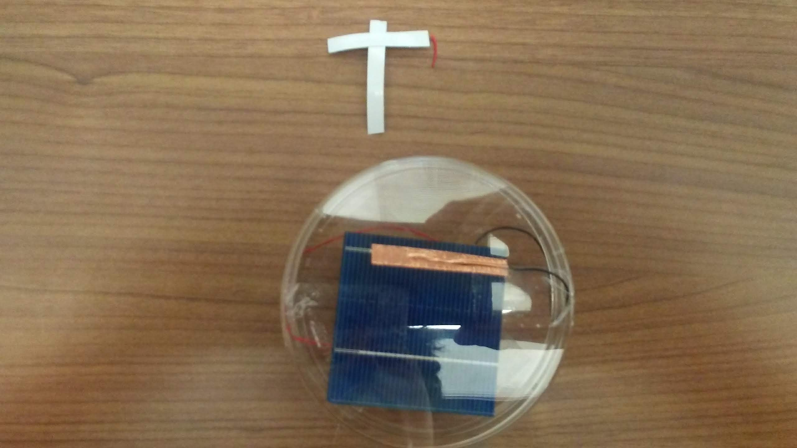

<!-- Packages -->
```{r setup, include=FALSE}
knitr::opts_chunk$set(echo = TRUE,warning=FALSE, message=FALSE)
```

# I have been crucified with Christ and I no longer live, but Christ lives in me. - Galatians 2:20 {#index}

I'd be the moon so I can reflect the shine from God on you during your darkest hours.

{width=600}

# Apr. 1, 2020 - Serve people

Luke 22:24-38

> For who is greater, the one who is at the table or the one who serves? Is it not the one who is at the table? But I am among you as one who serves. (v.27) Q1. Are you serving or being served in groups where you are involved in? 

We should think about God's kingdom and mission for which, we need to serve people as Jesus did regardless of thinking about reputation and authority. After done with my duty at UNDP Philippines, I came back to Korea and joined the small group in church where I found myself being proud about working in UN implicitly and seeking acknowledgement from people. I realized again about my sinful nature to get acknowledged and showing off. God has kept me in a humble environment where I have been learning being humble and quiet. 

> But he replied, "Lord, I am ready to go with you to prison and to death." (v.33) Q2. What are you self-confident with instead of relying on Word?

Jesus predicted that how Peter would go through the sufferings in the future. Peter confirmed with his own self-confidence that he would not deny Jesus to death. In fact the conviction from Peter is not based on the Word, but from the unbelief in what Jesus said that He will die. Being humble rather than self-conviction will help us stand firm in Word. 

> The disciples said, "See, Lord, here are two swords." "That is enough," he replied. (v.38) Q3. What do you mistakenly interpret the Word literally? 

What Jesus said to buy swords by selling clothes means to prepare His death and sufferings from the persecution. But disciples interpreted it literally as preparing swords. Then Jesus stopped talking about it further. We need to understand the Word by being humble rather than self-conviction or our own opinion from the pride. 

# Mar. 31, 2020 - Love enemy

Can I forgive, embrace, have a meal with, and pray for the one who has betrayed me? When I was naive and had not known more about God, I used to trust people. Through the life of hardships, I experienced the sinful human nature full of selfishness, greed, and hypocrisy. Also I saw how my parents got betrayed by business partners. The more I know God, and listen to Word, the more I have known humanity and human nature. Finally I understood why the church in Korea kept saying "people is not the objects to trust but to love." The more we trust, the more only disappointments would come back to us. People is not complete and after all disappointing each other. We only love them through the love from Jesus. We can't do but Jesus can do. In the Bible, Jesus said love my enemy, and put other chick to him when the enemy hits my chick. And honestly, I can't follow His Word. If someone hits me, I would hit him back. But as Stephen was stoned to death while he was still loving and forgiving those who killed him, I'm sure God will grow me in that way that finally I can love my enemy at the end of my life journey.

Just as Jesus bore the cross for our salvation, we must also repent with a sense of desperation for the sake of our family’s salvation, bringing them the Word to eat. I used to argue with mom about faith we have from the different perspectives. Now I regret that it would have been better to empathize with her by listening to her with love rather than insisting my opinion. I have still brothers and dad who I really need to listen to and empathize with for their salvation. For this, I need to bear the cross of self-denier, the inner pride which keeps saying "I'm right and know better than them." Only with love, I'm sure I can win their salvation to God.

Though he might have been better off never having been born, he is someone who is essential in redemption history (Matthew 26:24). Among us, there are families and neighbors that are like Judas Iscariot, individuals that God has granted to be among us for the sake of our salvation. There are people giving us hardships and sufferings. But after all, they are the ones God used for our salvation as God used everything good or bad and righteous or evil for good. I have been complaining about dad's reckless behavior which gave a lot of stress to mom. But surely, God used dad for my mom's salvation. Likewise, dad was used for my salvation too. Everything is under control of God. What I need to do is to leave it to God and acknowledge His sovereignty.

- 21 But the hand of him who is going to betray me is with mine on the table. 22 The Son of Man will go as it has been decreed. But woe to that man who betrays him!” - Luke 21:21-22


# Mar. 29, 2020 - Be awake 

## Be awake

Are you first praying to God before the Word and asking Him for guidance whenever you are faced with an incident or a sign? Yes, these days virus, mom's death and online class leading me to come back to Korea had me to ask God for the guidance. Therefore, believers must always be captured by the Word and to stay awake. Life is temporary that I should be awake all the time. There is no time to worry about what to eat, wear, or have for accommodation. Salvation all the time in my mind!


## Temporary life 

What kind of a splendid life are you dreaming of, not realizing that the time will come when everything will be completely destroyed? Reputation, beauty, fortune, house, car, etc. will be gone soon. While I'm living in this temporary world, I will keep thinking about salvation as my mom's death again confirmed that the life here is temporary and in vain. Am I dedicating myself to the calling I have been given the way Jesus consistently devoted Himself to His? I'd like to be faithful to my roles that I will make a plan during staying in Korea to prepare the exam and also to serve family as the first son.

## Destruction for salvation 

Jesus told them that there would be chaos, disturbance, wars, and great signs of Heaven but that they must not be confused or be afraid because this will not be the end but the beginning of salvation. We must understand that even the success we have built up with much hard work and effort will come to an end when it is time. There is nothing in this world that can keep us protected and happy for eternity. The money, health, and educational background that we rely on must be thrown down completely before Jesus can come into our life and begin the process of salvation in us.  Redemption follows destruction and after being fully destroyed. Since it leads to salvation, I just fave a faith in God who will work on this! God, please have those studies, degrees and researches to be tools for salvation to others rather than goals themselves. Please have mercy on me.

- Even so, when you see these things happening, you know that the kingdom of God is near. - Luke 21:31

# Mar. 21, 2020 - Acknowledging God's sovereignty

There is time to be tied and time to be untied in the current situation. Just acknowledge what God will do and I will just do my work in the current situation rather than planning for my future. I've been tied in Seattle and now untied that my new journey in Korea will come soon. Or it would be the time to be tied again in Korea. Never know, just trusting God who will work for good whatever.

- “Go to the village ahead of you, and as you enter it, you will find a colt tied there, which no one has ever ridden. Untie it and bring it here. - Luke 19:30

I praise God for His grace that my mom's death enlightened me more about His plan that I know how to acknowledge His sovereignty. I was controlling and sometimes restless but now I learned how to acknowledge God and get peace after all. If God gives, I thankfully receive it, if God does not give, I thankfully starve, and if God takes my life, I just go to heaven.

- “Blessed is the king who comes in the name of the Lord!” “Peace in heaven and glory in the highest!” - Luke 19:38

The time is coming. What I need to do everyday is to focus more on His love toward me and loving Him more with acknowledgment of his sovereignty rather than my own effort not sinning. Once I focus on not sinning, I get more burden and trapped finally. I will spend more energy on fixing my eyes on God, the light only then, the sin, darkness will disappear.

- They will dash you to the ground, you and the children within your walls. They will not leave one stone on another, because you did not recognize the time of God’s coming to you.” - Luke 19:44

He weeps for my sufferings that we had and will have because He was a human and knew how hard it is. I believe Jesus wept for my mom's suffering who is now in heaven after all. I'm sure her suffering and physical destruction led her to redemption in heaven. It would be the same heart of the father when the prodigal son left on his way. Because He knew how hard it would be that the son would suffer but He also knew the restoration that the son finally love the father more after experiencing the grace of the father. Jesus wept for Nazaros who had died even if He knew Nazaros would be resurrected again. The period of destruction such as Babylonian captivity in our lives leads to experience the work of God's redemption as restoration and recovery follow destruction. Jesus was destroyed with wounds and died. Then recovery, resurrection, and salvation followed. 

Repentance is to trust God, acknowledge His control by humbly asking mercy on me by admitting my weakness and I'm a sinner. I knew what is right and did my best to keep it and repeated several times but finally failed. I realized I can't do it on my own that I repented for my ignorance at the first place where I was not careful. Now accepting my weakness, I've asked His mercy on me. It is because everything regardless of mistakes or good works will work together to achieve the salvation. God is so gracious that He allows our weakness and mistakes which bring consequences and sufferings that help us to grow in Spirit and to know God's grace and love more. This is salvation, our final goal in this hopeless world. 

- As he approached Jerusalem and saw the city, he wept over it - Luke 19:41

- To love him with all your heart, with all your understanding and with all your strength, and to love your neighbor as yourself is more important than all burnt offerings and sacrifices." - Mark 12:33


# Mar. 19, 2020 - Seeking the lost

It seems that Zacchaeus, who was short, with the inferiority lived hard until he reached a high position. However, Zacchaeus, who lives with ignorance and insults from people, must have felt a sense of empty after achieving everything. The biggest problem is not knowing myself that I pursue something not important after all. For me, due to the financial difficulties, the sense of inferiority, I worked hard for the recognition from people. When I got to the point of achievement, only thing I pursed was enjoying life and seeking pleasure by sports and travelling. But I still felt emptiness deep in my heart. 

> We have to know that condemnation based on our standard of right or wrong is an act of denial of Jesus’s cross and a hindrance to salvation.

At that time, what Zacchaeus needed most was not to be criticized, but to be with someone who empathize with him. So Jesus came first to him by calling his name. He didn't scold Zacchaeus but was with him touching Zacchaeus' heart like that. Now Zacchaeus, calls Jesus the Lord. Those who condemn and mutter about Jesus because He was with Zacchaeus, such a sinner, are like the first son who focused on self-effort to become righteous and judged others who committed sins. The more I read the Bible, the more I do not condemn others, the more I know that I am a sinner and I feel the love and grace of God. Moreover, I become more seeking mercy and pity from God. Recently when I read the Bible, I felt guilty. So, when I prayed, God gave me a feeling that God understands that it is still okay, and I felt peace and gratitude through His grace and love while expecting how He will do and lessons I'm going to learn for salvation and becoming holy. This is grace, and I believe I'm on the process of being far from sin as a result even if I'm still struggling with my lack of faith. 

- He wanted to see who Jesus was, but being a short man he could not, because of the crowd. So he ran ahead and climbed a sycamore-fig tree to see him, since Jesus was coming that way. When Jesus reached the spot, he looked up and said to him, "Zacchaeus, come down immediately. I must stay at your house today." So he came down at once and welcomed him gladly. All the people saw this and began to mutter, "He has gone to be the guest of a 'sinner.' " But Zacchaeus stood up and said to the Lord, "Look, Lord! Here and now I give half of my possessions to the poor, and if I have cheated anybody out of anything, I will pay back four times the amount." Jesus said to him, "Today salvation has come to this house, because this man, too, is a son of Abraham. - Luke 19:3-9

When I was working at GGGI, I desperately waited for the result of UNDP interview, and guilt came to my mind. I realized it is an idol that I was obsessed with thinking I must go to UNDP, and this is the fear that God will not want it, and that God will wipe out. I prayed about it, and God allowed me getting the acceptance letter. The feeling I felt at that time was that God felt pity for me, and that he wasn't the one who punish me scaredly, but the one who understood me and gave me what I asked for knowing my weakness and lack of faith so I loved him more and only shed tears of grace for a while at that moment. I'm experiencing God who knows and touches my weaknesses with His warm heart.


# Mar. 18, 2020 - I'm a sinner

I'm blind that is why God allows incidents and problems for me to realize. It is all about the interpretation leading to my salvation about the problem in my life, not the problem solving.There is much grace where there are many sins. A sinner is not a person who mourns over his sin, but a person who does not know his sin. What I can do is just cry to God to have mercy on me. This incident or the problem is the event for my salvation. Everything regardless of mistakes or good work will work together to achieve the salvation. After all, through my testimony and confession in the future, people will come to salvation and I become less blind, finally can see clearly! The more I experience God's love and grace through my mistakes, the stronger faith and love I have in God that I can give my Isaac to God like Abraham did at the end of his life journey who used to be a coward. It is God who is working in me growing with the stronger faith, not my self-effort since God gave us the faith, the gift of God, and He is working on making the faith stronger through our life journey. 

* For it is by grace you have been saved, through faith--and this not from yourselves, it is the gift of God-- not by works, so that no one can boast. - Eph 2:8-9

God, I am a sinner. Please have mercy on me. I am desperate for myself knowing what is right while not being able to do it. I admit I'm a sinner. I mourn for my sinful fate that I get hurt and I hurt people. Thank You for giving me this incident and problem so that I can realize that I am really a sinner. I'm thankful for letting me know that it is not about solving this problem, but more about knowing You through the problem, realizing Your love and grace, making me aware that I am a sinner and being unable to do anything, and further seeking Your mercy. Thank You for comforting me by telling that there is many grace where a lot of sins exist. Thank you for your consolation telling that this is an event of salvation, and that everything including our weakness, mistakes, Your grace and love will work together to achieve the good and salvation through this event. At the end of this event, I believe that all people will come to salvation. Please have mercy on us all.

- He called out, "Jesus, Son of David, have mercy on me!" Those who led the way rebuked him and told him to be quiet, but he shouted all the more, "Son of David, have mercy on me!" - Luke 18:38-39


# Mar. 17, 2020 - How to be saved

Like a kid who has no doubt but trust whatever Father says. In this regard, I hope to raise my kids in the church before they grow up with their own mind and thoughts.

- But Jesus called the children to him and said, “Let the little children come to me, and do not hinder them, for the kingdom of God belongs to such as these. - Luke 18:16

He lacks the essence of the law, loving God and neighbors as it is all about not obeying God forcedly with our zeal and self-effort, but obeying Him voluntarily by loving Him. Self-effort is never working. Only by loving God, we naturally become distant from sins, and worldly things such as money, reputation, etc. and keep the law. The ruler who kept all the laws was not saved after all. The matter to salvation is not keeping the laws or not sinning, but humbly accepting Jesus as our master with faith and love. Only then, keeping the law and not sinning follow.

- You know the commandments: ‘You shall not commit adultery, you shall not murder, you shall not steal, you shall not give false testimony, honor your father and mother.’” “All these I have kept since I was a boy,” he said. - Luke 18:20,21

If we don't take Jesus as our Lord, but money, education, family, and reputation, it is hard to be saved. Salvation is not possible by human's own effort, but God, and His love and grace. Laying down money, education, family, and reputation means leaving them to God, otherwise, they become obstacle to our salvation.

- Indeed, it is easier for a camel to go through the eye of a needle than for someone who is rich to enter the kingdom of God.” Those who heard this asked, “Who then can be saved?” Jesus replied, “What is impossible with man is possible with God.” - Luke 18:25-27


# Condition for salvation 

What is God's will then? Wouldn't it be to trust God and love Him more with His love and grace to us than just to listen to and obey Him with our zeal or self-efforts? When we trust and love Him, we obey Him, not the other way around. This is compared to "trusting God vs. pleasing God." Committing sins cannot be justified, but God grants us freewill and responsibilities to pays for the consequences and we experience His grace and love through His forgiveness leading to our spiritual growth. We have no choice but to ask God for mercy on us for our weakness when making our choices, and we expect God to lead goodness to our lives by faith. As we experience God, with His love and grace to us, we seem to gradually love Him more and obey Him in return. In the end, it is not obeying God forcedly with our zeal and self-effort, but obeying Him voluntarily by loving Him. Excited by His grace, we are only satisfied with God. In conclusion, God's will is not about our actions, sin or not sin, but rather it is more about our salvation that we trust and love God fully and obey God as a result of the faith and love at the end.


The important thing is not whether I keep the law or commit sin, but to love God and do right as a result of loving God. I stopped habitual sins with my efforts, and I found myself proud of it but eventually I did it again. Self-effort is never working. Only by loving God, we naturally become distant from temptation, but when we encounter an environment of temptation, we have no choice but to mourn and come to God. That is what God wants us to know, acknowledge the nature of our sins, and commit everything to God by trusting Him because we can't do but He will do it for us. 

The process that emerged after the temptation was inevitable, and it is an environment in which every human being is hard to avoid committing sin. So we have to avoid the temptation at the first place, otherwise, once tempted, it is really hard to get out of it that we have no choice but to acknowledge our weaknesses and mourn before God. We should admit that we can't stop in the middle of process once tempted or addicted. After all, am I the Pharisee or the tax collector? Keeping all the law with self-effort and bragging myself or committing sins while admitting my weakness and humbly asking God have mercy on me? God confirms the latter is justified. So it is not about sin not sin, but more about humbly asking His mercy by trusting Him with love. As if I had stopped pursuing my zeal, but repeated my pursuit again, just as the ruler who kept all the laws was not saved, even if I kept the law, when I ended up acting without essence, the love of God, I'm like a pig which eats what it vomited, and everything I do is in vain.

- "Two men went up to the temple to pray, one a Pharisee and the other a tax collector. The Pharisee stood up and prayed about himself: 'God, I thank you that I am not like other men--robbers, evildoers, adulterers--or even like this tax collector. I fast twice a week and give a tenth of all I get.' "But the tax collector stood at a distance. He would not even look up to heaven, but beat his breast and said, 'God, have mercy on me, a sinner.' "I tell you that this man, rather than the other, went home justified before God. For everyone who exalts himself will be humbled, and he who humbles himself will be exalted." - Luke 18:10-14

- A certain ruler asked him, "Good teacher, what must I do to inherit eternal life?" "Why do you call me good?" Jesus answered. "No one is good--except God alone. You know the commandments: 'Do not commit adultery, do not murder, do not steal, do not give false testimony, honor your father and mother.'" "All these I have kept since I was a boy," he said. When Jesus heard this, he said to him, "You still lack one thing. Sell everything you have and give to the poor, and you will have treasure in heaven. Then come, follow me." When he heard this, he became very sad, because he was a man of great wealth. Jesus looked at him and said, "How hard it is for the rich to enter the kingdom of God! Indeed, it is easier for a camel to go through the eye of a needle than for a rich man to enter the kingdom of God." - Luke 18:18-25


# Mar. 16, 2020 - How to pray

God wants us to keep praying without stopping. But we tend to stop praying if God grants our prayer requests. This is the problem. Regardless we receive the answers for our prayers from God, we should keep praying. That's why Jesus said if He could find faith when He comes back because there would be none keeping the faith if God grants the prayer requests. The matter is not we receive the prayer answered, but we keep communicating and relationship with God by prayers.

- And will not God bring about justice for his chosen ones, who cry out to him day and night? Will he keep putting them off? I tell you, he will see that they get justice, and quickly. However, when the Son of Man comes, will he find faith on the earth?" - Luke 18:7-8

God said, there is none righteous as everyone committed sins. In fact, we are all robbers, evildoers and adulterers. He wants us to admit we are robbers, evildoers and adulterers. This is what we only can do - asking God to have mercy on us. Then God will call us righteous only after that. This is the only secret to receive answers for our prayers that we ask God mercy on us while admitting we are sinners that we can't do anything but asking His mercy. Jesus said, the tax collector who asked God have mercy on him, was justified before God. He is now called righteous.

- The Pharisee stood up and prayed about himself: 'God, I thank you that I am not like other men--robbers, evildoers, adulterers--or even like this tax collector. I fast twice a week and give a tenth of all I get.'"But the tax collector stood at a distance. He would not even look up to heaven, but beat his breast and said, 'God, have mercy on me, a sinner.' "I tell you that this man, rather than the other, went home justified before God. For everyone who exalts himself will be humbled, and he who humbles himself will be exalted." - Luke 18:11-14

God listens to the prayer of the one who confesses himself to be a sinner. Everyone is a sinner without any exception (Romans 3:23) and the prayer of the Pharisee who did not admit that he was a sinner has nothing to do with Jesus who was crucified for sinners. When we confess and admit that we are sinners before God, God justifies us. The Lord exalts the humble ones who confess that they are sinners. Then we will be able to be free from the condemnation that binds us and be blessed to be in places where we ought to serve.


# Mar. 15, 2020 - Admitting I'm a sinner leads to faith

> And Saul was there, giving approval to his death. On that day a great persecution broke out against the church at Jerusalem, and all except the apostles were scattered throughout Judea and Samaria. Godly men buried Stephen and mourned deeply for him. But Saul began to destroy the church. Going from house to house, he dragged off men and women and put them in prison. Those who had been scattered preached the word wherever they went. Philip went down to a city in Samaria and proclaimed the Christthere. When the crowds heard Philip and saw the miraculous signs he did, they all paid close attention to what he said. With shrieks, evil spirits came out of many, and many paralytics and cripples were healed. So there was great joy in that city. - Acts 8:1-8

## Shameful weakness, failure, and sin in the past 

Saul, who takes for granted Stephen's death, who was slain by stone for blasphemy, has only form of the law and no essence of the law. Stephan was killed by the law. Spiritual ignorance is scary. Stephen was martyred to give birth to Paul from Saul after all. Luke, who wrote the book of Acts, was Saul's physician and was able to document the events in detail. Since Saul had never forgotten the scene, he could later confess himself as the worst sinner and was able to deal with any hardship to spread the good news. What is the shameful event I will never forget?

- They will put you out of the synagogue; in fact, a time is coming when anyone who kills you will think he is offering a service to God. - John 16:2

- Here is a trustworthy saying that deserves full acceptance: Christ Jesus came into the world to save sinners--of whom I am the worst. - 1 Tim 1:15

## Scattering the church by God

That day, Stephen's death brought great persecution to the church. Not Rome, but Jews who believed in the same God persecuted the early church. It is the mission of the Early Church to go to Judea, Samaria, and the Gentiles to spread the Gospel. With many believers and lack of places of worship due to the great revival, the early church, which had no intention of going out, was forced to go out to Gentiles through persecution intended by the power of God. It should be inevitably scattered by God, not by my pride, passion, or self-righteousness. Life comes through pain. Likewise, Christians who would not have been scattered were scattered through the persecution of the Jews, and as a result the Gospel was preached out to Gentiles. It is God's plan. God uses our weaknesses in any situation. Philip ran away with no choice because of the persecution, not because of the Gospel, but it was resulting in the preaching of the Gospel as he lived according to the Word every day. God does guide us if we live cling to the Word every day. There is the joy of preaching the gospel in the event of scattering.

## Focus on salvation

Some people threw stones, while others cried and buried Stephan by respecting him. It is not that we cannot preach the Gospel with our shameful acts. We are helpless. Only God does it. We should focus on salvation, like Stephan, not people's praise and curse. The early church would not be scattered until the Jews became wicked enough to destroy the church. The zeal of those who were not experiencing Christ is a great harm to the kingdom of God. This is how Saul was before he became the believer. Saul remembered the detailed death of Stephen and the reaction of these godly people. This is the moment when Stephen was giving birth to the great apostle Paul by his death. 

## Fullness of God (Cross and Resurrection)

In many cases, Jesus was used as the Son of Man, but it is only Stephan who called Jesus as the Son of Man. To that extent, Stephan knew the meaning of Jesus' suffering and resurrection. Satan admits the cross, but denies the resurrection. The cross and the resurrection must be spoken together otherwise, we don't feel the fullness of God and end up with having trials and getting hurt and angry. If scattering is God's will, it becomes to bear fruit. It is a blessing that there is no way because God will guide us. Does my suffering save people?

## Faith is the relationship with God 

When was the most happiness in my life? The hardest problem in my life is not knowing myself. Moreover, if I can't see myself, neither I can see anyone nor God. Sin is off the target. The gospel is the relationship with God. Man is fundamentally an enemy to God. The relationship with God was restored through the only begotten Son, Jesus. All worries go away with love and close relationship with God. This is faith. Faith is the relationship with God. We rejoice because we love God, We love God because we rejoice. Relationships are important. So, if I can see myself properly as a sinner, it is a grace and a gift. Knowing that I am a sinner, I can know and meet the Savior Jesus because Jesus is needed only to those who know they are sinners. Then God uses our pain as a medicine to save others. There is nothing good in us. He humbles me to empathize with the lowly people and to preach the gospel to them. God, have mercy on me as I am the helpless of the paralysis, and the beggars of the crippled in feet. Help me that my ego is gone and confess that only God, not me, has done it to preach the gospel.


# Mar. 14, 2020 - Have mercy on me

This is the result of the faith of the Samaritan. His faith was represented by thanking Jesus. His faith saved him. Regardless of how sinful I am, ask Jesus mercy on me by humbling myself with confessing my weakness, and believe in Him as the lord. This faith saves me after all. The hardship now I have is in fact a blessing which makes me more humble seeking God.

- and called out in a loud voice, “Jesus, Master, have pity on us!”....Jesus asked, “Were not all ten cleansed? Where are the other nine? Has no one returned to give praise to God except this foreigner?” Then he said to him, “Rise and go; your faith has made you well.” - Luke 17:13,17-19

Rather than worrying about food, house, and virus, I would focus on His salvation toward my neighbors and myself. While cautious about any dangerous and risky circumstances around, I still want to pursue gathering with brothers to praise and worship God. I need wisdom. After all everything in this world I care about currently is temporary. Paul and Stephen dared to die with spreading the good news. They knew it would risk their lives but they still pursue it knowing that is what God wanted and is for salvation. Regardless of whether it is dangerous or not, if the purpose is for salvation, then go for it. God would take care of rest which is out of my control. God, have mercy on me with the little faith. Thanks for allowing me this humble circumstances, that I have nothing to say but quietly asking your mercy. 

- Whoever tries to keep their life will lose it, and whoever loses their life will preserve it. - Luke 17:33


# Mar. 13, 2020 - Be humble

Do I make someone to stumble by judging and condemning so that they keep away from God? Yes, I did it to my younger brothers. When I was excited about the good news, I invited my stubborn brothers who didn't listen to me to the church that I finally blamed and accused them. As a result, they kept away from God and I made them further away from God. For that on, whenever I asked them to come to church, they didn't listen to me. I confess my little faith and self-effort caused them from coming to Jesus. 

Furthermore, I should not judge people because they don't listen to me telling the truth and Jesus. When I was a marine, I tried to bring several juniors to the military church. On day, one of them who was supposed to go to the church, suddenly changed his mind that he didn't want to go with me. I was angry and punched him as I had a right to punch anyone if they didn't listen to me in the military. Even if that was acceptable in the frame of the military life, I feel sorry if he left away from God because of me. It is all about loving not forcing. Likewise, I feel God wants us to worship and love Him voluntarily rather than fearfully terrified for the punishment.

- “Things that cause people to stumble are bound to come, but woe to anyone through whom they come. It would be better for them to be thrown into the sea with a millstone tied around their neck than to cause one of these little ones to stumble. - Luke 17:1,2

We need to forgive regardless at the first time. But it is hard to forgive unconditionally. It is up to my level of faith and perseverance. However, if the person keeps sinning against us, we forgive them only if they repent. Without repentance, it is hard for us to forgive unconditionally for those who keep sinning against us repeatedly.

- “If your brother or sister sins against you, rebuke them; and if they repent, forgive them. - Luke 17:3

As we grow in Spirit, we would realize our weakness more and become more humble like the disciples who are now asking Jesus to increase their faith after they grow enough to be called apostles. The more we grow by reading the Bible and prayers, the more we become humble and realize our weakness, we lack faith and we are sinners. My faith is as small as a mustard seed, but this would grow big enough as to have birds later on. I hope this will happen and have faith that God will grow my faith bigger.

- The apostles said to the Lord, “Increase our faith!” 6 He replied, “If you have faith as small as a mustard seed, you can say to this mulberry tree, ‘Be uprooted and planted in the sea,’ and it will obey you. - Luke 17:5,6

All I have such as money, time, health, and talents are from God and not mine. What I need to do is just to thank God and be satisfied only with the eternal life that God promised to give me. I'm doing what I'm supposed to do as the unworthy servant. I'm a sinner still trying to get recognition and acknowledgement from people. What I can do is just humbly to shut up and asking God for His mercy on me.

- So you also, when you have done everything you were told to do, should say, ‘We are unworthy servants; we have only done our duty.’ - Luke 17:10

# Mar. 7, 2020 - Faith is repentance 

To God, the value of one sheep can't be compared in quantitative way but qualitative way. It is like to my parents, my value could not be measured like $100 billion, but as the unlimited value. Our values could not be counted in an economic way because we are priceless.

- “Suppose one of you has a hundred sheep and loses one of them. Doesn’t he leave the ninety-nine in the open country and go after the lost sheep until he finds it? - Luke 15:4

It is interesting to find the word "repentance" is the flip side of the word "faith." So to repent means to believe in Jesus. It is also interesting to know the word "repent" or "repentance" is never used in the John's Gospel but the word "faith", "believe" appears more than 100 times. On the other hand in the book of Revelation, the another book of John, the word "repent." appears. This shows in fact to believe or to repent is considered to the same as to repent. Now to change our minds with regard to what we previously believed and trusted is to believe in Jesus which is repentance as well. 

> * Acts 2:22-38:  When asked, “What shall we do?” Peter said, “Repent.”
*  Acts 16:29-34:  When asked, “What must I do to be saved?” Paul said, “Believe.”

- testifying to Jews, and also to Greeks, repentance toward God and faith toward our Lord Jesus Christ. - Act 20:21

- I tell you that in the same way there will be more rejoicing in heaven over one sinner who repents than over ninety-nine righteous persons who do not need to repent. - Luke 15:7

# Mar. 6, 2020 - Following Jesus

This message gives a thought about what is more important. Sometimes we are deceived to follow our unbelieving families for the sake of peace. In this regard Jesus said, loving Him and God matters more than loving family. While the 5th commands is to respect parents, Jesus still stressed out the real love is to let them know and meet Jesus in person even if it may break the temporal peace in the family or break the law of the 10 commands. We could be accused by our families due to our faith in Jesus. Still we need to confront them with the good news. To the world, we may look we are hating our families but this is the real love for their salvation.

- If anyone comes to me and does not hate father and mother, wife and children, brothers and sisters―yes, even their own life―such a person cannot be my disciple. - Luke 14:26

It is hard to follow Jesus with lots of my belongings to carry on. What are things that I need to throw away even my pride? Once prepared by measuring the battle and determined for that, I should take risks to go forward without turning back even if it costs my life. 

- In the same way, those of you who do not give up everything you have cannot be my disciples. - Luke 14:33

Even if my shape disappears, I should be dissolved well to take my role of the mission God has given to me. When I become humble by laying down my pride and vulnerable by confessing my weakness, God could use me for saltiness to the world.

- Salt is good, but if it loses its saltiness, how can it be made salty again? - Luke 14:34

# Mar. 4, 2020 - Being humble 

The hallmark of picking the places of honor is pride. Pride removes God's grace and only my boast is left. I must be humbled to meet Jesus. So a humble environment is a blessing. The Word can humble me because I can see my mistakes and sins. I need to meditate on the Word daily and mourn my weakness because it lets me know that I am a sinner. The reason God gave the Word is not for me to keep the Word fully with my strength leading me to rely more on myself with pride, but to humbly realize that I can only be a sinner, so that I can only depend on Jesus and seek His love and grace. The Word is sweet in the mouth, but sour in the stomach. Because it is hard to apply it to the daily life. I realize that I cannot keep the Word completely everyday, so that I humbly ask God for His love and grace. Definitely God wants us to be humble by admitting our weakness rather than upset by judging others. 

- Luke 14: 11 For everyone who exalts himself will be humbled, and he who humbles himself will be exalted."

- Revelation 10:9 So I went to the angel and asked him to give me the little scroll. He said to me, "Take it and eat it. It will turn your stomach sour, but in your mouth it will be as sweet as honey."

## Pride 

- Luke 11:43 "Woe to you Pharisees, because you love the most important seats in the synagogues and greetings in the marketplaces.

- Isaiah 5:21 Woe to those who are wise in their own eyes and clever in their own sight.

## Anger 

- Psalms 37:8 Refrain from anger and turn from wrath; do not fret--it leads only to evil.

- James 1:20 for man's anger does not bring about the righteous life that God desires.

- Psalms 103:8 The LORD is compassionate and gracious, slow to anger, abounding in love.

## Humble 

- Luke 1:52 He has brought down rulers from their thrones but has lifted up the humble.

- 2 Samuel 22:28 You save the humble, but your eyes are on the haughty to bring them low.

- Psalms 147:6 The LORD sustains the humble but casts the wicked to the ground.

- Psalms 18:27 You save the humble but bring low those whose eyes are haughty.

- Proverbs 3:34 He mocks proud mockers but gives grace to the humble.

- Psalms 149:4 For the LORD takes delight in his people; he crowns the humble with salvation.

- Isaiah 29:19 Once more the humble will rejoice in the LORD; the needy will rejoice in the Holy One of Israel.

- James 4:10 Humble yourselves before the Lord, and he will lift you up.

- James 4:6 But he gives us more grace. That is why Scripture says: "God opposes the proud but gives grace to the humble."

- 1 Peter 5:6 Humble yourselves, therefore, under God's mighty hand, that he may lift you up in due time.

- Deuteronomy 8:16 He gave you manna to eat in the desert, something your fathers had never known, to humble and to test you so that in the end it might go well with you.

# Mar. 2, 2020 - No stop seeking God

God's mercy would be on me when I'm present in the place of the Word spoken and given. Like the woman, I'm a sick patient and a sinner. Nevertheless, God will heal me by seeing me with the compassionate heart as long as I'm there where His Word is proclaimed and given. Have mercy on me.

- 10 On a Sabbath Jesus was teaching in one of the synagogues, 11 and a woman was there who had been crippled by a spirit for eighteen years. She was bent over and could not straighten up at all. 12 When Jesus saw her, he called her forward and said to her, “Woman, you are set free from your infirmity.” - Luck 13

Am I a hypocrite focusing on traditions and actions while forgetting the essence of love and salvation? When I was in college, I went to the Philippines as a missionary trainee based on financial supports from my Christian friends around 40 people that I could cover air fare and living expenses for about 6 months. The purpose of the mission was to follow the great commission that tells me to go and make disciples. Apparently, I looked following God's command, but in fact I was a hypocrite that deep in my heart, there was no love for people to know God but more about seeking accomplishment of having more disciples to show off and a desire to explore a new life in the Philippines. I was a robber getting money from friends for my own sake after all. Even if I look following God, and doing His work, if there is no love in it, it is nothing. Even if I keep the law, there is no love for God and neighbors, it is no use.

- Go therefore and make disciples of all nations, baptizing them in the name of the Father and of the Son and of the Holy Spirit, teaching them to observe all that I have commanded you. And behold, I am with you always, to the end of the age.” - Matt. 28:19-20

- If I speak in the tongues of men and of angels, but have not love, I am only a resounding gong or a clanging cymbal. If I have the gift of prophecy and can fathom all mysteries and all knowledge, and if I have a faith that can move mountains, but have not love, I am nothing. If I give all I possess to the poor and surrender my body to the flames, but have not love, I gain nothing. - 1 Cor 13:1-3

Since born, I have been to church where sometimes people gave their testimonies about Jesus and His blood which made them feel His love and grace that changed their lives. Whenever I listened to them, I felt frustrated because I had never experienced what they described. I kept asking God that I could experience what they did. But I could not experience Him. Finally I forgot seeking God and started to enjoy the worldly life by seeking success. After graduation with masters, I was determined to know more about God, and didn't stop listening to His Word while being jobless for a long time. That's the moment Jesus came that I could feel His love too as the others described. The mustard seed is willingness and determination to know God and by listening to His Word, it grows that finally it becomes big enough to embrace birds. 

- 18 Then Jesus asked, “What is the kingdom of God like? What shall I compare it to? 19 It is like a mustard seed, which a man took and planted in his garden. It grew and became a tree, and the birds perched in its branches." - Luke 13

# Mar. 1, 2020 - Repentance

I used to accuse and judge others by trying to find why they are wrong and why I am right. Now, I'm more seeking reflecting on myself of wrong doings and my heart rather than others with their wrong doings. God made me humble that I realized I had nothing to say but shut up. By listening to testimonies of brothers and sisters in the church in Korea, I indirectly experienced their lives which touched my heart leading to repentance as well. Praising His grace and endless love on us the sinners. Living daily life by asking help for my weakness to God and trusting His unconditional love for those humble in heart will help me have the productive life. Walking with Him everyday through His Word and prayer is the must for that.

Who am I? Prideful sitting in the place of God, judging and condemning people, Pharisees or humble, hoping for God's mercy,tax collectors and prostitutes? Who are the people who meet Jesus? Who is God looking at? I see part of me as Pharisee and part of me as prostitute. I want to repent for my wrong doings in the past and change what I'm going to do differently from what I used to do while I admit my weakness of failing to do that. Asking God to have mercy on me. I'm a sinner who frequently fails. This is only what I can do that I trust your mercy, unconditional love and grace to those who confess their weakness and sins with humble heart.

- So he said to the man who took care of the vineyard, 'For three years now I've been coming to look for fruit on this fig tree and haven't found any. Cut it down! Why should it use up the soil?' " 'Sir,' the man replied, 'leave it alone for one more year, and I'll dig around it and fertilize it. - Luck 13:7-8

# Feb. 28, 2020 - Saved by faith

Without faith we cannot please God. We are saved by believing in Jesus, not our actions to keep the law. On the other hand, we happen to keep the law as a result of that we love Jesus not that we are afraid of the punishment. If it were for punishment to keep the law, our faith won't grow. But still keeping the law is not the condition to the salvation, but only by faith in Jesus. My past, present, and future sins have been forgiven. There is no condemnation in faith in Jesus.

I know that no matter how hard I try I can't be free from sin. I know my self effort to keep the law makes things heavier. I know that I am saved by faith in Jesus regardless of whether I sin or not. I know there is no condemnation in Jesus. Do I believe in Jesus? Then, what am I worried about? I just admit my weaknesses in faith in Jesus and come to God. 

- Therefore, there is now no condemnation for those who are in Christ Jesus, because through Christ Jesus the law of the Spirit of life set me free from the law of sin and death. - Romans 8:1,2

- And without faith it is impossible to please God, because anyone who comes to him must believe that he exists and that he rewards those who earnestly seek him. - Heb 11:6

- know that a man is not justified by observing the law, but by faith in Jesus Christ. So we, too, have put our faith in Christ Jesus that we may be justified by faith in Christ and not by observing the law, because by observing the law no one will be justified. - Cal 2:16

- For it is by grace you have been saved, through faith--and this not from yourselves, it is the gift of God-- not by works, so that no one can boast. - Eph 2:8,9

- Where, then, is boasting? It is excluded. On what principle? On that of observing the law? No, but on that of faith. For we maintain that a man is justified by faith apart from observing the law. - Romans 3:27,28

## Jesus, the Savior 

- Jesus turned and saw her. "Take heart, daughter," he said, "your faith has healed you." And the woman was healed from that moment. - Matt 9:22

- "Go," said Jesus, "your faith has healed you." Immediately he received his sight and followed Jesus along the road. - Mark 10:52

- Jesus said to the woman, "Your faith has saved you; go in peace." - Luke 7:50

- Then he said to her, "Daughter, your faith has healed you. Go in peace."...Hearing this, Jesus said to Jairus, "Don't be afraid; just believe, and she will be healed." - Luke 8:48,50

## How to be saved? 

- Whoever believes and is baptized will be saved, but whoever does not believe will be condemned. -Mark 16:16

- But we are not of those who shrink back and are destroyed, but of those who believe and are saved. - Hebrews 10:39

- made us alive with Christ even when we were dead in transgressions--it is by grace you have been saved. - Ephesians 2:5

- That if you confess with your mouth, "Jesus is Lord," and believe in your heart that God raised him from the dead, you will be saved. For it is with your heart that you believe and are justified, and it is with your mouth that you confess and are saved. - Romans 10:9,10

- I am the gate; whoever enters through me will be saved. He will come in and go out, and find pasture. - John 10:9

- and this water symbolizes baptism that now saves you also--not the removal of dirt from the body but the pledge of a good conscience toward God. It saves you by the resurrection of Jesus Christ, - 1 Peter 3:21

- No! We believe it is through the grace of our Lord Jesus that we are saved, just as they are." - Acts 15:11

- He then brought them out and asked, "Sirs, what must I do to be saved?" They replied, "Believe in the Lord Jesus, and you will be saved--you and your household." - Act 16:30,31

- But we ought always to thank God for you, brothers loved by the Lord, because from the beginning God chose you to be saved through the sanctifying work of the Spirit and through belief in the truth - 2 Thessalonians 2:13

- who has saved us and called us to a holy life--not because of anything we have done but because of his own purpose and grace. This grace was given us in Christ Jesus before the beginning of time, - 2 Timothy 1:9

# Feb. 27, 2020 - Trust rather than understand God

Opposite to the wicked man is a humble man who seeks God's mercy, rather than a good man or righteous man.

- The Lord sustains the humble but casts the wicked to the ground. - Psalm 147:6

Lord, have mercy on me because you are unlimited beyond our understanding, imagination. I don't fully understand you but for sure you are not the one we should understand but we should trust! When we trust you, rather than try to understand you, we can, after all, praise you alone.

- He provides food for the cattle and for the young ravens when they call. His pleasure is not in the strength of the horse, nor his delight in the legs of the warrior; the Lord delights in those who fear him, who put their hope in his unfailing love. - Psalm 147:9-11

- If that is how God clothes the grass of the field, which is here today and tomorrow is thrown into the fire, will he not much more clothe you, O you of little faith? - Matt 6:30

- For our light and momentary troubles are achieving for us an eternal glory that far outweighs them all. So we fix our eyes not on what is seen, but on what is unseen. For what is seen is temporary, but what is unseen is eternal. - 2 Cor 4: 17,18

So I fix my eyes on You, the light and love! 

- This is the message we have heard from him and declare to you: God is light; in him there is no darkness at all. - 1 John 1:5

- Whoever does not love does not know God, because God is love. - 1 John 4:8

# Feb. 24, 2020 - Trusting only God

Pride is a change of relying on God to something else. On the contrary, it is humble to trust in the Word of God. Pride leads to evil. Evil is not trusting in God. The act of King Uzziah, who is not a priest, directly burning incense to the altar, does not seem like a great sin, but behind it is his pride that ignores the Word of God. When the missionary was going to lead Bible studies in Tacloban, a small city in the Philippines, the worst typhoon ever came and swept away everything. These days the Corona virus came to her hometown in Daegu and affected her church. She was wondering why God allowed those happened to her ministry, but she realized that God wanted her to rely only on Him. Believing in God's unexpected works, we endure and wait for God's time while repenting. God is responsible so we can live only in the Word.

- But after Uzziah became powerful, his pride led to his downfall. He was unfaithful to the LORD his God, and entered the temple of the LORD to burn incense on the altar of incense. - 2 Chronicles 26:16

- "When I shut up the heavens so that there is no rain, or command locusts to devour the land or send a plague among my people, if my people, who are called by my name, will humble themselves and pray and seek my face and turn from their wicked ways, then will I hear from heaven and will forgive their sin and will heal their land. - 2 Chronicles 7:13-14


# Feb. 23, 2020 - Methuselah - God’s love

**Genesis 5** 

* 5 Altogether, Adam lived 930 years, and then he died.
* 21 When Enoch had lived 65 years, he became the father of Methuselah.
* 22 And after he became the father of Methuselah, Enoch walked with God 300 years and had other sons and daughters.
* 23 Altogether, Enoch lived 365 years.
* 24 Enoch walked with God; then he was no more, because God took him away.
* 25 When Methuselah had lived 187 years, he became the father of Lamech.
* 26 And after he became the father of Lamech, Methuselah lived 782 years and had other sons and daughters.
* 27 Altogether, Methuselah lived 969 years, and then he died.
* 28 When Lamech had lived 182 years, he had a son.
* 29 He named him Noah and said, "He will comfort us in the labor and painful toil of our hands caused by the ground the LORD has cursed."
* 30 After Noah was born, Lamech lived 595 years and had other sons and daughters.
* 31 Altogether, Lamech lived 777 years, and then he died.


---


## God's Patience and Love to Save Us!


### Methuselah - God's patience and love to save all 


**Genesis 7** 

* 6 Noah was six hundred years old when the floodwaters came on the earth.

Methuselah's Age:

* 234 - Adam died
* 300 - His fater, Enoch was lifted up 
* 369 - His grandson, Noah was born
* 964 - His son, Lamech died
* 969 - He died, and 7 days later, the great flood came (Noah was 600 years old)]


### Who is Methuselah? 

Methuselah (Hebrew: מְתֿוּשֶלַח / מְתֿוּשָלַח, Modern Mətušélaḥ / Mətušálaḥ Tiberian Məṯûšélaḥ / Məṯûšālaḥ ; "Man of the dart/spear", or alternatively "his death shall bring judgment") 

* is the man who have **lived longest**. 
* died at the age of 969, **seven days before the beginning of the Great Flood**. 
* Methuselah was the son of Enoch, the father of Lamech, and the grandfather of Noah. 
* His name means **his death shall bring judgment**.


### Why Methuselah lived longest?

**Peter 3**

* 8 But do not forget this one thing, dear friends: With the Lord a day is like a thousand years, and **a thousand years are like a day**.
* 9 The Lord is not slow in keeping his promise, as some understand slowness. **He is patient with you, not wanting anyone to perish, but everyone to come to repentance**.

**Romans 9**

* 22 What if God, although willing to demonstrate His wrath and to make His power known, **endured with much patience** vessels of wrath prepared for destruction?


---


## Death We Have to Face by Faith!


### Faith overcomes Death

**Hebrews 11**

* 5 **By faith Enoch was taken up** so that he would not see death; AND HE WAS NOT FOUND BECAUSE GOD TOOK HIM UP; for he obtained the witness that before his being taken up **he was pleasing to God**.

**Genesis 5**

* 22 And after he became the father of Methuselah, **Enoch walked with God 300 years**


### Death was defeated by Jesus 

**1Corinthians 15**

* 55 "O DEATH, WHERE IS YOUR VICTORY? O DEATH, WHERE IS YOUR STING?"
* 56 **The sting of death is sin, and the power of sin is the law**;

Death from sin which power is the law. Jesus defeated them all by his born again! By faith in Him, we defeat death!

**2Corinthians 3**

* 3 written not with ink but with the Spirit of the living God, **not on tablets of stone but on tablets of human hearts**.
* 6 not of the letter but of the Spirit; for **the letter kills, but the Spirit gives life**.


### We are free and righteous 

**2Corinthians 3**

* 14 But their minds were hardened; for until this very day at the reading of the old covenant the same veil remains unlifted, because **it is removed in Christ**.
* 15 But to this day whenever Moses is read, a veil lies over their heart;
* 16 but whenever a person turns to the Lord, **the veil is taken away**.
* 17 Now **the Lord is the Spirit**, and where the Spirit of the Lord is, **there is liberty**.

**Philippians 3**

* 9 not having **a righteousness of my own derived from the Law**, but that which is **through faith in Christ, the righteousness which comes from God on the basis of faith**,


---


## Faith in Jesus and repentance save us!


### Faith in Jesus and His love sets us free 

**Genesis 3**

* 15 And I will put enmity Between you and the woman, And between your seed and her seed; **He shall bruise you on the head**, And you shall bruise him on the heel."

**Romans 13**

* 8 for **he who loves his neighbor has fulfilled the law**. 
* 10 therefore **love is the fulfillment of the law**.

**Galatians 5**

* 14 For **the whole Law is fulfilled in one word**, in the statement, "YOU SHALL **LOVE YOUR NEIGHBOR AS YOURSELF**."


### No more condemnation 

**Romans 8**

* 1 Therefore there is now **no condemnation for those who are in Christ Jesus**.

**Hebrews 2**

* 14 Therefore, since the children share in flesh and blood, He Himself likewise also partook of the same, that through death He might render powerless him who had the power of death, that is, the devil,and **might free those who through fear of death were subject to slavery all their lives**.

**Romans 6**

* 6 knowing this, that our old self was crucified with Him, in order that our body of sin might be done away with, so that **we would no longer be slaves to sin**;

---


## Pride blocks us to see Jesus


### Pride, self-righteousness blocks us to see Jesus

**James 4**

* 6 But He gives a greater grace Therefore it says, "**GOD IS OPPOSED TO THE PROUD, BUT GIVES GRACE TO THE HUMBLE**."

**Luke 23**

* 42 And he was saying, "**Jesus, remember me when You come in Your kingdom**!"
* 43 And He said to him, "Truly I say to you, **today you shall be with Me in Paradise**."


### Peter's change

**Matthew 26**

* 34 Jesus said to him, “Truly, I tell you, this very night, before the rooster crows, **you will deny me three times**.” 
* 35 Peter said to him, “**Even if I must die with you, I will not deny you!**” 

**Luke 22**

* 61 And the Lord turned and looked at Peter. And Peter remembered the saying of the Lord, how he had said to him, “Before the rooster crows today, **you will deny me three times**.” And **he went out and wept bitterly**. 


### What are the difference in Peter's reactions?

**John 21**

* 15 Jesus said to Simon Peter, "**Simon**, son of John, do you love Me more than these?" He said to Him, "Yes, Lord; **You know** that I love You " He said to him, "Tend My lambs." 16 He said to him again a second time, "**Simon**, son of John, do you love Me?" He said to Him, "Yes, Lord; **You know** that I love You." He said to him, "Shepherd My sheep." 17 He said to him the third time, "**Simon**, son of John, do you love Me?" **Peter was grieved because He said to him the third time**, "Do you love Me?" And he said to Him, "Lord, **You know** all things; **You know** that I love You " Jesus said to him, "Tend My sheep.

---

## Conclusions 

**Ecclesiastes 12**

* 1 **Remember also your Creator in the days of your youth**, before the evil days come and the years draw near when you will say, "I have no delight in them";

**Ecclesiastes 11**

* 9 Rejoice, young man, during your childhood, and let your heart be pleasant during the days of young manhood. And follow the impulses of your heart and the desires of your eyes Yet know that **God will bring you to judgment for all these things**.

We must face death. Death from sin was defeated by faith in Jesus! We much see Jesus! How? By self-emptying, coz pride blocks us to see Jesus! God is waiting for us to come back to Him! Coz he is patient and loves us!

# Feb. 22, 2020 - Loving God and neighbors

Loving God and neighbors is the essence of the Ten Commandments, laws. In the old days, women were treated as property that men could reject them with unreasonable faults leading to miserable lives to the women. While God regarded this as adultery, He showed His love by allowing it through issuing certificate of divorce to protect women so that the rejected women could remarry again. His love transcends breaking the law of committing adultery. The essence of the law is love. However, we are bound to the formality of the law, that we try to honor our parents without loving them, and focus on the act of adultery without loving neighbors. 

- If a man marries a woman who becomes displeasing to him because he finds something indecent about her, and he writes her a certificate of divorce, gives it to her and sends her from his house, and if after she leaves his house she becomes the wife of another man, - Deuteronomy 24:1,2

- Jesus replied: " 'Love the Lord your God with all your heart and with all your soul and with all your mind.' This is the first and greatest commandment. And the second is like it: 'Love your neighbor as yourself.' All the Law and the Prophets hang on these two commandments." - Matt 22:37-40

- He answered: " 'Love the Lord your God with all your heart and with all your soul and with all your strength and with all your mind'; and, 'Love your neighbor as yourself.'" - Luke 10:27

- Let no debt remain outstanding, except the continuing debt to love one another, for he who loves his fellowman has fulfilled the law. The commandments, "Do not commit adultery," "Do not murder," "Do not steal," "Do not covet," and whatever other commandment there may be, are summed up in this one rule: "Love your neighbor as yourself." - Romans 13:8-9

Divorce is committing adultery while it is only allowed on the premise of marital unfaithfulness. In this situation (marital unfaithfulness), it's a matter of choice that it is good to keep marriage, but divorce is also understood by God. This is different from the adultery in the case of man's lust leading to writing a divorce certificate to abandon his wife and accept another woman as his wife. Clearly Jesus is telling the world that divorce for marital unfaithfulness is the only divorce with God’s permission — not approval — that generally applies to all people from that time forward. Before figuring out what marital unfaithfulness is to judge adultery, it's a question of whether we have love.

- I tell you that anyone who divorces his wife, except for marital unfaithfulness, and marries another woman commits adultery." - Matt 19:9

- "It has been said, 'Anyone who divorces his wife must give her a certificate of divorce.' But I tell you that anyone who divorces his wife, except for marital unfaithfulness, causes her to become an adulteress, and anyone who marries the divorced woman commits adultery. - Matt 5:31,32

It is adultery, even if you are lustful, you don't love your husband or wife, or you love something more than God. The essence of the law is to love God, and neighbor. When focusing on the essence of loving God and neighbor, the other laws are to be kept naturally. A child conceived by a woman imprisoned in prison is involuntarily living in prison. Likewise, trapped in sin, we cannot escape the law of curse, no matter how we keep it. Whatever we do, even if we keep marriage, we must recognize that we still commit adultery and we are all destined to a curse. We can not save ourselves whatever we do in the prison of sin. we could be saved from the outside. Only Jesus can forgive us and set us free.

- "You have heard that it was said, 'Do not commit adultery.' But I tell you that anyone who looks at a woman lustfully has already committed adultery with her in his heart. - Matt 5:27-28

- and said to Jesus, "Teacher, this woman was caught in the act of adultery. In the Law Moses commanded us to stone such women. Now what do you say?"..."No one, sir," she said. "Then neither do I condemn you," Jesus declared. "Go now and leave your life of sin." - John 8:4,5,11

When you experience the cross, you no longer fall into condemnation and guilt because of mistakes or weaknesses. It is the Great Charter of Freedom. Now when we are in Christ, condemning and judging us is gone. The cross is that God accept me as I am, a sinner and love me. If you receive the grace of the cross, you will be confident in Christ. In the old days, you hated and ignored yourself, but after you met God's love that saved you by letting His Son, Jesus Christ die, you will find yourself precious from the perspective of God. A new self-image is created. It is not a Christian approach to “affirm you,” “love you,” and “trust you.” This psychological treatment, one's own affirmation in oneself, collapses at one point. Christian self affirmation, is the grace that comes to us after we pass the cross.


# Feb. 21, 2020 - Be awake 

To be always awake is to be ready to serve at any time, to show people the light of God's Word, and to wait and prepare for the coming of Jesus. Then Jesus comes to serve me surprisingly. We should discern the right time and share the resources given to us as stewards. This is wisdom, which is salvation by preaching Christ at the right time. God's will is to love God and neighbor. When I accept my weakness and seek God's grace, although I fall and fail, but in the end I can love God and my neighbor. 

From the humble surroundings in Abu Dhabi, I moved to living in luxury homes, that I became lazy and far from the word of God. I easily fell to temptation. Through such a fall, I realized that I was a sinner, and by God's grace, relied more on God and felt that my faith was strengthened. The people I should serve are my parents and brothers, who do not yet know God. I want them to meet God through my life.

- "Be dressed ready for service and keep your lamps burning, like men waiting for their master to return from a wedding banquet, so that when he comes and knocks they can immediately open the door for him. It will be good for those servants whose master finds them watching when he comes. I tell you the truth, he will dress himself to serve, will have them recline at the table and will come and wait on them...The Lord answered, "Who then is the faithful and wise manager, whom the master puts in charge of his servants to give them their food allowance at the proper time?..."That servant who knows his master's will and does not get ready or does not do what his master wants will be beaten with many blows. But the one who does not know and does things deserving punishment will be beaten with few blows. From everyone who has been given much, much will be demanded; and from the one who has been entrusted with much, much more will be asked.- Luke 12: 35-37,42, 47,48


# Feb. 20, 2020 - Don't worry, God provides 

Trusting God for food, clothing, and shelter [a place to live], the necessities of life and the most basic of survival, is the first beginning of a life of faith. He told me not to accumulate more than a day, like the manna was given every day in Exodus. For God is responsible to provide us with what we need every day. The manna piled up for more than one day was rotten. Anxiety and doubt can't add to a single hour to our lives. Jesus also told them to seek daily bread, not monthly or yearly bread. What we do is just to survive today. Don't worry about the future or tomorrow and live well today.

- Who of you by worrying can add a single hour to his life?...And do not set your heart on what you will eat or drink; do not worry about it. For the pagan world runs after all such things, and your Father knows that you need them. But seek his kingdom, and these things will be given to you as well. - Luke 12:25,29-31

- Give us today our daily bread. - Matt 6:11

- Then Moses said to them, "No one is to keep any of it until morning." However, some of them paid no attention to Moses; they kept part of it until morning, but it was full of maggots and began to smell. So Moses was angry with them. - Exodus 16:19-20

## No worry

- So do not worry, saying, 'What shall we eat?' or 'What shall we drink?' or 'What shall we wear?' For the pagans run after all these things, and your heavenly Father knows that you need them. But seek first his kingdom and his righteousness, and all these things will be given to you as well. Therefore do not worry about tomorrow, for tomorrow will worry about itself. Each day has enough trouble of its own. - Mathew 6:31-34

- Are not two sparrows sold for a penny? Yet not one of them will fall to the ground apart from the will of your Father. And even the very hairs of your head are all numbered. So don't be afraid; you are worth more than many sparrows. - Mathew 10:29-31

- in all your ways acknowledge him, and he will make your paths straight. - Proverb 3:6

- Do not be anxious about anything, but in everything, by prayer and petition, with thanksgiving, present your requests to God. And the peace of God, which transcends all understanding, will guard your hearts and your minds in Christ Jesus. - Philippians 4:6-7

- Have I not commanded you? Be strong and courageous. Do not be terrified; do not be discouraged, for the LORD your God will be with you wherever you go." - Joshua 1:9

- So do not fear, for I am with you; do not be dismayed, for I am your God. I will strengthen you and help you; I will uphold you with my righteous right hand. - Isaiah 41:10

- Therefore, my dear friends, as you have always obeyed--not only in my presence, but now much more in my absence--continue to work out your salvation with fear and trembling, for it is God who works in you to will and to act according to his good purpose. Do everything without complaining or arguing, so that you may become blameless and pure, children of God without fault in a crooked and depraved generation, in which you shine like stars in the universe - Philippians 2:12-15

## Because all is for your salvation

Is there any event I want to erase? Like it or not, good or bad, everything that happens to me is for my salvation. It is the grace of God that leads to the best in my life. David is crying out to God while hiding in a cave before the horror of death. This painful event can be seen leading David from seeking prosperity or worldly blessings to beatitude. In the past, I wondered why the great king David wrote so many mourning poems. Little by little, however, I began to understand because I realized that life is a series of hardships after all. But I can see the end of David's life in this crisis of death is salvation. The hardships of this moment are temporary. I can see through David that the end of my life is salvation, and I can comfort myself, and now I can endure hardship with faith and hope in God.

- I cry aloud to the LORD; I lift up my voice to the LORD for mercy. I pour out my complaint before him; before him I tell my trouble. When my spirit grows faint within me, it is you who know my way. In the path where I walk men have hidden a snare for me. Look to my right and see; no one is concerned for me. I have no refuge; no one cares for my life. I cry to you, O LORD; I say, "You are my refuge, my portion in the land of the living." Listen to my cry, for I am in desperate need; rescue me from those who pursue me, for they are too strong for me. Set me free from my prison, that I may praise your name. Then the righteous will gather about me because of your goodness to me. - Psalms 142

- And we know that in all things God works for the good of those who love him, who have been called according to his purpose. - Romans 8:28

## And you are righteous

God's criteria for distinguishing between sinners and righteousness is not my actions or how much I have not sinned so far, but my faith in Jesus, how much I trust and love God, and how grateful I am for his grace. Whatever my choice is, living and walking with God is the right answer. Rather than locked in the frame of the law, but step by step in faith in God, even if we make a mistake, by repenting in His love, we enjoy the grace of God and freedom. It is because a righteous person is not a person who does not sin but one who admits his weakness. Only then we can receive Jesus. It is not that we try to be righteous by our effort, but God just considers us righteous through the blood of Jesus.

- being fully persuaded that God had power to do what he had promised. This is why "it was credited to him as righteousness." The words "it was credited to him" were written not for him alone, but also for us, to whom God will credit righteousness--for us who believe in him who raised Jesus our Lord from the dead. He was delivered over to death for our sins and was raised to life for our justification. - Romans 4:21-25


# Feb. 19, 2020 - Material for salvation, not satisfaction of my greed or need

A man might have been treated unfairly with his possession that he asked Jesus for the justice. Seeing the greed beyond his motivation, Jesus told the man that possession have nothing to do with life with a story of a rich man. This rich man is sincere and wise preparing for an uncertain future to the eyes of men, but foolish to God. This foolish man was said that he is not rich toward God. Material is needed, but we need to use it as a tool for salvation and holiness. Do we use God-given material for salvation and eternal life? Or do we use it for my rotting flesh? God is saying that the purpose of buying insurance and a house for the uncertain future should be salvation and holiness, not for my earthly life and flesh due to worries in uncertainty which proves my unbelief in God. 

- Then he said to them, "Watch out! Be on your guard against all kinds of greed; a man's life does not consist in the abundance of his possessions." And he told them this parable: "The ground of a certain rich man produced a good crop. He thought to himself, 'What shall I do? I have no place to store my crops.' "Then he said, 'This is what I'll do. I will tear down my barns and build bigger ones, and there I will store all my grain and my goods. And I'll say to myself, "You have plenty of good things laid up for many years. Take life easy; eat, drink and be merry." ' "But God said to him, 'You fool! This very night your life will be demanded from you. Then who will get what you have prepared for yourself?' "This is how it will be with anyone who stores up things for himself but is not rich toward God." - Luke 12: 

# Feb. 18, 2020 - Revering God, not the world or people

Hypocrite like Pharisees do not fear God, but are conscious of the eyes of men, by pretending they are holy with pride. What is the yeast of hypocrisy for me? I don't like to reveal my weaknesses and mistakes because they are shameful. This is my hypocrisy pretending nothing happened while I have a concern on the other hand. For example, the story of going to red light districts may disappoint some beginners learning about Christianity and may lead them away from God. I need wisdom to speak discerningly in this regard. I don't also reveal that I'm talking to the special one. Waiting for the timing of wisdom to reveal it. We need wisdom as Boaz sent Ruth at night before the dawn, avoiding human attention because the cross is wisdom and wisdom is timing. The person who takes his cross well can discern when it is time for the Word and words of exhortation and reproof, and when it is time to shut up.

- Meanwhile, when a crowd of many thousands had gathered, so that they were trampling on one another, Jesus began to speak first to his disciples, saying: "Be on your guard against the yeast of the Pharisees, which is hypocrisy. There is nothing concealed that will not be disclosed, or hidden that will not be made known. What you have said in the dark will be heard in the daylight, and what you have whispered in the ear in the inner rooms will be proclaimed from the roofs..."When you are brought before synagogues, rulers and authorities, do not worry about how you will defend yourselves or what you will say, for the Holy Spirit will teach you at that time what you should say." - Luke 12: 1-3,11,12

Jesus told His disciples about the sufferings and persecutions that the disciples would face later from the world and people for the sake of faith in Jesus. If we fear God, we do not fear men and the world. On the other hand, we will lose the eternal life if we are afraid of the world to protect our lives in this world. The world and men may harm and kill my body, but they cannot harm my spirit. Blasphemy is not fearing God but the world and people. Do I not speak the Word of God because I am afraid of being persecuted? In the past, I did not say that I was a Christian intentionally because I wanted to succeed in the world and be recognized by people. But now I am telling people that I am a Christian in public and telling my Muslim friends about the Word through SNS. There is a protection of God who counts sparrow and even my hairs. If we deny Jesus before the world, Jesus would also deny us. Peter denied Jesus three times, and by using Peter for the Kingdom of God, it further testifies us the grace of God who loves us as sinners like Peter.

- "I tell you, my friends, do not be afraid of those who kill the body and after that can do no more. But I will show you whom you should fear: Fear him who, after the killing of the body, has power to throw you into hell. Yes, I tell you, fear him. Are not five sparrows sold for two pennies? Yet not one of them is forgotten by God. Indeed, the very hairs of your head are all numbered. Don't be afraid; you are worth more than many sparrows. "I tell you, whoever acknowledges me before men, the Son of Man will also acknowledge him before the angels of God. But he who disowns me before men will be disowned before the angels of God. And everyone who speaks a word against the Son of Man will be forgiven, but anyone who blasphemes against the Holy Spirit will not be forgiven. - Luke 12: 4-10

# Feb. 17, 2020 - Trusting God; focusing on my sin, application of Word, and salvation of others 

Because of the hardships received from her husband's concubine, Hannah eagerly seeks a child from God. However, Hannah is misunderstood as drunk by the priest Eli, but humbly talks about her situation rather than being angry. Through prayer, Hannah is free from the desire to seek a child and is satisfied with God alone. A vow is made to put down the idol of child and give it to God. So she goes home in peace, gives birth to a child, and gives the child to God after all.

God eventually wanted Hannah to stand firm in faith through the desire of having a kid. The child is a byproduct of her belief. When only God is my reward, others are given to us free. It is God's desire for us to be content and satisfied with God alone, to grow in Spirit, not to long for an child or other idols after all. God grants me an enemy or a difficult environment so that I can't help but pray.

When I long for a child like Hannah, wait for the acceptance letter, or when I want something to happen, I want to them to be my way, and when I don't get my way, I get worried. It comes from my desire and self-eagerness to control things I can't control. When I can be satisfied with God alone, all these desires become incidental. I only seek God alone. Word, Trial, and Time (WTT) - In this way, God grants us the Word, enemies and difficult situations leading us to grow in Spirit in patience with prayer.

- This went on year after year. Whenever Hannah went up to the house of the LORD, her rival provoked her till she wept and would not eat...In bitterness of soul Hannah wept much and prayed to the LORD. And she made a vow, saying, "O LORD Almighty, if you will only look upon your servant's misery and remember me, and not forget your servant but give her a son, then I will give him to the LORD for all the days of his life, and no razor will ever be used on his head."...Eli answered, "Go in peace, and may the God of Israel grant you what you have asked of him." She said, "May your servant find favor in your eyes." Then she went her way and ate something, and her face was no longer downcast. - 1 Samuel 1: 7,10,11,17,18

Jesus wants us to repent and receive three blessings by telling the law teacher three woes. First, do what we know is right instead of only telling what is right leading to putting heavy burdens on people. Second, admit we are the sinners like our disbelieving ancestors who killed the prophets instead of saying we are not sinners different from our ancestors by condemning others. The ancestors of faith have a record of their sins, empathize others' sins rather than condemn them. Peter could not be proud in the rest of his life because of his failure by denying Jesus three times. Only tears were left in his remaining life for Paul as he participated in killing Stephen. Third, He tells us not to close the gates of heaven blocking salvation of people, but to lead people to salvation. Thus Jesus wants us to receive three prosperous blessings by speaking three woes. So today I listen to the Word and meditate on it to apply in my daily life. Rather than condemning others, I first realize and acknowledge I am the sinner in that I lead others to salvation.

- Jesus replied, "And you experts in the law, woe to you, because you load people down with burdens they can hardly carry, and you yourselves will not lift one finger to help them. "Woe to you, because you build tombs for the prophets, and it was your forefathers who killed them..."Woe to you experts in the law, because you have taken away the key to knowledge. You yourselves have not entered, and you have hindered those who were entering." - Luke 11: 46,47,52


# Feb. 16, 2020 - Not judging but being generous with love

How to clean everything inside for us? Jesus told us to be generous to the poor rather than judging and condemning people for their wrong doing against the law or traditions. I've judged people also like the Pharisees based on my stereotypes. I will try more focusing on love and grace for others than judging them.

- But now as for what is inside you―be generous to the poor, and everything will be clean for you. - Luke 11: 41

I used to live with 4 other roommates in a small room in Abu Dhabi. The Indians who lived together would turn to room at 3 am after their night shift, light up the room, turn on the music, eat, talk on the phone, and wake me up several times at night. Because I stayed in the upper level of the bunk beds, the light immediately shined on my eyes. Rolling towels in layers, covering my eyes, and wearing earplugs became a daily routine.

In Abu Dhabi's life where there was no place for me to rest in work or accommodation, I went out and ran and prayed every day at 5 am. The accommodation was not comfortable, so it was easier to go out, and thanks to this, I was able to pray steadily. Like Abu Dhabi with a desert around, my life was like a wilderness. I endured and tried to get along with the roommates of India and Nepal. After all, there was a big fight among roommates leading to calling Police. The other Korean roommate couldn't stand them anymore. As the Korean roommate left the place, I could sleep on the ground level of the bunk beds where he used to stay and I felt heaven due to the comfort and convenience. A few weeks later, however, we were all kicked out as the landlord had been telling us to leave the house since the big fight led police to come. I was asleep and suddenly banished in the middle of night at 1 am, I was embarrassed. The place where we were moved still had cement dust on the floor and no water or electricity. The Indians and Nepalese roommates finally left me alone after two hours of sleep there. The quiet place was strange at first after being left alone. A while ago, 5 of us lived in a noisy environment, but the moment was gone and here I was left alone. 

After spending four days there, I moved to the house of my supervisor who had mercy on my circumstance. It was a luxury house where I had never experienced in my life. The other Korean roommate who left early also lived there, but the complex where he was, a bit lower class than the place I stayed. He ended up with paying rent of $1,000 in addition to car rent of $1,000. By comparison, I got my supervisor to commute with me in his luxurious car and I stayed at his home for free. On the other hand, the other roommate ended up with paying $2,000 a month. We started the same, but extremely different result became. I had to admire God's reward for my patience. From the harsh environment at the upper bunk beds with 4 roommates in a small room, to a more comfortable lower level of the bunk bed, then spending a few days quietly and calmly alone in the place under construction, and finally the luxury house. It doesn't look good at the first place, but it's actually getting better. 

God used my supervisor to show me the love and grace even though he was not a Christian. This led me to accept one of my roommates to my room at ISI house although it didn't happen as the house manager didn't allow it. But with the comfort of luxury homes, the surrounding artificial beaches, swimming pools, and health centers, the life of prayer every morning gradually diminished, and the desire to seek God also decreased. I realized that there are no humble people after all, only humble circumstances which make people humble. I admit I didn't seek God voluntarily on my own, but the situation made me seek God. And it is God who made me seek God. So I can't boast myself for this. In conclusion, a humble environment seems to be a blessing leading to seeking God.

- “Woe to you Pharisees, because you love the most important seats in the synagogues and respectful greetings in the marketplaces. - Luck 11:43

# Feb. 15, 2020 - Serving people with love and sacrifice

If a stronger man comes or an escaped evil spirit brings others  back to us, the situation gets worse. That's why we must be with Jesus, the most high to avoid those events. We will be blessed when listening and applying the Word. People asked for signs of solving problems and miracles, but Jesus told only Jonah's signs, which is the resurrection of Jesus who died for three days by the shedding of blood, just as Jonah was in a fish for three days. Therefore, the real sign is to serve people with sacrifice and love rather than arguing and convincing them with condemnation. Our eyes are good when we live with the Word every day which is leading to be brightened with light. We should not be proud by thinking of what we've done well. On the other hand, we should not also fall into condemnation and inferiority of ourselves by thinking about only our sin and mistakes. Rather than focusing on the pride and condemnation, only by fixing our eyes on Jesus, we can rejoice the grace and peace. 

- "When a strong man, fully armed, guards his own house, his possessions are safe. But when someone stronger attacks and overpowers him, he takes away the armor in which the man trusted and divides up the spoils...Then it goes and takes seven other spirits more wicked than itself, and they go in and live there. And the final condition of that man is worse than the first."...As the crowds increased, Jesus said, "This is a wicked generation. It asks for a miraculous sign, but none will be given it except the sign of Jonah...Your eye is the lamp of your body. When your eyes are good, your whole body also is full of light. But when they are bad, your body also is full of darkness. - Luke 11: 21,22,26,29,34

# Feb. 14, 2020 - Solar spinner story 

God created two humans. 


Solar panel was a figuration of Holy Spirit. The two humans were united as they needed each other to supplement their weakness. But they found they couldn't fill the hole. 


Now they were connected to solar through the gold of grace, the sacrificial love from Jesus. 


The blood from Jesus made it possible for them to be united with the Holy Spirit,




which means that they accepted Jesus in their hearts as the Lord. They enjoyed the eternal life with Him for good. 


# Feb. 13, 2020 - Eagerly ask God for His kingdom and righteousness

It is afraid when we see ourselves compared to the environment, and enemy around us. Even though my heart is uneasy, fear disappears finally when I remember what God has done to me and His grace. Don't worry. If I seek the kingdom and righteousness of God, God will solve the rest. Seeking the kingdom of God means focusing on a family, a church, and a community in the Holy Spirit with love. First seek the kingdom and righteousness of God.

- You may say to yourselves, "These nations are stronger than we are. How can we drive them out?" But do not be afraid of them; remember well what the LORD your God did to Pharaoh and to all Egypt. - Deuteronomy 7:17

- So do not worry, saying, 'What shall we eat?' or 'What shall we drink?' or 'What shall we wear?' For the pagans run after all these things, and your heavenly Father knows that you need them. But seek first his kingdom and his righteousness, and all these things will be given to you as well.-Matthew 6:31

God asks us to pray in earnest, and desperation. Also we must yearn for an eternal house in heaven. The house of heaven cannot be hoped for unless the house of tent on earth is broken. Rather than being afraid of the earthly house to fall, we should be eager to yearn for the house of heaven. If everything goes well, worship will slip away, and we are all indulging into work and fun in the world. Then we seek to find God only when we are about to die. Am I holding everything tightly so that my earthly house will not fall? Is my sigh lamentation of despair or lamentation of repentance?

After graduating from Hong Kong for the last semester in college, I was able to easily enter a large company that I applied for before graduating. Everything worked out well that I was sponsored to study for masters in the US. I was proud and quit the company before my graduation. There was an expectation of getting a better place, but after that, I could not escape unemployment for a while. Only then I tried to find God, and as I attended every service and listened to the Word, my faith grew. I cried earnestly and prayed to God. It was difficult at the time, but now I can confess that it was not the temporal worldly success, but God's grace that enabled me to hold on to the eternal.

- Now we know that if the earthly tent we live in is destroyed, we have a building from God, an eternal house in heaven, not built by human hands...Therefore we are always confident and know that as long as we are at home in the body we are away from the Lord. We live by faith, not by sight. - 1 Cor 5:1,6-7


# Feb. 12, 2020 - Focus on Word in faith rather than self-effort then apply it

The essence of the Word is to love God and neighbor, not just knowing, but applying to our daily lives. Jesus told the Samaritan, whom the Jews regarded as lowly at that time, as a neighbor to the person who had been robbed rather than a priest of the Jews who didn't care the person. Jesus asks who is the neighbor? I think the pastor of the church in Seattle is my neighbor who gives me the opportunity to serve God through praise and worship interpretation and provides meals every meeting. My friends who listen and empathize with me, and above all, the friend who always prays and cares for me seem to be my neighbors. I also want to be a neighbor to them by empathizing with them and satisfying their needs.

- He answered: " 'Love the Lord your God with all your heart and with all your soul and with all your strength and with all your mind'; and, 'Love your neighbor as yourself.'" "You have answered correctly," Jesus replied. "Do this and you will live."..."Which of these three do you think was a neighbor to the man who fell into the hands of robbers?" The expert in the law replied, "The one who had mercy on him." Jesus told him, "Go and do likewise." - Luke 10:27,28,36,37

Martha eventually missed what is most important because of her self-effort to serve Jesus while maybe seeking acknowledgement or pleasing Him. Mary only focused on Jesus, the truth and the Word and she was confirmed that she chose the better. Martha tried to please Jesus while she might want Jesus to give her credit for doing things for Jesus while Maria focused on Jesus alone. We are all Martha seeking self-effort to please God. But God keeps saying, "no, just trust me, focus on me, and have your eyes only on me." Rather than trying to please God, trusting Him will please God after all. 

- But Martha was distracted by all the preparations that had to be made. She came to him and asked, "Lord, don't you care that my sister has left me to do the work by myself? Tell her to help me!" "Martha, Martha," the Lord answered, "you are worried and upset about many things, but only one thing is needed. Mary has chosen what is better, and it will not be taken away from her." - Luke 10:40-42

- And without faith it is impossible to please God, because anyone who comes to him must believe that he exists and that he rewards those who earnestly seek him. - Hebrews 11:6

# Feb. 11, 2020 - Rejoice with Word

God tells us to rejoice that we are saved by God's grace, not by power, our deeds, or miracles, because our names are written in heaven. I am pleased to be involved in the salvation that God has already accomplished. What have I been pleased with lately? I has experienced a miracle of having a precious person into my life. But more than that, I'm pleased that the person helps me understand God and the Word more and from the different perspective. 

- However, do not rejoice that the spirits submit to you, but rejoice that your names are written in heaven." - Luke 10:20

Suffering is a blessing because of which I realize my weaknesses. Do I appreciate the Word that many prophets and kings wanted to see and hear, the Word that has been given to me? Even if the Word does not be fully understood now, it must be heard and become a seed, and when I fall down or an event occurs, my salvation will be accomplished through the seed.

- For I tell you that many prophets and kings wanted to see what you see but did not see it, and to hear what you hear but did not hear it." - Luke 10:24

# Feb. 10, 2020 - Only the Word of God

God prepares the enemy at hand, pushing us down to pray. God is the Father and He has to endure us now to give us something better. Later, a confession comes out that there is nothing but the Word of God from our mouth.

- There was a certain man from Ramathaim, a Zuphite from the hill country of Ephraim, whose name was Elkanah son of Jeroham, the son of Elihu, the son of Tohu, the son of Zuph, an Ephraimite. He had two wives; one was called Hannah and the other Peninnah. Peninnah had children, but Hannah had none. Year after year this man went up from his town to worship and sacrifice to the LORD Almighty at Shiloh, where Hophni and Phinehas, the two sons of Eli, were priests of the LORD. Whenever the day came for Elkanah to sacrifice, he would give portions of the meat to his wife Peninnah and to all her sons and daughters. But to Hannah he gave a double portion because he loved her, and the LORD had closed her womb. And because the LORD had closed her womb, her rival kept provoking her in order to irritate her. This went on year after year. Whenever Hannah went up to the house of the LORD, her rival provoked her till she wept and would not eat. Elkanah her husband would say to her, "Hannah, why are you weeping? Why don't you eat? Why are you downhearted? Don't I mean more to you than ten sons?" Once when they had finished eating and drinking in Shiloh, Hannah stood up. Now Eli the priest was sitting on a chair by the doorpost of the LORD's temple. In bitterness of soul Hannah wept much and prayed to the LORD. And she made a vow, saying, "O LORD Almighty, if you will only look upon your servant's misery and remember me, and not forget your servant but give her a son, then I will give him to the LORD for all the days of his life, and no razor will ever be used on his head." - 1 Samuel 1:1-11

Who is my precious partner? And where should we go together? If I believe in the Word of God and admit that I'm living the life of wanderer, I can be at peace even if I go out among wolves. Paying attention to things that don't matter as much as God's mission can lose my peace. So I should focus on what maters most. Peace comes from applying the Word regardless of the result, not from the result of the application. When do I have peace? I have peace when I have the Word at fellowship on Friday. It is not words of curses but words of love that give warning to us in advance that listening to the Word can make us realize and repent later when events come and we fall. The rejection of people does not affect our mission.

- After this the Lord appointed seventy-two others and sent them two by two ahead of him to every town and place where he was about to go. He told them, "The harvest is plentiful, but the workers are few. Ask the Lord of the harvest, therefore, to send out workers into his harvest field. Go! I am sending you out like lambs among wolves. Do not take a purse or bag or sandals; and do not greet anyone on the road....But when you enter a town and are not welcomed, go into its streets and say, 'Even the dust of your town that sticks to our feet we wipe off against you. Yet be sure of this: The kingdom of God is near.' - Luke 10:1-4,10,11

# Feb. 9, 2020 - God standing by our sins, or warning us

It is a human nature to be lazy that God comes to play a role to give us some events which make us awake if we failed to be alert. Sometimes God allows us to be lazy or even committing sins as long as those are adding up to our salvation. In other words, God stands by our sins for our salvation, and sometimes God gave us warnings. It is to allow us to realize and repent, experience the grace of God and grow more when God stands by our sins. For example, God didn't warn David who committed adultery because this would help David to grow in Spirit and for his salvation after all. On the other hand, God interrupted Ahab by sending prophets to give him warnings which may have helped Ahab later on as a "seed" to reflect on himself and repent. Furthermore, Peter denied Jesus three times while he already heard from Jesus warning that he would deny three times which as a seed, helped him to repent after his denial. 

God gives warnings to those who are not ready like infant in faith and the warnings as seeds help them to understand more about God and His love and grow in spirit after they fail. On the other hand, God doesn't warn those or God stands by those who are able to deal with the mistakes leading to their salvation too because God won't let us be tempted beyond what we can bear. If we failed and fall into sin and mistakes, even if we tried hard, there is a plan from God related to the mistakes that helps us to grow in spirit after all as God uses everything good or bad for our salvation as we can see many examples of those sins of faithful ancestors in the Bible. Abraham, and Jacob, were not perfect, and had many weaknesses. They sometimes rebelled against God and sinned, but God still used them. God's plan is not thwarted by our mistakes. So, we can stand firm regardless of our weakness by faith in God and His goodness. Faith is trusting God in our daily life.

- No temptation has seized you except what is common to man. And God is faithful; he will not let you be tempted beyond what you can bear. But when you are tempted, he will also provide a way out so that you can stand up under it. - 1 Corinthians 10:13

# Feb. 8, 2020 - The Word comes true

## Even though trying self-effort,

Even though God told Ahab would die if he goes to war, he eventually goes to war without discerning. The result is obvious. Ahab dies as the Word said. It's a blessing that the Word comes true regardless of whether it is auspicious or ominous. It is a great grace to meditate on the Words every day. As if Micaiah's ominous prophecy was disturbing, Ahab dressed Jehoshaphat, king of Judah with royal robes and disguised himself to a normal soldier on the battlefield. Nevertheless, every his effort is useless because there is a God who watches over the unrepentant and prepares a sword and a bow. What do I disguise to win?

- If he does not relent, he will sharpen his sword; he will bend and string his bow. -Psalms. 7:12

- The king of Israel said to Jehoshaphat, "I will enter the battle in disguise, but you wear your royal robes." So the king of Israel disguised himself and went into battle. - 1 King 22:30

## Even though relying on a chariot,

Ahab had a confidence that he defeated the united Aram army with a few troops in previous battles and, most importantly, he had chariots. In the Bible, the word chariot appears in every battle-related passage in 22: 31-35. Chariots at that time were powerful weapons such as tanks these days. So what is my chariot that I rely on as a strong weapons?

Commanders of the Aram army, who mistook Jehoshaphat, the king of Judah for Ahab, attacked Jehoshaphat in unison. Jehoshaphat screamed, and the commanders who attacked him who was crying to God left him. Am I crying to God when suffering? 

- Now the king of Aram had ordered his thirty-two chariot commanders, "Do not fight with anyone, small or great, except the king of Israel." When the chariot commanders saw Jehoshaphat, they thought, "Surely this is the king of Israel." So they turned to attack him, but when Jehoshaphat cried out, the chariot commanders saw that he was not the king of Israel and stopped pursuing him. - 1 Kings 22: 31-33

- When the chariot commanders saw Jehoshaphat, they thought, "This is the king of Israel." So they turned to attack him, but Jehoshaphat cried out, and the LORD helped him. God drew them away from him, -2 Chronicles 18:31

## Even though it looks coincidence, 

The words, "Involuntarily, random, and coincidentally", are in connection with faithfulness and wholeness in the original language. Ahab, who, under God's control, died in the evening with   very small probability of being hit by an arrow at the seam between the armor, enough to survive just one day. Wasn't it the opportunity of repentance and salvation that God gave to Ahab until the very end of his life that he did not just die right away but survive at least a few more hours till the evening? He would have thought a lot about himself dying such as the vineyards of Naboth he had taken, Elijah who killed the prophets of Baal, Micaiah who gave him a bad prophecy, or Jezebel, whom he loved. Did he realize God's love that he could still have time to repent and turn away? There was enough time for him to repent. The Bible says that Ahab slept with his ancestors. It is very rarely recorded that the evil kings slept with their ancestors, and I believe through the verse that Ahab slept with his ancestors that Ahab, seeing himself dying, repented and turned to God before he died.

- But someone drew his bow at random and hit the king of Israel between the sections of his armor. The king told his chariot driver, "Wheel around and get me out of the fighting. I've been wounded." - 1 King 22: 34

- Ahab rested with his fathers. And Ahaziah his son succeeded him as king. - 1 King 22: 40

## As the dogs licked up his blood, 

As Ahab dies, the people return to their homes, as the Word said. Only Ahab was judged, yet we can see God's love for Israel that they all returned to their homes. God has already spoken to Ahab through the prophets saying that King Aram of Ben-hadad was released with false mercy from Ahab that he would take the place of Ben-hadad's life and in war, Ahab would die and the people would return to their homes in peace. And the dog would lick Ahab's blood.

- He said to the king, "This is what the LORD says: 'You have set free a man I had determined should die. Therefore it is your life for his life, your people for his people.' "- 1 King 20:42

- Then Micaiah answered, "I saw all Israel scattered on the hills like sheep without a shepherd, and the LORD said, 'These people have no master. Let each one go home in peace.' ".-1 King 22:17

- Say to him, 'This is what the LORD says: Have you not murdered a man and seized his property?' Then say to him, 'This is what the LORD says: In the place where dogs licked up Naboth's blood, dogs will lick up your blood--yes, yours!' "- 1 King 21:19

And it all came true like the Word said.

- As the sun was setting, a cry spread through the army: "Every man to his town; everyone to his land!" So the king died and was brought to Samaria, and they buried him there They washed the chariot at a pool in Samaria (where the prostitutes bathed), and the dogs licked up his blood, as the word of the LORD had declared - 1 King 22:36-38

## Judgement on earth is a blessing

We are like Ahab who married Princess Jezebel from a wonderful royal family in the world seeking money, education and good looks regardless of faith. Like Ahab, who stole Naboth's vineyard, we speculates on stocks and real estate for our greed. We are all like Ahab, who wanted to be recognized as cool, kind, and generous regardless of the salvation of the other but for the benefit of the future that he released Ben-hadad who should be killed. 

Nevertheless, we could see Ahab keeping asking God through the prophets until he dies. Ahab was in agony due to Naboth's vineyard that he could not take it easily, which would have been taken easily if he was a gentile king like Jezebel, his wife took it easily by forcing. Ahab also listened to Elijah's words that he summoned the 800 prophets of Baal and the Asherah. After taking Naboth's vineyard, Ahab listened to the word of judgment and was troubled and repented also. But he continued to do evil encouraged by Jezebel, and was blinded by greed and pride, and finally he was judged on earth. 

Judgment after death is curse, but judgment on earth is a blessing as there is still a chance of repentance. God judged Ahab, but by the time of the evening which God allowed Ahab to survive, Ahab was given the opportunity to repent. Unlike other kings, Ahab is written in the Bible in dozens of chapters. I see it is Ahab's mission that brought up the great prophet Elijah of the day to come out and Ahab himself became the lessons which teach us how to live with Word. In this regard, Ahab seems to have fulfilled his mission that God used him for us to reflect on his life. There is love of God who accomplishes our salvation by showing Ahab's life that help us realize that in fact we are Ahab.

# Feb. 7, 2020 - God provides what I need

One of my friends asked why I have many items from free such as a laptop, tumblers, bikes, bags, and so on. I had been thinking about it and while I was at Church community, where I ate the best meal once a week, got some food and a heater for a new place, and enjoyed the fellowship where I feel restored and recharged, I realized God is the one who has provided me with what I need exactly. I feel His grace and presence. 

- At that time Abimelech and Phicol the commander of his forces said to Abraham, "God is with you in everything you do. - Genesis 21:22

- They answered, "We saw clearly that the LORD was with you; so we said, 'There ought to be a sworn agreement between us'-between us and you. Let us make a treaty with you that you will do us no harm, just as we did not molest you but always treated you well and sent you away in peace. And now you are blessed by the LORD." - Genesis 26:28-29

- But Laban said to him, "If I have found favor in your eyes, please stay. I have learned by divination that the LORD has blessed me because of you." - Genesis 30:27

- So Pharaoh asked them, "Can we find anyone like this man, one in whom is the spirit of God ?" - Genesis 41:38

For our families who are yet hard for us to reach out with the gospel, we can still be a peacemaker to introduce the love of God to them. 

- Peacemakers who sow in peace raise a harvest of righteousness.	- James 3:18

- Blessed are the peacemakers, for they will be called sons of God. - Matt 5:9

# Feb. 5, 2020 - Taking up the cross by letting go of anger, lust and greed 

Jesus cares more about how the disciples think about Him than how the crowd thinks about him. At last Peter confesses that Jesus is the Messiah, and Jesus discerns the time to come and tells His disciples that He will die in the future. It is a paradox that He must die to come back to life. It is self denial that I let go of my anger, lust and greed and this is how to die. The martyrdom of this generation is said to tolerate the anger. It is the professor who makes me angry these days. Every time he insults my character with his arrogance, it hurts. But it is said that I die when I respect him. It is said that I take up the cross when I honor my father who has been arguing with me recently in Korea. A disciple's life is to bear the cross and sacrifice by obeying Jesus. Soon I leave the house I have been comfortable with and move to an unfamiliar, uncomfortable place. I try to be glad as I am going to take up the cross of this undesirable and uncomfortable situation instead of the other person leaving the house.

- For it is with your heart that you believe and are justified, and it is with your mouth that you confess and are saved. - Romans 10:10

- "But what about you?" he asked. "Who do you say I am?" Peter answered, "The Christ of God." Jesus strictly warned them not to tell this to anyone. And he said, "The Son of Man must suffer many things and be rejected by the elders, chief priests and teachers of the law, and he must be killed and on the third day be raised to life." Then he said to them all: "If anyone would come after me, he must deny himself and take up his cross daily and follow me. - Luke 9:20-23


# Feb. 4, 2020 - Staying or leaving based on salvation

Jesus goes to Bethsaida, the hometown of the fishermen, Peter, Andrew and Phillip, so that the disciples who return after evangelism can rest, but people, who desperately need Jesus for their sake, do not leave them alone. Luke chapter 4 shows the different image of Jesus who left people to preach the gospel in the other town, and chapter 5 shows Jesus moved to a secluded place to pray when the crowd came. We should know that there are times to leave and to stay like Jesus for salvation. Even if I will get gold, if it does not help salvation, I must leave. Even if suffering comes, if it helps salvation, I must stay. When salvation becomes the purpose, there are times when what is always right is not right, and what is not right is right.

- When the apostles returned, they reported to Jesus what they had done. Then he took them with him and they withdrew by themselves to a town called Bethsaida, but the crowds learned about it and followed him. He welcomed them and spoke to them about the kingdom of God, and healed those who needed healing. - Luke 9:10-11

Thinking reasonably and rationally is different from having faith in Jesus who can do everything. Jesus focuses on bringing up the disciples by emphasizing faith and showing the miracle. Even if what I have seems a little, Jesus tells me to bring it. This results in abundant overflow. What do I have to feed people today?

- He replied, "You give them something to eat." They answered, "We have only five loaves of bread and two fish--unless we go and buy food for all this crowd."...Taking the five loaves and the two fish and looking up to heaven, he gave thanks and broke them. Then he gave them to the disciples to set before the people. They all ate and were satisfied, and the disciples picked up twelve basketfuls of broken pieces that were left over. - Luke 9:13, 16-17

# Feb. 3, 2020 - Stay focused on my role as God provides what needed

If you have a lot, you will not be able to focus on the mission, instead you will only be concerned about things you have. Jesus tells us to believe in God's provision, not to worry, and not to be overly prepared. As my mother recently got cancer, she had expensive cancer insurance for me in case I get it in the future. I felt it was too much that told my mother and terminated the insurance contract. Excessive preparation beyond the proper level may be the result of untrusting God. We better use the resources God gave us wise. 

He told me to stay well and still in the same place until I leave for my next mission. When I am faithful to the current role of son or daughter where I am now, I will become well prepared and able to leave in the right time. Nevertheless, Jesus tells us to dust off for family and friends who do not hear the Gospel. Dust means the worldly comfort they give to me. I should not neglect to preach the gospel due to the servile spirit of the comfort they give me. The environment where I do not have what I need now is for me to fulfill my purpose of becoming Jesus-like. I expect God to give me what I need in the right time.

- He told them: "Take nothing for the journey--no staff, no bag, no bread, no money, no extra tunic. Whatever house you enter, stay there until you leave that town. If people do not welcome you, shake the dust off your feet when you leave their town, as a testimony against them." - Luke 9: 3-5

# Feb. 1, 2020 - Being humble acknowledging my weakness with faith in Jesus saves me

The event of Jairus's sick daughter reveals that his religious rituals, and the law, the old values, cannot save a person. Jairus released his pride and fell to Jesus, the gospel, the new values, asking Him to save his daughter. As Jesus came to earth, He now saves people with the new gospel, the new wineskins, not the old law, the old wineskins. A woman with bleeding for 12 years and a 12-year-old daughter of Jairus,  are experiencing the gospel of Jesus. 12 is the perfect number, indicating that the limit of life, the time of salvation, has come near.

- And no one pours new wine into old wineskins. If he does, the wine will burst the skins, and both the wine and the wineskins will be ruined. No, he pours new wine into new wineskins." - Mark 2:22

- Then a man named Jairus, a ruler of the synagogue, came and fell at Jesus' feet, pleading with him to come to his house because his only daughter, a girl of about twelve, was dying. As Jesus was on his way, the crowds almost crushed him. And a woman was there who had been subject to bleeding for twelve years, but no one could heal her. - Luke 8:41-43

A woman with bleeding disease was isolated from society because of her illness, and she lost the sense of security that comes from belonging to a community and the safety that comes from possessing as she spent her fortune to cure her illness. Unlike Jairus, who fell down to Jesus, she recognized her humble state after losing her basic desires of safety and security, and she did not dare to come to Jesus. Instead, she came up behind Jesus and touched the edge of His cloak in secret. The woman's behavior at the time was a level of assault, because according to the law, contact with a sick person is unclean leading to separation for a while from the society. But Jesus calls her actions as faith, not assault. Her fear for people is turning into awe for God after being healed. Jesus calls the woman daughter and she is the only one being called daughter throughout the Bible. By believing in Jesus, we have a new identity and become children and daughters of God. Jesus now touches her wounds of insecurity that have been lost in isolation by publicly calling a woman out of a prison alone and proclaiming her return to community. Peace is now upon the woman who is a child and daughter of God by faith. There were many who touched Jesus, but only this woman of faith was healed and called  daughter by Jesus. When I come to Jesus with faith and thorough acknowledgment of my humbleness and incompetence, my sickness is healed, peace comes, and I become a child of God.

- Yet to all who received him, to those who believed in his name, he gave the right to become children of God--John 1:12

- She came up behind him and touched the edge of his cloak, and immediately her bleeding stopped...Then the woman, seeing that she could not go unnoticed, came trembling and fell at his feet. In the presence of all the people, she told why she had touched him and how she had been instantly healed. Then he said to her, "Daughter, your faith has healed you. Go in peace." - Luck 8: 44,47-48

# Jan. 31, 2020 - Jesus came to me through persecuting family

Gerasenes was a land of Judea bordering neighbor countries where Jews were making money by raising pigs used as offerings of foreign gods of the neighbor countries although pigs were unclean animals to Jews. There was a demonized man bothering the Jews in the land. Likewise there is a demonized and persecuting family next to me because of my hesitation between God and the world at the border. Only for this demon possessed man, Jesus came through the storm. The gospel is engraved in my heart when I pay the price of a large herd of pigs for the free grace of my salvation. To the healed man, Jesus told to return home and tell his family the great things God has done to him. Jesus came to me through my father, who caused financial struggling to my family and my mother, who was confused by different faith while I was hesitating at the boundary between God and the world of success. The Gospel was minded in my heart through losing my job, and paying the price of my mother's cancer. God tells me to go back to my family and tell the gospel to my brothers and father who don't know God yet.

- One day Jesus said to his disciples, "Let's go over to the other side of the lake." So they got into a boat and set out. As they sailed, he fell asleep. A squall came down on the lake, so that the boat was being swamped, and they were in great danger...They sailed to the region of the Gerasenes, which is across the lake from Galilee....When the demons came out of the man, they went into the pigs, and the herd rushed down the steep bank into the lake and was drowned....The man from whom the demons had gone out begged to go with him, but Jesus sent him away, saying, "Return home and tell how much God has done for you." So the man went away and told all over town how much Jesus had done for him. - Luke 8:22,23,26,33,38,39

# Jan. 30, 2020 - True love for family

We should overcome the family idols. Faith and family are separate. Family idols can be an obstacle to faith. Family is not the idols we depend on but the ones we share the gospel for their salvation. We should look at our family objectively like Jesus did. 

- Someone told him, "Your mother and brothers are standing outside, wanting to see you." He replied, "My mother and brothers are those who hear God's word and put it into practice." - Luke 7:20-21

What is it to love family or people? Is it love to listen to their wishes and grant their obsessions based on their own greed? Or is it love to pray for them and help them depend on God, not me? Still, keeping my heart somewhere else and trying to accommodate their obsessive needs is not love but more betrayal. Wouldn't it be a true love to recognize my irreversible heart and weakness, leave it to God, go forward with hope that God will work, and pray for the salvation of them? Nevertheless, the focus should be on the grace of God and salvation, not on physical or emotional help for their needs. Real salvation is not to give bread to the lame for the temporal satisfaction of his need, but for him to rise, go to the temple, and praise God as Peter did to the lame. For we live by Word not by bread. 

- Jesus answered, "It is written: 'Man does not live on bread alone, but on every word that comes from the mouth of God.'" - Matt 4:4

- He humbled you, causing you to hunger and then feeding you with manna, which neither you nor your fathers had known, to teach you that man does not live on bread alone but on every word that comes from the mouth of the LORD. - Duet 8:3

- Now a man crippled from birth was being carried to the temple gate called Beautiful, where he was put every day to beg from those going into the temple courts. When he saw Peter and John about to enter, he asked them for money. Peter looked straight at him, as did John. Then Peter said, "Look at us!" So the man gave them his attention, expecting to get something from them. Then Peter said, "Silver or gold I do not have, but what I have I give you. In the name of Jesus Christ of Nazareth, walk." Taking him by the right hand, he helped him up, and instantly the man's feet and ankles became strong. He jumped to his feet and began to walk. Then he went with them into the temple courts, walking and jumping, and praising God. - Act 3


# Jan. 29, 2020 - Acknowledging weakness and bring it to God while expecting His work for salvation

It is good to feel pity and compassion for people, but above all, think of their salvation first. More importantly, whether they are really closer to God and more dependent on God rather than their emotional or physical pains. Even if their hearts hurt, it's only a moment, and if they rely more on God through this event, it becomes an event of salvation. 

All things are possible with God. But since each of us has its own level of faith at the moment, it is often difficult for us to keep what is right. It is on going process that we become growing in spirit. We do our best to keep the word of God, and what is right, but nevertheless, we should acknowledge our weakness that sometimes we fail to keep it and expect God to work through it. We grow further through this process. The more we focus on our effort, the more desperate and heavier we will feel. We should no longer condemn ourselves for our weakness, rather bring it to God and expect how God is going to work and enjoy grace and freedom.

1. What is the definition of becoming righteous? Not by committing no sin but by faith. We can hurt people. We can keep falling and sinning. But this cannot affect the fact that we are righteous because It is considered righteous by faith. For we are bound to sin and keep failing to do the right things. 

- being fully persuaded that God had power to do what he had promised. This is why “it was credited to him as righteousness.” The words “it was credited to him” were written not for him alone, but also for us, to whom God will credit righteousness–for us who believe in him who raised Jesus our Lord from the dead. He was delivered over to death for our sins and was raised to life for our justification. - Romans 4:21-25

2. My actions and desires can hurt people. Jacob's desire for birthright hurt his brother, Esau as much as he wanted to kill Jacob. Tamar's desire to belong to God's people made adultery for his father-in-law, left a great wound for Judah. Rahab craving for God, killed all her people. While Jacob, Tamar, and Rahab were longing for God's kingdom and spiritual blessings and hurting people at the same time, but David's lust for Bathsheba was not just hurting, but even killed Uriah, the husband of her. Jacob escaped from his brother, sanctified through his rugged life enough to bless the King of Egypt at his older age. Tamar became the symbol of the blessing of giving birth to a spiritual child, and Judah became Israel's spiritual firstborn through the shameful event of sleeping with his daughter in law, the turning point of his life. Rahab, the gentile and prostitute, gave birth to Boaz and became the ancestor of Jesus, also she saved his family. David also gave birth to Solomon through Bathsheba and continued the spiritual lineage of Jesus. Those are the images of our daily lives like Jesus' forefather, Jacob, Judah, Tamar, Rahab, and David that they are not any better than us when it comes to weakness and sins. It is important to admit that we are as weak as we know what is right but cannot keep it and continue to sin. We must bring our weakness to God.

3. Our weakness and falling event sometimes becomes an event to be necessary and an event of salvation. Jacob's desire of seeking spiritual blessings or David's desire to satisfy his lust eventually served to become more holy, experience the grace of God and spiritual growth. At the end, we can expect God to work together with our weakness for good and how God is going to sanctify us through these events.

# Jan. 28, 2020 - Forgiven, so we love God 
 
A woman still living in sin had already heard about Jesus, and she had received the grace of His word, and she had the opportunity to meet Him in person finally. By loving Jesus with gratitude for the grace received, she breaks the expensive perfume and washes Jesus' feet with it. Jesus publicly declares that the sin of a woman is forgiven. 

It is not that I have been forgiven of my sins because I love God, but that I have already been forgiven freely by grace first, and I love God as a result. As the story of the two men forgiven the debt, the debt was already forgiven freely by grace. Likewise, my sins have already been forgiven by the blood of Jesus. All I have to do is to believe it and love God. To the woman forgiven by faith, Jesus tells her to go in peace. But even after the remission of sins, the woman's environment will remain the same with shame and humiliation. However, she can now be at peace with faith in Jesus, not in environment or humanity condemnation anymore. Jesus showed that He did not judge or condemn our weakness, nor our sins, but more focus on our physical and spiritual needs. Later, when we stand for judgement before God, He will see how much we loved God and neighbor, not how much we sinned as Jesus showed us when He was here.  

- When a woman who had lived a sinful life in that town learned that Jesus was eating at the Pharisee's house, she brought an alabaster jar of perfume,...Neither of them had the money to pay him back, so he canceled the debts of both. Now which of them will love him more?"...Therefore, I tell you, her many sins have been forgiven--for she loved much. But he who has been forgiven little loves little." Then Jesus said to her, "Your sins are forgiven." The other guests began to say among themselves, "Who is this who even forgives sins?" Jesus said to the woman, "Your faith has saved you; go in peace." - Luke 7:37, 42, 47-50

- being fully persuaded that God had power to do what he had promised. This is why "it was credited to him as righteousness." The words "it was credited to him" were written not for him alone, but also for us, to whom God will credit righteousness--for us who believe in him who raised Jesus our Lord from the dead. He was delivered over to death for our sins and was raised to life for our justification. - Romans 4:21-25

 
# Jan. 18, 2020 - God prepares my salvation knowing my weakness
 
I meditated on Jacob, who deceived his brother, Esau, and ran away. Isaac, the father, tried to bless Esau, but Jacob deceived his father and got blessed. Jacob was running away from the angry Esau who tried to kill Jacob. Esau was clearly a victim. But God was with Jacob. If Jacob had not lied and deceived, Esau would have been blessed, so would Esau, not Jacob, become the father of God's people? It seems that God already knew the end and chose Jacob from the beginning. God already knew the nature of Jacob, who lied and deceived, and God completed his salvation in consideration of Jacob's free will. Likewise, God knows my good, the weak, the sin, the failure, everything that is going to happen, and leads me in a good way under His plan. 

- His father Isaac asked him, "Who are you?" "I am your son," he answered, "your firstborn, Esau." Isaac trembled violently and said, "Who was it, then, that hunted game and brought it to me? I ate it just before you came and I blessed him--and indeed he will be blessed!" When Esau heard his father's words, he burst out with a loud and bitter cry and said to his father, "Bless me--me too, my father!" But he said, "Your brother came deceitfully and took your blessing." - Genesis 27:32-35

- And we know that in all things God works for the good of those who love him, who have been called according to his purpose. - Romans 8:28


God (who chose Jacob from the beginning, using his weaknesses, and his free will to complete his salvation) knew what I would choose and how I would fail, and He had already set up a plan for it. At the time of the creation of heaven and earth, knowing that Adam and Eve would fall, and people couldn't keep the law, God were already telling the serpent that He would send Jesus to the earth to crush his head. Six hundred years before Jesus was born, God spoke more specifically through Isaiah. And as He said, Jesus came. 

- And I will put enmity between you and the woman, and between your offspring and hers; he will crush your head, and you will strike his heel." - Genesis 3:15

- Therefore the Lord himself will give you a sign: The virgin will be with child and will give birth to a son, and will call him Immanuel. - Isaiah 7:14

- "The virgin will be with child and will give birth to a son, and they will call him Immanuel"--which means, "God with us." - Matt 1:23


Before Peter was still growing up, despite his weakness, Jesus said that Peter would open the kingdom of God with the key of heaven. He also knew that Peter would deny Him three times, and through this event He raised and disciplined Peter, who would be greatly used as an Apostle with the key of heaven. After the resurrection, Jesus met Peter and asked him three times, do you love me? Peter was born again from the icon of despair as the holy and mighty apostle of God. God knows everything, my weaknesses, my failures, my sins that I would make in the future, and my end, and has already made plans to use them for my salvation and leading me in good ways. 

- And I tell you that you are Peter, and on this rock I will build my church, and the gates of Hades will not overcome it. I will give you the keys of the kingdom of heaven; whatever you bind on earth will be bound in heaven, and whatever you loose on earth will be loosed in heaven." - Matt 16:18-19

- But whoever disowns me before men, I will disown him before my Father in heaven. - Matt 10:33

- Peter replied, "Man, I don't know what you're talking about!" Just as he was speaking, the rooster crowed. The Lord turned and looked straight at Peter. Then Peter remembered the word the Lord had spoken to him: "Before the rooster crows today, you will disown me three times." And he went outside and wept bitterly. - Luke 22:60-62

- When they had finished eating, Jesus said to Simon Peter, "Simon son of John, do you truly love me more than these?" "Yes, Lord," he said, "you know that I love you." Jesus said, "Feed my lambs." Again Jesus said, "Simon son of John, do you truly love me?" He answered, "Yes, Lord, you know that I love you." Jesus said, "Take care of my sheep." The third time he said to him, "Simon son of John, do you love me?" Peter was hurt because Jesus asked him the third time, "Do you love me?" He said, "Lord, you know all things; you know that I love you." - John 21:15-17


Later, God reluctantly gave a king to the Israelites as they had asked a king eagerly, but God had already prophesied to their forefather Jacob that kings would come from him. Timeless God already knows everything. God knows what choice I will make, my weakness, my failures, and my ends. Because He knows the end, it is certain that the Words of prophecy will be fulfilled, and we can therefore believe that all that God says will be fulfilled. Whenever I found that God prophesied knowing what is going to happen in the future, and the prophecies in the past were fulfilled later in the Bible, I feel God is amazing and reliable. My faith in God, who already knows my future and end, is growing in this regard.

- And God said to him, "I am God Almighty ; be fruitful and increase in number. A nation and a community of nations will come from you, and kings will come from your body. - Genesis 35:11

- They said to him, "You are old, and your sons do not walk in your ways; now appoint a king to lead us, such as all the other nations have." But when they said, "Give us a king to lead us," this displeased Samuel; so he prayed to the LORD. And the LORD told him: "Listen to all that the people are saying to you; it is not you they have rejected, but they have rejected me as their king. - 1Samuel 8:5-7

> God knows your end, how you die, and what you will do rest of your life as well as your family. Don't worry, just leave them to God. Just enjoy His grace by  doing your best to fully trust Him, which pleases Him too. He knows your end and has prepared the plan for your salvation considering your weakness and mistakes. Everything happening has reasons. Let's trust Him. One thing for sure, you were chosen! 

> My brother talked to the leader in the church yesterday about keeping the life support or just giving up and let her go to heaven. She said nobody knows what is the way of salvation. Her father died after receiving ten days of life support. The resident doctor told her that he had to do what he had to do the best, because he had seen a lot of miracles. But after trying what he could do for 10 days, her father died. 

> "Likewise, all we have to do is not to make plans for what's going to happen in the future, but stay true to the present considering the situation where you go for the life support if that is the situation or don't go if that is the situation. And when we need to decide, obey the order and ask your father and older brother as your father and older brother are the main decision makers while you have to comfort your younger brothers as that is your role. And since we are all spiritual beings and as declared last Sunday, God is everywhere, so let's hold on to God, who will remember and receive all the prayers you have with the mourning of salvation regardless of whether she is conscious or not. In the end, as long as we do our best for salvation by prayers and sharing the Word, the repentance and salvation of her will be accomplished by God's full work. The reason why you are still seeking the proof of her salvation is because you are still in self-effort without full trust in God. And the salvation that will be achieved through this event is not only for your mother, but also for those who are left that it is the salvation of someone in your family, it could be your father, or brothers."
