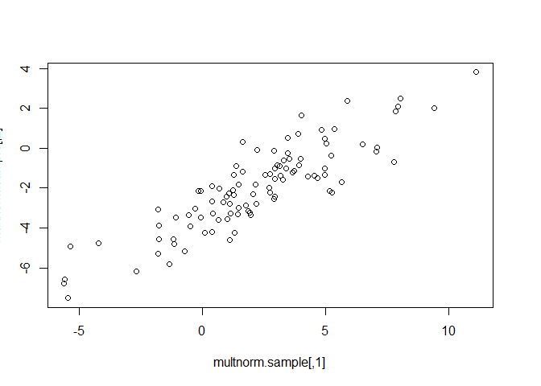
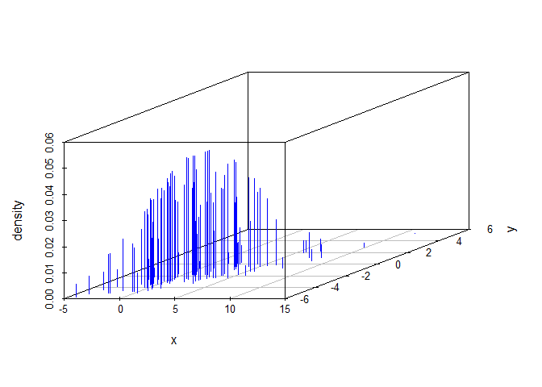
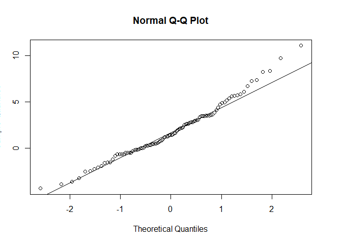
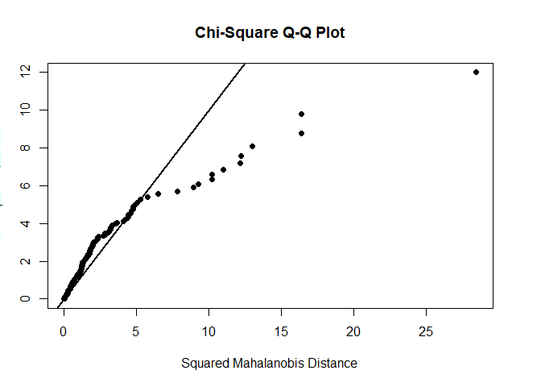
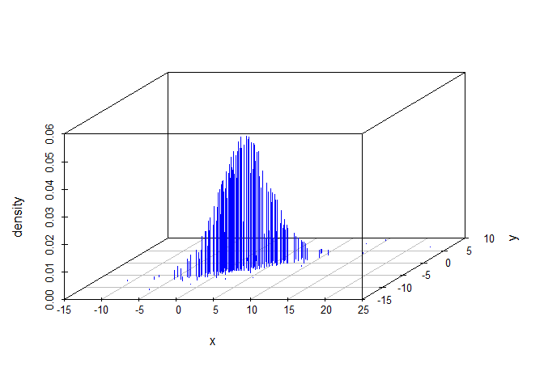
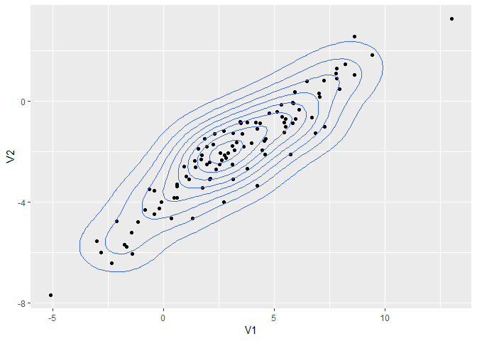
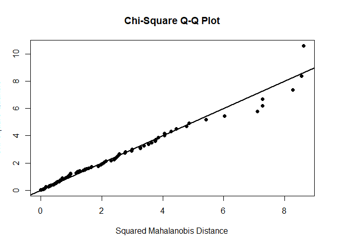
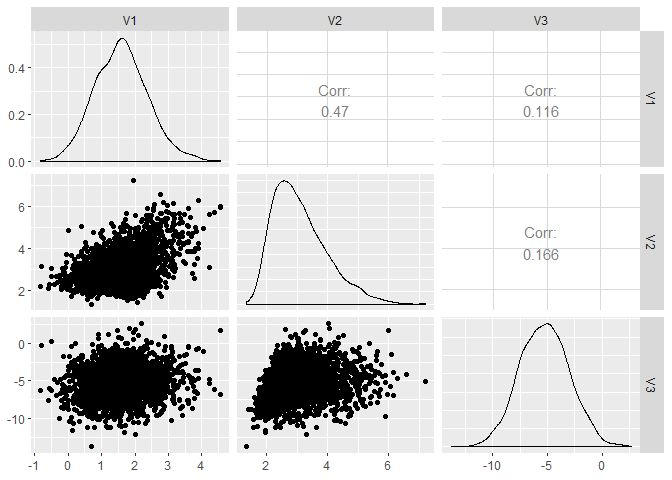
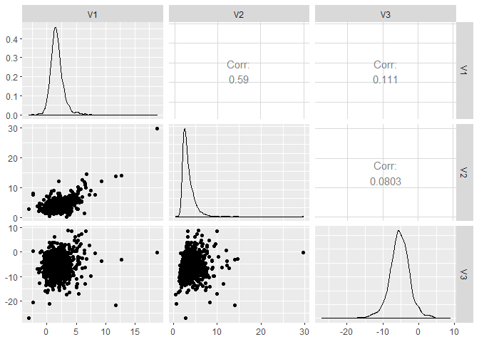

Multivariate normality is required for regression, model-based clustering, PCA and ANOVA. Then how to test? qqplot (qqnorm, qqline) to detect heavier tail, skewness, outliers, and clustered data. If any sinble variable fails to be a normality, we can not have joint multivariate.  


```r
wine <- read.table("http://archive.ics.uci.edu/ml/machine-learning-databases/wine/wine.data", sep = ",")
View(wine)

colnames(wine) <- c('Type', 'Alcohol', 'Malic', 'Ash', 'Alcalinity', 'Magnesium', 'Phenols', 'Flavanoids', 'Nonflavanoids','Proanthocyanins', 'Color', 'Hue', 'Dilution', 'Proline')
wine$Type <- as.factor(wine$Type)

## plots
var.wine <- var(wine[2:5])
cor.wine <- cor(wine[, 2:5])
corrplot(cor.wine, method = "ellipse")
```

<!-- -->

```r
pairs(wine[,2:5])
```

<!-- -->

```r
splom( ~ wine[,2:5],  pch = 16, col = wine$Type)
```

<!-- -->

```r
(wine.gg <- ggpairs(data = wine, columns = 2:5))
```

<!-- -->

```r
scatterplot3d(wine[, c(2, 3, 5)], color = wine$Type, angle = 70)
```

<!-- -->

```r
## samples
mu.sim <- c(2, -2)
sigma.sim <- matrix(c(9,5,5,4), 2,2)
multnorm.sample <- rmvnorm(n = 100, mean = mu.sim, sigma = sigma.sim)
head(multnorm.sample)
```

```
##          [,1]       [,2]
## [1,] 3.033345 -0.8426019
## [2,] 1.617139  0.3092684
## [3,] 2.553391 -1.3512985
## [4,] 4.002669  1.6507527
## [5,] 1.849858 -3.1653327
## [6,] 1.775711 -2.8863031
```

```r
plot(multnorm.sample)
```

<!-- -->

```r
## density 
multnorm.dens <- dmvnorm(multnorm.sample, mean = mu.sim, sigma = sigma.sim)
scatterplot3d(cbind(multnorm.sample, multnorm.dens),    
              color="blue", pch="", type = "h",             
              xlab = "x", ylab = "y", zlab = "density")
```

<!-- -->

```r
mvals <- expand.grid(seq(-5, 10, length.out = 40), seq(-8, 4, length.out = 40))
mvds <- dmvnorm(x = mvals, mean = mu.sim, sigma = sigma.sim)
matrix_mvds <-  matrix(mvds, nrow = 40)
persp(matrix_mvds, theta = 80, phi = 30, expand = 0.6, shade = 0.2, col = "lightblue", xlab = "x", ylab = "y", zlab = "dens")
```

<!-- -->

```r
pmvnorm(lower = c(-1, -1), upper = c(1, 1))
```

```
## [1] 0.4660649
## attr(,"error")
## [1] 1e-15
## attr(,"msg")
## [1] "Normal Completion"
```

```r
pmvnorm(lower = c(-5, -5), upper = c(5, 5), mean = mu.sim, sigma = sigma.sim)
```

```
## [1] 0.7734162
## attr(,"error")
## [1] 1e-15
## attr(,"msg")
## [1] "Normal Completion"
```

```r
qmvnorm(0.9, tail = "both", sigma = diag(2))
```

```
## $quantile
## [1] 1.948779
## 
## $f.quantile
## [1] -1.537507e-06
## 
## attr(,"message")
## [1] "Normal Completion"
```

```r
qmvnorm(0.95, tail = "both", mean = mu.sim, sigma = sigma.sim)
```

```
## $quantile
## [1] 7.110635
## 
## $f.quantile
## [1] 5.712626e-06
## 
## attr(,"message")
## [1] "Normal Completion"
```

```r
qqnorm(multnorm.sample[, 1])
qqline(multnorm.sample[, 1])
```

<!-- -->

```r
mvn(multnorm.sample)
```

```
## $multivariateNormality
##              Test         Statistic           p value Result
## 1 Mardia Skewness  1.18852829884814 0.879983723270373    YES
## 2 Mardia Kurtosis 0.232074542980962 0.816480116899531    YES
## 3             MVN              <NA>              <NA>    YES
## 
## $univariateNormality
##           Test  Variable Statistic   p value Normality
## 1 Shapiro-Wilk  Column1     0.9819    0.1859    YES   
## 2 Shapiro-Wilk  Column2     0.9946    0.9637    YES   
## 
## $Descriptives
##     n      Mean  Std.Dev    Median       Min       Max       25th
## 1 100  2.190103 3.130910  2.114932 -5.604945 11.118192  0.4236494
## 2 100 -1.975110 2.132202 -2.009851 -7.522204  3.807691 -3.2954016
##        75th          Skew  Kurtosis
## 1  3.925500 -0.0790567500 0.5504153
## 2 -0.799937 -0.0008720948 0.1032656
```

```r
mvn(wine[, 2:5])
```

```
## $multivariateNormality
##              Test         Statistic              p value Result
## 1 Mardia Skewness   80.605641908137 3.09764065780589e-09     NO
## 2 Mardia Kurtosis 0.559382574051838    0.575900651525058    YES
## 3             MVN              <NA>                 <NA>     NO
## 
## $univariateNormality
##           Test   Variable Statistic   p value Normality
## 1 Shapiro-Wilk  Alcohol      0.9818   0.02       NO    
## 2 Shapiro-Wilk   Malic       0.8888  <0.001      NO    
## 3 Shapiro-Wilk    Ash        0.9839  0.0387      NO    
## 4 Shapiro-Wilk Alcalinity    0.9902  0.2639      YES   
## 
## $Descriptives
##              n      Mean   Std.Dev Median   Min   Max    25th    75th
## Alcohol    178 13.000618 0.8118265 13.050 11.03 14.83 12.3625 13.6775
## Malic      178  2.336348 1.1171461  1.865  0.74  5.80  1.6025  3.0825
## Ash        178  2.366517 0.2743440  2.360  1.36  3.23  2.2100  2.5575
## Alcalinity 178 19.494944 3.3395638 19.500 10.60 30.00 17.2000 21.5000
##                  Skew   Kurtosis
## Alcohol    -0.0506179 -0.8862122
## Malic       1.0221946  0.2208517
## Ash        -0.1737324  1.0328782
## Alcalinity  0.2094697  0.4022708
```

```r
## t distribution (e.g. financial stock time series)
### rmvt, dmvt, qmvt, pmvt
multt.sample <- rmvt(n = 200,sigma = sigma.sim, df = 5, delta = mu.sim)
mvn(multt.sample, multivariatePlot = "qq")
```

<!-- -->

```
## $multivariateNormality
##              Test        Statistic              p value Result
## 1 Mardia Skewness 24.3601744294914 6.76353306638357e-05     NO
## 2 Mardia Kurtosis 12.4562689162956                    0     NO
## 3             MVN             <NA>                 <NA>     NO
## 
## $univariateNormality
##           Test  Variable Statistic   p value Normality
## 1 Shapiro-Wilk  Column1     0.9603  <0.001      NO    
## 2 Shapiro-Wilk  Column2     0.9762  0.0018      NO    
## 
## $Descriptives
##     n      Mean  Std.Dev    Median       Min       Max       25th
## 1 200  2.237454 4.056930  1.754584 -10.89487 22.116803 -0.2549921
## 2 200 -1.882580 2.796779 -2.145287 -10.86115  9.276281 -3.5033088
##        75th      Skew Kurtosis
## 1  4.575151 0.6991208 2.957353
## 2 -0.106527 0.4725652 1.632230
```

```r
multt.dens <- dmvt(x = multt.sample, delta = mu.sim, sigma = sigma.sim, df = 5, log = F)
scatterplot3d(cbind(multt.sample, multt.dens),    
              color = "blue", pch = "", type = "h",             
              xlab = "x", ylab = "y", zlab = "density")
```

<!-- -->

```r
pmvt(lower = c(-5, -5), upper = c(5, 5), 
     delta = mu.sim, df = 5, sigma = sigma.sim) 
```

```
## [1] 0.6626107
## attr(,"error")
## [1] 0.0007438344
## attr(,"msg")
## [1] "Normal Completion"
```

```r
# CDF, e.g., Probability for all 3 stocks between $100 and 200. 
qmvt(p = 0.9, tail = "both", sigma = diag(2)) # inverse CDF, showing the circle of radius for 90%
```

```
## $quantile
## [1] 8.956747
## 
## $f.quantile
## [1] -1.35426e-07
## 
## attr(,"message")
## [1] "Normal Completion"
```

```r
## skew distribution
skewnorm.sample <- rmsn(n = 100, xi = mu.sim, Omega = sigma.sim, alpha = c(4, -4))
ggplot(as.data.frame(skewnorm.sample), aes(x = V1, y = V2)) + 
  geom_point() + 
  geom_density_2d() 
```

<!-- -->

```r
mvn(skewnorm.sample, multivariatePlot = "qq")
```

<!-- -->

```
## $multivariateNormality
##              Test           Statistic           p value Result
## 1 Mardia Skewness    7.64240673810363 0.105591245826078    YES
## 2 Mardia Kurtosis -0.0832341367649692 0.933665369690171    YES
## 3             MVN                <NA>              <NA>    YES
## 
## $univariateNormality
##           Test  Variable Statistic   p value Normality
## 1 Shapiro-Wilk  Column1     0.9949    0.9725    YES   
## 2 Shapiro-Wilk  Column2     0.9928    0.8746    YES   
## 
## $Descriptives
##     n      Mean  Std.Dev    Median       Min       Max      25th      75th
## 1 100  3.222222 3.141441  3.116629 -5.101139 12.997359  1.375466  5.457465
## 2 100 -1.988932 2.032638 -1.902443 -7.672739  3.265607 -3.154002 -0.834811
##         Skew   Kurtosis
## 1  0.0676569 0.08468114
## 2 -0.1812659 0.07313154
```

```r
xi <- c(1,2,-5)
omega <- matrix(c(1,1,0,
                1,2,0,
                0,0,5), 3,3)
alpha <- c(4,30,-5)
skew.s <- rmsn(n = 2000, xi = xi, Omega = omega, alpha = alpha)
ggpairs(data = as.data.frame(skew.s))
```

<!-- -->

```r
msn.mle(y = skew.s, opt.method = "BFGS")
```

```
## $call
## msn.mle(y = skew.s, opt.method = "BFGS")
## 
## $dp
## $dp$beta
##           [,1]    [,2]      [,3]
## [1,] 0.9612265 2.02267 -4.892065
## 
## $dp$Omega
##             [,1]       [,2]        [,3]
## [1,]  1.05657091  1.0080332 -0.01893476
## [2,]  1.00803324  1.8689747 -0.11961930
## [3,] -0.01893476 -0.1196193  5.23113442
## 
## $dp$alpha
## [1]  5.132638 33.033904 -6.177825
## 
## 
## $logL
## [1] -8775.381
## 
## $aux
## $aux$alpha.star
## [1] 37.61814
## 
## $aux$delta.star
## [1] 0.9996469
## 
## 
## $opt.method
## $opt.method$par
## [1]  0.9612265  2.0226695 -4.8920648  4.9933419 24.1634084 -2.7010813
## 
## $opt.method$value
## [1] 17550.76
## 
## $opt.method$counts
## function gradient 
##      117       36 
## 
## $opt.method$convergence
## [1] 0
## 
## $opt.method$message
## NULL
## 
## $opt.method$method
## [1] "BFGS"
## 
## $opt.method$called.by
## [1] "msn.mle"
```

```r
skewt.s <- rmst(n = 2000, xi = xi, Omega = omega, alpha = alpha, nu = 4)
ggpairs(data = as.data.frame(skewt.s))
```

<!-- -->

```r
msn.mle(y = skewt.s, opt.method = "BFGS")
```

```
## $call
## msn.mle(y = skewt.s, opt.method = "BFGS")
## 
## $dp
## $dp$beta
##           [,1]     [,2]      [,3]
## [1,] 0.9728867 1.972289 -5.041374
## 
## $dp$Omega
##           [,1]        [,2]        [,3]
## [1,] 1.8486960  1.78341939  0.13507315
## [2,] 1.7834194  3.52667048 -0.02285358
## [3,] 0.1350732 -0.02285358  9.94611186
## 
## $dp$alpha
## [1]  11.88742  88.48374 -15.30086
## 
## 
## $logL
## [1] -10641.26
## 
## $aux
## $aux$alpha.star
## [1] 98.35202
## 
## $aux$delta.star
## [1] 0.9999483
## 
## 
## $opt.method
## $opt.method$par
## [1]  0.9728867  1.9722886 -5.0413736  8.7428894 47.1173700 -4.8516476
## 
## $opt.method$value
## [1] 21282.51
## 
## $opt.method$counts
## function gradient 
##      117       39 
## 
## $opt.method$convergence
## [1] 0
## 
## $opt.method$message
## NULL
## 
## $opt.method$method
## [1] "BFGS"
## 
## $opt.method$called.by
## [1] "msn.mle"
```


---
title: "multi_distr.R"
author: "Yohan_Min"
date: "Thu Nov 29 01:40:14 2018"
---
