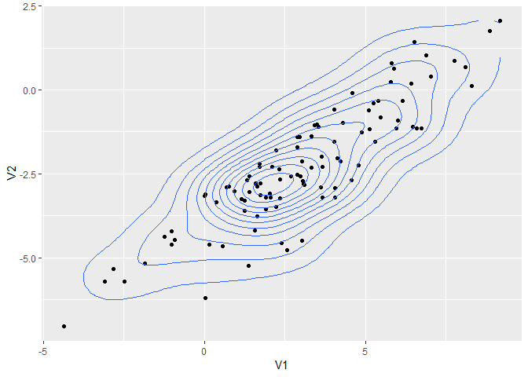
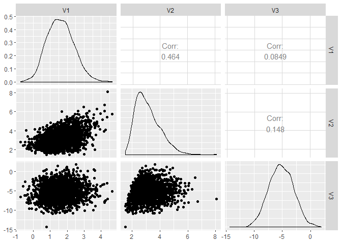
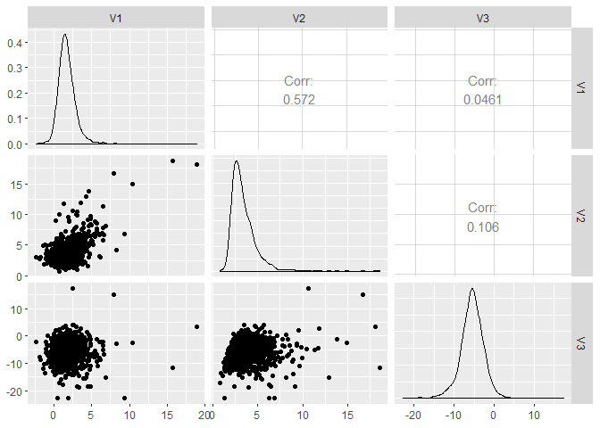

Multivariate normality is required for regression, model-based clustering, PCA and ANOVA. Then how to test? qqplot (qqnorm, qqline) to detect heavier tail, skewness, outliers, and clustered data. If any single variable fails to be a normality, we can not have joint multivariate.  


```r
wine <- read.table("http://archive.ics.uci.edu/ml/machine-learning-databases/wine/wine.data", sep = ",")
View(wine)

colnames(wine) <- c('Type', 'Alcohol', 'Malic', 'Ash', 'Alcalinity', 'Magnesium', 'Phenols', 'Flavanoids', 'Nonflavanoids','Proanthocyanins', 'Color', 'Hue', 'Dilution', 'Proline')
wine$Type <- as.factor(wine$Type)
```

## plots


```r
var.wine <- var(wine[2:5])
cor.wine <- cor(wine[, 2:5])
corrplot(cor.wine, method = "ellipse")
```

<!-- -->

```r
pairs(wine[,2:5])
```

<!-- -->

```r
splom( ~ wine[,2:5],  pch = 16, col = wine$Type)
```

<!-- -->

```r
(wine.gg <- ggpairs(data = wine, columns = 2:5))
```

<!-- -->

```r
scatterplot3d(wine[, c(2, 3, 5)], color = wine$Type, angle = 70)
```

<!-- -->

## Multivariate normal samples


```r
mu.sim <- c(2, -2)
sigma.sim <- matrix(c(9,5,5,4), 2,2)
multnorm.sample <- rmvnorm(n = 100, mean = mu.sim, sigma = sigma.sim)
head(multnorm.sample)
```

```
##          [,1]        [,2]
## [1,] 5.326172  0.70385021
## [2,] 4.149977  0.40339452
## [3,] 2.126468 -1.85516334
## [4,] 3.801705 -0.80666844
## [5,] 2.975384 -0.03137134
## [6,] 7.955302  1.10419759
```

```r
plot(multnorm.sample)
```

<!-- -->

## Density 


```r
multnorm.dens <- dmvnorm(multnorm.sample, mean = mu.sim, sigma = sigma.sim)
scatterplot3d(cbind(multnorm.sample, multnorm.dens),    
              color="blue", pch="", type = "h",             
              xlab = "x", ylab = "y", zlab = "density")
```

<!-- -->

```r
mvals <- expand.grid(seq(-5, 10, length.out = 40), seq(-8, 4, length.out = 40))
mvds <- dmvnorm(x = mvals, mean = mu.sim, sigma = sigma.sim)
matrix_mvds <-  matrix(mvds, nrow = 40)
persp(matrix_mvds, theta = 80, phi = 30, expand = 0.6, shade = 0.2, col = "lightblue", xlab = "x", ylab = "y", zlab = "dens")
```

<!-- -->

## Probability 


```r
pmvnorm(lower = c(-1, -1), upper = c(1, 1))
```

```
## [1] 0.4660649
## attr(,"error")
## [1] 1e-15
## attr(,"msg")
## [1] "Normal Completion"
```

```r
pmvnorm(lower = c(-5, -5), upper = c(5, 5), mean = mu.sim, sigma = sigma.sim)
```

```
## [1] 0.7734162
## attr(,"error")
## [1] 1e-15
## attr(,"msg")
## [1] "Normal Completion"
```

## Quantile


```r
qmvnorm(0.9, tail = "both", sigma = diag(2))
```

```
## $quantile
## [1] 1.948779
## 
## $f.quantile
## [1] -1.537507e-06
## 
## attr(,"message")
## [1] "Normal Completion"
```

```r
qmvnorm(0.95, tail = "both", mean = mu.sim, sigma = sigma.sim)
```

```
## $quantile
## [1] 7.110635
## 
## $f.quantile
## [1] 5.712626e-06
## 
## attr(,"message")
## [1] "Normal Completion"
```

## Normality test


```r
qqnorm(multnorm.sample[, 1])
qqline(multnorm.sample[, 1])
```

<!-- -->

```r
mvn(multnorm.sample)
```

```
## $multivariateNormality
##              Test         Statistic           p value Result
## 1 Mardia Skewness  3.56204526118572 0.468507149131871    YES
## 2 Mardia Kurtosis 0.248292361034901 0.803908209001922    YES
## 3             MVN              <NA>              <NA>    YES
## 
## $univariateNormality
##           Test  Variable Statistic   p value Normality
## 1 Shapiro-Wilk  Column1     0.9857    0.3538    YES   
## 2 Shapiro-Wilk  Column2     0.9789    0.1091    YES   
## 
## $Descriptives
##     n      Mean  Std.Dev    Median       Min      Max       25th
## 1 100  2.389566 2.893994  2.278145 -4.922796 8.540764  0.9993658
## 2 100 -1.855771 1.823848 -1.842227 -8.043417 2.170776 -2.7334958
##         75th       Skew   Kurtosis
## 1  4.0677125 -0.1154405 -0.1546827
## 2 -0.7958626 -0.4018259  0.8231233
```

```r
mvn(wine[, 2:5])
```

```
## $multivariateNormality
##              Test         Statistic              p value Result
## 1 Mardia Skewness   80.605641908137 3.09764065780589e-09     NO
## 2 Mardia Kurtosis 0.559382574051838    0.575900651525058    YES
## 3             MVN              <NA>                 <NA>     NO
## 
## $univariateNormality
##           Test   Variable Statistic   p value Normality
## 1 Shapiro-Wilk  Alcohol      0.9818   0.02       NO    
## 2 Shapiro-Wilk   Malic       0.8888  <0.001      NO    
## 3 Shapiro-Wilk    Ash        0.9839  0.0387      NO    
## 4 Shapiro-Wilk Alcalinity    0.9902  0.2639      YES   
## 
## $Descriptives
##              n      Mean   Std.Dev Median   Min   Max    25th    75th
## Alcohol    178 13.000618 0.8118265 13.050 11.03 14.83 12.3625 13.6775
## Malic      178  2.336348 1.1171461  1.865  0.74  5.80  1.6025  3.0825
## Ash        178  2.366517 0.2743440  2.360  1.36  3.23  2.2100  2.5575
## Alcalinity 178 19.494944 3.3395638 19.500 10.60 30.00 17.2000 21.5000
##                  Skew   Kurtosis
## Alcohol    -0.0506179 -0.8862122
## Malic       1.0221946  0.2208517
## Ash        -0.1737324  1.0328782
## Alcalinity  0.2094697  0.4022708
```

## t distribution (e.g. financial stock time series)
### rmvt, dmvt, qmvt, pmvt


```r
multt.sample <- rmvt(n = 200,sigma = sigma.sim, df = 5, delta = mu.sim)
mvn(multt.sample, multivariatePlot = "qq")
```

<!-- -->

```
## $multivariateNormality
##              Test        Statistic              p value Result
## 1 Mardia Skewness 19.7481577938249 0.000559930985135474     NO
## 2 Mardia Kurtosis 10.8909178083946                    0     NO
## 3             MVN             <NA>                 <NA>     NO
## 
## $univariateNormality
##           Test  Variable Statistic   p value Normality
## 1 Shapiro-Wilk  Column1     0.9351  <0.001      NO    
## 2 Shapiro-Wilk  Column2     0.9744   0.001      NO    
## 
## $Descriptives
##     n      Mean  Std.Dev    Median       Min      Max       25th
## 1 200  2.283220 3.775792  2.418401 -9.178309 23.57580  0.2853907
## 2 200 -1.926002 2.433361 -2.054420 -9.379802  9.12151 -3.2890994
##         75th      Skew Kurtosis
## 1  4.1949433 0.6912813 5.158725
## 2 -0.6497142 0.2918111 2.097565
```

```r
multt.dens <- dmvt(x = multt.sample, delta = mu.sim, sigma = sigma.sim, df = 5, log = F)
scatterplot3d(cbind(multt.sample, multt.dens),    
              color = "blue", pch = "", type = "h",             
              xlab = "x", ylab = "y", zlab = "density")
```

<!-- -->

```r
pmvt(lower = c(-5, -5), upper = c(5, 5), 
     delta = mu.sim, df = 5, sigma = sigma.sim) 
```

```
## [1] 0.662725
## attr(,"error")
## [1] 0.0006308717
## attr(,"msg")
## [1] "Normal Completion"
```

```r
# CDF, e.g., Probability for all 3 stocks between $100 and 200. 
qmvt(p = 0.9, tail = "both", sigma = diag(2)) # inverse CDF, showing the circle of radius for 90%
```

```
## $quantile
## [1] 8.956747
## 
## $f.quantile
## [1] -1.35426e-07
## 
## attr(,"message")
## [1] "Normal Completion"
```

## skew distribution


```r
skewnorm.sample <- rmsn(n = 100, xi = mu.sim, Omega = sigma.sim, alpha = c(4, -4))
ggplot(as.data.frame(skewnorm.sample), aes(x = V1, y = V2)) + 
  geom_point() + 
  geom_density_2d() 
```

<!-- -->

```r
mvn(skewnorm.sample, multivariatePlot = "qq")
```

<!-- -->

```
## $multivariateNormality
##              Test          Statistic            p value Result
## 1 Mardia Skewness   8.68366842846642 0.0695113566706572    YES
## 2 Mardia Kurtosis -0.545498239033261  0.585410891332715    YES
## 3             MVN               <NA>               <NA>    YES
## 
## $univariateNormality
##           Test  Variable Statistic   p value Normality
## 1 Shapiro-Wilk  Column1     0.9907    0.7247    YES   
## 2 Shapiro-Wilk  Column2     0.9889    0.5792    YES   
## 
## $Descriptives
##     n      Mean  Std.Dev    Median       Min      Max      25th      75th
## 1 100  3.016500 2.656167  2.975248 -4.364197 9.187308  1.527107  4.807624
## 2 100 -2.313157 1.812363 -2.578739 -7.037937 2.057242 -3.209530 -1.129475
##          Skew    Kurtosis
## 1 -0.10641617  0.03773409
## 2  0.07659712 -0.14713751
```

```r
xi <- c(1,2,-5)
omega <- matrix(c(1,1,0,
                1,2,0,
                0,0,5), 3,3)
alpha <- c(4,30,-5)
skew.s <- rmsn(n = 2000, xi = xi, Omega = omega, alpha = alpha)
ggpairs(data = as.data.frame(skew.s))
```

<!-- -->

```r
msn.mle(y = skew.s, opt.method = "BFGS")
```

```
## $call
## msn.mle(y = skew.s, opt.method = "BFGS")
## 
## $dp
## $dp$beta
##          [,1]     [,2]      [,3]
## [1,] 1.049817 2.029537 -4.920909
## 
## $dp$Omega
##             [,1]        [,2]        [,3]
## [1,]  0.93039100  0.92313771 -0.01385484
## [2,]  0.92313771  1.93513199 -0.03419354
## [3,] -0.01385484 -0.03419354  4.77297237
## 
## $dp$alpha
## [1]  2.200324 22.495195 -3.734726
## 
## 
## $logL
## [1] -8696.076
## 
## $aux
## $aux$alpha.star
## [1] 24.39114
## 
## $aux$delta.star
## [1] 0.9991606
## 
## 
## $opt.method
## $opt.method$par
## [1]  1.049817  2.029537 -4.920909  2.281150 16.170910 -1.709481
## 
## $opt.method$value
## [1] 17392.15
## 
## $opt.method$counts
## function gradient 
##       78       23 
## 
## $opt.method$convergence
## [1] 0
## 
## $opt.method$message
## NULL
## 
## $opt.method$method
## [1] "BFGS"
## 
## $opt.method$called.by
## [1] "msn.mle"
```

```r
skewt.s <- rmst(n = 2000, xi = xi, Omega = omega, alpha = alpha, nu = 4)
ggpairs(data = as.data.frame(skewt.s))
```

<!-- -->

```r
msn.mle(y = skewt.s, opt.method = "BFGS")
```

```
## $call
## msn.mle(y = skewt.s, opt.method = "BFGS")
## 
## $dp
## $dp$beta
##           [,1]     [,2]     [,3]
## [1,] 0.9041992 1.949553 -5.21347
## 
## $dp$Omega
##             [,1]       [,2]        [,3]
## [1,]  2.19150145 2.24464929 -0.07340559
## [2,]  2.24464929 4.31260755  0.04090302
## [3,] -0.07340559 0.04090302  9.22808827
## 
## $dp$alpha
## [1]  7.935175 55.695781 -8.741828
## 
## 
## $logL
## [1] -10853.79
## 
## $aux
## $aux$alpha.star
## [1] 62.31163
## 
## $aux$delta.star
## [1] 0.9998712
## 
## 
## $opt.method
## $opt.method$par
## [1]  0.9041992  1.9495532 -5.2134695  5.3602570 26.8196018 -2.8777058
## 
## $opt.method$value
## [1] 21707.59
## 
## $opt.method$counts
## function gradient 
##       80       27 
## 
## $opt.method$convergence
## [1] 0
## 
## $opt.method$message
## NULL
## 
## $opt.method$method
## [1] "BFGS"
## 
## $opt.method$called.by
## [1] "msn.mle"
```

## Multi dimentional scaling (MDS)


```r
state.dist <- dist(wine[-1])
mds.state <- cmdscale(state.dist, k=3) 
mds.state_df <- data.frame(mds.state)
scatterplot3d(mds.state_df, color = wine$Type, pch = 19, type = "h", lty.hplot = 2)
```

<!-- -->


---
title: "multi_distr.R"
author: "Yohan_Min"
date: "Mon Feb 11 14:47:54 2019"
---
