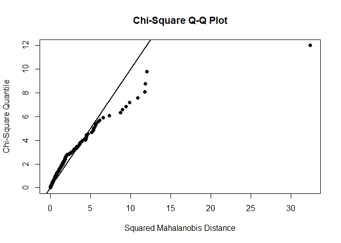
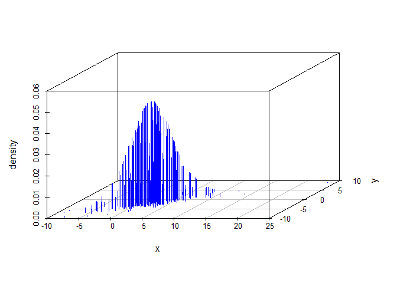

Multivariate normality is required for regression, model-based clustering, PCA and ANOVA. Then how to test? qqplot (qqnorm, qqline) to detect heavier tail, skewness, outliers, and clustered data. If any single variable fails to be a normality, we can not have joint multivariate.  


```r
wine <- read.table("http://archive.ics.uci.edu/ml/machine-learning-databases/wine/wine.data", sep = ",")
View(wine)

colnames(wine) <- c('Type', 'Alcohol', 'Malic', 'Ash', 'Alcalinity', 'Magnesium', 'Phenols', 'Flavanoids', 'Nonflavanoids','Proanthocyanins', 'Color', 'Hue', 'Dilution', 'Proline')
wine$Type <- as.factor(wine$Type)
```

## plots


```r
var.wine <- var(wine[2:5])
cor.wine <- cor(wine[, 2:5])
corrplot(cor.wine, method = "ellipse")
```

<!-- -->

```r
pairs(wine[,2:5])
```

<!-- -->

```r
splom( ~ wine[,2:5],  pch = 16, col = wine$Type)
```

<!-- -->

```r
(wine.gg <- ggpairs(data = wine, columns = 2:5))
```

<!-- -->

```r
scatterplot3d(wine[, c(2, 3, 5)], color = wine$Type, angle = 70)
```

<!-- -->

## Multivariate normal samples


```r
mu.sim <- c(2, -2)
sigma.sim <- matrix(c(9,5,5,4), 2,2)
multnorm.sample <- rmvnorm(n = 100, mean = mu.sim, sigma = sigma.sim)
head(multnorm.sample)
```

```
##           [,1]         [,2]
## [1,]  4.314746 -1.163227730
## [2,]  4.147136 -1.921663034
## [3,]  1.136820 -2.259767017
## [4,] -4.426965 -4.089224567
## [5,]  2.539341 -1.178591955
## [6,]  2.366595 -0.009762207
```

```r
plot(multnorm.sample)
```

<!-- -->

## Density 


```r
multnorm.dens <- dmvnorm(multnorm.sample, mean = mu.sim, sigma = sigma.sim)
scatterplot3d(cbind(multnorm.sample, multnorm.dens),    
              color="blue", pch="", type = "h",             
              xlab = "x", ylab = "y", zlab = "density")
```

<!-- -->

```r
mvals <- expand.grid(seq(-5, 10, length.out = 40), seq(-8, 4, length.out = 40))
mvds <- dmvnorm(x = mvals, mean = mu.sim, sigma = sigma.sim)
matrix_mvds <-  matrix(mvds, nrow = 40)
persp(matrix_mvds, theta = 80, phi = 30, expand = 0.6, shade = 0.2, col = "lightblue", xlab = "x", ylab = "y", zlab = "dens")
```

<!-- -->

## Probability 


```r
pmvnorm(lower = c(-1, -1), upper = c(1, 1))
```

```
## [1] 0.4660649
## attr(,"error")
## [1] 1e-15
## attr(,"msg")
## [1] "Normal Completion"
```

```r
pmvnorm(lower = c(-5, -5), upper = c(5, 5), mean = mu.sim, sigma = sigma.sim)
```

```
## [1] 0.7734162
## attr(,"error")
## [1] 1e-15
## attr(,"msg")
## [1] "Normal Completion"
```

## Quantile


```r
qmvnorm(0.9, tail = "both", sigma = diag(2))
```

```
## $quantile
## [1] 1.948779
## 
## $f.quantile
## [1] -1.537507e-06
## 
## attr(,"message")
## [1] "Normal Completion"
```

```r
qmvnorm(0.95, tail = "both", mean = mu.sim, sigma = sigma.sim)
```

```
## $quantile
## [1] 7.110635
## 
## $f.quantile
## [1] 5.712626e-06
## 
## attr(,"message")
## [1] "Normal Completion"
```

## Normality test


```r
qqnorm(multnorm.sample[, 1])
qqline(multnorm.sample[, 1])
```

<!-- -->

```r
mvn(multnorm.sample)
```

```
## $multivariateNormality
##              Test          Statistic           p value Result
## 1 Mardia Skewness    4.2064028858842 0.378792339550829    YES
## 2 Mardia Kurtosis -0.915133121576842 0.360121748828648    YES
## 3             MVN               <NA>              <NA>    YES
## 
## $univariateNormality
##           Test  Variable Statistic   p value Normality
## 1 Shapiro-Wilk  Column1     0.9894    0.6190    YES   
## 2 Shapiro-Wilk  Column2     0.9657    0.0104    NO    
## 
## $Descriptives
##     n      Mean  Std.Dev    Median       Min      Max       25th
## 1 100  1.413927 2.811835  1.274856 -4.997811 9.914585 -0.5660093
## 2 100 -2.274462 1.949161 -2.340566 -5.534348 3.040174 -3.8805621
##         75th      Skew    Kurtosis
## 1  2.8809673 0.3301045 -0.01008256
## 2 -0.9458519 0.4891688 -0.50570341
```

```r
mvn(wine[, 2:5])
```

```
## $multivariateNormality
##              Test         Statistic              p value Result
## 1 Mardia Skewness   80.605641908137 3.09764065780589e-09     NO
## 2 Mardia Kurtosis 0.559382574051838    0.575900651525058    YES
## 3             MVN              <NA>                 <NA>     NO
## 
## $univariateNormality
##           Test   Variable Statistic   p value Normality
## 1 Shapiro-Wilk  Alcohol      0.9818   0.02       NO    
## 2 Shapiro-Wilk   Malic       0.8888  <0.001      NO    
## 3 Shapiro-Wilk    Ash        0.9839  0.0387      NO    
## 4 Shapiro-Wilk Alcalinity    0.9902  0.2639      YES   
## 
## $Descriptives
##              n      Mean   Std.Dev Median   Min   Max    25th    75th
## Alcohol    178 13.000618 0.8118265 13.050 11.03 14.83 12.3625 13.6775
## Malic      178  2.336348 1.1171461  1.865  0.74  5.80  1.6025  3.0825
## Ash        178  2.366517 0.2743440  2.360  1.36  3.23  2.2100  2.5575
## Alcalinity 178 19.494944 3.3395638 19.500 10.60 30.00 17.2000 21.5000
##                  Skew   Kurtosis
## Alcohol    -0.0506179 -0.8862122
## Malic       1.0221946  0.2208517
## Ash        -0.1737324  1.0328782
## Alcalinity  0.2094697  0.4022708
```

## t distribution (e.g. financial stock time series)
### rmvt, dmvt, qmvt, pmvt


```r
multt.sample <- rmvt(n = 200,sigma = sigma.sim, df = 5, delta = mu.sim)
mvn(multt.sample, multivariatePlot = "qq")
```

<!-- -->

```
## $multivariateNormality
##              Test        Statistic              p value Result
## 1 Mardia Skewness 32.9640541141846 1.21489399824118e-06     NO
## 2 Mardia Kurtosis 21.9927643392953                    0     NO
## 3             MVN             <NA>                 <NA>     NO
## 
## $univariateNormality
##           Test  Variable Statistic   p value Normality
## 1 Shapiro-Wilk  Column1     0.9621  <0.001      NO    
## 2 Shapiro-Wilk  Column2     0.9726   6e-04      NO    
## 
## $Descriptives
##     n      Mean  Std.Dev    Median       Min       Max       25th
## 1 200  2.147863 3.826891  2.439323 -15.26046 14.418530  0.1672948
## 2 200 -2.033947 2.472919 -1.770199 -10.53644  5.210634 -3.2172391
##         75th       Skew Kurtosis
## 1  4.1347477 -0.5043920 2.560980
## 2 -0.6203986 -0.4516789 1.194807
```

```r
multt.dens <- dmvt(x = multt.sample, delta = mu.sim, sigma = sigma.sim, df = 5, log = F)
scatterplot3d(cbind(multt.sample, multt.dens),    
              color = "blue", pch = "", type = "h",             
              xlab = "x", ylab = "y", zlab = "density")
```

<!-- -->

```r
pmvt(lower = c(-5, -5), upper = c(5, 5), 
     delta = mu.sim, df = 5, sigma = sigma.sim) 
```

```
## [1] 0.6629391
## attr(,"error")
## [1] 0.0006940023
## attr(,"msg")
## [1] "Normal Completion"
```

```r
# CDF, e.g., Probability for all 3 stocks between $100 and 200. 
qmvt(p = 0.9, tail = "both", sigma = diag(2)) # inverse CDF, showing the circle of radius for 90%
```

```
## $quantile
## [1] 8.956747
## 
## $f.quantile
## [1] -1.35426e-07
## 
## attr(,"message")
## [1] "Normal Completion"
```

## skew distribution


```r
skewnorm.sample <- rmsn(n = 100, xi = mu.sim, Omega = sigma.sim, alpha = c(4, -4))
ggplot(as.data.frame(skewnorm.sample), aes(x = V1, y = V2)) + 
  geom_point() + 
  geom_density_2d() 
```

<!-- -->

```r
mvn(skewnorm.sample, multivariatePlot = "qq")
```

<!-- -->

```
## $multivariateNormality
##              Test         Statistic           p value Result
## 1 Mardia Skewness  4.61717520896155 0.328878725474415    YES
## 2 Mardia Kurtosis -1.17673609915514 0.239300854646246    YES
## 3             MVN              <NA>              <NA>    YES
## 
## $univariateNormality
##           Test  Variable Statistic   p value Normality
## 1 Shapiro-Wilk  Column1     0.9908    0.7285    YES   
## 2 Shapiro-Wilk  Column2     0.9854    0.3387    YES   
## 
## $Descriptives
##     n      Mean  Std.Dev    Median       Min      Max      25th       75th
## 1 100  3.141581 2.680357  3.090025 -4.714196 9.047996  1.325071  5.0897542
## 2 100 -2.145624 1.918362 -1.929138 -6.545158 1.831082 -3.451421 -0.9858062
##         Skew   Kurtosis
## 1 -0.2247018 -0.2905011
## 2 -0.1257389 -0.5523340
```

```r
xi <- c(1,2,-5)
omega <- matrix(c(1,1,0,
                1,2,0,
                0,0,5), 3,3)
alpha <- c(4,30,-5)
skew.s <- rmsn(n = 2000, xi = xi, Omega = omega, alpha = alpha)
ggpairs(data = as.data.frame(skew.s))
```

<!-- -->

```r
msn.mle(y = skew.s, opt.method = "BFGS")
```

```
## $call
## msn.mle(y = skew.s, opt.method = "BFGS")
## 
## $dp
## $dp$beta
##           [,1]     [,2]      [,3]
## [1,] 0.9770762 2.010626 -4.946375
## 
## $dp$Omega
##             [,1]        [,2]        [,3]
## [1,]  1.01073934  0.99132517 -0.08948017
## [2,]  0.99132517  1.90347954 -0.05359514
## [3,] -0.08948017 -0.05359514  5.07280011
## 
## $dp$alpha
## [1]  4.572596 35.136803 -6.202950
## 
## 
## $logL
## [1] -8725.76
## 
## $aux
## $aux$alpha.star
## [1] 39.1586
## 
## $aux$delta.star
## [1] 0.9996741
## 
## 
## $opt.method
## $opt.method$par
## [1]  0.9770762  2.0106257 -4.9463751  4.5482389 25.4676065 -2.7540663
## 
## $opt.method$value
## [1] 17451.52
## 
## $opt.method$counts
## function gradient 
##       87       24 
## 
## $opt.method$convergence
## [1] 0
## 
## $opt.method$message
## NULL
## 
## $opt.method$method
## [1] "BFGS"
## 
## $opt.method$called.by
## [1] "msn.mle"
```

```r
skewt.s <- rmst(n = 2000, xi = xi, Omega = omega, alpha = alpha, nu = 4)
ggpairs(data = as.data.frame(skewt.s))
```

<!-- -->

```r
msn.mle(y = skewt.s, opt.method = "BFGS")
```

```
## $call
## msn.mle(y = skewt.s, opt.method = "BFGS")
## 
## $dp
## $dp$beta
##          [,1]     [,2]      [,3]
## [1,] 1.017079 1.978947 -4.962707
## 
## $dp$Omega
##           [,1]       [,2]       [,3]
## [1,] 1.8433442  1.8123795  0.0201479
## [2,] 1.8123795  3.7321694 -0.3491192
## [3,] 0.0201479 -0.3491192  9.5451631
## 
## $dp$alpha
## [1]  5.230570 36.244109 -5.960517
## 
## 
## $logL
## [1] -10687.95
## 
## $aux
## $aux$alpha.star
## [1] 40.78582
## 
## $aux$delta.star
## [1] 0.9996996
## 
## 
## $opt.method
## $opt.method$par
## [1]  1.017079  1.978947 -4.962707  3.852528 18.761033 -1.929267
## 
## $opt.method$value
## [1] 21375.9
## 
## $opt.method$counts
## function gradient 
##       80       27 
## 
## $opt.method$convergence
## [1] 0
## 
## $opt.method$message
## NULL
## 
## $opt.method$method
## [1] "BFGS"
## 
## $opt.method$called.by
## [1] "msn.mle"
```

## Multi dimentional scaling (MDS)


```r
state.dist <- dist(wine[-1])
mds.state <- cmdscale(state.dist, k=3) 
mds.state_df <- data.frame(mds.state)
scatterplot3d(mds.state_df, color = wine$Type, pch = 19, type = "h", lty.hplot = 2)
```

<!-- -->


---
title: "multi_distr.R"
author: "Yohan_Min"
date: "Mon Feb 11 14:25:13 2019"
---
