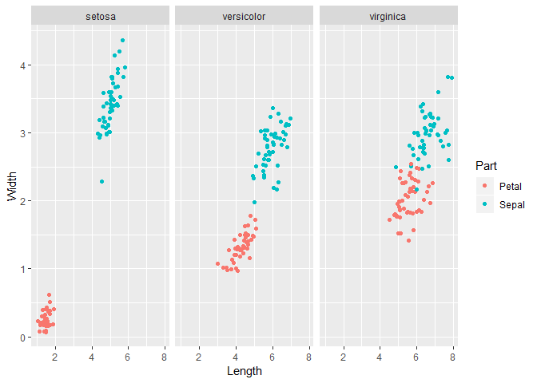
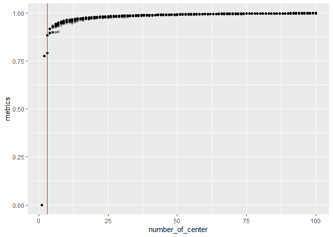
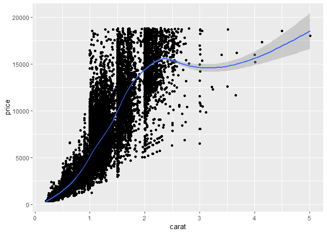
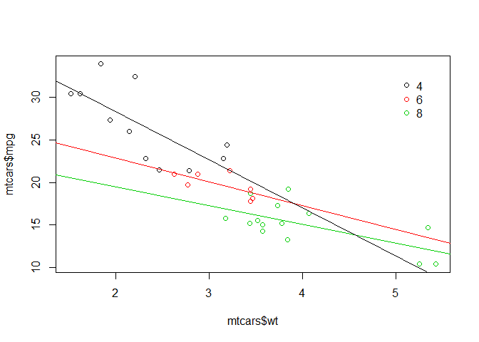
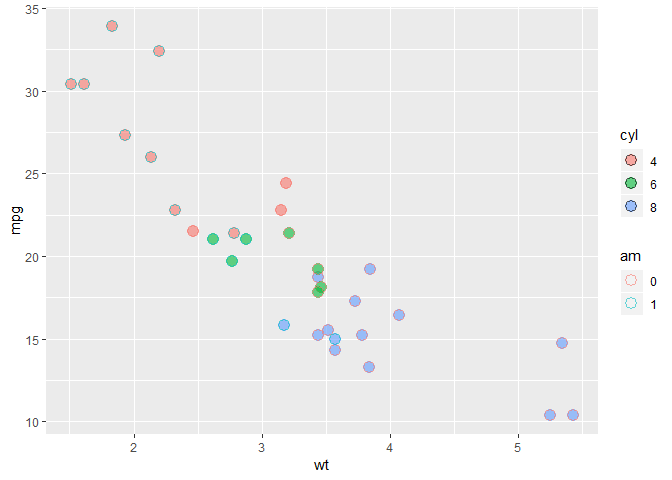
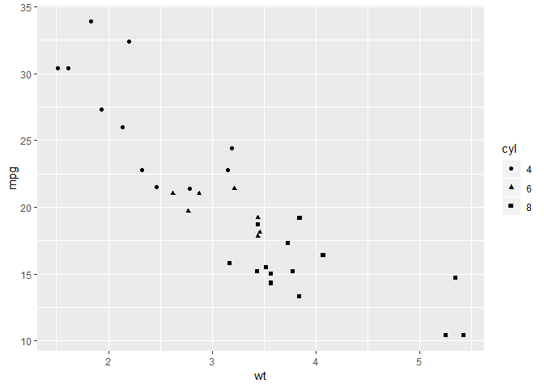
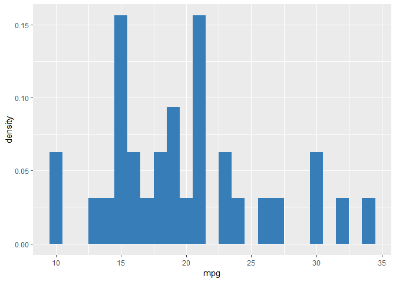
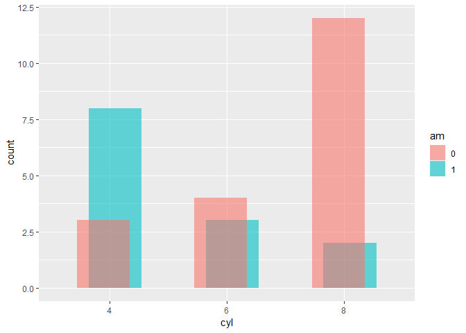
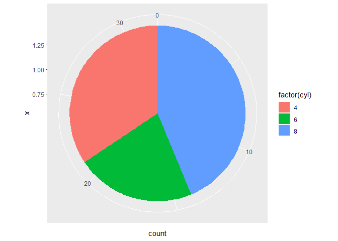
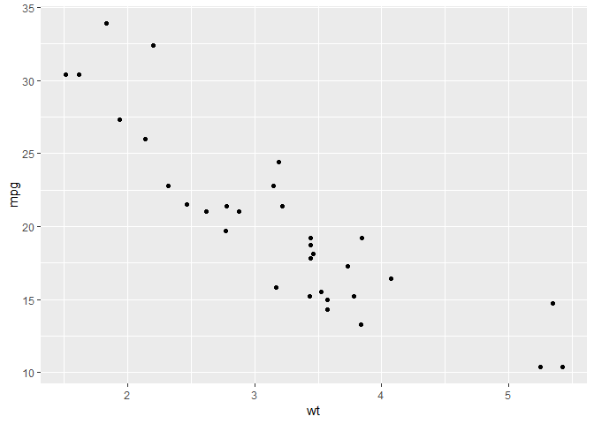

```r
## gapminder
str(gapminder)
```

```
## Classes 'tbl_df', 'tbl' and 'data.frame':	1704 obs. of  6 variables:
##  $ country  : Factor w/ 142 levels "Afghanistan",..: 1 1 1 1 1 1 1 1 1 1 ...
##  $ continent: Factor w/ 5 levels "Africa","Americas",..: 3 3 3 3 3 3 3 3 3 3 ...
##  $ year     : int  1952 1957 1962 1967 1972 1977 1982 1987 1992 1997 ...
##  $ lifeExp  : num  28.8 30.3 32 34 36.1 ...
##  $ pop      : int  8425333 9240934 10267083 11537966 13079460 14880372 12881816 13867957 16317921 22227415 ...
##  $ gdpPercap: num  779 821 853 836 740 ...
```

```r
ggplot(data = gapminder, aes(x = year, y = lifeExp,
                             group = country, color = continent)) +
  geom_line(alpha = 0.5) + 
  facet_wrap( ~ continent) +
  xlab("Year") + ylab("Life expectancy") +
  ggtitle("Life expectancy over time") + theme_bw()
```

<!-- -->

```r
ggplot(data = gapminder, aes(x = continent, y = year, color = continent)) +
  geom_point()
```

<!-- -->

```r
ggplot(data = gapminder, aes(x = continent, y = year, color = continent)) +
  geom_point(position = position_jitter(width = 0.5, height = 2))
```

<!-- -->

```r
ggplot(data = gapminder, aes(x = year, y = lifeExp, group = country)) +
  geom_line(alpha = 0.5, aes(color = "Country", size = "Country")) +
  geom_line(stat = "smooth", method = "loess",
            aes(group = continent, color = "Continent", size = "Continent"), 
            alpha = 0.5) +
  facet_wrap(~ continent, nrow = 2) +
  scale_color_manual(name = "Life Exp. for:",
                     values = c("Country" = "black", "Continent" = "dodgerblue1")) +
  scale_size_manual(name = "Life Exp. for:", 
                    values = c("Country" = 0.25, "Continent" = 3)) +
  theme_minimal(base_size = 14) + 
  ylab("Years") + xlab("") + 
  ggtitle("Life Expectancy, 1952-2007", subtitle = "By continent and country") +
  theme(legend.position=c(0.75, 0.2), axis.text.x = element_text(angle = 45))
```

<!-- -->

```r
gapminder %>%
  filter(year == 1952) %>%
  group_by(continent) %>%
  summarize(medianGdpPercap = median(gdpPercap)) %>% 
  ggplot(aes(x = continent, y = medianGdpPercap)) +
  geom_col()
```

<!-- -->

```r
gapminder %>%
  filter(year == 1952) %>% 
  ggplot(aes(x = pop)) +
  geom_histogram() +
  scale_x_log10()
```

<!-- -->

```r
gapminder %>%
  filter(year == 1952) %>% 
  ggplot(aes(x = continent, y = gdpPercap, color = continent)) +
  geom_boxplot() +
  scale_y_log10() +
  ggtitle("Comparing GDP per capita across continents")
```

<!-- -->

```r
## tidy 
str(iris)
```

```
## 'data.frame':	150 obs. of  5 variables:
##  $ Sepal.Length: num  5.1 4.9 4.7 4.6 5 5.4 4.6 5 4.4 4.9 ...
##  $ Sepal.Width : num  3.5 3 3.2 3.1 3.6 3.9 3.4 3.4 2.9 3.1 ...
##  $ Petal.Length: num  1.4 1.4 1.3 1.5 1.4 1.7 1.4 1.5 1.4 1.5 ...
##  $ Petal.Width : num  0.2 0.2 0.2 0.2 0.2 0.4 0.3 0.2 0.2 0.1 ...
##  $ Species     : Factor w/ 3 levels "setosa","versicolor",..: 1 1 1 1 1 1 1 1 1 1 ...
```

```r
iris.tidy <- iris %>%
  gather(key, Value, -Species) %>%
  separate(key, c("Part", "Measure"), "\\.")

iris$Flower <- 1:nrow(iris)

iris.wide <- iris %>%
  gather(key, value, -Species, -Flower) %>%
  separate(key, c("Part", "Measure"), "\\.") %>%
  spread(Measure, value)


ggplot(iris.wide, aes(x = Length, y = Width, color = Part)) +
  geom_jitter() +
  facet_grid(. ~ Species)
```

<!-- -->

```r
## cluster analysis
ggpairs(iris[,-6],mapping=aes(color=Species))
```

<!-- -->

```r
ggpairs(iris, columns = 1:4, 
        aes(color=Species, alpha=0.4), 
        title="Scatterplot Matrix",
        upper=list(continuous="density", combo="box"),
        lower=list(continuous="smooth", combo="dot")) +
  theme_light() +
  theme(plot.title=element_text(size=10))
```

<!-- -->

```r
ggplot(iris, aes(x=Petal.Length, y=Sepal.Width, colour=Species) ) +
  geom_point(size= 2.5) +
  geom_smooth(method="lm") +             
  labs(title="Aggregated Data")
```

<!-- -->

```r
set.seed(123)
cluster=kmeans(iris[,1:4],3)
iris$cluster=as.factor(cluster$cluster)
ggpairs(iris,columns = 1:5, mapping=aes(color=cluster))
```

<!-- -->

```r
set.seed(456)
performance=c()
for (i in rep(1:100,times=30)) {
  clust=kmeans(iris[,1:4],i)
  performance=c(performance,1-clust$tot.withinss/clust$totss)
}
perf_df=data.frame(metrics=performance,number_of_center=rep(1:100,times=30))
ggplot(perf_df,aes(x=number_of_center,y=metrics)) +
  geom_point(alpha=0.2) +
  geom_vline(xintercept = 3,color='red')
```

<!-- -->

```r
## point 
data(diamonds)
str(diamonds)
```

```
## Classes 'tbl_df', 'tbl' and 'data.frame':	53940 obs. of  10 variables:
##  $ carat  : num  0.23 0.21 0.23 0.29 0.31 0.24 0.24 0.26 0.22 0.23 ...
##  $ cut    : Ord.factor w/ 5 levels "Fair"<"Good"<..: 5 4 2 4 2 3 3 3 1 3 ...
##  $ color  : Ord.factor w/ 7 levels "D"<"E"<"F"<"G"<..: 2 2 2 6 7 7 6 5 2 5 ...
##  $ clarity: Ord.factor w/ 8 levels "I1"<"SI2"<"SI1"<..: 2 3 5 4 2 6 7 3 4 5 ...
##  $ depth  : num  61.5 59.8 56.9 62.4 63.3 62.8 62.3 61.9 65.1 59.4 ...
##  $ table  : num  55 61 65 58 58 57 57 55 61 61 ...
##  $ price  : int  326 326 327 334 335 336 336 337 337 338 ...
##  $ x      : num  3.95 3.89 4.05 4.2 4.34 3.94 3.95 4.07 3.87 4 ...
##  $ y      : num  3.98 3.84 4.07 4.23 4.35 3.96 3.98 4.11 3.78 4.05 ...
##  $ z      : num  2.43 2.31 2.31 2.63 2.75 2.48 2.47 2.53 2.49 2.39 ...
```

```r
diamonds %>% 
  ggplot(aes(x = carat, y = price)) +
  geom_point() +
  geom_smooth()
```

<!-- -->

```r
ggplot(diamonds, aes(x = carat, y = price, color = clarity)) +
  geom_point(alpha = 0.4)+
  geom_smooth()
```

<!-- -->

```r
ggplot(diamonds, aes(x = carat, y = price)) +
  geom_point(alpha = 0.4)+
  geom_smooth(aes(color = clarity))
```

<!-- -->

```r
ggplot(diamonds, aes(x = clarity, y = carat, color = price)) +
  geom_point(alpha = 0.5)
```

<!-- -->

```r
ggplot(diamonds, aes(x = clarity, y = carat, color = price)) +
  geom_point(alpha = 0.5, position = "jitter")
```

<!-- -->

```r
data("mtcars")
str(mtcars)
```

```
## 'data.frame':	32 obs. of  11 variables:
##  $ mpg : num  21 21 22.8 21.4 18.7 18.1 14.3 24.4 22.8 19.2 ...
##  $ cyl : num  6 6 4 6 8 6 8 4 4 6 ...
##  $ disp: num  160 160 108 258 360 ...
##  $ hp  : num  110 110 93 110 175 105 245 62 95 123 ...
##  $ drat: num  3.9 3.9 3.85 3.08 3.15 2.76 3.21 3.69 3.92 3.92 ...
##  $ wt  : num  2.62 2.88 2.32 3.21 3.44 ...
##  $ qsec: num  16.5 17 18.6 19.4 17 ...
##  $ vs  : num  0 0 1 1 0 1 0 1 1 1 ...
##  $ am  : num  1 1 1 0 0 0 0 0 0 0 ...
##  $ gear: num  4 4 4 3 3 3 3 4 4 4 ...
##  $ carb: num  4 4 1 1 2 1 4 2 2 4 ...
```

```r
mtcars <- mtcars %>% 
  mutate_at(vars(cyl, am), factor)
plot(mtcars$wt, mtcars$mpg, col = mtcars$cyl)

lapply(mtcars$cyl, function(x) {
  abline(lm(mpg ~ wt, mtcars, subset = (cyl == x)), col = x)
})
```

```
## [[1]]
## NULL
## 
## [[2]]
## NULL
## 
## [[3]]
## NULL
## 
## [[4]]
## NULL
## 
## [[5]]
## NULL
## 
## [[6]]
## NULL
## 
## [[7]]
## NULL
## 
## [[8]]
## NULL
## 
## [[9]]
## NULL
## 
## [[10]]
## NULL
## 
## [[11]]
## NULL
## 
## [[12]]
## NULL
## 
## [[13]]
## NULL
## 
## [[14]]
## NULL
## 
## [[15]]
## NULL
## 
## [[16]]
## NULL
## 
## [[17]]
## NULL
## 
## [[18]]
## NULL
## 
## [[19]]
## NULL
## 
## [[20]]
## NULL
## 
## [[21]]
## NULL
## 
## [[22]]
## NULL
## 
## [[23]]
## NULL
## 
## [[24]]
## NULL
## 
## [[25]]
## NULL
## 
## [[26]]
## NULL
## 
## [[27]]
## NULL
## 
## [[28]]
## NULL
## 
## [[29]]
## NULL
## 
## [[30]]
## NULL
## 
## [[31]]
## NULL
## 
## [[32]]
## NULL
```

```r
legend(x = 5, y = 33, legend = levels(mtcars$cyl),
       col = 1:3, pch = 1, bty = "n")
```

<!-- -->

```r
ggplot(mtcars, aes(x = wt, y = mpg, col = cyl)) +
  geom_point() +
  geom_smooth(method = "lm", se = FALSE) +
  geom_smooth(aes(group = 1), method = "lm", se = FALSE, linetype = 2)
```

<!-- -->

```r
## aesthetics 
### x, y, color, fill, size, alpha, labels, linetype, shape
### variable: continuous, discrete
ggplot(mtcars, aes(x = wt, y = mpg, fill = cyl, col = am)) +
  geom_point(shape = 21, size = 4, alpha = 0.6)
```

<!-- -->

```r
ggplot(mtcars, aes(x = wt, y = mpg, size = cyl)) +
  geom_point()
```

<!-- -->

```r
ggplot(mtcars, aes(x = wt, y = mpg, alpha = cyl)) +
  geom_point()
```

<!-- -->

```r
ggplot(mtcars, aes(x = wt, y = mpg, shape = cyl)) +
  geom_point()
```

<!-- -->

```r
ggplot(mtcars, aes(x = wt, y = mpg, label = cyl)) +
  geom_text()
```

<!-- -->

```r
ggplot(mtcars, aes(x = wt, y = mpg)) +
  geom_text(label = rownames(mtcars), color = 'red')
```

<!-- -->

```r
ggplot(mtcars, aes(x = mpg, y = qsec, col = cyl, shape = am, 
                   size = (hp/wt))) +
  geom_point()
```

<!-- -->

```r
ggplot(mtcars, aes(x = mpg, y = 0)) +
  geom_jitter() +
  scale_y_continuous(limits = c(-2,2))
```

<!-- -->

```r
ggplot(mtcars, aes(x = cyl, y = wt)) +
  geom_jitter(width = 0.1, alpha = 0.6, shape = 1)
```

<!-- -->

```r
ggplot(mtcars, aes(x = cyl, y = wt)) +
  geom_point(position = position_jitter(0.1))
```

<!-- -->

```r
### histogram 
ggplot(mtcars, aes(mpg)) +
  geom_histogram(aes(y = ..density..), binwidth = 1, fill = "#377EB8")
```

<!-- -->

```r
ggplot(mtcars, aes(mpg, fill = cyl)) +
  geom_histogram(binwidth = 1)
```

<!-- -->

```r
ggplot(mtcars, aes(mpg, fill = cyl)) +
  geom_histogram(binwidth = 1, position = "dodge")
```

<!-- -->

```r
ggplot(mtcars, aes(mpg, color = cyl)) +
  geom_freqpoly(binwidth = 1)
```

<!-- -->

```r
ggplot(mtcars, aes(mpg, fill = cyl)) +
  geom_histogram(binwidth = 1, position = "identity", alpha = 0.4)
```

<!-- -->

```r
### bar
ggplot(mtcars, aes(x = cyl, fill = am)) +
  geom_bar(position = "stack")
```

<!-- -->

```r
ggplot(mtcars, aes(x = cyl, fill = am)) +
  geom_bar(position = "fill") +
  scale_fill_brewer()
```

<!-- -->

```r
ggplot(mtcars, aes(x = cyl, fill = am)) +
  geom_bar(position = "dodge")
```

<!-- -->

```r
ggplot(mtcars, aes(x = cyl, fill = am)) +
  geom_bar(position = position_dodge(0.2), alpha = 0.6)
```

<!-- -->

```r
ggplot(mtcars, aes(x = 1, fill = factor(cyl))) +
  geom_bar() +
  coord_polar(theta = "y")
```

<!-- -->

```r
ggplot(mtcars, aes(x = 1, fill = cyl)) +
  geom_bar(width = .1) +
  scale_x_continuous(limits = c(0.5,1.5)) +
  coord_polar(theta = "y")
```

<!-- -->

```r
### facet 
mtcars$cyl_am <- paste(mtcars$cyl, mtcars$am, sep = "_")
myCol <- rbind(brewer.pal(9, "Blues")[c(3,6,8)],
               brewer.pal(9, "Reds")[c(3,6,8)])

ggplot(mtcars, aes(x = wt, y = mpg, col = cyl_am)) +
  geom_point() +
  scale_color_manual(values = myCol)
```

<!-- -->

```r
ggplot(mtcars, aes(x = wt, y = mpg, col = cyl_am, size = disp)) +
  geom_point() +
  scale_color_manual(values = myCol) +
  facet_grid(gear ~ vs)
```

<!-- -->

```r
### qplot
qplot(wt, mpg, data = mtcars)
```

<!-- -->

```r
qplot(wt, mpg, data = mtcars, size = cyl)
```

<!-- -->

```r
qplot(wt, mpg, data = mtcars, color = hp)
```

<!-- -->

```r
qplot(cyl, factor(vs), data = mtcars)
```

<!-- -->

```r
qplot(cyl, factor(vs), data = mtcars, geom = "jitter")
```

<!-- -->

```r
ggplot(mtcars, aes(cyl, wt, col = am)) +
  geom_point(position = position_jitter(0.2, 0))
```

<!-- -->

```r
ggplot(mtcars, aes(cyl, wt, fill = am)) +
  geom_dotplot(stackdir = "center", binaxis = "y")
```

<!-- -->

```r
qplot(
  cyl, wt,
  data = mtcars,
  fill = am,
  geom = "dotplot",
  binaxis = "y",
  stackdir = "center"
)
```

<!-- -->

```r
head(ChickWeight)
```

```
## Grouped Data: weight ~ Time | Chick
##   weight Time Chick Diet
## 1     42    0     1    1
## 2     51    2     1    1
## 3     59    4     1    1
## 4     64    6     1    1
## 5     76    8     1    1
## 6     93   10     1    1
```

```r
ggplot(ChickWeight, aes(x = Time, y = weight)) +
  geom_line(aes(group = Chick))
```

<!-- -->

```r
ggplot(ChickWeight, aes(x = Time, y = weight, color = Diet)) +
  geom_line(aes(group = Chick))
```

<!-- -->

```r
ggplot(ChickWeight, aes(x = Time, y = weight, color = Diet)) +
  geom_line(aes(group = Chick), alpha = 0.3) +
  geom_smooth(lwd = 2, se = FALSE)
```

<!-- -->


---
title: "visual_1.R"
author: "Yohan_Min"
date: "Mon Feb 11 14:48:38 2019"
---
